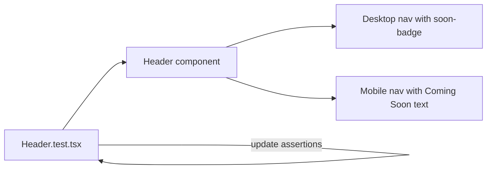

## Problem
2 frontend tests in `src/components/__tests__/Header.test.tsx` are failing because they assert that Pool and Bridge nav links have NO "Coming Soon" badges. However, task `gooddollar-l2-nav-coming-soon-desktop-badge` intentionally added these badges.

### Failing tests
1. `Header > Pool and Bridge in desktop nav have no Soon badges` — expects `soonBadges.length` to be 0, gets 2
2. `Header > Pool and Bridge in mobile menu have no Coming Soon badges` — expects `mobileNav.textContent` not to contain "Coming Soon"

## Research Notes
- The Header component renders `[data-testid="soon-badge"]` elements for Pool and Bridge in desktop nav
- The mobile nav renders "Coming Soon" text for Pool and Bridge
- These badges were added intentionally by an already-executed task
- The test assertions are stale and need updating to match the new behavior

## Assumptions
- The "Coming Soon" badges on Pool and Bridge are intended permanent features (for now)
- No other tests depend on the absence of these badges

## Architecture Diagram

## One-week decision
**YES** — This is a 5-minute test assertion update (2 lines changed).

## Implementation Plan
1. In `Header.test.tsx` line 88: change `expect(soonBadges.length).toBe(0)` to `expect(soonBadges.length).toBe(2)`
2. In `Header.test.tsx` line 96: change `expect(mobileNav.textContent).not.toContain('Coming Soon')` to `expect(mobileNav.textContent).toContain('Coming Soon')`
3. Update test names to reflect the expected behavior (e.g., "have Soon badges" instead of "have no Soon badges")
4. Run `npx vitest run` to confirm all tests pass

## Files
- `frontend/src/components/__tests__/Header.test.tsx`
