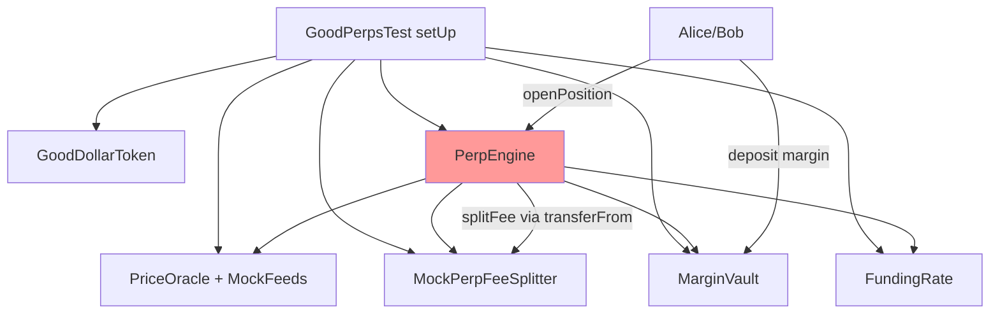

## Problem
All 18 PerpEngine tests in `test/perps/GoodPerps.t.sol` revert. The MarginVault and FundingRate tests in the same file pass (vault_deposit, vault_withdraw, etc.), so setUp() runs correctly through vault+funding deployment. The reverts start at PerpEngine method calls.

### Failing tests (all EvmError: Revert)
- test_engine_openLongPosition
- test_engine_openShortPosition
- test_engine_closeLong_withProfit / _withLoss
- test_engine_closeShort_withProfit
- test_engine_cannotOpenTwoPositions_sameMarket
- test_engine_fundingAppliedAtClose
- test_engine_liquidate_underwater / _healthyPosition_reverts / _bonusNotDoubleDeducted
- test_engine_marginLockedAtOpen / _marginRatio_decreasesOnLoss / _marginRatio_includesFunding
- test_engine_openInterestTracked / _openPosition_exactMaxLeverage_succeeds
- test_engine_openPosition_feeRoutedToSplitter
- test_engine_posStateWrittenBeforeExternalCall
- test_engine_unrealizedPnL_long

## Research Notes
- setUp() creates: GoodDollarToken, PriceOracle, MockPerpFeed (BTC at $50k), MockPerpFeeSplitter, MarginVault, FundingRate, PerpEngine
- Vault and FundingRate are wired to engine; BTC-PERP market created with 50x max leverage
- Alice and Bob get 10M G$ each and approve the vault for max
- Engine tests call `engine.openPosition(btcMarketId, ...)` which likely deposits margin → opens position
- The feeSplitter mock does `token.transferFrom(msg.sender, ...)` — the engine needs to have approved the feeSplitter, or the feeSplitter needs to pull from engine
- Possible root causes:
  1. Engine doesn't approve feeSplitter to pull G$ for fee routing
  2. Engine method signatures changed but tests weren't updated
  3. Missing initialization step in PerpEngine (e.g., setFeeSplitter not called)

## Assumptions
- The contract code in `src/perps/PerpEngine.sol` is the source of truth
- Tests need to match the current contract interface
- We may need to run with `-vvvv` verbosity first to identify exact revert location

## Architecture Diagram

## One-week decision
**YES** — These are likely 1-2 missing setup calls (approve/initialize). Once the root cause is found via `-vvvv` trace, the fix should be straightforward.

## Implementation Plan
1. Run `forge test --match-test test_engine_openLongPosition -vvvv` to get full stack trace
2. Identify the exact revert location and reason
3. Fix either:
   a. Missing approval in setUp (engine → feeSplitter)
   b. Missing initialization call
   c. Interface mismatch between test and contract
4. Run full `forge test --match-contract GoodPerpsTest` to verify all 18 pass
5. Run full `forge test` to verify no regressions

## Files
- `test/perps/GoodPerps.t.sol`
- `src/perps/PerpEngine.sol`
- `src/perps/MarginVault.sol`
