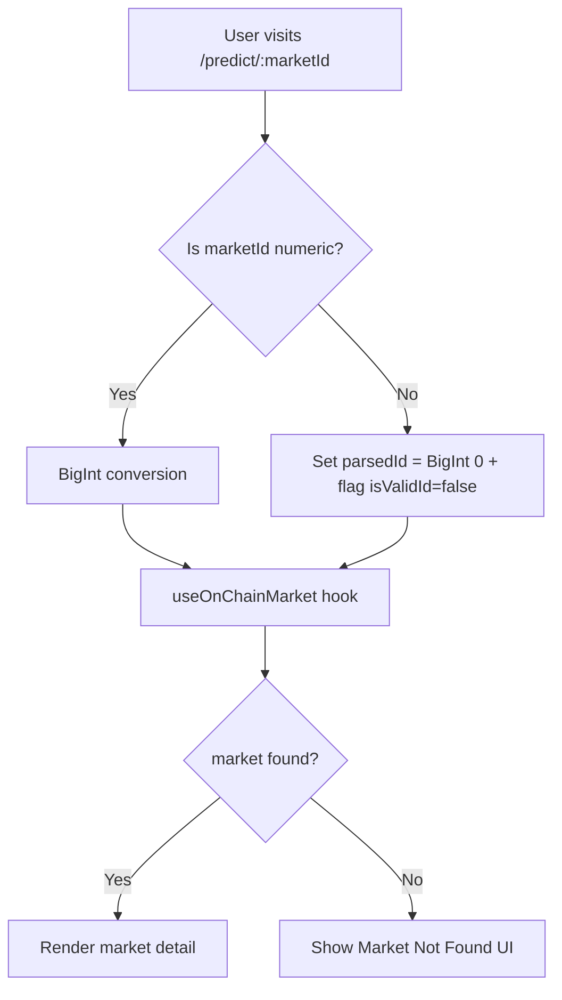

## Overview

A defensive fix for the predict market detail page. When users navigate to `/predict/<non-numeric-string>`, the `BigInt()` constructor throws a `SyntaxError`, crashing the component. This bypasses the existing "Market Not Found" UI and shows the generic error boundary instead. The fix validates `marketId` before conversion.

## Research Notes

- `BigInt()` throws `SyntaxError` for non-numeric strings — this is native JS behavior with no way to suppress it.
- React hooks cannot be called conditionally, so we cannot skip `useOnChainMarket` — we must pass a safe fallback value (e.g., `BigInt(0)`) and handle the invalid case in the render logic.
- The "Market Not Found" UI already exists (lines 234-244) and handles the case when `market` is null. Passing `BigInt(0)` for invalid IDs will naturally result in `market === null`, triggering this existing UI.

## Assumptions

- No numeric-but-invalid market IDs need special handling beyond what the existing null check provides.

## Architecture Diagram



## One-Week Decision

**YES** — This is a 15-minute single-file bug fix. Add a regex guard before `BigInt()`, pass a safe fallback to the hook, and the existing null check handles the rest.

## Implementation Plan

1. Add `const isValidId = /^\d+$/.test(marketId || '')` before the BigInt line
2. Change `BigInt(marketId || '0')` to `isValidId ? BigInt(marketId!) : BigInt(0)`
3. The existing `if (!market)` check on line 234 already renders "Market Not Found" — no render changes needed
4. Verify manually: `/predict/abc` → "Market Not Found", `/predict/1` → works normally

## Problem

`frontend/src/app/predict/[marketId]/page.tsx` line 214 calls:

```typescript
useOnChainMarket(BigInt(marketId || '0'))
```

When a user navigates to `/predict/not-a-number` or any non-numeric marketId, `BigInt("not-a-number")` throws a `SyntaxError`, crashing the component. The error boundary catches it and shows a generic "Something Went Wrong" page instead of the proper "Market Not Found" message that already exists on lines 234-244.

## Expected Behavior

Non-numeric marketId values should show the existing "Market Not Found" UI, not crash the component.

## Fix

Validate `marketId` before BigInt conversion. If invalid, skip the hook and render the "Market Not Found" state.

```typescript
const isValidId = /^\d+$/.test(marketId || '')
const parsedId = isValidId ? BigInt(marketId!) : BigInt(0)
const { market: onChainMarket, isLoading } = useOnChainMarket(parsedId)
```

Then in the render logic, if `!isValidId`, show the "Market Not Found" UI directly.

## Files

- `frontend/src/app/predict/[marketId]/page.tsx`

## Tests

- Test that navigating to `/predict/abc` does not crash
- Test that navigating to `/predict/999999` shows "Market Not Found"
- Test that navigating to a valid numeric ID works normally
