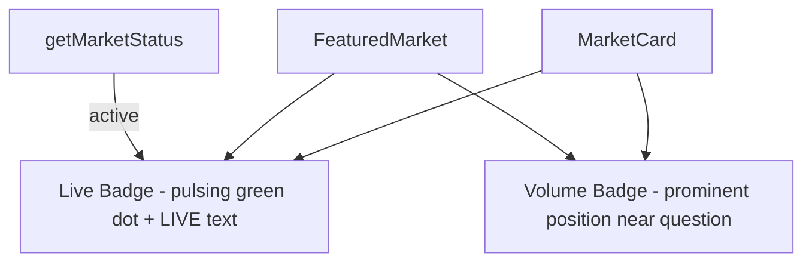

# Predict — Add Live Badge and Prominent Volume Display on Market Cards

parent: gooddollar-l2
id: gooddollar-l2-predict-live-badge-volume-prominence
status: done
priority: medium
planned: true
executed: true
split: false
type: feature
area: predict

## Problem

Competitor comparison with Polymarket reveals that their market cards prominently display volume figures (e.g., "$384M Vol.", "$990M Vol.") in large, bold formatting and show "Live" badges on actively trading markets. Our GoodDollar predict page displays volume in small 12px text at the card footer, making it far less prominent and reducing the perception of market activity.

## Gaps Observed

- **Volume prominence**: Polymarket shows volume as a large, prominent badge. Ours is a tiny footer detail.
- **Live indicator**: Polymarket shows "Live" on actively trading markets. We only show time-left labels.
- **Trading activity signals**: Polymarket's design communicates active trading. Our cards feel more static.

## Research Notes

- The `MarketCard` component in `frontend/src/app/predict/page.tsx` (line 99-187) handles card rendering
- Volume is currently displayed at line 183: `Vol: {formatVolume(market.volume)}` in the footer
- `getMarketStatus()` already returns `'active' | 'ending-today' | 'expired'` — can be reused for live badge
- `FeaturedMarket` component (line 190-287) also shows volume in footer — needs same treatment
- `formatVolume()` from `@/lib/predictData` already formats numbers compactly

## Architecture

## One-Week Decision

**YES** — This is a CSS/layout change within a single file. ~1-2 hours of work.

## Implementation Plan

1. In `MarketCard`, add a "Live" badge with pulsing green dot next to the category badge when `status !== 'expired'`
2. Move volume from footer to a prominent badge near the question text, styled with larger font and bold
3. Apply same changes to `FeaturedMarket` component
4. Keep the footer row for liquidity only (volume moves up)

## Files to Modify

- `frontend/src/app/predict/page.tsx` — MarketCard and FeaturedMarket components
