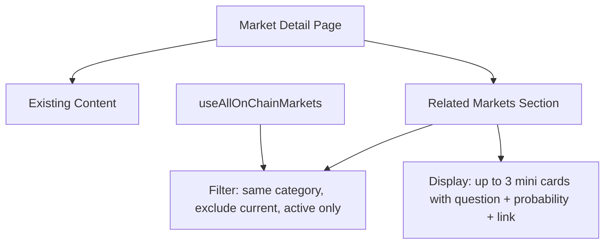

# Predict — Add Related Markets Section on Market Detail Page

parent: gooddollar-l2
id: gooddollar-l2-predict-related-markets-grouping
status: open
priority: medium
planned: true
executed: false
split: false
type: feature
area: predict

## Problem

Competitor comparison with Polymarket shows related markets grouped under events. Our predict detail page has no related markets section.

## Research Notes

- The detail page is at `frontend/src/app/predict/[marketId]/page.tsx`
- Markets have a `category` field (Crypto, Politics, Sports, AI & Tech, World Events, Culture)
- `useAllOnChainMarkets()` fetches all markets — can filter by same category
- The `onChainToMarket()` function maps on-chain data to `PredictionMarket` type
- `inferCategory()` assigns categories based on question keywords

## Architecture

## One-Week Decision

**YES** — Adding a section at the bottom of an existing page with filtered data. ~2-3 hours.

## Implementation Plan

1. Read the existing `[marketId]/page.tsx` to understand its structure
2. Add a `RelatedMarkets` component at the bottom that:
   - Takes the current market's category and id
   - Fetches all markets via `useAllOnChainMarkets()`
   - Filters to same category, excludes current, active only, takes top 3 by volume
   - Renders mini cards with: question (truncated), probability percentage, and link
3. Style consistently with existing card design

## Files to Modify

- `frontend/src/app/predict/[marketId]/page.tsx` — Add RelatedMarkets section
