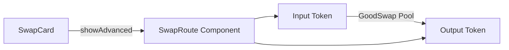

# Swap — Show Swap Route Path Visualization

parent: gooddollar-l2
id: gooddollar-l2-swap-route-path-display
status: open
priority: medium
planned: true
executed: false
split: false
type: feature
area: swap

## Problem

Uniswap shows routing path for swaps. Our swap card shows exchange rate and fees but no routing information.

## Research Notes

- `SwapCard` in `frontend/src/components/SwapCard.tsx` handles the swap interface
- There's already a `showAdvanced` toggle that reveals `SwapDetails` and `SwapSettings`
- `SwapDetails` shows exchange rate, minimum received, price impact, slippage, fee breakdown
- The swap uses `useSwapQuote()` from `@/lib/useOnChainSwap` for on-chain quotes
- All swaps go through GoodSwap AMM pool — simple direct route (no multi-hop)
- Token data comes from `TOKENS` array in `@/lib/tokens`

## Architecture

## One-Week Decision

**YES** — Simple new component + insertion into SwapCard. ~1-2 hours.

## Implementation Plan

1. Create `frontend/src/components/SwapRoute.tsx`:
   - Takes `inputToken` and `outputToken` as props
   - Renders: `[Token Icon] TOKEN_A → [Pool Icon] GoodSwap → [Token Icon] TOKEN_B`
   - Use token icons from the Token type
   - Style with arrows and small pill-shaped pool label
2. Import and render in `SwapCard.tsx` inside the advanced details section, below `SwapDetails`
3. Only show when both tokens are selected and an amount is entered

## Files to Modify

- `frontend/src/components/SwapRoute.tsx` — New component
- `frontend/src/components/SwapCard.tsx` — Import and render SwapRoute
