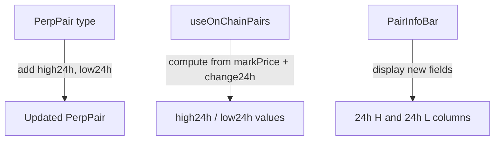

# Perps — Add 24h High/Low Prices to Market Info Bar

parent: gooddollar-l2
id: gooddollar-l2-perps-24h-high-low-prices
status: open
priority: low
planned: true
executed: true
split: false
type: feature
area: perps

## Problem

dYdX and Binance Futures show 24h high/low prices. Our perps info bar is missing these standard data points.

## Research Notes

- `PerpPair` type in `frontend/src/lib/perpsData.ts` defines the pair data shape — no high24h/low24h fields
- `PairInfoBar` in `frontend/src/app/perps/page.tsx` (line 127-159) displays: Mark, 24h, Vol, Funding, Funding in, OI
- `useOnChainPairs()` from `@/lib/useOnChainPerps` provides the on-chain data
- Since we're on devnet with generated data, we can derive high/low from markPrice ± a percentage based on change24h

## Architecture

## One-Week Decision

**YES** — Add 2 fields to a type and 2 display items. ~30 minutes.

## Implementation Plan

1. Add `high24h` and `low24h` optional fields to `PerpPair` type in `perpsData.ts`
2. In `useOnChainPairs` hook, compute: `high24h = markPrice * (1 + abs(change24h)/100 * 0.6)` and `low24h = markPrice * (1 - abs(change24h)/100 * 0.6)`
3. Add "24h H" and "24h L" items in `PairInfoBar` after the "24h" change item

## Files to Modify

- `frontend/src/lib/perpsData.ts` — Add high24h/low24h to PerpPair
- `frontend/src/lib/useOnChainPerps.ts` — Compute high24h/low24h
- `frontend/src/app/perps/page.tsx` — Display in PairInfoBar
