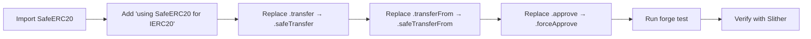

## Planning Notes

### Research Findings
- Grep found ~50+ raw `.transfer(` and `.transferFrom(` calls across src/
- Key contracts: GoodLendPool, PerpEngine, MarginVault, CollateralVault, StabilityPool, PegStabilityModule
- Pattern: import SafeERC20, add `using SafeERC20 for IERC20`, replace `.transfer()` with `.safeTransfer()`
- Some contracts use interface-level definitions that shadow ERC20 — need care
- Bridge contracts also use raw transfers

### Architecture

### One-Week Decision: YES — fits in one week
~15 contracts need SafeERC20 migration. Each is a mechanical replacement. Estimated: 2-3 days.

## Goal
Replace every raw `.transfer()` and `.transferFrom()` call with SafeERC20's `safeTransfer` / `safeTransferFrom` to eliminate unchecked return value vulnerabilities.

## Scope

### High-priority contracts (core protocol):
- `src/lending/GoodLendPool.sol` — 8 transfer calls
- `src/UBIFeeSplitter.sol` — 8 transfer calls
- `src/stable/StableUBIFeeSplitter.sol` — 7 transfer calls
- `src/predict/PredictUBIFeeSplitter.sol` — 6 transfer calls
- `src/predict/OptimisticResolver.sol` — 7 transfer calls
- `src/stocks/CollateralVault.sol` — 5 transfer calls
- `src/governance/VoteEscrowedGD.sol` — 5 transfer calls
- `src/bridge/FastWithdrawalLP.sol` — 5 transfer calls
- `src/swap/LimitOrderBook.sol` — 5 transfer calls
- `src/yield/GoodVault.sol` — 5 transfer calls

### Medium-priority contracts:
- `src/stable/StabilityPool.sol` — 4 transfer calls
- `src/stable/PegStabilityModule.sol` — 4 transfer calls
- `src/stable/VaultManager.sol` — 4 transfer calls
- `src/bridge/GoodDollarBridgeL1.sol` — 4 transfer calls
- `src/swap/GoodSwapRouter.sol` — 4 transfer calls
- `src/swap/LiFiBridgeAggregator.sol` — 4 transfer calls
- `src/yield/strategies/StablecoinStrategy.sol` — 4 transfer calls
- `src/ValidatorStaking.sol` — 3 transfer calls
- `src/perps/PerpUBIFeeSplitter.sol` — 3 transfer calls
- `src/stocks/StocksUBIFeeSplitter.sol` — 3 transfer calls
- `src/perps/MarginVault.sol` — 3 transfer calls
- `src/bridge/MultiChainBridge.sol` — 3 transfer calls
- `src/ValidatorStakingDevnet.sol` — 3 transfer calls

### Low-priority contracts:
- `src/predict/MarketFactory.sol` — 2 transfer calls
- `src/bridge/L1StandardBridge.sol` — 2 transfer calls
- `src/perps/PerpEngine.sol` — 1 transfer call
- `src/GoodSwap.sol` — 1 transfer call
- `src/yield/strategies/LendingStrategy.sol` — 1 transfer call
- `src/hooks/UBIFeeHook.sol` — 1 transfer call

## Implementation Pattern
For each contract:
1. Add `import {SafeERC20} from "@openzeppelin/contracts/token/ERC20/utils/SafeERC20.sol";`
2. Add `using SafeERC20 for IERC20;` declaration
3. Replace `.transfer(` with `.safeTransfer(`
4. Replace `.transferFrom(` with `.safeTransferFrom(`
5. Replace `.approve(` with `.safeApprove(` or `.forceApprove(`

## Acceptance Criteria
- Zero raw `.transfer()` or `.transferFrom()` calls on IERC20 types
- All contracts compile successfully
- `forge test` passes with zero failures
- No "unchecked-transfer" findings in Slither output
