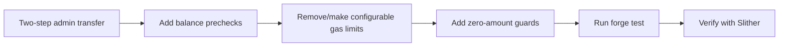

## Planning Notes

### Research Findings
- StabilityPool.transferAdmin is single-step — needs two-step pattern (pending + accept)
- Several admin functions lack onlyAdmin — PegStabilityModule.withdrawReserves needs balance validation
- Hardcoded gas in bridge contracts (e.g. 200_000 for cross-domain messages)
- Missing zero-amount checks on deposit/withdraw in several contracts
- CollateralVault needs collateral ratio validation before minting

### Architecture

### One-Week Decision: YES — fits in one week
Mixed bag of smaller fixes across ~10 contracts. Each fix is localized. Estimated: 2-3 days.

## Goal
Fix all remaining Slither HIGH findings related to access control, balance validation, and hardcoded gas limits.

## Scope

### Access Control
- `src/stable/StabilityPool.sol` — implement two-step admin transfer (GOO-493)
- Audit all contracts for admin functions missing `onlyAdmin`/`onlyOwner`
- Verify role-based access on all privileged functions

### Missing Balance Checks
- Validate sufficient balance before every transfer
- Check for zero-amount operations (revert on amount == 0)
- Validate collateral ratios before minting in:
  - `src/stocks/CollateralVault.sol`
  - `src/stable/VaultManager.sol`
  - `src/lending/GoodLendPool.sol`

### Hardcoded Gas Limits
- Search for hardcoded gas values (e.g., `gas: 50000`)
- Replace with configurable parameters or remove
- Use `gasleft()` checks where appropriate

## Acceptance Criteria
- StabilityPool uses two-step admin transfer pattern
- All admin functions have access control modifiers
- All transfers preceded by balance validation
- No hardcoded gas limits
- `forge test` passes with zero failures
- No access-control or balance-check related Slither HIGH findings
