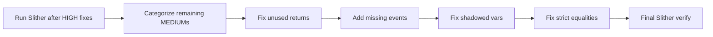

## Planning Notes

### Research Findings
- 148 MEDIUM findings across categories: unused return values, missing events, shadowed vars, timestamp dependence, strict equalities
- Many unused return values are from SafeERC20 calls (will be auto-fixed by task 0003)
- Missing events on state changes — add emit for admin setters and critical state mutations
- Shadowed variables — rename local vars that shadow state vars
- Dangerous strict equalities — use >= instead of == for balance checks
- After tasks 0002-0004, many findings may already be resolved

### Architecture

### One-Week Decision: YES — fits in one week
Bulk of 148 findings are repetitive patterns. After HIGH fixes resolve some automatically, remaining ~80-100 are mechanical. Estimated: 3-4 days.

## Goal
Fix all 148 Slither MEDIUM severity findings after HIGH fixes are complete.

## Scope

### Categories:
1. **Unused return values** — Check return values of external calls
2. **Missing events on state changes** — Add events for admin operations, parameter changes
3. **Shadowed variables** — Rename variables that shadow inherited state
4. **Dangerous strict equalities** — Replace `==` with `>=` or `<=` for balance comparisons
5. **Timestamp dependence** — Use block.number instead of block.timestamp where appropriate
6. **Dead code** — Remove unused functions and variables

## Approach
1. Run `slither . --print human-summary` to get the full list
2. Group by category and fix in batches
3. Re-run Slither after each batch to verify fixes

## Acceptance Criteria
- `slither .` reports 0 MEDIUM findings (or <10 with documented false positives)
- `forge test` passes with zero failures
