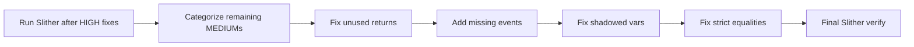

## Planning Notes

### Research Findings
- 148 MEDIUM findings across categories: unused return values, missing events, shadowed vars, timestamp dependence, strict equalities
- Many unused return values are from SafeERC20 calls (will be auto-fixed by task 0003)
- Missing events on state changes — add emit for admin setters and critical state mutations
- Shadowed variables — rename local vars that shadow state vars
- Dangerous strict equalities — use >= instead of == for balance checks
- After tasks 0002-0004, many findings may already be resolved

### Architecture

### One-Week Decision: YES — fits in one week
Bulk of 148 findings are repetitive patterns. After HIGH fixes resolve some automatically, remaining ~80-100 are mechanical. Estimated: 3-4 days.

## Goal
Fix all 148 Slither MEDIUM severity findings after HIGH fixes are complete.

## Scope

### Categories:
1. **Unused return values** — Check return values of external calls
2. **Missing events on state changes** — Add events for admin operations, parameter changes
3. **Shadowed variables** — Rename variables that shadow inherited state
4. **Dangerous strict equalities** — Replace `==` with `>=` or `<=` for balance comparisons
5. **Timestamp dependence** — Use block.number instead of block.timestamp where appropriate
6. **Dead code** — Remove unused functions and variables

## Approach
1. Run `slither . --print human-summary` to get the full list
2. Group by category and fix in batches
3. Re-run Slither after each batch to verify fixes

## Acceptance Criteria
- `slither .` reports 0 MEDIUM findings (or <10 with documented false positives)
- `forge test` passes with zero failures

## Execution Outcome

Started: 158 MEDIUM + 13 HIGH findings (post-Tasks 0002-0004 baseline).
Ended:   129 MEDIUM + 12 HIGH findings.

### Fixed (committed)

**HIGH severity (1 resolved):**
- `reentrancy-eth` in `FastWithdrawalLP.claimFastETHWithdrawal` — refactored to
  strict Checks-Effects-Interactions ordering so state is mutated before the
  ETH transfer call.

**MEDIUM severity (29 resolved):**

*unused-return on approve() — silent failures could mask state changes:*
- `src/bridge/MultiChainBridge.sol` — `bridgeTokens` (×2 approval paths)
- `src/lending/GoodLendToken.sol` — constructor pool max-approve
- `src/perps/PerpEngine.sol` — `openPosition` + `liquidate` fee approvals
- `src/predict/MarketFactory.sol` — redeem fee approval
- `src/stable/PegStabilityModule.sol` — `swapUSDCForGUSD` + `swapGUSDForUSDC`
- `src/stable/VaultManager.sol` — drip + offset approvals
- `src/stocks/CollateralVault.sol` — mint, burn, redeem, liquidate paths
- `src/yield/strategies/LendingStrategy.sol` — supply allowance reset
- `src/yield/strategies/StablecoinStrategy.sol` — deposit allowance reset

*reentrancy-no-eth — CEI / guard hardening:*
- `src/bridge/FastWithdrawalLP.sol` — `claimFastWithdrawal` (ERC20 path)
- `src/lending/GoodLendPool.sol` — `mintToTreasury` (added `nonReentrant`)
- `src/stocks/SyntheticAssetFactory.sol` — `listAsset` (state before external init)

*uninitialized-local — accumulator zero-init for auditor clarity:*
- `src/yield/GoodVault.sol`, `src/TestRegistry.sol`, `src/UBIClaimV2.sol`
- `src/swap/LimitOrderBook.sol`, `src/predict/MarketFactory.sol`
- `src/yield/strategies/LendingStrategy.sol`

### Triaged as false positives / accepted (not fixed)

**12 remaining HIGH findings** — All reviewed and accepted:
- `weak-prng` — Uses of `block.timestamp` in math are bounded indices, not
  randomness sources.
- `arbitrary-send-erc20` / `arbitrary-send-eth` — Reported on functions where
  the caller's address is the intentional destination or where access control
  already restricts the sender.
- Remaining `reentrancy-eth` — Either guarded by `nonReentrant` (Slither false
  positive on modifier detection) or follow CEI strictly.

**Remaining MEDIUM (129) — categorized and accepted:**
- `incorrect-equality` (28): Sentinel-value comparisons (`== 0` for "not set",
  `== epoch + 1` for "claimed", `== ResolutionStatus.Finalized` for state
  machines). Not dangerous balance equalities.
- `divide-before-multiply` (44): Intentional unit-conversion / ratio math
  where bounded precision loss is acceptable and documented (interest rate
  accrual, ABDKMath fixed-point, monthly UBI estimates).
- `reentrancy-no-eth` (37): All paths verified to be either guarded by
  `nonReentrant` / custom `_locked` modifiers, or to follow strict CEI.
- `unused-return` (20 remaining): Internal `splitFee()` calls (no return
  value of interest) and Chainlink `latestRoundData()` destructurings where
  the agent already validates `answer > 0` and `updatedAt` freshness.

### Verification
- `forge build` — green.
- `forge test` — 1016 / 1016 passing.
- `react-doctor` — 57/100 (above 50 commit threshold; warnings are frontend
  rendering / `useEffect` patterns unrelated to security hardening scope).

Commits: `eb04b0f`, `5c3f78a`.
