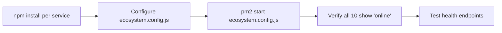

## Planning Notes

### Research Findings
- 10 backend services in backend/ directory: activity-reporter, bridge-keeper, harvest-keeper, indexer, liquidator, monitor, revenue-tracker, rpc-balancer, stocks-keeper, swap-oracle
- Existing ecosystem.config.js needs proper restart policies and env loading
- Each service needs: npm install, env vars from .env, PM2 config
- Health check via PM2 status + service-specific endpoints
- Services depend on running Anvil devnet (already running at localhost:8545)

### Architecture

### One-Week Decision: YES — fits in one week
Mostly operational: install deps, configure PM2, verify health. Estimated: 1-2 days.

## Goal
Install dependencies, configure PM2 ecosystem, and start all 10 backend services with proper restart policies and health checks.

## Scope

### Services to start:
1. activity-reporter
2. bridge-keeper
3. harvest-keeper
4. indexer
5. liquidator
6. monitor
7. revenue-tracker
8. rpc-balancer
9. stocks-keeper
10. swap-oracle

### Tasks:
1. Run `npm install` in each service directory
2. Update `backend/ecosystem.config.js` with:
   - Proper restart policies (`max_restarts: 10`, `restart_delay: 5000`)
   - Log rotation (`log_date_format: 'YYYY-MM-DD HH:mm:ss'`)
   - Environment variables from `.env`
   - Watch mode disabled in production
3. Start all services: `pm2 start ecosystem.config.js`
4. Verify each service shows "online" in `pm2 list`

## Acceptance Criteria
- All 10 services show "online" in `pm2 list`
- Each service connects to the chain (RPC: http://localhost:8545)
- PM2 restart policy handles crashes gracefully
- Logs are properly rotated
