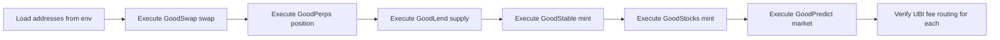

## Planning Notes

### Research Findings
- Contract addresses available in .autobuilder/addresses.env
- 6 protocols to test: GoodSwap, GoodPerps, GoodLend, GoodStable, GoodStocks, GoodPredict
- Each protocol needs: approve → execute → verify receipt → check UBI fee
- UBI fee verification: check UBI pool balance before/after, verify 33% of fees routed
- Use `cast send` for transactions, `cast call` for reads
- Tester key available in .env/addresses.env

### Architecture

### One-Week Decision: YES — fits in one week
6 protocol transactions + UBI verification script. Mostly using cast commands. Estimated: 2-3 days.

## Goal
Execute real on-chain transactions across all 6 protocols on Anvil devnet and verify UBI 33% fee routing works end-to-end.

## Scope

### Protocol Transactions:
1. **GoodSwap** — Approve + swap G$ for ETH
2. **GoodPerps** — Deposit margin + open position
3. **GoodLend** — Supply + withdraw
4. **GoodStable** — Deposit collateral + mint gUSD
5. **GoodStocks** — Mint synthetic stock
6. **GoodPredict** — Create market + buy position

### UBI Fee Verification:
For each protocol:
1. Record UBI pool balance before transaction
2. Execute protocol transaction
3. Check that 33% of fees arrived in UBI pool
4. Write assertion script that validates the exact fee split

### Contract Addresses:
From `.autobuilder/addresses.env`:
- GDT: 0x36c02da8a0983159322a80ffe9f24b1acff8b570
- GoodSwap: 0x922D6956C99E12DFeB3224DEA977D0939758A1Fe
- PerpEngine: 0x2e2ed0cfd3ad2f1d34481277b3204d807ca2f8c2
- MarginVault: 0x21df544947ba3e8b3c32561399e88b52dc8b2823
- GoodLend: 0x49fd2be640db2910c2fab69bb8531ab6e76127ff
- GoodStable: 0x5d42ebdbba61412295d7b0302d6f50ac449ddb4f
- GoodStocks: 0x2d13826359803522cce7a4cfa2c1b582303dd0b4
- MarketFactory: 0xd28f3246f047efd4059b24fa1fa587ed9fa3e77f
- UBI Claims: 0x976fcd02f7c4773dd89c309fbf55d5923b4c98a1

## Acceptance Criteria
- Transaction receipts prove all 6 protocols execute on-chain
- UBI fee routing verified: 33% of fees from each protocol reach UBI pool
- Test script is repeatable and can be run for regression testing
