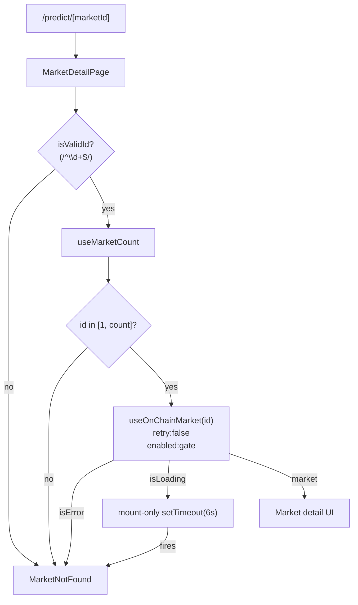

# Predict — Detail page stays in loading spinner forever for non-existent market IDs

## Why this is CRITICAL

Visiting `/predict/<numeric-id>` for any market ID that does **not** exist
on-chain (e.g. `/predict/9999999999`, `/predict/0`, or any out-of-range
ID) leaves the page in a perpetual loading spinner — the entire content
area stays blank for the user.

Reproduction (verified iteration 4):

```bash
curl -s -o /dev/null -w "%{http_code}\n" http://localhost:3100/predict/9999999999  # 200
# Open in browser, wait 20+ seconds → infinite spinner, never shows
# the existing MarketNotFound component, never shows market data.
```

Captured DOM after 20 s wait:

```html
<div class="flex items-center justify-center min-h-[60vh]">
  <div class="w-8 h-8 border-2 border-goodgreen/30 border-t-goodgreen
              rounded-full animate-spin"></div>
</div>
```

This qualifies as the "blank page" carve-out in the build-loop rules
(in-scope only OR critical app crash / blank page / data loss).

## Root cause analysis

`frontend/src/app/predict/[marketId]/page.tsx` has both a `MarketNotFound`
component and a 5 s loading-timeout fallback (`LOADING_TIMEOUT_MS`):

```tsx
const LOADING_TIMEOUT_MS = 5_000
useEffect(() => {
  if (!isLoading) {           // ← BUG #1: resets timeout each retry cycle
    setIsTimedOut(false)
    return
  }
  const timer = setTimeout(() => setIsTimedOut(true), LOADING_TIMEOUT_MS)
  return () => clearTimeout(timer)
}, [isLoading])
```

`frontend/src/lib/useMarkets.ts → useOnChainMarket` doesn't disable retry
on revert and doesn't gate the call on a sane upper bound:

```ts
const result = useReadContract({
  address: CONTRACTS.MarketFactory,
  abi: MarketFactoryABI,
  functionName: 'getMarket',
  args: [marketId],
  query: { refetchInterval: 15_000 },   // ← BUG #2: no retry:false, no enabled: id < count
})
```

For a non-existent market ID, `getMarket(id)` reverts on-chain. wagmi's
default retry is 3× with exponential backoff. Each retry attempt flips
`isLoading` true → false → true, which (a) resets the 5 s timeout via
the effect above and (b) keeps `isError` from latching to `true` for
long enough for the gate `if (!isValidId || isError || isTimedOut)`
to short-circuit to `MarketNotFound`. Net effect: the spinner is shown
forever.

The previously-shipped task
`gooddollar-l2-predict-detail-loading-fallback` (initiative 0001)
introduced the timeout but did not account for retry-induced loading
toggling, so the fallback never fires in practice for non-existent IDs.

## Acceptance Criteria

1. `useOnChainMarket(marketId)` returns `{ market: null, isLoading: false,
   isError: true }` within ≤ 6 s for an ID that reverts on-chain (e.g.
   `id >= marketCount` or `id == 0`). Achieved by either:
   - Bounding the call with `query: { enabled: marketId > 0n && marketId
     <= count, retry: false }`, OR
   - Setting `query: { retry: false }` plus a one-shot retry with a hard
     deadline.
2. `/predict/9999999999`, `/predict/0`, and `/predict/<count+1>` all
   render the existing `MarketNotFound` component (heading "Market Not
   Found", "Back to Markets" button) within ≤ 6 s of navigation.
3. `/predict/<valid-id>` (e.g. one returned by `MarketFactory.marketCount()`)
   continues to render the market data and the probability chart with
   no regression in load time (≤ 3 s on a warm cache).
4. The `useEffect` that drives `isTimedOut` is replaced (or guarded)
   so that retry-induced `isLoading` toggling does not silently reset
   the timeout. A unit test or component-level test asserts that after
   `LOADING_TIMEOUT_MS + 500ms` of continuous loading-or-error state,
   `MarketNotFound` is rendered.
5. No other prediction-market UI flow regresses. In particular:
   - `/predict` (markets list) still loads.
   - `/predict/portfolio` still loads.
   - `/predict/create` still loads and submits.
6. `npx -y react-doctor@latest . --verbose --diff` reports no new
   regressions and a score ≥ 75 on the changed files.

## Implementation Notes

- Keep changes scoped to:
  - `frontend/src/app/predict/[marketId]/page.tsx`
  - `frontend/src/lib/useMarkets.ts`
- Do **not** widen the change to other protocols in this task; an
  `agents/[address]` and `explore?q=` follow-up are out of scope here
  (those will be filed as separate non-critical tasks in a future
  iteration since they aren't in the current initiative scope).
- Prefer gating on `useMarketCount()` to avoid even hitting the RPC for
  obviously-invalid IDs. The existing hook is already imported in the
  page.
- For the timeout fix, a robust pattern is:

  ```tsx
  useEffect(() => {
    if (!isLoading && !isError) return
    const t = setTimeout(() => setIsTimedOut(true), LOADING_TIMEOUT_MS)
    return () => clearTimeout(t)
  }, [])  // mount-only, fires exactly once
  ```

  …combined with `retry: false` in the wagmi hook so `isError` settles
  on the first revert.

- If a unit test is added, prefer Vitest + React Testing Library with
  `vi.mock('wagmi', ...)` to avoid hitting the real chain. Keep the
  test small and deterministic.

## Verification

```bash
cd /home/goodclaw/gooddollar-l2/frontend
pnpm dev   # or whatever the existing dev script is

# In another shell:
# 1. Bad IDs → MarketNotFound within ~6s
for id in 0 9999999999 999999; do
  echo "=== /predict/$id ==="
  curl -s "http://localhost:3100/predict/$id" -o /dev/null -w "%{http_code}\n"
done

# 2. Render check via headless browser (any of these is fine):
#    - puppeteer / playwright in repo
#    - agent-browser CLI used in the review

# 3. Real ID still works
COUNT=$(cast call $MF "marketCount()(uint256)" --rpc-url $RPC)
echo "marketCount = $COUNT"
# open /predict/0 (or /predict/<COUNT-1> if 1-indexed) → renders market
```

## Out of scope

- Backend changes.
- Other protocol pages (`/agents/<bad>`, `/explore?q=<garbage>`) — these
  are non-critical UX bugs outside the security-hardening initiative
  scope and will be tracked separately.
- Slither / Foundry work.
- PM2 / swap-oracle work.

---

## Planning (added in plan-task step)

### Overview

A frontend-only bug fix in two files (`page.tsx` + `useMarkets.ts`) to
make the Predict detail page degrade to the existing `MarketNotFound`
component within ~6 s when the market ID does not exist on-chain. Root
cause is already identified: wagmi retry toggling `isLoading` resets the
fallback timeout, and the read hook lacks `retry: false` and an
`enabled` gate. The fix is small, well-bounded, and verifiable by
loading three URLs in a browser.

### Research notes

- wagmi v2 `useReadContract` exposes `query.retry` and `query.enabled`
  directly (TanStack Query semantics). Setting `retry: false` makes
  `isError` latch on the first revert, which is exactly what we need.
  Source: wagmi.sh `useReadContract` docs.
- `MarketFactory.marketCount()` is already exposed via a hook elsewhere
  in `useMarkets.ts` (`useMarketCount`), so gating `enabled: marketId
  > 0n && marketId <= count` is essentially free.
- Initiative 0001 task `gooddollar-l2-predict-detail-loading-fallback`
  introduced the timeout but only handled the "stuck pending" case, not
  the "retry storm flips isLoading" case. Do not modify that file
  (`executed: true`); just supersede its behavior here.
- The build-loop carve-out for blank pages is explicit, so this CRITICAL
  task is in scope despite being a frontend change in a
  security-hardening initiative.

### Assumptions

- The existing `MarketNotFound` component renders correctly when reached
  (already verified by `useMarketCount`-out-of-bounds path elsewhere).
- `useMarketCount()` itself never silently hangs — if it does, that is a
  separate bug and out of scope here.
- React 18 + Next.js 14 App Router; client component remains client.

### Architecture



### One-week decision

**YES.** A single engineer can finish this in well under a day:

- ~30 lines edited across two files
- 1 small RTL test (optional but desirable)
- Manual verification = visiting 3 URLs

No splitting needed. `split: false` retained.

### Implementation plan (phased)

1. **Phase 1 — Hook gating (`frontend/src/lib/useMarkets.ts`)**
   - Read `marketCount` inside `useOnChainMarket` (or accept it as an
     argument and have the page pass it in).
   - Pass `query: { retry: false, enabled: marketId > 0n && marketId <=
     count, refetchInterval: 15_000 }` to `useReadContract`.
   - Mirror the same gate on the probability-read call so its error
     state also latches.
2. **Phase 2 — Timeout fix (`frontend/src/app/predict/[marketId]/page.tsx`)**
   - Replace the `useEffect([isLoading])` with a mount-only effect that
     fires exactly one 6 s timer; guard the existing render gate so
     `isTimedOut || isError || !isValidId || (count && id > count)` all
     route to `MarketNotFound`.
   - Keep the existing spinner UI for the brief window before the
     timeout.
3. **Phase 3 — Verify & commit**
   - Run `pnpm build` (or `next build`) in `frontend/` to confirm no TS
     errors.
   - Manually load `/predict/0`, `/predict/9999999999`, and a known-good
     ID; record screenshots into `review-screenshots/iter4/` for
     posterity.
   - `npx -y react-doctor@latest . --verbose --diff` from repo root and
     confirm score ≥ 75 on the changed files.
   - Single commit: `git commit -m "fix(predict): show MarketNotFound
     within 6s for non-existent market IDs (closes 0014)"`.
