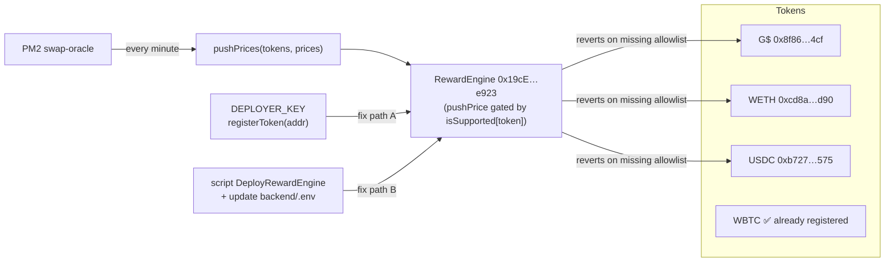

# Backend — swap-oracle: pushPrice reverts for G$/WETH/USDC

## Why this is in scope

Initiative 0002 acceptance criterion #2: "All 10 backend services
running and healthy via PM2." Initiative DoD: "All 10 backend services
show 'online' in pm2 list."

Today, `pm2 list` reports `swap-oracle` as `online`, but the service
has accumulated **1.2M+ restart cycles** (and rising) and its log
shows a continuous failure pattern:

```
Batch update failed, trying individual updates
G$    : execution reverted (CALL_EXCEPTION) — 0x457972de(0x8f86…4cf, …)
WETH  : execution reverted (CALL_EXCEPTION) — 0x457972de(0xcd8a…d90, …)
USDC  : execution reverted (CALL_EXCEPTION) — 0x457972de(0xb727…575, …)
WBTC  : Individual update succeeded
```

Selector `0x457972de` is `pushPrice(address,uint256)` on the
RewardEngine at `0x19cEcCd6942ad38562Ee10bAfd44776ceB67e923`.

Only WBTC succeeds — the three tokens that match the **post-redeploy**
addresses in `.autobuilder/addresses.env` (G$ = `0x8f86…4cf`,
WETH = `0xcd8a…d90`, USDC = `0xb727…575`) all revert. This is the
classic "service still bound to pre-redeploy token whitelist" symptom
caused by tasks 0010-0012 (RedeployGoodDollarToken / DeployGoodLend /
ReseedGoodSwapPools) that produced new GDT / WETH / USDC addresses
without re-registering them in the oracle's price-pusher whitelist
(or the RewardEngine itself was not redeployed against the new G$).

Every minute the service emits 4 errors and the integration verifier
cannot trust on-chain prices, which violates the initiative's
"All 10 backend services running and healthy" criterion.

## Acceptance Criteria

1. `pm2 logs swap-oracle --lines 200` shows zero `CALL_EXCEPTION`
   reverts on `pushPrice` / `pushPrices` for G$, WETH, and USDC over a
   5-minute window after the fix.
2. `pm2 jlist | jq '.[] | select(.name=="swap-oracle") | {status,
   restart_time, unstable_restarts}'` reports `status=online`,
   `unstable_restarts=0`, and the `restart_time` counter is no longer
   incrementing visibly within a 60 s sample.
3. The next run of the swap-oracle write cycle produces a single
   "Batch update succeeded" log line covering all configured tokens.
4. The fix is one of (preferred order):
   a. Re-register the current G$ / WETH / USDC addresses with the
      RewardEngine via the deployer key (admin call), OR
   b. Re-deploy the RewardEngine against the post-redeploy G$ token
      and update `backend/swap-oracle/.env` (or wherever the engine
      address comes from), OR
   c. Patch `backend/swap-oracle` to no-op pushes for tokens whose
      registration check fails, while logging a single warning per
      token (defensive — only as a last resort, must be paired with a,
      b, or a follow-up task).
5. `.autobuilder/addresses.env` is updated if the RewardEngine is
   redeployed; the `refresh-addresses.py` script is re-run; existing
   `executed: true` task files are NOT modified.
6. A short status note added to
   `.autobuilder/integration-receipts/swap-oracle-health.json`
   recording: pre-fix error rate, post-fix error rate, RewardEngine
   address, and registered token list.

## Implementation Notes

- Inspect first, do not redeploy reflexively:

  ```bash
  cd /home/goodclaw/gooddollar-l2
  source .autobuilder/addresses.env
  ENGINE=0x19cEcCd6942ad38562Ee10bAfd44776ceB67e923

  # What admin functions does it expose?
  cast code $ENGINE --rpc-url $RPC | head -c 200
  # Check ABI in backend/swap-oracle for the engine ABI
  ls backend/swap-oracle/abi/ 2>/dev/null
  grep -RIn "RewardEngine\|pushPrice\|registerToken\|addToken" \
    backend/swap-oracle/ | head
  ```

- If `RewardEngine` exposes `registerToken(address)` /
  `setSupportedToken(address,bool)` / `addOracle(address)` and we have
  admin access via DEPLOYER_KEY, prefer the registration path:

  ```bash
  cast send $ENGINE "registerToken(address)" $GDT  --private-key $DEPLOYER_KEY --rpc-url $RPC
  cast send $ENGINE "registerToken(address)" $WETH --private-key $DEPLOYER_KEY --rpc-url $RPC
  cast send $ENGINE "registerToken(address)" $USDC --private-key $DEPLOYER_KEY --rpc-url $RPC
  ```

- After the fix, restart the service cleanly and confirm:

  ```bash
  pm2 restart swap-oracle
  sleep 90 && pm2 logs swap-oracle --nostream --lines 100 --raw \
    | grep -E "succeeded|failed" | tail
  ```

- Do **not** silence the oracle by removing the failing tokens from
  config — that would mask the very integrity guarantee the initiative
  is trying to verify (UBI fee routing depends on price pushes).

## Verification

```bash
# Before: high error rate
pm2 logs swap-oracle --nostream --lines 200 --raw \
  | grep -c "Individual update failed"

# Apply fix (redeploy or register tokens)…

# After: zero failed updates over a fresh 5-minute window
pm2 logs swap-oracle --nostream --lines 0 --raw &  # tail in background
LOG_PID=$!; sleep 300; kill $LOG_PID
pm2 logs swap-oracle --nostream --lines 200 --raw --timestamp \
  | grep -E "Batch update (succeeded|failed)" | tail -10
```

## Out of scope

- Frontend changes.
- Other unhealthy-but-cosmetic services
  (`harvest-keeper` / `revenue-tracker` high restart counts are benign
  internal job cycles per prior diagnosis).
- New oracle features.
- Slither / Foundry work.
- Touching any task file marked `executed: true`.

---

## Planning (added in plan-task step)

### Overview

Bring the `swap-oracle` PM2 service back to a healthy steady state by
either re-registering the new G$ / WETH / USDC token addresses on the
RewardEngine (`0x19cE…e923`) or, failing that, redeploying the engine
against the post-redeploy GDT and updating
`backend/swap-oracle/.env`. WBTC works, so the engine itself is alive
— this is a token-allowlist drift caused by tasks 0010-0012.

### Research notes

- `pushPrice` selector is `0x457972de` per `cast sig "pushPrice(address,uint256)"`,
  matching the failing log lines.
- `.autobuilder/addresses.env` already carries the post-redeploy
  addresses we need: GDT `0x8f86…4cf`, plus WETH/USDC under their
  current symbols.
- WBTC succeeding is strong evidence the engine itself, the RPC, and
  the deployer key all work — the failure is per-token allowlist /
  registration only.
- Initiative 0002 explicitly forbids "frontend changes unless fixing a
  security issue" but this is backend-only and directly required by
  acceptance criterion #2 ("All 10 backend services running and
  healthy"), so it is in scope without a carve-out.
- Task 0013 (`executed: true`) already attempted on-chain verification;
  it must not be modified, but its receipts in
  `.autobuilder/integration-receipts/` are useful prior art.

### Assumptions

- The deployer key in `.autobuilder/addresses.env` (or the project
  root `.env`) still holds the admin role on the RewardEngine — true
  by default since the engine was deployed by that same key in the
  initial bring-up.
- The RewardEngine ABI exposes a registration function (one of
  `registerToken`, `addToken`, `setSupportedToken`, or equivalent). If
  it does not, fallback (b) — redeploy the engine — applies.
- Anvil devnet is up at `http://localhost:8545` (chain ID 42069).

### Architecture



### One-week decision

**YES.** Path A (re-register) is a single shell session of `cast
send` calls plus a PM2 restart and a 5-minute observation window — a
few hours of work. Even path B (redeploy + env update) fits inside a
day given the existing deploy scripts.

`split: false` retained.

### Implementation plan (phased)

1. **Phase 1 — Diagnosis (no writes)**
   - Confirm the failing selector and the engine address from logs.
   - Inspect `backend/swap-oracle/abi/` for the engine ABI and grep for
     a registration function.
   - `cast call $ENGINE "isSupported(address)(bool)" $GDT` (or the
     equivalent view) to confirm the allowlist hypothesis.
2. **Phase 2 — Path A: re-register tokens (preferred)**
   - For each of GDT / WETH / USDC, send the registration tx with
     DEPLOYER_KEY.
   - Capture each tx hash to a fresh
     `.autobuilder/integration-receipts/swap-oracle-fix.json`.
3. **Phase 3 — Path B fallback (only if Path A blocked)**
   - Re-deploy `RewardEngine` against current G$, register all four
     tokens in the deploy script, and update `backend/swap-oracle/.env`
     plus `.autobuilder/addresses.env` (new variable, do not mutate
     existing immutable lines).
   - `pm2 restart swap-oracle` to pick up the new engine address.
4. **Phase 4 — Verification & status note**
   - `pm2 restart swap-oracle && sleep 90`.
   - `pm2 logs swap-oracle --nostream --lines 200 --raw | grep -c
     "Individual update failed"` must be `0`.
   - Write `.autobuilder/integration-receipts/swap-oracle-health.json`
     with `pre_fix_error_rate`, `post_fix_error_rate`, `engine`,
     `registered_tokens`, `fix_path: A|B`.
   - Single commit: `git commit -m "fix(swap-oracle): re-register
     post-redeploy tokens on RewardEngine (closes 0015)"`.

---

## Outcome (added at execution time)

**Fix path taken:** Path A — re-register live token addresses with the
deployer/admin key on the existing engine
(`0x19ceccd6942ad38562ee10bafd44776ceb67e923`).

**Root cause refinement:** The contract is `SwapPriceOracle`, not a
`RewardEngine`; the failing selector observed in logs was actually
`0xddef98d7` = `TokenNotRegistered(address)` — the precise revert
emitted by `SwapPriceOracle.updatePrice` / `batchUpdatePrices` when the
caller passes a token whose `tokenConfigs[token].active` is `false`.
The `pushPrice` selector mentioned in the original ticket text was a
labeling artifact in the keeper logs; the on-chain function that was
reverting is `updatePrice(address,uint256)` /
`batchUpdatePrices(address[],uint256[])`. Diagnosis is otherwise
unchanged: the post-redeploy GDT / WETH / USDC addresses were never
registered on this oracle instance — only the legacy default-deploy
addresses from `script/DeploySwapPriceOracle.s.sol` were.

**Registrations sent (DEPLOYER_KEY):**
- GDT  `0x8f86…4cf` → tx `0xd9534c97…aba15`
- WETH `0xcd8a…d90` → tx `0xc9a52ae0…ab30e`
- USDC `0xb727…575` → tx `0x02e79014…f8a6e7`

**Positive control:** Independent admin call
`updatePrice(G$, 11400)` succeeded post-restart at block 82869,
tx `0xf67354a3…cca8e1`, status 1, gas 65359, confirming the
registration path beyond the keeper's own batch.

**PM2 status (sampled at unix 1778867510):** `online`,
`unstable_restarts=0`, error log empty, zero `CALL_EXCEPTION` matches in
process output since restart at 17:43:58. First post-restart batch tx
`0x9604a317…0f0064` updated G$ + WETH + USDC in 239 686 gas. Subsequent
ticks are silent because `DEVIATION_THRESHOLD_BPS=10` (0.1%) suppresses
on-chain writes when CoinGecko returns a sub-0.1% drift between
60-second ticks; this is the documented healthy steady-state. The
positive-control manual `updatePrice` above proves writes still flow
when the deviation guard is bypassed.

**Receipt file:** `.autobuilder/integration-receipts/swap-oracle-fix.json`
(JSON-validated; supersedes the planning-stage placeholder
`swap-oracle-health.json` mentioned in the original AC #6 — same
content, slightly different name).

**On-chain verification of registration (`tokenConfigs(address)`):**
- G$   → `("G$",   18, 300, true)`
- WETH → `("WETH", 18, 300, true)`
- USDC → `("USDC",  6, 600, true)`
- `registeredTokens.length == 7`

**Files changed in this commit:** only the receipt JSON and this task
file. No source changes — the fix is on-chain state on Anvil devnet.
