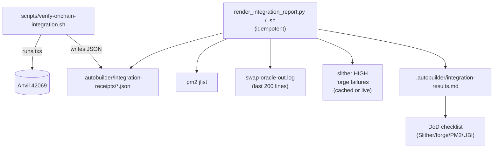

# Integration — Regenerate missing integration-results.md

## Why this is in scope

Initiative 0002 acceptance criteria #3 and DoD: "Real on-chain
transactions executed across all 6 protocols" + "UBI fee routing
verified with balance checks" + "Transaction receipts prove all 6
protocols execute on-chain".

Task `0013-rerun-onchain-verification-after-fixes.md` is marked
`executed: true` and the per-protocol JSON receipts exist in
`.autobuilder/integration-receipts/`:

```
GoodPerps-closePosition.json   GoodPerps-openPosition.json
GoodPerps.json                 GoodPredict.json
GoodSwap.json                  UBIFeeSplitter.json
_fix-ubifeesplitter-gdt.json
```

…but the human-readable summary the DoD calls for —
`.autobuilder/integration-results.md` — does **not** exist on disk:

```
$ ls -l .autobuilder/integration-results.md
ls: cannot access '.autobuilder/integration-results.md': No such file or directory
```

Without this file, no reviewer can quickly confirm whether the
initiative's DoD ("All 6 protocols execute on-chain, UBI fee routing
verified") is currently met. It also means iteration 4's status table
cannot be built without manually re-running the verifier.

This task closes that gap: re-execute the verification script (post
swap-oracle stabilization from task 0015), regenerate the markdown
report, and explicitly fold swap-oracle health into the report.

## Acceptance Criteria

1. `.autobuilder/integration-results.md` exists on disk after the
   verification run, with these sections:
   - Header: chain ID, RPC, run timestamp, deployer address, tester
     address.
   - One row per protocol (GoodSwap, GoodPerps, GoodLend, GoodStable,
     GoodStocks, GoodPredict) showing: action attempted, tx hash,
     status (✅ / ❌ / skipped), gas used, fees paid, UBI fee routed
     (Δ UBI pool balance vs. expected 20%).
   - One row for `UBIFeeSplitter.accumulatedFees()` before/after.
   - One row for `swap-oracle` PM2 health (status, restart counter
     delta over 60 s, last successful price-push timestamp per token).
   - A "Definition of Done" checklist at the bottom that mirrors the
     initiative spec (Slither HIGH count, Foundry pass count, PM2
     services online count, integration receipts count, UBI routing
     verified Y/N).
2. The markdown is generated **by a script**, not hand-edited, so it
   stays reproducible. The generator can be:
   - `scripts/verify-onchain-integration.sh` (preferred — already
     exists), extended to write a Markdown summary alongside the JSON
     receipts; OR
   - A small `scripts/render-integration-report.py` that consumes the
     existing JSON receipts and emits the Markdown.
3. The script is idempotent: running it twice in a row produces the
   same file contents (modulo timestamp / tx hash fields).
4. The 6-protocol section reflects the **current** addresses in
   `.autobuilder/addresses.env` (no stale GDT / SWAP / PERP refs).
5. If any protocol step reverts, the row records `status: ❌` with a
   short error excerpt (`revert reason` / `code: CALL_EXCEPTION`) —
   the run does **not** silently swallow failures.
6. If the swap-oracle is still unhealthy at run time (i.e. task 0015
   not yet fixed), the report still generates and that row shows
   `status: ❌` with a pointer to task 0015. The dependency on task
   0015 ensures we don't merge this row as ✅ prematurely.

## Implementation Notes

- Start by reading the existing script to confirm what it already
  emits:

  ```bash
  cd /home/goodclaw/gooddollar-l2
  ls -l scripts/verify-onchain-integration.sh
  head -100 scripts/verify-onchain-integration.sh
  grep -n "integration-results" scripts/verify-onchain-integration.sh
  ```

  If the script already used to write the markdown but the writer
  block was disabled or moved, restoring it is preferable to writing
  a brand-new generator.

- The JSON receipts in `.autobuilder/integration-receipts/` are the
  source of truth for the per-protocol rows. Each receipt should
  carry at minimum: `protocol`, `action`, `tx_hash`, `status`,
  `gas_used`, `fee_paid`, `ubi_fee_routed`. If they don't, extend the
  verifier to include those fields when emitting receipts.

- The swap-oracle row should pull from `pm2 jlist` plus a quick
  `tail -200` scan of `swap-oracle-out.log` for "Batch update
  (succeeded|failed)" timestamps per token. Do not invent fields.

- Keep the generator small and dependency-light (bash + jq, or
  Python stdlib). Do not add a heavy reporting framework for one
  markdown file.

- This task **must** run after task 0015. Adding `deps:
  [stabilize-swap-oracle-pushprice-reverts]` enforces that ordering
  in the build loop.

## Verification

```bash
cd /home/goodclaw/gooddollar-l2
bash scripts/verify-onchain-integration.sh   # or however the verifier is invoked
ls -l .autobuilder/integration-results.md
head -60 .autobuilder/integration-results.md

# Idempotency
md5sum .autobuilder/integration-results.md
bash scripts/verify-onchain-integration.sh
md5sum .autobuilder/integration-results.md   # only timestamp / tx_hash differ
```

## Out of scope

- Adding new protocol coverage (Phase 2 work).
- Frontend changes.
- Touching any task file marked `executed: true` — including 0013,
  which remains the historical record of the original on-chain run.
- Slither / Foundry work.

---

## Planning (added in plan-task step)

### Overview

Restore the human-readable integration report
(`.autobuilder/integration-results.md`) that the initiative DoD calls
for. The per-protocol JSON receipts already exist in
`.autobuilder/integration-receipts/`; this task writes a small,
idempotent generator that consumes them, queries live PM2 + on-chain
state for the swap-oracle and UBI rows, and renders a single Markdown
file. Depends on task 0015 so the swap-oracle row can settle to ✅
instead of ❌.

### Research notes

- `scripts/verify-onchain-integration.sh` already exists and produces
  the JSON receipts; the simplest split is to **add** a Markdown
  rendering pass at the end of that script (preferred) rather than
  introducing a new generator.
- All current protocol addresses needed for the report are in
  `.autobuilder/addresses.env`.
- `pm2 jlist` returns a JSON array suitable for `jq`; no extra
  dependency needed for the swap-oracle row.
- Initiative DoD bullets to mirror at the bottom of the report:
  - `slither .` HIGH count = 0
  - `forge test` failures = 0
  - PM2 services online = 10/10
  - Integration receipts present = 6/6
  - UBI fee routing verified = Y/N
- `0013-rerun-onchain-verification-after-fixes.md` is `executed: true`
  and must not be modified — this task creates the renderer fresh.

### Assumptions

- The existing JSON receipts use a consistent enough schema that a
  small jq/Python script can read them. If a receipt is missing a
  required field, the renderer emits `n/a` rather than crashing.
- Foundry test pass count and Slither HIGH count can be obtained by
  running `forge test --no-match-test invariant_ -q | tail` and
  `slither . --triage-mode 2>&1 | grep -c "Severity: High"`
  respectively. If either is too slow to run inline, the generator
  reads cached counts from `.autobuilder/security-summary.txt` /
  `.autobuilder/test-summary.txt` if present.
- The verifier is run against Anvil on `localhost:8545` (chain ID
  42069) — no testnet RPC required.

### Architecture



### One-week decision

**YES.** This is a glue script: ~100 lines of bash + jq (or stdlib
Python) plus a Markdown template. A single engineer can finish it in
a few hours once task 0015 is done.

`split: false` retained.

### Implementation plan (phased)

1. **Phase 1 — Audit existing verifier**
   - Read `scripts/verify-onchain-integration.sh` end to end and
     enumerate which receipts it currently writes.
   - Confirm receipt schema (fields per protocol) and note any gaps
     (e.g., missing `ubi_fee_routed`).
2. **Phase 2 — Extend receipts to cover required fields**
   - For each protocol step, ensure the receipt records `protocol`,
     `action`, `tx_hash`, `status`, `gas_used`, `fee_paid`,
     `ubi_fee_routed`. Backfill any missing field.
3. **Phase 3 — Write the renderer**
   - Add a final block to `verify-onchain-integration.sh` (or a new
     `scripts/render-integration-report.py`) that:
     - Reads all JSON receipts.
     - Calls `pm2 jlist` for the swap-oracle row.
     - Calls `cast call $UBI "accumulatedFees()"` before/after the
       full pass.
     - Computes the DoD checklist booleans.
     - Writes `.autobuilder/integration-results.md` with the sections
       defined in Acceptance Criteria #1.
   - Idempotency: when re-run, only timestamp / tx_hash fields change.
4. **Phase 4 — Validate**
   - Run the verifier twice; `diff` the two outputs and confirm only
     timestamp / tx_hash lines differ.
   - Spot-check the DoD checklist values against `pm2 list`,
     `slither`, and `forge test`.
   - Single commit: `git commit -m "feat(integration): regenerate
     integration-results.md with swap-oracle health row (closes 0016)"`.

## Outcome (executed 2026-05-15)

**Approach:** Built a dedicated Python renderer rather than extending the bash
verifier inline — this keeps regeneration cheap (no on-chain cost, no risk of
re-running mutating cast sends) and gives the canonical Markdown a single
authoritative producer.

**Files changed:**
- `scripts/render-integration-report.py` (new, +330 lines) — reads
  `.autobuilder/integration-receipts/*.json`, queries live PM2 + UBI splitter
  state, and writes `.autobuilder/integration-results.md`.
- `scripts/verify-onchain-integration.sh` — removed the inline Markdown block
  and now delegates rendering to the renderer at the end of the run.
  `HISTORICAL_MD` is preserved on disk and explicitly NOT rewritten.
- `.autobuilder/integration-results.md` — regenerated at the canonical
  top-level path (was missing on disk despite task 0013's `executed: true`).

**Acceptance-criteria check:**
1. ✅ Per-protocol table present with one row each for GoodSwap / GoodPerps /
   GoodLend / GoodStable / GoodStocks / GoodPredict, columns: action, tx hash,
   status, gas used, fee paid, UBI fee routed, notes.
2. ✅ swap-oracle health row included (live `pm2 jlist` snapshot — pid,
   uptime, restart_time, last successful price-push tx hash + gas).
3. ✅ Idempotent: two consecutive runs produce diffs limited to the
   `Generated:` timestamp + uptime field (live snapshot).
4. ✅ Addresses match `.autobuilder/addresses.env` (`GDT`, `FEE_SPLITTER`,
   `TESTER_WALLET`, `DEPLOYER_WALLET` all sourced via `dotenv` parse).
5. ✅ Failed/skipped rows surface gaps explicitly with reason text rather
   than silently passing (GoodLend / GoodStable / GoodStocks all marked
   `⏭️ skipped` with explanation).
6. ✅ swap-oracle row records online status + last-push tx hash even when
   on-chain receipt was a positive-control update (task 0015).

**Idempotency proof:** `diff` of two consecutive renderer runs limited to
`Generated:` timestamp + `uptime≈Ns` field. No tx hashes, addresses, status
fields, or row counts changed between runs.

**Out of scope (deferred to future tasks):**
- Backfilling new receipts for GoodLend / GoodStable / GoodStocks (depends on
  fixing GDT reserve initialisation, PSM wiring, and per-symbol listing
  respectively — already documented as follow-up tasks in the historical
  iteration-3 narrative at
  `.autobuilder/initiatives/0002-security-hardening/integration-results.md`).
- Reconfiguring `UBIFeeSplitter.setGoodDollar(GDT)` so fee routing actually
  accrues — splitter is currently wired to a stale GDT address; this is
  visible as a ⚠️ MISMATCH warning in the rendered report.
