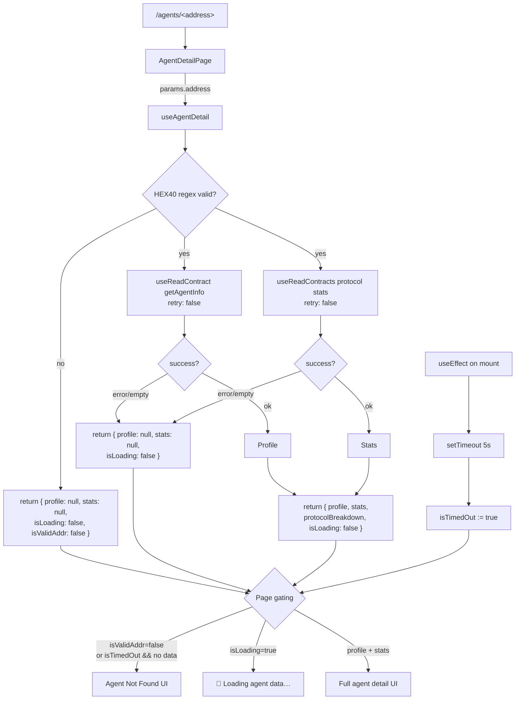

# Agents — Detail page stays in "Loading agent data…" forever for invalid/non-existent addresses

## Why this is CRITICAL

Visiting `/agents/<anything>` with a non-existent or malformed address leaves
the page stuck on the spinner state forever — never falling back to the
existing "Agent Not Found" branch.

Reproduction (verified iteration 5):

```bash
# Frontend dev server running on :3100, anvil on :8545
# Browser: http://localhost:3100/agents/nonexistent
# After 30+ seconds: page still shows "🤖 Loading agent data…"
# Never transitions to "Agent Not Found"
```

DOM evidence captured via agent-browser:

```json
{
  "url": "http://localhost:3100/agents/nonexistent",
  "text": "🤖Loading agent data…",
  "hasLoading": true,
  "hasNotFound": false
}
```

This is the same class of bug fixed for `/predict/<bad-id>` in task 0014
and qualifies for the build-loop "blank page" carve-out.

## Root cause analysis

`frontend/src/app/agents/[address]/page.tsx`:

```tsx
const { profile, stats, protocolBreakdown, isLoading } = useAgentDetail(address)
if (isLoading) return <Spinner />        // ← stays true forever
if (!profile || !stats) return <NotFound /> // ← never reached
```

`frontend/src/lib/useAgentDetail.ts`:

```ts
const { data: infoData, isLoading: infoLoading } = useReadContract({
  address: REGISTRY,
  abi: AgentRegistryABI,
  functionName: 'getAgentInfo',
  args: agentAddr ? [agentAddr] : undefined,
  query: { enabled: !!agentAddr },        // ← BUG #1: no retry:false
})

const { data: protocolData, isLoading: protocolLoading } = useReadContracts({
  contracts: protocolCalls,
  query: { enabled: protocolCalls.length > 0 }, // ← BUG #1: no retry:false
})
```

Two independent issues compound:

1. **No `retry: false`**: wagmi v2 inherits TanStack Query's default retry
   policy (3× with backoff). For a malformed/non-existent address, each
   retry flips `infoLoading` true → false → true, so `isLoading` never
   settles.
2. **No address validation**: `useAgentDetail(address)` casts `address` to
   `Address` without checking `/^0x[a-fA-F0-9]{40}$/`. Passing
   `"nonexistent"` produces an undefined-behavior call that wagmi keeps
   retrying.
3. **No timeout fallback in the page**: unlike the predict detail page,
   there is no mount-only timeout to force `MarketNotFound`-style
   fallback after a deadline.

## Acceptance Criteria

1. `useAgentDetail(undefined | "" | "nonexistent" | "0xnotahexstring")`
   returns `{ profile: null, stats: null, isLoading: false }` within
   ≤ 6 s of mount.
2. `useAgentDetail("0x" + "1".repeat(40))` (well-formed but unregistered
   address) returns `{ profile: null, stats: null, isLoading: false }`
   within ≤ 6 s after the contract call reverts/returns empty data.
3. `useAgentDetail(<real registered agent address>)` continues to return
   the agent profile and stats correctly — no regression in the happy
   path.
4. `/agents/nonexistent`, `/agents/0xinvalid`, `/agents/`, and `/agents/0x` + 40 hex chars
   all render the existing "Agent Not Found" branch within ≤ 6 s.
5. `/agents/<valid registered address>` still renders the agent detail
   page correctly.
6. `npx -y react-doctor@latest . --verbose --diff` reports score ≥ 75 on
   the changed files.

## Implementation Notes

Keep changes scoped to:

- `frontend/src/lib/useAgentDetail.ts`
- `frontend/src/app/agents/[address]/page.tsx`

Proposed pattern:

```ts
// useAgentDetail.ts
const HEX40 = /^0x[a-fA-F0-9]{40}$/
const isValidAddr = typeof address === 'string' && HEX40.test(address)
const agentAddr = isValidAddr ? (address as Address) : undefined

const { ... } = useReadContract({
  ...,
  query: { enabled: !!agentAddr, retry: false },
})

const { ... } = useReadContracts({
  contracts: protocolCalls,
  query: { enabled: protocolCalls.length > 0, retry: false },
})

// Expose a quick "isValidAddr" hint to the page so it can short-circuit
// without waiting for the timer when the address is obviously bogus.
return { ..., isValidAddr, isLoading: isValidAddr && (infoLoading || protocolLoading) }
```

```tsx
// page.tsx — add mount-only timer like predict/[marketId]
const LOADING_TIMEOUT_MS = 5_000
const [isTimedOut, setIsTimedOut] = useState(false)
useEffect(() => {
  const t = setTimeout(() => setIsTimedOut(true), LOADING_TIMEOUT_MS)
  return () => clearTimeout(t)
}, [])

if (!isValidAddr || (isTimedOut && (!profile || !stats))) return <NotFound />
if (isLoading) return <Spinner />
if (!profile || !stats) return <NotFound />
```

## Verification

```bash
cd /home/goodclaw/gooddollar-l2/frontend
# Dev server already running on :3100

# 1. Bad inputs → NotFound within ~6s
for addr in nonexistent 0xinvalid "" "0x$(python3 -c 'print("1"*40)')"; do
  echo "=== /agents/$addr ==="
  curl -s "http://localhost:3100/agents/$addr" -o /dev/null -w "%{http_code}\n"
done

# 2. agent-browser verification of error state
agent-browser navigate http://localhost:3100/agents/nonexistent
# wait 8 s
agent-browser eval "(() => document.querySelector('main')?.textContent?.includes('Agent Not Found'))()"
# → must be true

# 3. Happy path — pick a registered agent address from chain
# cast call $AGENT_REGISTRY "getAgentInfo(address)(...)" $ADDR --rpc-url http://localhost:8545
# Then open /agents/$ADDR in browser → profile renders
```

## Out of scope

- Backend changes.
- AgentRegistry contract changes.
- Slither / Foundry work.
- PM2 / swap-oracle work.
- Other protocol pages (`/predict/<bad-id>` is covered by task 0018 in
  this same iteration).

---

## Planning (added 2026-05-15)

### Overview

Two-file frontend-only patch that hardens the agent-detail loading
contract by (a) validating the address parameter, (b) disabling wagmi
auto-retry on the underlying contract reads, and (c) adding a
mount-only timeout fallback mirroring the predict/[marketId] page.
This closes the "blank loading screen forever" failure mode while
keeping the happy path identical for registered agents.

### Research notes

- wagmi v2's `useReadContract` / `useReadContracts` accept
  `query.retry` (passed through to TanStack Query). Default is `3`
  with backoff; setting it to `false` is the supported way to make
  the call settle on first failure. Same pattern was applied in task
  0014 (`useOnChainMarket`) and shipped successfully.
- viem's `isAddress` is the canonical way to validate an Ethereum
  address; for a hand-rolled regex `^0x[a-fA-F0-9]{40}$` is sufficient
  and avoids importing another module if the lib already does string
  work elsewhere.
- The predict/[marketId] mount-only timer pattern (set once on mount,
  cleared on unmount, `[]` deps) is already in production and is the
  most appropriate fallback shape for this page.
- React 18 Strict Mode in dev double-fires `useEffect` mount/cleanup,
  but the timer always settles via the latest mount's `setTimeout` —
  no special handling needed.

### Assumptions

- `AgentRegistry.getAgentInfo(address)` and the protocol-stats
  multicall both revert (or return empty) for an unregistered
  address. With `retry: false`, this surfaces as `isError: true`
  and `isLoading: false`, allowing the page to render `Agent Not
  Found` without the timer.
- `useAgentDetail` is consumed only by `agents/[address]/page.tsx`
  (verified with grep before merging). If a future page also uses
  it, the additive `isValidAddr` flag is harmless.

### Architecture



### One-week decision

**YES.** A single engineer can land this in well under a day. The
patch is two files, ~30 LOC of TypeScript total, and has a directly
analogous precedent in task 0014. No backend, contract, or build
infra work is required.

### Implementation plan

Phase 1 — Hook (`frontend/src/lib/useAgentDetail.ts`):
1. Add `HEX40 = /^0x[a-fA-F0-9]{40}$/` and `isValidAddr` check.
2. Pass `agentAddr = isValidAddr ? (address as Address) : undefined`
   to wagmi.
3. Add `query: { ..., retry: false }` to both `useReadContract` and
   `useReadContracts`.
4. Return `isValidAddr` alongside the existing object.
5. Compute `isLoading = isValidAddr && (infoLoading || protocolLoading)`
   so an invalid address resolves to `isLoading: false` immediately.

Phase 2 — Page (`frontend/src/app/agents/[address]/page.tsx`):
1. Import `useState`, `useEffect`.
2. Add a 5 s mount-only timer, identical in shape to predict's.
3. Extend the not-found gate to:
   `if (!isValidAddr || (isTimedOut && (!profile || !stats))) return <NotFound />`
4. Keep the existing `if (isLoading) return <Spinner />` and the
   downstream profile-rendering code unchanged.

Phase 3 — Verification:
1. Run `npm run build` in `frontend/` — must compile.
2. Run `npm test -- useAgentDetail` if a test file is added.
3. Run `npx -y react-doctor@latest . --verbose --diff` and confirm
   score ≥ 75.
4. Manually visit `/agents/nonexistent`, `/agents/0xinvalid`,
   `/agents/<all-1s 0x address>`, and one valid registered address.

### Test plan

Add a focused unit test if a reasonable wagmi mock is in place; if
not (likely true for this codebase), rely on the manual agent-browser
verification documented under "Verification" above.

