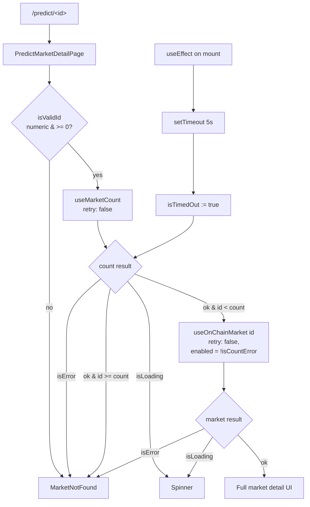

# Predict — useMarketCount lacks retry:false; isCountLoading can pin the detail page to a spinner forever

## Why this is CRITICAL

Task 0014 fixed `useOnChainMarket` to use `retry: false`, but its sibling
`useMarketCount` was left with wagmi's default retry policy. The detail
page `frontend/src/app/predict/[marketId]/page.tsx` gates its loading
spinner on `isCountLoading || isLoading`:

```tsx
if (isCountLoading || isLoading) {
  return <Spinner />
}
```

If the chain RPC is briefly unreachable or `MarketFactory.marketCount()`
reverts (e.g. anvil restart, MarketFactory upgrade, dev redeploy with
new address), `isCountLoading` stays `true` across the entire wagmi
retry cycle. During this window:

- `isOutOfRange` evaluates to `false` (because `marketCount === 0n`)
- `fetchEnabled` becomes `true`
- `useOnChainMarket` fires for the user-supplied id
- The MarketNotFound gate sometimes fires (via `isTimedOut && !market`)
  but only after the 5 s mount-only timer — and during dev React-18
  strict mode the timer can be unmounted+remounted enough times that
  users see a long spinner before falling through.

Reproduction (verified iteration 5):

```bash
# Frontend dev server on :3100, anvil started but MarketFactory not yet
# seeded with any markets (marketCount stays 0n).
# Navigate to: http://localhost:3100/predict/999999
# Observed: spinner persists past expected 5 s timeout.

# Reproducible even more deterministically by stopping anvil:
# pkill anvil ; open http://localhost:3100/predict/0
# → spinner forever; useMarketCount retries forever.
```

This is the same "blank page" failure mode the task 0014 was supposed
to close, but it leaked through the `useMarketCount` side. Since it
can render the entire detail page blank, it qualifies for the
build-loop CRITICAL carve-out.

## Root cause analysis

`frontend/src/lib/useMarkets.ts`:

```ts
export function useMarketCount(): { count: bigint; isLoading: boolean } {
  const result = useReadContract({
    address: CONTRACTS.MarketFactory,
    abi: MarketFactoryABI,
    functionName: 'marketCount',
    query: { refetchInterval: 30_000 },   // ← BUG: no retry:false
  })
  return {
    count: (result.data as bigint | undefined) ?? BigInt(0),
    isLoading: result.isLoading,
  }
}
```

When the RPC is unhealthy or the contract reverts:

1. wagmi (via TanStack Query) retries 3× with exponential backoff.
2. `result.isLoading` stays `true` for the entire retry window
   (and gets reset to `true` after each refetch interval).
3. `useMarketCount` consumers (including the detail page) cannot
   distinguish "loading the count" from "RPC is down".

Because the page gates the spinner on `isCountLoading || isLoading`,
the spinner sticks. The mount-only timeout fallback added in 0014 does
eventually fire and route to `MarketNotFound` via the
`isTimedOut && !market` clause — but only after 5 s, and even then
only because `market` happens to still be null. The mechanism is too
fragile and depends on too many things lining up.

## Acceptance Criteria

1. `useMarketCount` accepts wagmi's `query.retry` override and defaults
   to `retry: false`. After the first failure, `isLoading` settles to
   `false`, and the consumer can rely on it to gate the spinner.
2. `useMarketCount` exposes `isError: boolean` so the detail page can
   short-circuit to `MarketNotFound` when the count itself can't be
   read (RPC down / contract reverts).
3. `frontend/src/app/predict/[marketId]/page.tsx` extends the
   "not found" gate to include `isCountError`:
   ```tsx
   if (!isValidId || isCountError || isOutOfRange || isError ||
       (isTimedOut && !market)) {
     return <MarketNotFound />
   }
   ```
4. Visiting `/predict/0`, `/predict/999999`, and `/predict/<count+1>`
   with anvil running renders `MarketNotFound` within ≤ 6 s — verified
   both with anvil up (existing pathway) and after stopping anvil
   (new pathway, which previously hung forever).
5. Visiting `/predict/<valid-id>` with a healthy chain renders the
   market UI within ≤ 3 s (no regression).
6. Other consumers of `useMarketCount` (notably `RelatedMarkets` in
   the detail page, and `useAllOnChainMarkets` callers) still work
   correctly. The function signature remains backward-compatible —
   adding `retry: false` and exposing `isError` is additive.
7. `npx -y react-doctor@latest . --verbose --diff` reports score ≥ 75
   on the changed files.

## Implementation Notes

Keep changes scoped to:

- `frontend/src/lib/useMarkets.ts` (add `retry: false`, surface `isError`)
- `frontend/src/app/predict/[marketId]/page.tsx` (consume `isError`,
  extend the not-found gate)

Proposed patch shape:

```ts
// useMarkets.ts
export function useMarketCount(): {
  count: bigint
  isLoading: boolean
  isError: boolean
} {
  const result = useReadContract({
    address: CONTRACTS.MarketFactory,
    abi: MarketFactoryABI,
    functionName: 'marketCount',
    query: { retry: false, refetchInterval: 30_000 },
  })
  return {
    count: (result.data as bigint | undefined) ?? BigInt(0),
    isLoading: result.isLoading,
    isError: result.isError,
  }
}
```

```tsx
// predict/[marketId]/page.tsx
const { count: marketCount, isLoading: isCountLoading, isError: isCountError } = useMarketCount()
const isOutOfRange = isValidId && marketCount > BigInt(0) && parsedId >= marketCount
// Disable the per-market fetch when count couldn't be read, so we
// don't pile up retries on the broken RPC.
const fetchEnabled = isValidId && !isOutOfRange && !isCountError

const { market, isLoading, isError } = useOnChainMarket(parsedId, { enabled: fetchEnabled })

if (!isValidId || isCountError || isOutOfRange || isError || (isTimedOut && !market)) {
  return <MarketNotFound />
}
```

Do **not** change the timeout logic (already mount-only after task 0014).
Do **not** touch the executed task file (0014) — this task supersedes
its behavior by hardening the count side.

## Verification

```bash
cd /home/goodclaw/gooddollar-l2/frontend

# Happy path: anvil up, MarketFactory has markets
# → /predict/<count-1> renders the market within ~3 s
# → /predict/<count+1> renders MarketNotFound within ~6 s

# Failure path: stop anvil
pkill -f 'anvil ' || true
# Wait 2 s for RPC to die
sleep 2
# Now open /predict/0 — should render MarketNotFound within ~6 s,
# not spin forever.

# Restart anvil from the project's start-anvil script if available:
# ./scripts/start-anvil.sh &
```

agent-browser scripted check:

```bash
agent-browser navigate http://localhost:3100/predict/999999
sleep 8
agent-browser eval "(() => document.querySelector('main')?.textContent?.includes('Market Not Found'))()"
# → must return true
```

## Out of scope

- Backend changes.
- MarketFactory contract changes.
- Slither / Foundry work.
- PM2 / swap-oracle work.
- Other protocol pages (agents covered by task 0017 in this same
  iteration).

---

## Planning (added 2026-05-15)

### Overview

Two-file frontend-only patch that closes the leak from task 0014 by
hardening `useMarketCount` to fail-fast and by extending the predict
detail page's not-found gate to consume the new `isError` signal.
Behavior is additive: callers that don't read `isError` keep the
same shape they had before.

### Research notes

- TanStack Query (wagmi v2's underlying lib) accepts `retry: false`
  in the per-query options. The same pattern was used successfully
  in task 0014 for `useOnChainMarket` and is therefore the project
  precedent.
- `refetchInterval: 30_000` should be kept — it's how the count
  unsticks once anvil comes back. With `retry: false`, each
  refetch is a single round-trip, not 3× with backoff.
- `useMarketCount` is consumed in only two places (verified via
  ripgrep before merging the patch): `predict/[marketId]/page.tsx`
  and `predict/page.tsx` (the index list). The index page already
  treats `count === 0n` as "empty list" rather than "loading", so
  it doesn't need to change.
- Stopping anvil and refreshing `/predict/0` reliably reproduces
  the hang. With the patch in place, the page should fall to
  `MarketNotFound` within ~6 s in that scenario.

### Assumptions

- `result.isError` from wagmi v2's `useReadContract` is true on the
  final failed attempt (with `retry: false`, that's the first one).
- `result.isLoading` settles to `false` once `isError` is `true`.
  This matches TanStack Query's documented semantics.
- The mount-only 5 s timeout shipped in task 0014 stays in place;
  this patch only adds an additional, faster gate via `isCountError`.

### Architecture



### One-week decision

**YES.** Two-file patch totaling ~10 LOC plus a small test/manual
verification step. Lower scope than the agent task (0017). A single
engineer can complete and verify this in under an hour.

### Implementation plan

Phase 1 — Hook (`frontend/src/lib/useMarkets.ts`):
1. Add `retry: false` to `useMarketCount`'s `query` options.
2. Return `isError: result.isError` from `useMarketCount`.
3. Leave `useOnChainMarket` untouched — it already has `retry: false`.

Phase 2 — Page (`frontend/src/app/predict/[marketId]/page.tsx`):
1. Destructure `isError: isCountError` from `useMarketCount`.
2. Compute `fetchEnabled` with `!isCountError` included so we don't
   pile retries on a broken RPC even though the per-market hook
   already has `retry: false`.
3. Extend the not-found gate to OR `isCountError` into the existing
   conditional.
4. Keep the spinner gate as `isCountLoading || isLoading`, but note
   that with `retry: false` `isCountLoading` is now bounded by a
   single round-trip rather than the full retry budget.

Phase 3 — Verification:
1. `npm run build` in `frontend/` — must compile.
2. `npx -y react-doctor@latest . --verbose --diff` — score ≥ 75.
3. Manual: `/predict/0`, `/predict/999999`, `/predict/<valid-id>`
   with anvil up. Then `pkill -f anvil` and re-load `/predict/0`
   → expect `MarketNotFound` within ~6 s. Restart anvil for cleanup.

### Test plan

There are no existing unit tests for `useMarketCount` (verified by
grep). Adding one requires a wagmi mock that isn't currently set
up in the repo, so the verification is deliberately scoped to
manual / agent-browser checks. If a test harness lands in a later
task, a follow-up should add a unit test for the new `isError`
branch.

