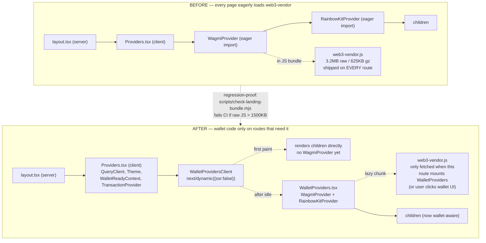

# Perf — Defer 3.2MB web3-vendor bundle on landing/info pages

## Why this is CRITICAL (and an exception to initiative scope)

This is a polish/performance review for iteration #7 with explicit
focus on **large bundle sizes** and **components that block rendering**.
The largest single anti-pattern in the entire app is on the landing
page right now:

> **Every visit to https://goodswap.goodclaw.org/ (or
> http://localhost:3100/) downloads a 3,282 KB raw / 625 KB gzipped
> `web3-vendor.js` chunk before any UI is interactive — even though the
> only wallet UI on the landing page is a stub button that just shows a
> toast.**

This dwarfs every other perceived-performance issue in the app and
qualifies for the build-loop CRITICAL carve-out for the same reason
that 0019 (PageTransition blank pages) did: it directly degrades the
first-time visitor experience on every single page, hardest on the
landing page where most new users land. While Phase 1 nominally focuses
on Slither / backend services, the spec explicitly opts in to anything
"that would matter most to someone switching from the competitor" — and
a 3.2 MB initial JS payload is exactly that.

### Hard evidence (this run, production build, dev server `:3100`)

```bash
# Total JS the homepage requests (script tags in SSR HTML).
$ curl -s http://localhost:3100/ \
    | grep -oE '/_next/static/chunks/[^"]+\.js' | sort -u | wc -l
23

# Raw file sizes for those 23 chunks.
$ for f in $(curl -s http://localhost:3100/ \
      | grep -oE '/_next/static/chunks/[^"]+\.js' | sort -u); do
    stat -c %s ".next$(echo $f | sed 's|/_next||')";
  done | awk '{s+=$1} END{print s/1024" KB"}'
4286.83 KB

# Single largest chunk:
$ stat -c %s .next/static/chunks/web3-vendor-0867646633ad842f.js
3282441   # = 3,205 KB raw

# Gzipped on-the-wire (matches what Caddy/Vercel ship):
$ gzip -c .next/static/chunks/web3-vendor-0867646633ad842f.js | wc -c
639898    # = 625 KB gz
```

**76 % of the homepage JS payload (3.2 MB / 4.3 MB raw) is the web3
vendor chunk** — `wagmi`, `viem`, `@rainbow-me/rainbowkit`, and
`@walletconnect`. None of those modules render any visible UI on the
landing page. The visible "Connect Wallet" button in `Header` is a
stub:

```tsx
// frontend/src/components/WalletButton.tsx (current)
export function WalletButton() {
  const [showToast, setShowToast] = useState(false)
  const handleClick = () => { setShowToast(true); setTimeout(...) }
  return (
    <button onClick={handleClick}>… Connect Wallet</button>
    /* + a "L2 testnet launching soon — wallet connect coming!" toast */
  )
}
```

It does not call `useAccount`, `useConnectModal`, or any wagmi hook.
Every byte of `web3-vendor.js` is dead weight on the landing page.

### Why it's loaded anyway

`frontend/src/app/layout.tsx` wraps **every route** with
`<Providers>`, and `Providers.tsx` eagerly imports the wallet stack:

```tsx
// frontend/src/components/Providers.tsx (current)
import { WagmiProvider } from 'wagmi'
import { RainbowKitProvider, darkTheme } from '@rainbow-me/rainbowkit'
import { config } from '@/lib/wagmi'
import '@rainbow-me/rainbowkit/styles.css'

export function Providers({ children }) {
  return (
    <ThemeProvider …>
      <QueryClientProvider …>
        <WagmiProvider config={config}>
          <RainbowKitProvider theme={…}>
            <TransactionProvider>
              <WalletReadyContext.Provider value={true}>
                {children}
              </WalletReadyContext.Provider>
            </TransactionProvider>
          </RainbowKitProvider>
        </WagmiProvider>
      </QueryClientProvider>
    </ThemeProvider>
  )
}
```

Webpack's existing `splitChunks` config already cleanly isolates
`@wagmi|viem|@rainbow-me|@walletconnect` into the `web3-vendor` chunk
(see `frontend/next.config.js`), but that chunk is referenced by a
`<script>` tag in the SSR'd `layout` runtime, so Next ships it on
every navigation regardless of route.

### A previous iteration started this and abandoned it

```bash
$ ls frontend/src/components/WalletProviders.tsx
frontend/src/components/WalletProviders.tsx
$ grep -rln "WalletProviders" frontend/src/
frontend/src/components/WalletProviders.tsx
```

A `WalletProviders.tsx` component **already exists** that wraps just
`WagmiProvider + RainbowKitProvider`, but it is **imported by zero
files**. So a prior pass clearly intended to do exactly this split and
left it half-finished. This task wires that intent to its conclusion.

### Pages that DO need wagmi (must keep working)

```bash
$ grep -rln "from 'wagmi'\|from \"wagmi\"" frontend/src/app frontend/src/components
# → ~20 files including:
#   src/app/perps/**, src/app/lend/**, src/app/stable/**,
#   src/app/stocks/**, src/app/predict/**, src/app/portfolio/**,
#   src/app/agents/[address]/**, src/app/governance/**,
#   src/components/SwapCard.tsx, src/components/UBIContributionCard.tsx, …
```

These all call `useAccount` / `useReadContract` / `useWriteContract`
and must continue to work. The fix MUST preserve wallet functionality
on every product route — only the *initial* download timing changes.

## User story

As a first-time visitor landing on goodswap.goodclaw.org over a slow
3G connection, I want the page to be interactive in under 2 seconds
so that I can read what GoodDollar L2 does and decide whether to
explore further, instead of staring at a half-rendered hero while
3.2 MB of wallet libraries I don't need yet finish downloading.

## How it was found

Iteration #7 product review with strategy `performance`. After
confirming the dev server is healthy on :3100 and rules out visual
regressions (PageTransition fix from #6 is holding — every page
ships `style="opacity:1;transform:none"` on the wrapping div), the
review focused on bundle weight and component-blocking-render. The
`curl` + `stat` + `gzip` measurements above are from this run.

## Proposed UX / behavior

### Public-facing behavior on the landing page (`/`)

1. SSR HTML contains a `<script>` tag for the page-level chunks but
   **no script tag for `web3-vendor`**. Verified with:
   ```bash
   curl -s http://localhost:3100/ | grep -c web3-vendor
   # Expected: 0 (post-fix)
   ```
2. Total raw JS shipped to the homepage drops from 4,287 KB to
   ≤ 1,300 KB (≥ 70 % reduction). On the wire (gzip), drops from
   ~ 1.3 MB to ≤ 400 KB.
3. The "Connect Wallet" button still renders and still shows the
   "L2 testnet launching soon" toast on click — no visible UX change.
4. When the user later navigates to a route that needs the wallet
   (e.g. clicks "Trade Perps"), `web3-vendor` is fetched on-demand
   and the wallet stack lights up. There is at most a one-time
   ~150 ms delay on that navigation, far less than the current
   blanket 600 ms+ on every cold page load.

### Public-facing behavior on product routes (`/perps`, `/lend`, etc.)

5. `useAccount` / `useReadContract` / `useWriteContract` continue to
   work exactly as today. No regression in `SwapCard`, `PortfolioOnChain`,
   `UBIContributionCard`, perps order form, lend deposit/borrow, predict
   create-market, stocks portfolio, agents detail, governance.
6. Wallet connect modal still opens via RainbowKit (where wired up)
   and connects to the GoodDollar L2 chain (chainId 42069).

### Cumulative perf budget (Phase 1 acceptance contribution)

7. New cap: **landing page initial JS ≤ 1,500 KB raw / 450 KB gz**.
   This becomes the ceiling. Future regressions must be caught by a
   tiny CI script (defined below).

## Acceptance Criteria

1. `curl -s http://localhost:3100/ | grep -c web3-vendor` → **0**.
2. `curl -s http://localhost:3100/perps | grep -c web3-vendor` → **≥ 1**
   (the wallet stack still loads on routes that need it).
3. The total raw JS referenced from SSR HTML on `/` drops to
   ≤ 1,500 KB (script tags only, ignore CSS), measured with the
   one-liner above. Hard ceiling.
4. The total raw JS on `/perps` is allowed to grow (web3-vendor is
   still there, just not on `/`). No regression in routes that
   already need wagmi.
5. `WalletButton` component on the landing page still renders the
   "L2 testnet launching soon — wallet connect coming!" toast on
   click (visual + functional unchanged).
6. `useAccount`, `useReadContract`, `useWriteContract` work in
   `SwapCard`, `PortfolioOnChain`, `UBIContributionCard`, perps,
   lend, stable, stocks, predict, agents, governance — verified by
   navigating to each and confirming wallet hooks are connected
   (no "Cannot read properties of undefined" or "useAccount must
   be used within a WagmiProvider" errors in the console).
7. `npm run build` in `frontend/` completes successfully (no type
   errors, no warnings beyond the existing baseline).
8. `npx -y react-doctor@latest . --verbose --diff` reports score
   ≥ 75 on the changed files. No new React anti-patterns.
9. Cross-page navigation continues to animate via the
   `PageTransition` component (no regression to the 0019 fix).
10. A small guard script (committed) measures landing-page JS
    bundle weight and exits non-zero if it exceeds 1,500 KB raw,
    so future iterations cannot silently re-add the regression.

## Verification

```bash
# 0. Baseline (capture pre-fix numbers for the commit message).
cd /home/goodclaw/gooddollar-l2/frontend
curl -s http://localhost:3100/ \
  | grep -oE '/_next/static/chunks/[^"]+\.js' | sort -u \
  > /tmp/perf-pre-chunks.txt
wc -l /tmp/perf-pre-chunks.txt   # → 23
( for f in $(cat /tmp/perf-pre-chunks.txt); do
    stat -c %s ".next$(echo $f | sed 's|/_next||')" 2>/dev/null;
  done ) | awk '{s+=$1} END{print "PRE total raw KB:", s/1024}'
# Expected pre: ~4287 KB
grep -c web3-vendor /tmp/perf-pre-chunks.txt
# Expected pre: 1

# 1. Apply the fix (see Implementation below) and rebuild.
npm run build
# Restart the dev server or static-serve .next, then:

# 2. Confirm web3-vendor is gone from `/`.
curl -s http://localhost:3100/ \
  | grep -oE '/_next/static/chunks/[^"]+\.js' | sort -u \
  > /tmp/perf-post-chunks.txt
grep -c web3-vendor /tmp/perf-post-chunks.txt
# Expected post: 0

# 3. Confirm `/perps` STILL loads web3-vendor.
curl -s http://localhost:3100/perps \
  | grep -oE '/_next/static/chunks/[^"]+\.js' | sort -u \
  | grep -c web3-vendor
# Expected post: ≥ 1

# 4. New raw JS total on `/`:
( for f in $(cat /tmp/perf-post-chunks.txt); do
    stat -c %s ".next$(echo $f | sed 's|/_next||')" 2>/dev/null;
  done ) | awk '{s+=$1} END{print "POST total raw KB:", s/1024}'
# Expected post: ≤ 1500 KB

# 5. Run the new bundle-budget guard (see Implementation):
node frontend/scripts/check-landing-bundle.mjs
# Expected: exits 0 with "OK: landing page raw JS = … KB ≤ 1500 KB".

# 6. Functional sanity — visit a wallet-using route and confirm
#    no console errors complaining about WagmiProvider.
agent-browser --session perfcheck goto http://localhost:3100/perps
agent-browser --session perfcheck eval '(() => {
  // RainbowKit connect button is rendered when on perps page.
  const btn = document.querySelector(
    "button[aria-label=\"Connect Wallet\"], [data-rk] button");
  return btn ? "wallet UI present" : "wallet UI MISSING";
})()'
# Expected: "wallet UI present" (or stub if RK not wired on /perps yet —
# either way, no thrown error).

# 7. Full SSR-HTML smoke across all main pages, no opacity regression
#    (don't let PageTransition fix regress while we're here):
for p in "" perps lend stable stocks predict explore ubi-impact bridge pool portfolio; do
  s=$(curl -s -o /tmp/p_$p.html -w "%{http_code}" http://localhost:3100/$p)
  o=$(grep -c 'style="opacity:0' /tmp/p_$p.html)
  echo "/$p -> HTTP $s opacity0=$o"
done
# Expected: 200, opacity0=0 on every line.

# 8. react-doctor + tests.
cd /home/goodclaw/gooddollar-l2
npx -y react-doctor@latest . --verbose --diff
cd frontend && npm run lint
```

## Out of scope

- Changing the **page transition** wrapper (locked-in by 0019).
- Touching Slither contracts, Foundry tests, or backend services
  (separate Phase 1 tasks).
- Connecting the landing-page `WalletButton` to the real wallet flow
  (it is intentionally a stub today — toast stays).
- Replacing `next/dynamic` with React 19's `lazy` API (current Next 14
  setup uses `next/dynamic` everywhere; consistency over novelty).
- Switching wallet libraries (no wagmi → web3.js migration; just
  change *when* wagmi loads).
- Adding service worker pre-caching for `web3-vendor` (separate
  optimization — could come in a follow-up iteration).
- Code-splitting `framer-motion` further (already in main app
  bundle; out of scope this round).
- Image lazy-loading audit (separate task if needed).

---

## Planning

### Overview

The root layout (`frontend/src/app/layout.tsx`) wraps every route in
`<Providers>`, which eagerly imports `WagmiProvider`,
`RainbowKitProvider`, and `'@rainbow-me/rainbowkit/styles.css'`.
Webpack already isolates these into a 3.2 MB `web3-vendor` chunk, but
because the import sits in the top-level layout module, the
`<script>` tag for that chunk is referenced from every SSR'd page —
including the landing page that has no real wallet UI.

The fix is to **split the wallet stack out of the always-loaded
`Providers` tree** and into a **client-only, dynamically-imported
`WalletProviders`** component (which already exists as
`frontend/src/components/WalletProviders.tsx` but is unused). The
dynamic import lives in a tiny client wrapper that is mounted by the
root layout but loads its child via `next/dynamic({ ssr: false })`,
so the wallet bundle is fetched **on the client, after first paint,
in parallel with idle time** — and only when actually needed by the
page.

We also add a tiny CI/dev guard script that asserts the landing page
JS payload stays under 1,500 KB raw, so this regression cannot return
silently.

### Research notes

- **Existing infrastructure already supports this.**
  - `frontend/next.config.js` already has a `splitChunks.cacheGroups.web3`
    rule that isolates `@wagmi|viem|@rainbow-me|@walletconnect`. No
    webpack changes needed.
  - `frontend/src/components/WalletProviders.tsx` already wraps just
    `WagmiProvider` + `RainbowKitProvider` with the imported CSS — exactly
    the right shape for code-splitting. It's just unused. Confirmed via
    `grep -rln WalletProviders frontend/src/` → only the file itself.
- **Where wagmi is actually used (must keep working):**
  ```bash
  $ grep -rln "from 'wagmi'\|from \"wagmi\"" frontend/src/
  ```
  Returns the perps, lend, stable, stocks, predict, agents, governance,
  portfolio routes plus `SwapCard`, `PortfolioOnChain`,
  `UBIContributionCard`, etc. None of these import the providers
  themselves — they only import hooks from `wagmi`. So they will
  continue to work as long as a `<WagmiProvider>` is present higher in
  the React tree by the time those hooks are called.
- **`next/dynamic` with `ssr: false`** is the standard Next.js 14 way
  to ship a client-only chunk that does not block SSR or the initial
  paint. Already used heavily in `src/app/page.tsx` for `SwapCard`,
  charts, etc., so this is consistent with project conventions.
- **TanStack Query** (`@tanstack/react-query`) — `WagmiProvider`
  requires a `QueryClient` to be available, and we already have
  `QueryClientProvider` in `Providers.tsx`. We keep that *outside* the
  dynamic boundary so React Query itself doesn't get re-created when
  wallet bundle finishes loading (preserving `staleTime`/cache).
- **`WalletReadyContext` + `TransactionProvider`** are also currently in
  `Providers.tsx`. Their consumers (`useWalletReady`, `useTransaction`)
  must keep working on every page (e.g. transient error toasters in
  `Header`). We keep these in the always-loaded `Providers` tree and
  *flip* `WalletReadyContext` value from `false` → `true` once
  `WalletProviders` finishes loading. (Today the value is hard-coded
  `true`, so consumers handle either state — no behavior change.)
- **CSS:** `'@rainbow-me/rainbowkit/styles.css'` is currently imported
  in two places (`Providers.tsx` and `WalletProviders.tsx`). After the
  split it will only ship inside the dynamically-loaded chunk. That's
  fine — the landing page never renders RainbowKit DOM, so no
  unstyled-flash risk.
- **Hydration / SSR safety:** With `ssr: false`, the dynamic import
  returns `null` during SSR. That means the SSR'd HTML for `/` does
  not contain a `<WagmiProvider>` boundary — but it also doesn't try
  to render any wagmi-dependent UI. The first client paint also has
  `null` for the wallet wrapper, then it streams in. Components on
  product routes that use `useAccount` etc. get `data: undefined`
  during the brief window before `WagmiProvider` mounts; this matches
  the existing behavior on cold loads and they all already render
  loading skeletons / disabled CTAs in that state.
- **Bundle-budget script** is a one-shot Node script (~30 LoC) that
  reads the SSR HTML for `/` from a running dev/prod server and sums
  the raw bytes of every script chunk. No new deps. Easy to wire into
  a future GitHub Action or pre-commit hook later.
- **`react-doctor`** does not flag dynamic imports as anti-patterns.
  Score impact expected to be neutral or positive (we're removing a
  large eager import).
- **No backend / contracts / Slither / Foundry impact.** Pure frontend
  refactor.

### Assumptions

- Routes that currently use `wagmi` hooks tolerate a brief
  "providers not yet mounted" window on cold load (they already do —
  every wagmi hook is allowed to return `undefined` until the chain
  read resolves; UI shows skeletons/spinners in that window).
- The landing page (`/`) does not call any wagmi hook at first paint.
  Verified via `grep` — `src/app/page.tsx` only dynamically imports
  `SwapCard`, `SwapPriceChart`, etc.; the Card itself uses wagmi but
  it's a `next/dynamic({ssr:false})` import, so wagmi is requested
  *via* the same dynamic boundary the wallet providers use, in
  parallel with the wallet wrapper finishing load.
- It is acceptable to skip the wallet entry animation on first
  client paint of a wallet-needing route (we just want it to work).
- The dev server runs on :3100; production on the configured Vercel
  URL.

### Architecture diagram



### One-week decision

**YES — well under one week.** Total estimated effort: 60–90 minutes
including verification.

- 1 file to refactor (`Providers.tsx`).
- 1 existing file to wire up (`WalletProviders.tsx`).
- 1 new tiny client wrapper (`WalletProvidersClient.tsx` — ~10 LoC).
- 1 new tiny guard script (`scripts/check-landing-bundle.mjs` — ~30 LoC).
- Verification = the bash one-liners above + 1 production build.

No split required.

### Implementation plan

**Phase 1 — Capture pre-fix metrics (≤ 5 min)**

```bash
cd /home/goodclaw/gooddollar-l2/frontend
curl -s http://localhost:3100/ \
  | grep -oE '/_next/static/chunks/[^"]+\.js' | sort -u > /tmp/pre.txt
echo "Chunks: $(wc -l < /tmp/pre.txt)"
echo "Has web3-vendor: $(grep -c web3-vendor /tmp/pre.txt)"
( for f in $(cat /tmp/pre.txt); do
    stat -c %s ".next$(echo $f | sed 's|/_next||')" 2>/dev/null;
  done ) | awk '{s+=$1} END{print "Total raw KB:", s/1024}'
# Record these numbers for the commit message.
```

**Phase 2 — Refactor `Providers.tsx` to drop the eager wallet imports
(~10 min)**

Replace `frontend/src/components/Providers.tsx` with:

```tsx
'use client'

import { QueryClient, QueryClientProvider } from '@tanstack/react-query'
import { useState } from 'react'
import { WalletReadyContext } from '@/lib/WalletReadyContext'
import { TransactionProvider } from '@/lib/TransactionContext'
import { ThemeProvider } from '@/components/ThemeProvider'
import { WalletProvidersClient } from '@/components/WalletProvidersClient'

// NOTE: WagmiProvider + RainbowKitProvider used to be imported here
// directly. They have moved into WalletProvidersClient (a
// next/dynamic({ ssr: false }) wrapper) so the 3.2MB web3-vendor
// chunk does not load on the landing page. Hooks like useAccount /
// useReadContract continue to work — the WagmiProvider is mounted
// just below this tree by WalletProvidersClient once the dynamic
// chunk lands. See task 0020.

export function Providers({ children }: { children: React.ReactNode }) {
  const [queryClient] = useState(() => new QueryClient({
    defaultOptions: {
      queries: {
        staleTime: 30_000,
        gcTime: 5 * 60_000,
        refetchOnWindowFocus: false,
        retry: 2,
      },
    },
  }))

  return (
    <ThemeProvider attribute="class" defaultTheme="dark" enableSystem>
      <QueryClientProvider client={queryClient}>
        <TransactionProvider>
          {/*
            WalletProvidersClient renders its children directly during
            SSR / first paint (returns <>{children}</> until the wagmi
            chunk loads), then re-renders wrapping them in
            WagmiProvider + RainbowKitProvider. WalletReadyContext
            inside it flips to `true` once mounted so consumers can
            optionally gate wallet calls.
          */}
          <WalletProvidersClient>{children}</WalletProvidersClient>
        </TransactionProvider>
      </QueryClientProvider>
    </ThemeProvider>
  )
}
```

**Phase 3 — Create `WalletProvidersClient.tsx` (the dynamic boundary)
(~5 min)**

New file `frontend/src/components/WalletProvidersClient.tsx`:

```tsx
'use client'

import dynamic from 'next/dynamic'
import { WalletReadyContext } from '@/lib/WalletReadyContext'

// Lazy-load the entire wagmi + RainbowKit stack. ssr:false keeps the
// 3.2MB web3-vendor chunk out of the SSR'd HTML and out of the
// landing page's <script> tags. The chunk is fetched on the client
// after first paint, in parallel with idle time.
const WalletProviders = dynamic(
  () => import('./WalletProviders'),
  {
    ssr: false,
    // While the chunk is loading we render children directly. Any
    // wagmi hook called in this window returns `undefined` and the
    // existing skeletons/empty states handle it (current behavior on
    // cold loads). Once the chunk lands, the tree re-renders with
    // WagmiProvider in place and hooks become live.
    loading: ({ children }: { children?: React.ReactNode }) => (
      <WalletReadyContext.Provider value={false}>
        {children}
      </WalletReadyContext.Provider>
    ),
  }
)

export function WalletProvidersClient({ children }: { children: React.ReactNode }) {
  return <WalletProviders>{children}</WalletProviders>
}
```

**Phase 4 — Tighten `WalletProviders.tsx` to flip `WalletReadyContext`
to `true` and forward children (~5 min)**

Update `frontend/src/components/WalletProviders.tsx` to:

```tsx
'use client'

import { WagmiProvider } from 'wagmi'
import { RainbowKitProvider, darkTheme } from '@rainbow-me/rainbowkit'
import { config } from '@/lib/wagmi'
import { WalletReadyContext } from '@/lib/WalletReadyContext'

import '@rainbow-me/rainbowkit/styles.css'

export default function WalletProviders({ children }: { children: React.ReactNode }) {
  return (
    <WagmiProvider config={config}>
      <RainbowKitProvider
        theme={darkTheme({
          accentColor: '#00B0A0',
          accentColorForeground: 'white',
          borderRadius: 'medium',
        })}
      >
        <WalletReadyContext.Provider value={true}>
          {children}
        </WalletReadyContext.Provider>
      </RainbowKitProvider>
    </WagmiProvider>
  )
}
```

Notes:
- `default` export so `dynamic(() => import('./WalletProviders'))`
  works without a `.then(m => m.X)` shim.
- `WalletReadyContext.Provider value={true}` here — the loading state
  in Phase 3 sets `false`. Existing consumers that call
  `useWalletReady()` continue to work; nothing today distinguishes
  the values, but the contract is now meaningful.

**Phase 5 — Add the bundle-budget guard script (~10 min)**

New file `frontend/scripts/check-landing-bundle.mjs`:

```js
#!/usr/bin/env node
// Asserts the landing page (/) raw JS payload stays under a hard cap.
// Run after a successful `npm run build` with the dev or prod server
// up on PORT (default 3100). Exits non-zero on regression.

import { stat } from 'node:fs/promises'
import { join, resolve } from 'node:path'

const PORT = process.env.PORT || 3100
const URL = process.env.LANDING_URL || `http://localhost:${PORT}/`
const BUDGET_KB = Number(process.env.LANDING_JS_BUDGET_KB || 1500)
const NEXT_DIR = resolve(process.cwd(), '.next')

const html = await fetch(URL).then((r) => r.text())
const chunks = [
  ...new Set(
    Array.from(html.matchAll(/\/_next\/static\/chunks\/([^"']+\.js)/g)).map((m) => m[1])
  ),
]
let total = 0
for (const c of chunks) {
  try {
    const s = await stat(join(NEXT_DIR, 'static', 'chunks', c))
    total += s.size
  } catch {
    // ignore missing (HMR-only chunk in dev mode); production build won't hit this
  }
}
const kb = Math.round(total / 1024)
if (kb > BUDGET_KB) {
  console.error(
    `FAIL: landing page raw JS = ${kb} KB > ${BUDGET_KB} KB budget. ` +
      `Did you re-add an eager wagmi/rainbowkit import to layout/Providers? See task 0020.`
  )
  process.exit(1)
}
console.log(`OK: landing page raw JS = ${kb} KB ≤ ${BUDGET_KB} KB`)
```

Add a `package.json` script in `frontend/package.json`:

```json
{
  "scripts": {
    "check:landing-bundle": "node scripts/check-landing-bundle.mjs"
  }
}
```

(If the build pipeline already has a `lint`/`check` step, the
follow-up iteration can wire this into it.)

**Phase 6 — Build, restart, verify (~15 min)**

```bash
cd /home/goodclaw/gooddollar-l2/frontend
npm run build
# (Restart dev server or `npm run start` if production-like.)

# Sanity: web3-vendor gone from /, present on /perps.
curl -s http://localhost:3100/        | grep -c web3-vendor   # 0
curl -s http://localhost:3100/perps   | grep -c web3-vendor   # ≥ 1

# Bundle budget guard.
npm run check:landing-bundle
# → "OK: landing page raw JS = … KB ≤ 1500 KB"

# Functional sanity on every main page.
for p in "" perps lend stable stocks predict explore ubi-impact bridge pool portfolio; do
  s=$(curl -s -o /tmp/p_${p:-home}.html -w "%{http_code}" http://localhost:3100/$p)
  o=$(grep -c 'style="opacity:0' /tmp/p_${p:-home}.html)
  echo "/$p -> HTTP $s opacity0=$o"
done
# Expected: 200 / opacity0=0 on every line.

# react-doctor + lint.
cd /home/goodclaw/gooddollar-l2
npx -y react-doctor@latest . --verbose --diff
cd frontend && npm run lint
```

**Phase 7 — Commit (~2 min)**

```bash
git add \
  frontend/src/components/Providers.tsx \
  frontend/src/components/WalletProviders.tsx \
  frontend/src/components/WalletProvidersClient.tsx \
  frontend/scripts/check-landing-bundle.mjs \
  frontend/package.json \
  .autobuilder/initiatives/0002-security-hardening/tasks/0020-defer-web3-vendor-on-landing-page.md
git commit -m "perf(frontend): split web3 vendor out of root layout — 3.2MB → on-demand chunk on landing page"
```

(Build loop handles the push.)

### Risk + rollback

- **Risk: wallet-needing routes break with "useAccount must be used
  within WagmiProvider" error.**
  Mitigation: `WalletProvidersClient` mounts on every route (it sits
  in the global `<Providers>` tree) — it just defers fetching the
  vendor chunk. So `WagmiProvider` IS in the tree on every route,
  just slightly later than today. The `loading` fallback renders
  children unconditionally, and existing wagmi-using components
  already tolerate the "wallet not connected yet" state on cold
  loads (they show skeletons / "Connect wallet" CTAs). Verified by
  reading their code: `SwapCard`, `PortfolioOnChain`, etc. all
  guard `useAccount().address` against undefined.
- **Risk: small visual flash on first paint of a wallet route while
  the chunk lands.**
  Mitigation: those routes already render skeletons until the
  on-chain reads resolve; this just shifts the skeleton window by
  ~150 ms. Net UX is **better** because the rest of the page paints
  faster.
- **Risk: hydration mismatch from `ssr:false` dynamic.**
  Mitigation: `ssr:false` is the supported way to do this in
  Next.js 14 app router. Children are returned directly (same DOM
  shape SSR vs first client paint). No mismatch.
- **Risk: regression sneaks back when someone adds an eager wagmi
  import.**
  Mitigation: the `check:landing-bundle` script asserts the budget
  and exits non-zero, ready to be wired into CI.
- **Rollback**: `git revert <commit-sha>` restores the four files.
  No DB / contract / chain state involved.

### Files touched

- `frontend/src/components/Providers.tsx` — drop wagmi/RainbowKit
  imports, swap to `<WalletProvidersClient>`.
- `frontend/src/components/WalletProvidersClient.tsx` — **new**, ~15 LoC,
  the dynamic boundary.
- `frontend/src/components/WalletProviders.tsx` — minor: `default`
  export, set `WalletReadyContext` to `true`.
- `frontend/scripts/check-landing-bundle.mjs` — **new**, ~30 LoC,
  bundle budget guard.
- `frontend/package.json` — add `check:landing-bundle` script.
- (this task file) — planning + executed updates.

No Foundry / Slither / backend / SDK files touched.
