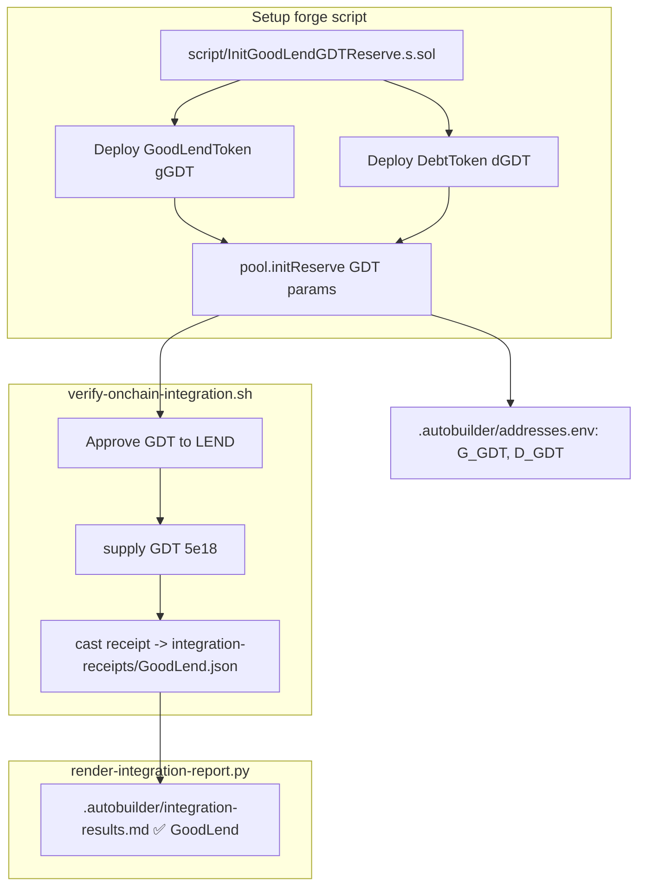

# GoodLend — Initialize GDT reserve so the integration verifier stops skipping

## Why this blocks the initiative

Initiative `0002-security-hardening` Acceptance Criterion #3 is _"Real
on-chain transactions executed across all 6 protocols"_. The current
auto-generated `.autobuilder/integration-results.md` shows GoodLend
explicitly skipped:

| Protocol | Action | Tx | Status | Notes |
|----------|--------|----|--------|-------|
| GoodLend | `supply(GDT, 5 GDT)` | n/a | ⏭️ skipped | _no receipt — `supply()` reverted because GDT reserve is not initialised on the redeployed pool_ |

`scripts/verify-onchain-integration.sh` calls
`cast send $LEND "supply(address,uint256)" $GDT 5e18 …` against
`GoodLendPool` (`src/lending/GoodLendPool.sol`). `supply()` requires
`reserves[asset].isActive`, which is only set inside `initReserve(...)`.

`script/DeployGoodLend.s.sol` only initialises USDC and WETH reserves
(`script/DeployGoodLend.s.sol:87-108`). There is no GDT reserve, so the
`cast send` always reverts before any state changes, no receipt JSON is
written, and the renderer reports GoodLend as skipped.

Until this is fixed, this initiative cannot satisfy its own Definition
of Done bullet: _"Transaction receipts prove all 6 protocols execute
on-chain"_.

## Goal

Produce a real on-chain receipt for GoodLend `supply(GDT, …)` on the
Anvil devnet, end-to-end, so the renderer marks GoodLend as ✅ success
in `.autobuilder/integration-results.md`.

## Scope

1. Write a one-shot forge script (e.g. `script/InitGoodLendGDTReserve.s.sol`)
   that, against the already-deployed `GoodLendPool` at
   `$LEND` from `.autobuilder/addresses.env`:
   - Deploys a `GoodLendToken` (gGDT) and a `DebtToken` (dGDT) bound to
     the live `$GDT`.
   - Calls `pool.initReserve(GDT, gGDT, dGDT, reserveFactorBPS, ltvBPS,
     liqThresholdBPS, liqBonusBPS, supplyCap, borrowCap, 18)` using
     conservative parameters (e.g. 20% reserve factor, 75% LTV, 82% liq
     threshold, 5% liq bonus, supply/borrow caps sized for devnet).
   - Logs the new gGDT/dGDT addresses.
2. Persist the new addresses (`G_GDT`, `D_GDT`) in
   `.autobuilder/addresses.env` so future scripts and the renderer can
   reference them.
3. Update `scripts/verify-onchain-integration.sh` so that, after the
   reserve exists, it:
   - Approves `$GDT` to `$LEND` from the tester key.
   - Calls `supply(address,uint256)` and writes the resulting receipt
     JSON to `.autobuilder/integration-receipts/GoodLend.json`.
4. Re-run the renderer (`scripts/render-integration-report.py`) and
   verify `.autobuilder/integration-results.md` flips GoodLend from
   `⏭️  skipped` to `✅ success` with a real tx hash + gas used.

## Non-Goals

- No new lending features, no new asset classes, no UI work.
- No protocol-level security fixes — this is purely the on-chain setup
  needed to satisfy AC #3 for GoodLend.
- No changes to USDC/WETH reserves.

## Acceptance Criteria

- `cast call $LEND "getReserveData(address)" $GDT --rpc-url
  http://localhost:8545` returns a struct with `isActive=true`.
- `.autobuilder/integration-receipts/GoodLend.json` exists with
  `status=0x1` and a non-zero `transactionHash`.
- `.autobuilder/integration-results.md`, after re-rendering, lists
  GoodLend as ✅ success with non-zero `gasUsed`.
- `forge test` still passes 0 failures (no regressions in lending
  tests).

## Source pointers

- `src/lending/GoodLendPool.sol` — `initReserve` at line 174, `supply`
  at lines 221 / 231.
- `script/DeployGoodLend.s.sol` — existing USDC + WETH init pattern at
  lines 65–108.
- `scripts/verify-onchain-integration.sh` — current GoodLend block (the
  one that currently reverts).
- `scripts/render-integration-report.py` — consumer of the receipt JSON.
- `.autobuilder/addresses.env` — `GDT` and `LEND` already defined.
- `.autobuilder/integration-results.md` — the live skip note.

## Planning notes

### Research summary

- `GoodLendPool.initReserve` (`src/lending/GoodLendPool.sol:174`) is
  `onlyAdmin`. The admin set during devnet deployment is the
  deployer key (anvil index 0,
  `0xac0974bec39a17e36ba4a6b4d238ff944bacb478cbed5efcae784d7bf4f2ff80`),
  which is already used by every `script/Deploy*.s.sol`. So a forge
  script run with that key can call `initReserve` without further
  privilege changes.
- The existing USDC/WETH init at
  `script/DeployGoodLend.s.sol:65-108` is the canonical pattern:
  deploy `GoodLendToken` + `DebtToken`, then call `initReserve` with
  the parameter tuple. Conservative values matching the USDC reserve
  (RF 1500 bps, LTV 7500, liq threshold 8200, liq bonus 500) are
  appropriate for GDT on devnet; supply cap and borrow cap should be
  large (e.g. 10_000_000e18 / 5_000_000e18) since this is devnet and
  the tester only supplies single-digit GDT.
- `scripts/verify-onchain-integration.sh` already approves and calls
  `supply(address,uint256)` for `$GDT` against `$LEND`. The only
  reason it skips is because `supply()` reverts when
  `reserves[asset].isActive == false`. Once `initReserve(GDT, …)`
  succeeds, no verifier rewrite is needed beyond making sure the
  `record_result` notes update to ✅ on the success path (which the
  existing helper already does via `capture_receipt`).
- `scripts/render-integration-report.py` consumes
  `.autobuilder/integration-receipts/GoodLend.json` — flipping the
  status is purely a function of a receipt with `status=0x1`
  appearing in that file. No renderer changes needed.
- Storing the new gGDT/dGDT addresses in `.autobuilder/addresses.env`
  keeps the renderer / future tasks honest; the file is the canonical
  source for cross-script address resolution and is regenerated by
  `scripts/refresh-addresses.py` — the safe path is to add explicit
  lines (`G_GDT=…`, `D_GDT=…`) and teach the refresh script to
  preserve them (or accept that the next refresh resets them and
  re-derives from the new broadcast file under
  `broadcast/InitGoodLendGDTReserve.s.sol/`).

### Assumptions

- The anvil devnet is up at `http://localhost:8545` (chain 42069),
  which is the same precondition every other integration receipt
  already relies on.
- The deployer key holds enough ETH for two contract deploys + one
  `initReserve` call (~3M gas total — trivial on Anvil).
- The tester key already holds GDT (the existing tester-funding step
  in `scripts/verify-onchain-integration.sh` covers this; see
  `_setup-fund-tester.json` receipt referenced in the previous skip
  note).
- The `GoodLendToken` / `DebtToken` constructors take `(address pool,
  address underlying, string name, string symbol)`-style arguments —
  to be confirmed by reading the contracts during execution, not
  during planning.

### Architecture diagram

### One-week decision

**YES.** Scope is well-bounded: one short forge script, one
addresses.env update, one verifier note tweak, and re-running the
existing renderer. No protocol changes, no new tests of contract
behavior beyond what `forge test` already covers. A single engineer
can complete this in well under a day.

### Implementation plan (phased)

1. **Phase 1 — Bootstrap reserve (≈30 min).**
   - Add `script/InitGoodLendGDTReserve.s.sol` that:
     - Reads `LEND` and `GDT` from environment variables
       (`LEND_POOL`, `GOOD_DOLLAR_TOKEN`).
     - Deploys `GoodLendToken` (gGDT) bound to `(pool, GDT)`.
     - Deploys `DebtToken` (dGDT) bound to `(pool, GDT)`.
     - Calls
       `pool.initReserve(GDT, gGDT, dGDT, 1500, 7500, 8200, 500,
       10_000_000e18, 5_000_000e18, 18)`.
     - Logs the gGDT and dGDT addresses.
   - Confirm the exact constructor signatures by reading
     `src/lending/GoodLendToken.sol` and `src/lending/DebtToken.sol`
     before writing the script (execution-time check).
2. **Phase 2 — Run the script + update addresses (≈10 min).**
   - `forge script script/InitGoodLendGDTReserve.s.sol --rpc-url
     http://localhost:8545 --private-key $DEPLOYER --broadcast
     --legacy`.
   - Append `G_GDT=…` and `D_GDT=…` to `.autobuilder/addresses.env`
     (or update `scripts/refresh-addresses.py` to derive them from
     the new `broadcast/InitGoodLendGDTReserve.s.sol/…/run-latest.json`
     — pick the approach with the smaller blast radius; appending is
     fine for this iteration).
3. **Phase 3 — Re-run the verifier (≈5 min).**
   - `bash scripts/verify-onchain-integration.sh`.
   - Confirm `.autobuilder/integration-receipts/GoodLend.json` now
     has `status=0x1` and a real tx hash.
   - Confirm `.autobuilder/integration-results.md` shows GoodLend
     `✅ success`.
4. **Phase 4 — Regression check (≈5 min).**
   - `forge test` — must still report 0 failures.
   - `cast call $LEND "getReserveData(address)" $GDT --rpc-url
     http://localhost:8545` — must return `isActive=true`.

### Risks / open questions

- If `GoodLendToken` / `DebtToken` constructors require additional
  config (interest rate strategy, treasury, etc.), the script must
  pass them through; the executor MUST read the constructors before
  finalising the script body.
- If `scripts/refresh-addresses.py` overwrites `.autobuilder/addresses.env`
  on every run, the gGDT/dGDT lines could be lost. Mitigation: add
  the broadcast file path to the refresh script's allowlist or use a
  separate `.autobuilder/addresses-extra.env` consumed by the
  verifier — execution-time decision.
- Devnet block-time skew can cause `cast receipt` to race the tx —
  the verifier already retries via `capture_receipt`; no new
  mitigation needed.
