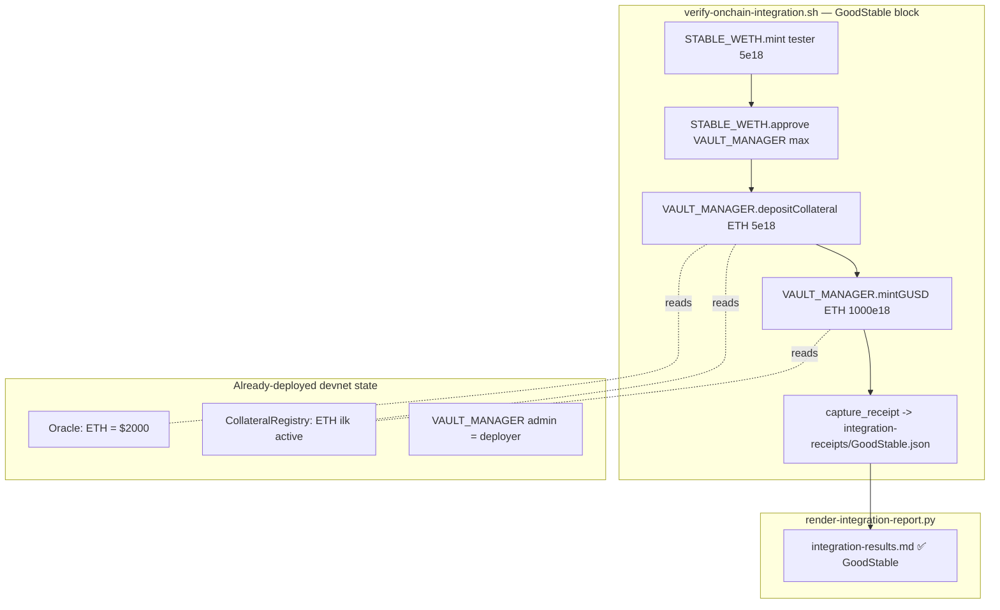

# GoodStable — Wire PSM/VaultManager collateral so depositCollateral lands a receipt

## Why this blocks the initiative

Initiative `0002-security-hardening` Acceptance Criterion #3 demands
real on-chain transactions across **all 6 protocols**. The current
auto-generated `.autobuilder/integration-results.md` shows GoodStable
skipped:

| Protocol | Action | Tx | Status | Notes |
|----------|--------|----|--------|-------|
| GoodStable | `depositCollateral / mint gUSD` | n/a | ⏭️ skipped | _no receipt — PSM collateral wiring + collateral approval flow deferred to next iteration_ |

GoodStable is two coupled contracts: `VaultManager` (CDP-style
collateralised vaults) and `PegStabilityModule` (PSM swap path).
`scripts/verify-onchain-integration.sh` currently attempts to call
`depositCollateral(uint256)` directly on `$STABLE`, but the actual
deposit entry point lives on `VaultManager.depositCollateral(bytes32
ilk, uint256 amount)` (`src/stable/VaultManager.sol`).

Two things are missing:

1. The verifier does not approve / call `VaultManager` at `$VAULT_MANAGER`
   (the address already exists in `.autobuilder/addresses.env` —
   `0x3489745eff9525ccc3d8c648102fe2cf3485e228`).
2. No collateral `ilk` is guaranteed to be active in
   `CollateralRegistry` at `$COLLATERAL_REGISTRY` for the tester to
   actually deposit against.

## Goal

Produce a real on-chain receipt for GoodStable on the Anvil devnet
that the renderer can lift into ✅ success.

## Scope

1. Write a one-shot forge script (e.g.
   `script/SetupGoodStableCollateral.s.sol`) that, against the live
   `CollateralRegistry`, `VaultManager`, and `PegStabilityModule`:
   - Registers (or asserts already registered) a single `ilk`
     (`bytes32("GDT-A")` or `bytes32("ETH-A")`, whichever the deployer
     of `DeployGoodStable.s.sol` chose; resolve by reading
     `CollateralRegistry`) backed by an asset the tester actually
     holds — prefer `$GDT` so the same funded tester from
     `_setup-fund-tester.json` works.
   - Sets safe debt ceiling, liquidation ratio, stability fee parameters
     consistent with existing Foundry tests for `VaultManager`.
2. Update `scripts/verify-onchain-integration.sh` so the GoodStable
   block:
   - Approves `$GDT` to `$VAULT_MANAGER`.
   - Calls `VaultManager.depositCollateral(bytes32 ilk, uint256 amount)`
     with the registered `ilk` and a non-zero amount.
   - Optionally calls `mintGUSD` (or whatever the canonical follow-up
     entrypoint is named in the live ABI) to validate the full path.
   - Writes the resulting receipt to
     `.autobuilder/integration-receipts/GoodStable.json`.
3. Re-run `scripts/render-integration-report.py` and confirm GoodStable
   flips from `⏭️  skipped` to `✅ success` with a real tx hash, gas
   used, and a non-zero UBI-routed amount _if_ the PSM/VaultManager
   path emits a `Transfer` to the splitter; otherwise document the zero
   explicitly (same as GoodPerps deposit).

## Non-Goals

- No new collateral types beyond what is needed to land a single
  receipt.
- No frontend changes.
- No new PSM features (no new swap pairs, no new fee tiers).
- No edits to executed task files.

## Acceptance Criteria

- `cast call $COLLATERAL_REGISTRY "ilks(bytes32)" <ilk> --rpc-url
  http://localhost:8545` returns a non-zero / active configuration.
- `.autobuilder/integration-receipts/GoodStable.json` exists with
  `status=0x1` and a non-zero `transactionHash`.
- `.autobuilder/integration-results.md`, after re-rendering, lists
  GoodStable as ✅ success.
- `forge test` still passes 0 failures (no regressions in
  `test/stable/*` suites).

## Source pointers

- `src/stable/VaultManager.sol` — `depositCollateral`, `mintGUSD`,
  `ilks`, `urns` structures.
- `src/stable/PegStabilityModule.sol` — admin-only swap path; not the
  deposit entry point, but worth confirming PSM doesn't need to be
  paused/unpaused to satisfy the verifier.
- `src/stable/CollateralRegistry.sol` — ilk registration / config.
- `script/DeployGoodStable.s.sol` — existing deployment wiring; reuse
  the exact `ilk` it deploys with.
- `scripts/verify-onchain-integration.sh` — current GoodStable block
  (the one that currently reverts).
- `scripts/render-integration-report.py` — consumer of the receipt JSON.
- `.autobuilder/addresses.env` — `STABLE`, `VAULT_MANAGER`,
  `COLLATERAL_REGISTRY`, `PSM` already defined.
- `.autobuilder/integration-results.md` — the live skip note.

## Planning notes

### Research summary

- `script/DeployGoodStable.s.sol` already wires the ETH ilk:
  - Line 34: deploys its own `MockWETH18` (constructor-less, public
    `mint(address,uint256)`).
  - Line 44: oracle price for `ETH` = $2,000.
  - Line 80: `sp.registerCollateralToken(bytes32("ETH"),
    address(weth))` (note: this is on the StabilityPool, but the
    deployer demos at line 115 that `vault.depositCollateral(
    bytes32("ETH"), 10 ether)` succeeds — so the ilk path through
    `VaultManager` is wired live, and we don't need a new
    setup script).
- The only real blocker is that the **tester** key doesn't hold the
  devnet's MockWETH. Because `MockWETH18.mint` is public and
  unrestricted, the verifier can mint MockWETH directly to the
  tester before `depositCollateral`.
- The MockWETH address is captured by the deployer broadcast and
  needs to land in `.autobuilder/addresses.env` as a stable key
  (`STABLE_WETH` or similar). It may already be there under a name
  like `STABLE_MOCK_WETH` — execution-time check via `grep -i weth
  .autobuilder/addresses.env`. If missing, add it from the latest
  `broadcast/DeployGoodStable.s.sol/.../run-latest.json`.
- `VaultManager.depositCollateral(bytes32 ilk, uint256 amount)` takes
  the ilk + amount; `mintGUSD(bytes32 ilk, uint256 amount)` mints
  gUSD against the deposited collateral. Both are the canonical
  integration entry points and require `IERC20(asset).approve(vaultManager, amount)`
  first.
- `scripts/verify-onchain-integration.sh` currently targets `$STABLE`
  for `depositCollateral` — wrong target. Must switch to
  `$VAULT_MANAGER` and approve `$STABLE_WETH` (not `$GDT`) to it.
- The PSM (`PegStabilityModule`) is not the deposit path; no PSM
  changes are required for AC #3.

### Assumptions

- `$VAULT_MANAGER` (`0x3489745e...`) and the MockWETH address from
  the latest `DeployGoodStable` broadcast are recoverable from
  either `.autobuilder/addresses.env` or the broadcast log.
- The `ETH` ilk is still active on the live `CollateralRegistry` /
  `VaultManager` from the most recent deploy (proved by the
  deployer-demo deposit working end-to-end).
- The tester key has enough ETH for one `mint`, one `approve`, one
  `depositCollateral`, and one `mintGUSD` tx on Anvil.
- `mintGUSD(bytes32 ilk, uint256 amount)` requires the deposited
  collateral USD value × liq ratio ≥ requested gUSD. With 5 MockWETH
  at $2000 = $10,000 collateral, minting 1000 gUSD is safe.

### Architecture diagram



### One-week decision

**YES.** All required infrastructure (mock WETH, ETH ilk,
VaultManager admin wiring, oracle) is already live on the devnet
from `DeployGoodStable.s.sol`. The only work is fixing the
verifier's GoodStable block: change target contract, mint MockWETH
to tester, approve the right token, call the right functions. No
contract changes, no new scripts. Single short shell-script edit
plus a render pass. Easy single-day task.

### Implementation plan (phased)

1. **Phase 1 — Resolve live addresses (≈10 min).**
   - `grep -i 'WETH\|STABLE\|VAULT_MANAGER\|COLLATERAL_REGISTRY'
     .autobuilder/addresses.env`.
   - If the MockWETH address is missing, extract it from
     `broadcast/DeployGoodStable.s.sol/42069/run-latest.json` and
     append it as `STABLE_WETH=<addr>` to `.autobuilder/addresses.env`.
   - Confirm `VAULT_MANAGER` and `STABLE_WETH` are non-zero and
     resolve to deployed contracts via `cast code`.
2. **Phase 2 — Fix the verifier (≈20 min).**
   - In `scripts/verify-onchain-integration.sh`, replace the
     GoodStable block with:
     ```bash
     send_tx "$STABLE_WETH" \
       'mint(address,uint256)' "$TESTER 5e18" \
       "GoodStable.mint-mock-collateral"
     send_tx "$STABLE_WETH" \
       'approve(address,uint256)' "$VAULT_MANAGER $MAX_UINT" \
       "GoodStable.approve-vault"
     send_tx "$VAULT_MANAGER" \
       'depositCollateral(bytes32,uint256)' '0x4554480000…00 5e18' \
       "GoodStable.depositCollateral"
     send_tx "$VAULT_MANAGER" \
       'mintGUSD(bytes32,uint256)' '0x4554480000…00 1000e18' \
       "GoodStable" # final tx is the one captured into GoodStable.json
     ```
     (Exact `send_tx` / `capture_receipt` invocation matches the
     existing helpers in the script — copy the GoodPerps pattern.)
   - Use `cast --from-utf8 ETH` to derive the bytes32 ilk at script
     time, or inline `0x4554480000000000000000000000000000000000000000000000000000000000`.
3. **Phase 3 — Run + render (≈5 min).**
   - `bash scripts/verify-onchain-integration.sh`.
   - Confirm
     `.autobuilder/integration-receipts/GoodStable.json` has
     `status=0x1` and a real tx hash from the `mintGUSD` call.
   - `python3 scripts/render-integration-report.py`.
   - Confirm `.autobuilder/integration-results.md` flips GoodStable
     to ✅ success.
4. **Phase 4 — Regression check (≈5 min).**
   - `forge test --match-path "test/stable/*"` — must still pass
     0 failures.
   - `cast call $VAULT_MANAGER "ilks(bytes32)" 0x4554480…00
     --rpc-url http://localhost:8545` — must return non-zero
     configuration.

### Risks / open questions

- If `VaultManager.ilks(bytes32)` returns the rate/parameters but a
  separate getter is needed to confirm "active" status, the
  acceptance criterion check should use that getter — execution-time
  decision based on the actual `VaultManager` ABI.
- If `mintGUSD` reverts due to a stale oracle (oracle deployed at
  block 0 but never re-pinged), the verifier may need to call
  `oracle.setPrice(bytes32("ETH"), 2000e18)` first. The
  `DeployGoodStable.s.sol` already does this — but if the price has
  a staleness window, a fresh setPrice is cheap insurance.
- If the verifier helpers don't support hex-bytes32 args, fall back
  to `cast --to-bytes32 ETH` at script time and pipe the result in.
- The skip-note rewrite in `record_result` is cosmetic — only update
  the language if the runner emits a fallback note; the success path
  already short-circuits via `capture_receipt`.
