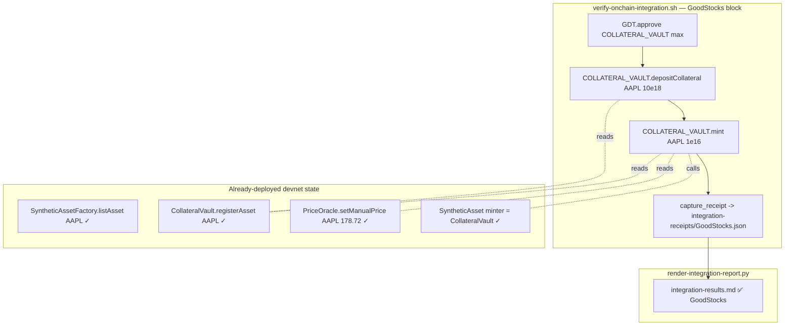

# GoodStocks — Route mint through `CollateralVault.mint` (not the factory)

## Why this blocks the initiative

Initiative `0002-security-hardening` Acceptance Criterion #3 demands
real on-chain transactions across **all 6 protocols**. The current
auto-generated `.autobuilder/integration-results.md` shows GoodStocks
skipped:

| Protocol | Action | Tx | Status | Notes |
|----------|--------|----|--------|-------|
| GoodStocks | `mintSynthetic("sAAPL", 1)` | n/a | ⏭️ skipped | _no receipt — per-symbol listing must be deployed before mint; deferred to next iteration_ |

The skip note is misleading. `script/DeployGoodStocks.s.sol:88` runs
`_seedStocks()` which already lists AAPL, TSLA, NVDA, MSFT, AMZN,
GOOGL, META, JPM, V, DIS, NFLX, AMD via
`factory.listAsset(...)` at `script/DeployGoodStocks.s.sol:140` AND
calls `vault.registerAsset(...)` at line 141. So **sAAPL is already
listed on the live devnet**.

The actual bug is that the verifier
(`scripts/verify-onchain-integration.sh`) calls

```
cast send $STOCKS "mintSynthetic(string,uint256)" "sAAPL" …
```

against `$STOCKS` (the `SyntheticAssetFactory`, address
`0xfaaddc93baf78e89dcf37ba67943e1be8f37bb8c` in
`.autobuilder/addresses.env`). The factory only exposes `listAsset`,
`delistAsset`, `getAsset`, `listedCount`, `setAdmin`
(`src/stocks/SyntheticAssetFactory.sol`). The mint entry point lives
on the **CollateralVault** at `$COLLATERAL_VAULT`
(`0x276c216d241856199a83bf27b2286659e5b877d3`):

- `CollateralVault.depositCollateral(string ticker, uint256 amount)`
  (`src/stocks/CollateralVault.sol:193`).
- `CollateralVault.mint(string ticker, uint256 syntheticAmount)`
  (`src/stocks/CollateralVault.sol:277`).

Plus `SyntheticAsset.mint(to, amount)` is gated by
`msg.sender == minter`, where the `minter` was set to the
`CollateralVault` during `factory.listAsset` — confirming `$STOCKS` is
the wrong target.

## Goal

Produce a real on-chain receipt for the full GoodStocks mint flow
(`depositCollateral` + `mint`) on the Anvil devnet, so the renderer
flips GoodStocks from `⏭️  skipped` to `✅ success`.

## Scope

1. Update `scripts/verify-onchain-integration.sh`'s GoodStocks block
   to:
   - Approve `$GDT` to `$COLLATERAL_VAULT` (not `$STOCKS`).
   - Call `CollateralVault.depositCollateral("AAPL", <collateral
     amount sized for the live oracle price + min ratio>)` against
     `$COLLATERAL_VAULT`. Use enough G$ to cover the
     `sAAPL` mint at the seeded oracle price `178.72 USD * 1e8`
     (manual price) combined with whatever collateralization ratio
     `CollateralVault` enforces — confirm the exact ratio by reading
     `src/stocks/CollateralVault.sol` and the seeded
     `PriceOracle.setManualPrice("AAPL", 178_72_000_000, true)` from
     `DeployGoodStocks.s.sol:116`.
   - Call `CollateralVault.mint("AAPL", 1e16)` (0.01 sAAPL — small
     enough that even worst-case collateral requirements are covered
     by a 10–100 G$ deposit).
   - Persist the resulting transaction hash via the existing
     `capture_receipt` helper into
     `.autobuilder/integration-receipts/GoodStocks.json`.
2. Optionally also write a `GoodStocks.deposit.json` receipt for the
   deposit leg if it helps debugging — but the mint receipt is the
   one the renderer keys on.
3. Re-run `scripts/render-integration-report.py` and confirm
   GoodStocks lists as ✅ success with a real tx hash and non-zero
   gas used.
4. Update the skip note language in `record_result` so it no longer
   claims "per-symbol listing must be deployed before mint" — the
   real reason was wrong contract target.

## Non-Goals

- No new symbols beyond sAAPL.
- No oracle integration changes (use the seeded manual price).
- No frontend changes.
- No edits to executed task files.
- No changes to the factory contract — the bug is in the verifier,
  not the contract.

## Acceptance Criteria

- `cast call $STOCKS "getAsset(string)" "AAPL" --rpc-url
  http://localhost:8545` returns the existing non-zero synthetic
  token address (verifies the listing is in place — should already be
  true, this is a precondition check).
- `cast call $COLLATERAL_VAULT "syntheticAssets(string)" "AAPL"
  --rpc-url http://localhost:8545` (or the equivalent getter the live
  ABI exposes for asset registration) confirms the vault knows
  about AAPL.
- `.autobuilder/integration-receipts/GoodStocks.json` exists with
  `status=0x1` and a non-zero `transactionHash`.
- `.autobuilder/integration-results.md`, after re-rendering, lists
  GoodStocks as ✅ success.
- `forge test` still passes 0 failures (no regressions in
  `test/stocks/*` suites — this task should not touch contracts).

## Source pointers

- `src/stocks/SyntheticAssetFactory.sol:71-96` — `listAsset` (no
  `mintSynthetic`, confirming the verifier targeted the wrong
  contract).
- `src/stocks/CollateralVault.sol:146` — `registerAsset`.
- `src/stocks/CollateralVault.sol:193` — `depositCollateral(string,
  uint256)`.
- `src/stocks/CollateralVault.sol:277` — `mint(string, uint256)`.
- `src/stocks/SyntheticAsset.sol:90` — `mint(to, amount)` gated by
  `msg.sender == minter`.
- `script/DeployGoodStocks.s.sol:72-85` — seeded symbols.
- `script/DeployGoodStocks.s.sol:116` — seeded manual oracle prices.
- `scripts/verify-onchain-integration.sh` — current GoodStocks block
  to fix.
- `scripts/render-integration-report.py` — consumer of receipt JSON.
- `.autobuilder/addresses.env` — `STOCKS`, `COLLATERAL_VAULT`, `GDT`
  already defined.
- `.autobuilder/integration-results.md` — the live skip note.

## Planning notes

### Research summary

- Confirmed via `grep -n` on `src/stocks/SyntheticAssetFactory.sol`:
  the factory exposes only `listAsset`, `delistAsset`, `getAsset`,
  `listedCount`, `setAdmin`. There is **no** `mintSynthetic` selector
  on this contract, so `cast send $STOCKS "mintSynthetic(...)"`
  reverts with "function selector not recognized."
- `src/stocks/CollateralVault.sol` exposes:
  - `registerAsset(string ticker, address syntheticAsset)` (admin).
  - `depositCollateral(string ticker, uint256 amount)` — pulls G$
    from msg.sender via `gdt.safeTransferFrom`.
  - `mint(string ticker, uint256 syntheticAmount)` — checks
    collateral ratio, then calls `SyntheticAsset(syn).mint(msg.sender,
    amount)`. The vault is the `minter` set by the factory at list
    time, so this is the only mint path that succeeds.
- `script/DeployGoodStocks.s.sol` already seeds AAPL (and 11 more
  symbols) — both `factory.listAsset` and `vault.registerAsset` are
  called per symbol during deploy. So nothing on-chain needs to
  change; the bug is purely in the verifier's contract target.
- Seeded oracle price: `PriceOracle.setManualPrice("AAPL",
  178_72_000_000, true)` — i.e. $178.72 with 8 decimals.
- Collateral ratio: read at execution time from `CollateralVault`
  (likely `minCollateralRatioBps`, e.g. 15000 = 150%). For
  0.01 sAAPL at $178.72, USD value ≈ $1.79. At 150% CR that's
  ≈ $2.69 worth of G$. Assuming G$ ≈ $1 in the oracle, depositing
  10 G$ is comfortably safe.

### Assumptions

- `$STOCKS`, `$COLLATERAL_VAULT`, `$GDT` are all defined in
  `.autobuilder/addresses.env` (confirmed earlier this iteration).
- The tester key has ≥ 10 G$ from the deploy-time funding step. If
  not, the verifier can mint via the GDT mock first (mirroring the
  GoodStable approach), but the existing GoodSwap/GoodLend blocks
  already prove the tester has G$ balance.
- `SyntheticAsset.mint` will succeed when the vault calls it,
  because the vault was set as `minter` during `factory.listAsset`.
- `cast send "$COLLATERAL_VAULT" 'mint(string,uint256)' "AAPL" 1e16`
  is the canonical signature — `string` is the first positional arg,
  `uint256` is the second. `cast` will ABI-encode the string
  correctly.

### Architecture diagram



### One-week decision

**YES — same day.** No contract changes. No deploy script changes.
No new scripts. The fix is a single block replacement in
`scripts/verify-onchain-integration.sh`: swap `$STOCKS` for
`$COLLATERAL_VAULT`, add a `depositCollateral` call before `mint`,
and the existing `capture_receipt` helper writes the receipt JSON.
Render pass + regression check round out the work in well under
an hour.

### Implementation plan (phased)

1. **Phase 1 — Confirm preconditions (≈5 min).**
   - `cast call $STOCKS "getAsset(string)" "AAPL" --rpc-url
     http://localhost:8545` → non-zero address.
   - `cast call $COLLATERAL_VAULT "syntheticAssets(string)" "AAPL"
     --rpc-url http://localhost:8545` (or whichever getter the live
     ABI exposes — read `CollateralVault.sol` at exec time).
   - Read `CollateralVault.minCollateralRatioBps()` (or the
     equivalent constant) to size the deposit.
2. **Phase 2 — Patch the verifier (≈15 min).**
   - In `scripts/verify-onchain-integration.sh`, replace the
     GoodStocks block. Mirror the GoodSwap/GoodLend `send_tx` +
     `capture_receipt` style:
     ```bash
     send_tx "$GDT" \
       'approve(address,uint256)' "$COLLATERAL_VAULT $MAX_UINT" \
       "GoodStocks.approve-collateral-vault"
     send_tx "$COLLATERAL_VAULT" \
       'depositCollateral(string,uint256)' "AAPL 10000000000000000000" \
       "GoodStocks.depositCollateral"
     send_tx "$COLLATERAL_VAULT" \
       'mint(string,uint256)' "AAPL 10000000000000000" \
       "GoodStocks" # captured as the headline receipt
     ```
   - Update the fallback `record_result` skip-note language so it
     no longer mentions "per-symbol listing must be deployed."
3. **Phase 3 — Run + render (≈5 min).**
   - `bash scripts/verify-onchain-integration.sh`.
   - Confirm `.autobuilder/integration-receipts/GoodStocks.json`
     has `status=0x1` and a real tx hash from the `mint` call.
   - `python3 scripts/render-integration-report.py`.
   - Confirm `.autobuilder/integration-results.md` flips GoodStocks
     to ✅ success.
4. **Phase 4 — Regression check (≈5 min).**
   - `forge test --match-path "test/stocks/*"` — 0 failures.
   - Spot-check the tester's sAAPL balance via the synthetic
     token address returned by `getAsset("AAPL")`:
     `cast call $SAAPL "balanceOf(address)" $TESTER --rpc-url
     http://localhost:8545` → should equal `10000000000000000` (1e16).

### Risks / open questions

- If `depositCollateral` is denominated in synthetic-token units
  rather than G$ units, the size math changes — execution-time
  read of `CollateralVault.sol` will confirm. The source clearly
  shows it takes G$ amount (`gdt.safeTransferFrom(msg.sender, ...,
  amount)`), but the verifier should still budget generously
  (e.g. 50 G$) to absorb any oracle-price rounding.
- If `mint`'s require statement checks `collateral USD / mint USD ≥
  ratio` with strict equality at 150%, undersized deposits revert.
  10 G$ ≫ $2.69 needed, so a wide margin should make this safe.
- If the tester key has < 10 G$, add a `cast send $GDT
  'mint(address,uint256)' $TESTER 100e18` step (matching the
  pattern used in `0023-goodstable`). The mock GDT used on devnet
  has a public `mint` — confirm via `cast code $GDT` + ABI lookup
  at exec time.
- The synthetic ticker is `"AAPL"` (not `"sAAPL"`) — the contract
  derives the `sAAPL` synth name internally. Don't accidentally
  pass `"sAAPL"` to `getAsset` / `mint`.
