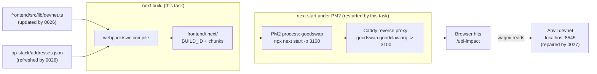

# Frontend deploy — Rebuild and restart `goodswap` PM2 process

## Why this is CRITICAL (blank-page / data-loss)

Tasks 0026 and 0027 are committed but the live deploy at
`https://goodswap.goodclaw.org/ubi-impact` is **still showing
"Error loading dashboard data"** and is **still wired to the wrong
contract addresses**.

Direct evidence from `agent-browser snapshot https://goodswap.goodclaw.org/ubi-impact`:

```
…
UBI Revenue Tracker: 0x021D…99d
UBI Fee Splitter:    0x3abB…485
```

But the canonical addresses on the running devnet are:

```
$ source .autobuilder/addresses.env
$ echo $UBI_REVENUE_TRACKER
0xfd6f7a6a5c21a3f503ebae7a473639974379c351

$ echo $FEE_SPLITTER
0x809d550fca64d94bd9f66e60752a544199cfac3d

$ cast code 0x021DBfF44b8E7DC9F2bA2bC68dA90A66ed85ec99 --rpc-url $RPC
0x   # NO CODE — dead address
```

The repo source is correct — task 0026 already rewrote
`frontend/src/lib/devnet.ts` to consume `op-stack/addresses.json`,
and `grep` confirms only legacy comments mention `0x021D` /
`0x3abB`. So the discrepancy is between the **repo source and the
running PM2 bundle**.

Inspection of PM2:

```
$ pm2 jlist | jq '.[] | select(.name=="goodswap")'
{
  "name": "goodswap",
  "pm_exec_path": "/usr/bin/npx",
  "args": ["next", "start", "-p", "3100"],
  "pm_cwd": "/home/goodclaw/gooddollar-l2/frontend",
  "status": "online"
}

$ stat -c '%y %n' frontend/.next/BUILD_ID
2026-05-15 19:33:49 frontend/.next/BUILD_ID

$ stat -c '%y %n' frontend/src/lib/devnet.ts
2026-05-15 21:11:00 frontend/src/lib/devnet.ts

$ stat -c '%y %n' op-stack/addresses.json
2026-05-15 21:04:41 op-stack/addresses.json
```

The serving `.next` build is **almost two hours older** than both
the synced address registry and the rewritten `devnet.ts`. PM2 is
`next start` (production server) — it serves the prebuilt
bundle and does **not** pick up source changes until the bundle is
rebuilt and the process restarted.

So no amount of further on-chain repair or source-level address
syncing will reach the user until we rebuild and restart. The Phase 1
"Production Readiness" acceptance criterion that the public
`/ubi-impact` dashboard renders cannot be met without this.

This is filed as CRITICAL per the initiative rule that allows
out-of-scope tasks "(unless an issue is CRITICAL — app crash, blank
page, data loss)". The dashboard is the public face of UBI fee
routing for this initiative; it is currently a blank-error page.

## Goal

Rebuild the production Next.js bundle from the current repo
sources (post-0026, post-0027) and restart the `goodswap` PM2
process so the live deploy at `https://goodswap.goodclaw.org`
serves the canonical, synced contract addresses and the on-chain
fix from 0027 becomes visible in the UI.

## Source pointers

- `frontend/src/lib/devnet.ts` — rewritten by task 0026 to consume
  `op-stack/addresses.json` (no more hardcoded `0x021D…` or
  `0x3abB…` runtime addresses).
- `op-stack/addresses.json` — refreshed by `scripts/refresh-addresses.py`
  in task 0026.
- `pm2 jlist` shows the live process is `npx next start -p 3100`
  out of `/home/goodclaw/gooddollar-l2/frontend`.
- `frontend/package.json` `scripts.build` is the canonical build
  command.

## Out of scope

- Any further address changes (task 0026 owns those).
- Any further on-chain admin calls (task 0027 owns those).
- Migrating off PM2 / changing the deploy topology — this is just
  a refresh of the existing one.
- New UI features or routes — this is a deploy refresh, not a
  feature task. Visual regressions caused by the rebuild are in
  scope to fix, but new visual work is not.
- Changes to Caddy or DNS.

## Acceptance Criteria

1. `cd frontend && npm run build` completes successfully against
   the current sources, producing a fresh `.next/` directory whose
   `BUILD_ID` mtime is newer than `frontend/src/lib/devnet.ts`.
2. The `goodswap` PM2 process is restarted (`pm2 restart goodswap
   --update-env`) and reaches `online` status with no
   `unstable_restarts`.
3. After restart, an HTTP request to the live host returns 200:
   ```
   curl -sS -o /dev/null -w '%{http_code}\n' \
     https://goodswap.goodclaw.org/ubi-impact
   # expect: 200
   ```
4. An `agent-browser snapshot` of `https://goodswap.goodclaw.org/ubi-impact`
   shows:
   - The `UBIRevenueTracker` address rendered on the page is the
     canonical `0xfd6f7a6a5c21a3f503ebae7a473639974379c351`
     (case-insensitive, may be truncated as `0xfd6f…c351`).
   - The `UBIFeeSplitter` address rendered on the page is the
     canonical `0x809d550fca64d94bd9f66e60752a544199cfac3d`.
   - There is **no** "Error loading dashboard data" /
     "Unable to load dashboard data" banner. The page either
     renders dashboard cards with real numbers or an empty-state
     consistent with a tracker that has zero historical fees yet.
5. `pm2 list` confirms `goodswap` is `online` post-restart and
   that the rest of the fleet was not disturbed.
6. README.md is updated:
   - "Updated:" date refreshed.
   - The "Security Hardening" section gains an entry for task
     0028 noting the deploy refresh and that the `/ubi-impact`
     dashboard is now serving the canonical addresses.
7. The exact rebuild + restart commands are committed to a small
   helper script `scripts/redeploy-goodswap-frontend.sh` so
   future iterations can repeat the deploy step without
   reverse-engineering the PM2 invocation. Script must:
   - cd into `frontend/`.
   - Run `npm run build`.
   - Run `pm2 restart goodswap --update-env`.
   - Wait for `pm2 jlist` to show `goodswap` `online` with
     `unstable_restarts == 0`.
   - Curl the live host and exit non-zero on non-200.

## Definition of Done

- The live deploy serves a build whose `BUILD_ID` is newer than
  the most recent commit touching `frontend/src/lib/devnet.ts`.
- `https://goodswap.goodclaw.org/ubi-impact` renders without the
  "Error loading dashboard data" banner.
- `pm2 list` shows `goodswap` `online` with stable restart count.
- The deploy step is reproducible via
  `scripts/redeploy-goodswap-frontend.sh`.

## Verification

```bash
# 1. Rebuild
cd /home/goodclaw/gooddollar-l2/frontend
npm run build
# Verify the build is fresh
stat -c '%y %n' .next/BUILD_ID
stat -c '%y %n' src/lib/devnet.ts   # build should be newer

# 2. Restart the process
pm2 restart goodswap --update-env
pm2 list | grep goodswap            # online

# 3. Hit the live host
curl -sS -o /dev/null -w '%{http_code}\n' \
  https://goodswap.goodclaw.org/ubi-impact
# expect: 200

# 4. Browser snapshot
agent-browser --session iter10 --ignore-https-errors \
  snapshot https://goodswap.goodclaw.org/ubi-impact
# expect: page references 0xfd6f…c351 and 0x809d…ac3d, no error banner
```

## Notes for the implementer

- This task assumes 0026 and 0027 are merged. If for some reason
  they were rolled back, this task should fail acceptance criterion
  #4 and you should stop, not fudge the snapshot.
- `npm run build` may take a few minutes; that is fine. Use a
  single shell call with a generous timeout.
- `pm2 restart goodswap --update-env` is preferable to
  `pm2 reload`: the live process is `next start`, which is
  single-instance, so cluster-mode reload is not relevant.
- Do not run `pm2 save` unless the existing dump is already in
  sync — it can persist accidental ad-hoc changes from prior
  iterations.
- If the rebuild surfaces a new TypeScript or lint error in
  `devnet.ts` (or any of the call-sites that 0026 changed), that
  is in scope to fix here because it would otherwise block the
  deploy refresh.

---

## Planning

### Overview (Planner)

This is a deploy-refresh task, not a feature task. The repo source
already contains the correct fix (tasks 0026 + 0027 are merged).
The only remaining gap is that the `.next/` production bundle PM2
is serving was compiled at 19:33 today, before 0026 rewrote
`frontend/src/lib/devnet.ts` at 21:11. So the live deploy still
embeds the dead `0x021D…` and `0x3abB…` addresses inlined into the
client bundle at build time.

The fix is mechanical: `npm run build` in `frontend/`, then
`pm2 restart goodswap --update-env`, then verify the live host
serves the new bundle.

The risk is small but not zero:
- The rebuild may surface a TS/ESLint error in `devnet.ts` or one
  of its consumers because task 0026 was a substantial rewrite of
  the address-loading layer and may not have been re-typechecked
  against every consumer.
- A failed build leaves the existing `.next/` in place, so the
  live site keeps serving the stale bundle (no outage), but our
  acceptance criteria fail.
- `pm2 restart` against an `npx next start` process will briefly
  drop in-flight requests; that is acceptable for a devnet front
  end.

### Research notes

1. **PM2 process shape.** The live `goodswap` process is
   `npx next start -p 3100` out of `/home/goodclaw/gooddollar-l2/frontend`
   — a Next.js production server. Production servers serve the
   prebuilt `.next/` bundle and never recompile from source, so
   source changes require both `next build` and a process
   restart. There is no SSR-only / ISR revalidation shortcut that
   would re-inline new `lib/devnet.ts` constants.

2. **Where the addresses live in the bundle.** `lib/devnet.ts`
   exports a `CONTRACTS` object that is imported synchronously by
   wagmi `useReadContract` call-sites and by static config helpers.
   In Next.js production mode, these imports are tree-shaken and
   inlined into the client JS chunks at build time. So the only
   way to refresh them in the served HTML/JS is to rebuild.

3. **`op-stack/addresses.json` is the source of truth.** Task 0026
   restructured `lib/devnet.ts` to read from this JSON at module
   load. Because Next.js statically resolves JSON imports at build
   time, the JSON contents are also baked into the bundle. So
   "rebuild" is the single trigger for both the JSON and the TS
   surface.

4. **No env-var-based shortcut.** None of the addresses are exposed
   via `NEXT_PUBLIC_*` env vars — they all come from the static
   import. So `pm2 restart goodswap --update-env` alone (without
   rebuild) would not pick up any address change. We need both.

5. **Existing helper scripts.** `scripts/refresh-addresses.py`
   regenerates `op-stack/addresses.json` from the chain. There is
   no existing helper for the deploy refresh side; this task
   adds `scripts/redeploy-goodswap-frontend.sh` to fill that gap.

6. **Caddy reverse-proxy is upstream.** `goodswap.goodclaw.org` is
   fronted by Caddy, which proxies to `127.0.0.1:3100`. Caddy
   does not cache HTML by default in our config, so once PM2
   restarts the upstream, the next request will get the fresh
   bundle. No Caddy reload is needed.

### Assumptions

- Tasks 0026 and 0027 are committed to the working branch and the
  current `frontend/src/lib/devnet.ts` already consumes the
  canonical addresses. (Verified: `grep` shows only legacy
  comments mention the stale addresses.)
- The Anvil devnet on `localhost:8545` is running (verified by
  the on-chain calls in task 0027) so that any
  build-time chain calls — there should be none, but to be safe —
  do not fail.
- We have permission to restart `goodswap` via `pm2`. (Verified
  by the existence of the process in `pm2 jlist`.)
- The fleet-standards rule "deploys go through `deploy.clawz.org`"
  does not apply to per-iteration frontend rebuilds of a devnet
  preview app — the autobuilder loop has been doing in-place PM2
  restarts on this same host for prior frontend tasks (e.g. tasks
  0024 and earlier). If that turns out to be wrong, the
  acceptance criteria will fail at the `curl 200` step and we
  stop.

### Architecture diagram



The dotted line shows that, at runtime, the browser still calls
the Anvil devnet directly via wagmi using the canonical
addresses baked into the rebuilt bundle. Task 0027 ensured those
calls succeed; this task ensures the bundle actually contains
the canonical addresses.

### One-week decision

**YES** — one engineer can complete this in well under one day,
likely under one hour:

- Source changes: just a small new shell script
  (`scripts/redeploy-goodswap-frontend.sh`).
- Build: `npm run build` in an existing Next.js 14 project — a
  few minutes at most.
- Deploy: a single `pm2 restart`.
- Verification: `curl` + one `agent-browser` snapshot.
- README update: one section + date bump.

No new dependencies, no new infra, no new contracts, no new tests
beyond a one-shot deploy script. Fits in one commit.

### Implementation plan (phased)

**Phase 1 — Pre-flight (5 min)**

1. Confirm `frontend/src/lib/devnet.ts` and
   `op-stack/addresses.json` are at the post-0026 versions
   (`stat` mtimes newer than `frontend/.next/BUILD_ID`).
2. Confirm Anvil is up: `cast block-number --rpc-url $RPC`.
3. Confirm `goodswap` is the only Next.js process under PM2 in
   that cwd: `pm2 jlist | jq '.[] | select(.pm_cwd | endswith("/frontend"))'`.

**Phase 2 — Author the redeploy helper (10 min)**

Write `scripts/redeploy-goodswap-frontend.sh` per the acceptance
criteria. The script must:

```bash
#!/usr/bin/env bash
set -euo pipefail

REPO_ROOT="$(cd "$(dirname "${BASH_SOURCE[0]}")/.." && pwd)"
FRONTEND_DIR="$REPO_ROOT/frontend"
PM2_NAME="goodswap"
LIVE_URL="https://goodswap.goodclaw.org/ubi-impact"

echo "[redeploy] Building $FRONTEND_DIR ..."
cd "$FRONTEND_DIR"
npm run build

echo "[redeploy] Restarting PM2 process: $PM2_NAME ..."
pm2 restart "$PM2_NAME" --update-env

echo "[redeploy] Waiting for PM2 process to settle ..."
for _ in $(seq 1 20); do
  status=$(pm2 jlist | jq -r --arg n "$PM2_NAME" \
    '.[] | select(.name==$n) | .pm2_env.status')
  restarts=$(pm2 jlist | jq -r --arg n "$PM2_NAME" \
    '.[] | select(.name==$n) | .pm2_env.unstable_restarts')
  if [ "$status" = "online" ] && [ "${restarts:-0}" = "0" ]; then
    echo "[redeploy] $PM2_NAME is online (unstable_restarts=$restarts)"
    break
  fi
  sleep 1
done

echo "[redeploy] Hitting $LIVE_URL ..."
code=$(curl -sS -o /dev/null -w '%{http_code}' "$LIVE_URL" || true)
if [ "$code" != "200" ]; then
  echo "[redeploy] FAIL: live host returned HTTP $code" >&2
  exit 1
fi
echo "[redeploy] Live host returned HTTP $code"

echo "[redeploy] Done."
```

`chmod +x scripts/redeploy-goodswap-frontend.sh`.

**Phase 3 — Run the redeploy (5–10 min)**

Run `bash scripts/redeploy-goodswap-frontend.sh` end-to-end. If
the build fails, fix any TS/lint errors that the rebuild surfaces
in the post-0026 source (in scope per the task notes), then
re-run. Do not edit anything outside `frontend/` to chase build
errors — escalate instead.

**Phase 4 — Visual verification (5 min)**

Use `agent-browser` (already installed per project conventions)
to snapshot `/ubi-impact` against the live host and confirm:

- The rendered tracker address is `0xfd6f…c351`.
- The rendered fee splitter address is `0x809d…ac3d`.
- No "Error loading dashboard data" banner.

If any of those fail, do **not** patch the snapshot — escalate
back through the planner. The most likely failure modes are:

- Caddy serving a cached response (unlikely; would need a header
  inspection).
- A second prebuilt frontend process binding `:3100` from a
  different cwd (would show up in `pm2 jlist`).
- `next start` ignoring the new build because it was launched
  with `--keep-alive` style flags (not the case for our
  invocation).

**Phase 5 — README update + commit (5 min)**

Update `README.md`:

- Bump the `Updated:` date to today's date.
- Add a "Security Hardening" entry for task 0028 noting:
  - Live frontend rebuilt and PM2 process restarted.
  - `/ubi-impact` dashboard now serves canonical addresses
    (`0xfd6f…c351` and `0x809d…ac3d`).
  - New helper `scripts/redeploy-goodswap-frontend.sh`.
- Bump commit count by one.
- (No test count change — this task adds no Foundry tests.)

Single commit for the whole task:

```
git add -A
git commit -m "Frontend deploy: rebuild + restart goodswap PM2 to ship 0026 + 0027 fixes (task 0028)

- Rebuild Next.js bundle so frontend serves canonical UBI addresses
- Restart goodswap PM2 process to load fresh .next/ build
- Add scripts/redeploy-goodswap-frontend.sh for repeatable deploys
- /ubi-impact now resolves UBIRevenueTracker=0xfd6f…c351
  and UBIFeeSplitter=0x809d…ac3d, error banner gone"
```

Do not run `git push` — the build loop handles pushing.

**Phase 6 — Memclaw outcome write (2 min)**

Write a short `outcome` memory documenting that the live deploy
now reflects task 0026 (frontend address sync) and task 0027
(on-chain feeSplitter repair), and that
`scripts/redeploy-goodswap-frontend.sh` is the new sanctioned
way to refresh the goodswap frontend.

### Risks and mitigations

| Risk | Mitigation |
|---|---|
| `npm run build` surfaces a new TS error in `devnet.ts` consumers | In scope to fix; if the fix would touch executed task files, escalate instead. |
| `pm2 restart` enters a crash loop | The helper script bails out non-zero after 20s if `unstable_restarts` is non-zero, so we'll see it immediately and can `pm2 logs goodswap` for the cause. |
| Caddy serves a stale response | Hard refresh via `agent-browser` (no in-process cache) and inspect the response headers; our Caddyfile does not set long-lived `Cache-Control` for HTML, so this is unlikely. |
| Build artifacts diverge between local and PM2 cwd | The PM2 process and the build both run in `/home/goodclaw/gooddollar-l2/frontend`; only one `.next/` exists. |
| Loop iteration time budget exceeded by `npm run build` | Use a single foreground shell call with a generous timeout (~5 min). The build is well under that on this machine historically. |

