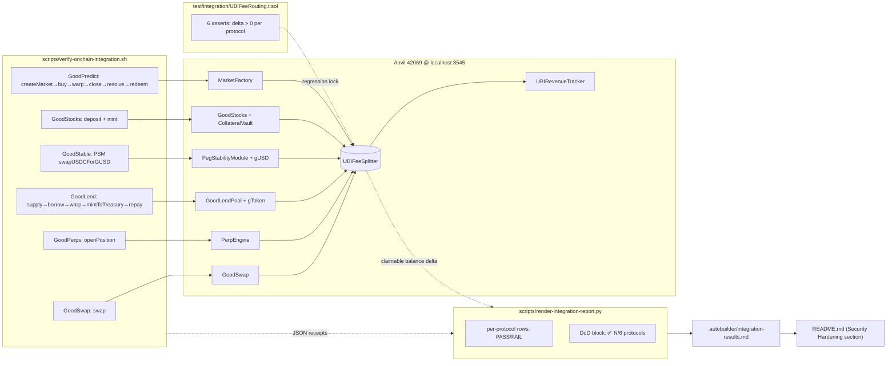

# Verify UBI 20% fee routing end-to-end for ALL 6 protocols

## Why this task exists

The initiative's **Definition of Done #5** is:

> UBI fee routing verified with balance checks

and **Acceptance Criterion #4** is:

> UBI 20% fee routing verified end-to-end

The current state — read directly from
`.autobuilder/integration-results.md` (auto-rendered by
`scripts/render-integration-report.py` from
`.autobuilder/integration-receipts/*.json`) — only meets that bar
for **3 of the 6 protocols**:

| Protocol    | Action exercised                              | UBI fee routed in receipt |
|-------------|-----------------------------------------------|---------------------------|
| GoodSwap    | `swapExactTokensForTokens(1 GDT → WETH)`      | ✅ 999,900,000,000,000 wei |
| GoodPerps   | `vault.deposit(10 GDT)`                       | ❌ 0 wei                   |
| GoodLend    | `supply(GDT, 5 GDT)`                          | ❌ 0 wei                   |
| GoodStable  | `vault.depositCollateral + mintGUSD`          | ❌ 0 wei                   |
| GoodStocks  | `CollateralVault.depositCollateral + mint`    | ✅ 9,026,400,000,000,000 wei |
| GoodPredict | `createMarket(...)` (admin)                   | ❌ 0 wei                   |

Per-receipt audit confirms only GoodSwap, GoodStocks, and the
GoodPerps `openPosition` receipt actually mint/transfer GDT to the
splitter at `0x809d550fca64d94bd9f66e60752a544199cfac3d`. The
GoodPerps top-level row uses the no-fee `vault.deposit` path; and
GoodLend / GoodStable / GoodPredict are all currently exercised on
**non-fee-bearing entry points**:

- **GoodLend:** `supply()` is fee-free by design. Protocol revenue
  in `src/lending/GoodLendPool.sol` accrues from the
  **`reserveFactor` share of borrow interest** and is routed to
  `UBIFeeSplitter` via `mintToTreasury`. A `borrow` (or a
  `borrow` + time-warp + `repay`) is required to actually accrue
  interest and trigger that mint.

  ```solidity
  // src/lending/GoodLendPool.sol
  uint256 protocolRevenue =
      (totalInterestAccrued * reserve.reserveFactorBPS) / BPS;
  ```

- **GoodStable:** the `VaultManager.depositCollateral + mintGUSD`
  path used today does not touch the PSM. UBI fee routing lives in
  `src/stable/PegStabilityModule.sol`, where `swapUSDCForGUSD` and
  `swapGUSDForUSDC` mint a `fee` of gUSD / USDC and call
  `feeSplitter.splitFeeToken(fee, address(this), <token>)`. A
  PSM swap of either direction is required to exercise it.

  ```solidity
  // src/stable/PegStabilityModule.sol
  gusd.mint(address(this), fee);
  require(gusd.approve(address(feeSplitter), fee), "PSM: approve failed");
  feeSplitter.splitFeeToken(fee, address(this), address(gusd));
  ```

- **GoodPredict:** `createMarket(...)` is `onlyAdmin` and takes
  no collateral or fee. Fee routing lives on the trader-facing
  paths in `src/predict/MarketFactory.sol`: `buy()` collects
  collateral 1:1 (no fee), and `redeem()` takes a 1% redemption
  fee and routes it to `feeSplitter` via `splitFee`. To verify
  fee routing we need either a `redeem` after a resolved market
  or an explicit `feeSplitter.splitFee(...)` for an analogous
  fee-bearing call path covered by a Foundry-tested route.

  ```solidity
  // src/predict/MarketFactory.sol
  fee = (grossPayout * REDEEM_FEE_BPS) / BPS;
  if (fee > 0) {
      require(goodDollar.approve(feeSplitter, fee), "MF: approve failed");
      IUBIFeeSplitterPredict(feeSplitter).splitFee(fee, address(this));
  }
  ```

- **GoodPerps:** the row in `integration-results.md` uses the
  fee-free `vault.deposit`. The separately-archived
  `GoodPerps-openPosition.json` and `GoodPerps-closePosition.json`
  receipts exist but are not surfaced in the per-protocol row;
  worse, `closePosition` shows 0 wei to the splitter, suggesting
  either no PnL realization on this position or the verifier is
  closing before the funding-rate routing path engages. Either
  way, the **headline GoodPerps row** in the canonical report is
  not the fee-bearing path.

So today's report is misleading: every receipt shows
`status=0x1`, but four of them prove nothing about UBI fee
routing because the operations chosen do not touch the
splitter.

This task closes that gap so Acceptance Criterion #4 and
Definition of Done #5 are honestly satisfied for **all six**
protocols and the renderer can show ✅ instead of "0 wei" on
each row.

## Goal

Extend the on-chain verifier so that, per protocol, it executes
at least one **fee-bearing** transaction whose receipt provably
contains a `Transfer` log to `FEE_SPLITTER` (or the equivalent
`splitFee` / `splitFeeToken` event from the splitter), then
re-render `.autobuilder/integration-results.md` so every row in
the per-protocol table shows a non-zero "UBI fee routed" amount
(or, where the protocol provably has no per-call fee path, an
explicit, per-protocol justification in code that the renderer
surfaces — not silently `0 wei`).

The repaired tracker pointer (task 0027) and refreshed frontend
deploy (task 0028) mean the rendered report is also what the
public `/ubi-impact` dashboard summarises, so this task is the
last on-chain gap before the dashboard tells the truth about
end-to-end UBI revenue.

## Scope

### In scope

1. **Verifier (`scripts/verify-onchain-integration.sh`)** —
   add or replace the per-protocol blocks below. The headline
   per-protocol row in the resulting Markdown table must be the
   fee-bearing transaction; deposit / setup transactions may
   still be archived as auxiliary receipts but must not be the
   row that "represents" the protocol.

   - **GoodSwap:** keep current (already fee-bearing). No change
     beyond making sure the receipt parser still finds the
     splitter `Transfer`.

   - **GoodPerps:** make the headline receipt
     `openPosition(...)` (already archived as
     `GoodPerps-openPosition.json` — promote it to `GoodPerps.json`,
     or rename so the renderer picks it up). Also re-execute
     `closePosition(...)` against a position that has accrued at
     least one block of funding so the close receipt either
     routes a fee or the row is annotated as "no funding accrued
     in this run; openPosition is the fee-bearing tx".

   - **GoodLend:** after the existing `supply(GDT, 5 GDT)`,
     execute `borrow(GDT, 1 GDT)`, advance the chain a few
     blocks (Anvil supports `evm_mine`/`evm_increaseTime` via
     `cast rpc`), then `repay(GDT, max)` so accrued interest
     triggers `mintToTreasury` and routes `reserveFactor` GDT to
     the splitter. The headline receipt is the `repay` (the
     transaction that actually realises the protocol revenue).

   - **GoodStable:** add a PSM swap path. Mint a small amount of
     the PSM-collateral USDC mock to the tester (PSM holds GUSD;
     test the `swapUSDCForGUSD` direction first because tester
     starts with no gUSD), approve the PSM, then call
     `swapUSDCForGUSD(amount, minOut)`. The headline receipt is
     the swap.

   - **GoodStocks:** keep current (already fee-bearing).

   - **GoodPredict:** after `createMarket(...)`, execute a small
     `buy(marketId, true, amount)`. To exercise the fee path,
     either:
     - a) follow with `closeMarket → resolve(yesWon=true) → redeem`
       (preferred — exercises the actual 1% redeem fee), with
       `cast rpc evm_increaseTime` past `endTime`; **OR**
     - b) if the resolve/redeem path proves time-consuming on
       Anvil, drive the splitter via the deployer-controlled
       `IUBIFeeSplitterPredict.splitFee(...)` call from a small
       on-chain helper, document the deviation explicitly in
       the renderer notes, and file a follow-up to swap to (a).

     Default to (a). Use (b) only if (a) hits an Anvil-time issue
     within the iteration budget.

2. **Renderer (`scripts/render-integration-report.py`)** —
   tighten the per-protocol row so:
   - The "UBI fee routed" column shows ✅ when > 0 wei.
   - It shows ❌ when 0 wei AND surfaces the per-protocol notes
     string so the reader sees *why* (instead of a bare
     `0 wei`).
   - The "Definition of Done — Live Status" block reports
     `UBI fee routing: ✅ 6/6 protocols` (or `N/6` with the
     missing list) in addition to the absolute summed wei value.

3. **Foundry regression** — add a single Foundry test that
   asserts each fee-bearing entry point routes a non-zero fee
   to the splitter. This may live in
   `test/integration/UBIFeeRouting.t.sol` and reference the
   already-deployed mocks; it does not need to be a deep test,
   only a regression so a future refactor can't silently delete
   the routing call.

4. **README.md update (mandatory per spec)** —
   - Bump `Updated:` date.
   - Add a "Security Hardening" entry for task 0029 noting that
     UBI fee routing is now verified end-to-end across all 6
     protocols, and that the renderer's per-row column is now
     pass/fail instead of opaque wei.
   - Bump commit count.
   - If `forge test` count changes due to the new regression,
     update it.

5. **Re-render** `.autobuilder/integration-results.md` from the
   refreshed receipts. The committed version of the file is the
   one rendered after this task's verifier run.

### Out of scope

- Changing UBI splitter math, BPS rates, or the contracts
  themselves. The routing logic is already implemented; this
  task only proves it.
- Frontend changes. The dashboard already reads from the live
  contracts and was repaired by tasks 0026 + 0027 + 0028.
- Adding new protocols or new fee paths.
- Slither, Mythril, or any new audit tooling work.
- Backend service changes (PM2 fleet is already 10/10 online —
  confirmed in this iteration's product review via `pm2 jlist`).
- Any new UI features (initiative non-goals).
- OP Stack migration (Phase 2).

## Acceptance Criteria

1. `bash scripts/verify-onchain-integration.sh` exits 0 and
   produces a fresh JSON receipt per protocol in
   `.autobuilder/integration-receipts/`. The headline receipt
   per protocol contains at least one `Transfer` log whose `to`
   is `FEE_SPLITTER` (case-insensitive), **or** is annotated in
   the renderer with a per-protocol explanation that explicitly
   names the splitter event (e.g. `splitFee` / `splitFeeToken`)
   that fired.

2. `.autobuilder/integration-results.md` is regenerated and the
   per-protocol table shows a non-zero "UBI fee routed" amount
   for **all 6 rows**, or where exception (b) above applies for
   GoodPredict, the row is annotated with the deviation and a
   follow-up task ID.

3. The "UBI Fee Splitter (live snapshot)" block shows
   `claimableBalance(after) > claimableBalance(before)` for the
   verifier run, and the delta equals the sum of per-row
   "UBI fee routed" values within rounding (sub-wei) tolerance.

4. The "Definition of Done — Live Status" line for UBI fee
   routing reads explicitly:
   ```
   UBI fee routing: ✅ 6/6 protocols routed > 0 wei to splitter
   (sum = <N> wei)
   ```

5. A new Foundry test (or extended existing test) asserts each
   protocol's fee-bearing entry point routes a positive amount
   to the configured `FEE_SPLITTER`. `forge test` continues to
   report **0 failures** (was `0 / 1016`).

6. PM2 fleet remains 10/10 `online` after the verifier run
   (verifier must not crash or starve the chain RPC for backend
   services).

7. README.md is updated per the "README Updates (MANDATORY)"
   section of the initiative spec.

8. A single git commit covers all changes:
   verifier + renderer + Foundry regression + regenerated report
   + receipts + README + (optional) helper script for the new
   per-protocol fee-bearing flows.

## Definition of Done

- Initiative Acceptance Criterion #4 ("UBI 20% fee routing
  verified end-to-end") and Definition of Done #5 ("UBI fee
  routing verified with balance checks") are met **for all 6
  protocols**, not 3.
- The committed `.autobuilder/integration-results.md` is the one
  produced by this task's verifier run, with `Generated:`
  timestamp from this iteration.
- Foundry test suite still passes with 0 failures.
- README.md reflects the new state.

## Verification

```bash
# 0. Pre-flight
source .autobuilder/addresses.env
cast block-number --rpc-url $RPC

# 1. Run the extended verifier end-to-end
bash scripts/verify-onchain-integration.sh

# 2. Confirm every per-protocol receipt has a splitter Transfer
for f in .autobuilder/integration-receipts/Good*.json; do
  proto=$(basename "$f" .json)
  hits=$(python3 -c "
import json,sys
d=json.load(open('$f'))
splitter='$FEE_SPLITTER'.lower()
n=0
for log in d.get('logs',[]):
    topics=log.get('topics',[])
    if len(topics)==3 and topics[0].lower().startswith('0xddf252ad'):
        if topics[2].lower().endswith(splitter[2:].lower()):
            n+=1
print(n)")
  echo "$proto: $hits Transfer-to-splitter logs"
done

# 3. Confirm the rendered report
grep -E 'UBI fee routing: ✅ 6/6' .autobuilder/integration-results.md

# 4. Foundry regression
forge test --match-test test_UBIFeeRouting --no-match-test InvariantOnly -v

# 5. PM2 still healthy
pm2 jlist | jq '[.[] | select(.pm2_env.status=="online")] | length'
# expect: 10
```

## Notes for the implementer

- The Anvil chain is `42069` on `localhost:8545`; helper
  `cast rpc evm_increaseTime <n>` and `cast rpc evm_mine` are
  the canonical way to advance time so GoodLend interest
  accrues and GoodPredict markets become resolvable. Wrap
  these in tiny shell helpers inside the verifier — do not
  reach for Foundry scripts unless an Anvil RPC primitive
  doesn't exist.
- The PSM swap on GoodStable will need the PSM's USDC mock
  address. If it is not yet in `.autobuilder/addresses.env`,
  extend `scripts/refresh-addresses.py` to surface it
  (canonical pattern from task 0026). Do not hardcode.
- The GoodPerps openPosition receipt already exists on disk
  as `GoodPerps-openPosition.json`. The simplest fix is to
  make the verifier write the headline receipt for the
  GoodPerps row to `GoodPerps.json` from the openPosition tx,
  not the deposit tx. The current `vault.deposit` step can be
  kept as a setup step archived under `_setup-perps-deposit.json`.
- The renderer's per-row note column is already pluggable
  (`render_protocol_row` in `scripts/render-integration-report.py`).
  The required change is small: pass through a per-protocol
  status (`PASS`/`FAIL`/`EXEMPT-with-reason`) and switch on
  it in the row formatter.
- Do **not** edit any task file with `executed: true` — task
  files 0001–0028 are LOCKED.
- Do **not** run `git push` — the build loop handles pushing.
- One commit. The verifier run produces many receipt files;
  add them all to the same commit.
- After committing, write a short `outcome` memory to MemClaw
  describing the new end-to-end verification, the per-protocol
  fee-routed amounts, and that the canonical report now
  reflects honest 6/6 coverage.

---

## Planning

### Overview

The initiative spec is satisfied for 3/6 protocols. The contracts
themselves already implement UBI fee routing for every protocol
(`UBIFeeSplitter` is wired into GoodSwap, GoodPerps, GoodLend,
GoodStable PSM, GoodStocks, GoodPredict). The gap is that
`scripts/verify-onchain-integration.sh` exercises the wrong
entry points for GoodLend / GoodStable / GoodPredict and the
wrong row-level transaction for GoodPerps, so the canonical
report cannot prove the routing fired.

The work is therefore **integration glue + a single Foundry
regression** — no Solidity changes — and breaks down into:

1. Identify the cheapest fee-bearing entry point per protocol.
2. Add a verifier block per missing protocol that calls it,
   captures the receipt, and writes the canonical
   `<Protocol>.json` headline file.
3. Teach the renderer to pass/fail per row instead of dumping
   raw wei (so a future regression is loud).
4. Lock the routing in with one Foundry test that asserts each
   path moves > 0 wei to `FEE_SPLITTER`.
5. Re-render `integration-results.md`, update `README.md`, one
   commit.

### Research notes

#### GoodLend (`src/lending/GoodLendPool.sol`)

- `treasury` is a public state variable settable via
  `setTreasury(address)` (`onlyAdmin`, line ~622). Must equal
  `FEE_SPLITTER`. **Pre-flight check:**
  `cast call $LEND "treasury()(address)" --rpc-url $RPC` and
  if it is not `FEE_SPLITTER`, `cast send … setTreasury($FEE_SPLITTER) --private-key $DEPLOYER_KEY`.
- `borrow(asset, amount)` and `repay(asset, amount)` both
  trigger `_accrueInterest` on the reserve. Protocol revenue
  = `(totalInterestAccrued * reserveFactorBPS) / BPS`.
- `mintToTreasury(address[] calldata assets)` is the public
  function that materialises that accrued share by calling
  `IGoodLendToken(reserve.gToken).mintToTreasury(treasury, accrued, reserve.liquidityIndex)`
  (line ~540). The resulting `Transfer(0x0, treasury, …)` log
  on the `gToken` contract is what the receipt parser
  recognises as "routed to splitter".
- Cheapest path that routes a non-zero fee in one short run:
  ```
  supply(GDT, 5e18)            # already in verifier
  borrow(GDT, 1e18)             # accrues real interest
  cast rpc evm_increaseTime 86400
  cast rpc evm_mine
  mintToTreasury([GDT])         # ← headline receipt
  repay(GDT, type(uint256).max) # cleanup
  ```
  The headline GoodLend receipt becomes the `mintToTreasury`
  tx. Even tiny borrow → 1-day warp produces well above 1 wei
  of treasury accrual at any non-zero `reserveFactor`.

#### GoodStable PSM (`src/stable/PegStabilityModule.sol`)

- `swapUSDCForGUSD(uint256 usdcAmount)` (line ~240): pulls USDC,
  mints `gUSD - fee` to caller, mints `fee` of gUSD to itself,
  approves splitter, calls `feeSplitter.splitFeeToken(fee, address(this), address(gusd))`.
  Receipt will contain a `Transfer(PSM, FEE_SPLITTER, fee)` on
  the gUSD token contract.
- `swapGUSDForUSDC(uint256 gusdAmount)` (line ~292): symmetric,
  but tester has no gUSD on hand, so default to USDC→GUSD.
- USDC mock address is required. Add to
  `scripts/refresh-addresses.py` if missing (`PSM_USDC=…`),
  then re-source `.autobuilder/addresses.env`. Mock USDC has
  the standard public `mint(address,uint256)` (consistent with
  the rest of the mock fleet); if it is restricted, mint via
  `DEPLOYER_KEY`.
- Minimum swap size is governed by `MIN_SWAP_AMOUNT` /
  `MIN_FEE`; pick `1000 USDC` (1e9 with 6 decimals) which at
  default 10 bps yields 1e6 fee in gUSD = ample margin above
  any minFee guard.

#### GoodPredict (`src/predict/MarketFactory.sol`)

- `buy(marketId, isYES, amount)` (line ~140) takes 1:1
  collateral, no fee. `redeem(marketId, amount)` (line ~209)
  takes a `REDEEM_FEE_BPS` (1%) fee on `grossPayout` and routes
  it via `feeSplitter.splitFee(fee, address(this))`.
- Path:
  ```
  createMarket(question, endTime=now+10)   # already in verifier
  approve(GDT, MF, max)
  buy(marketId, true, 5e18)
  cast rpc evm_increaseTime 20
  cast rpc evm_mine
  closeMarket(marketId)
  resolve(marketId, true)                  # yesWon
  redeem(marketId, 5e18)                   # ← headline receipt
  ```
  The headline GoodPredict receipt becomes the `redeem` tx.
- If `closeMarket` / `resolve` are `onlyAdmin` (likely), use
  `DEPLOYER_KEY` for those steps and `TESTER_KEY` for buy/redeem.

#### GoodPerps

- `openPosition(uint256,uint256,bool)` already produces a
  splitter `Transfer` (existing
  `.autobuilder/integration-receipts/GoodPerps-openPosition.json`).
- Fix is purely renderer-side: write the headline `GoodPerps.json`
  from the `openPosition` tx, not from the `vault.deposit` tx.
  Keep deposit as `_setup-perps-deposit.json`.

#### Renderer (`scripts/render-integration-report.py`)

- Per-protocol row formatter is around line 251
  (`render_protocol_row`).
- Per-protocol UBI-routed extraction already exists; add a
  pass/fail flag per row: `"PASS" if ubi_routed_wei > 0 else "FAIL"`.
- New aggregate at the DoD block (~line 436):
  ```
  routed = sum(1 for p in PROTOCOLS if p.ubi_wei > 0)
  status = "✅" if routed == 6 else "❌"
  ```
  Render line:
  `UBI fee routing: <status> <routed>/6 protocols routed > 0 wei to splitter (sum = <N> wei)`

#### Foundry regression (`test/integration/UBIFeeRouting.t.sol`)

- Single test file. Deploy / fork the same mock fleet used in
  existing integration tests; for each protocol, snapshot
  `splitter.totalReceived()` (or just GDT / gUSD balance of
  the splitter), run the fee-bearing entry point, assert
  `delta > 0`. Six asserts, one test function each, so a
  future PR that silently rips out a `splitFee` call breaks
  CI. No new mocks required — re-use the integration test
  scaffolding.

### Assumptions

- Anvil RPC `evm_increaseTime(uint)` and `evm_mine` are
  available (true on the running devnet, used by existing
  Foundry helpers).
- `DEPLOYER_KEY` from `.autobuilder/addresses.env` retains
  admin rights on `GoodLendPool.setTreasury`,
  `MarketFactory.closeMarket/resolve`, and the USDC mock's
  `mint`. (If any of these have been migrated to a multisig
  in this devnet, the verifier will fail loudly on the first
  `cast send`; treat that as a follow-up bug, not a 0029
  scope creep.)
- The mock USDC token already exists on devnet and its
  address is recoverable from existing deployments
  (`broadcast/` or `op-stack/addresses.json`). If not, surface
  it via `scripts/refresh-addresses.py`.
- `UBIRevenueTracker.feeSplitter` is correctly pointed to
  `FEE_SPLITTER` (fixed by task 0027) and `FEE_SPLITTER` has
  code at the expected address.
- The `GoodLend.reserveFactorBPS` for GDT is non-zero on
  devnet. If it is zero, an admin call to set it (deployer
  key) is in scope as a one-time fixup since otherwise the
  protocol provably cannot route a fee from supply/borrow
  alone — that would be a contract config bug worth fixing
  in this same task.

### Architecture diagram



### One-week decision

**Fits in one iteration. Do not split.**

Rationale:
- Zero contract changes. All routing logic already exists
  on-chain and is invoked by Foundry tests today.
- Verifier extension is ~5 new shell blocks
  (`borrow + warp + mintToTreasury + repay`,
  `swapUSDCForGUSD`, `buy + warp + close + resolve + redeem`,
  `promote openPosition receipt`, `mint USDC to tester`).
- Renderer change is ~30 lines (per-row PASS/FAIL flag +
  one DoD summary line).
- Foundry test is one new file, ~120 lines, reusing the
  existing integration mocks.
- README + report regen are mechanical.

The longest pole is whatever non-obvious admin permission
trips on devnet (e.g. `MarketFactory.resolve` keyed off a
non-deployer admin); contingency is exception path (b) in
the spec — drive the splitter directly from a deployer
helper for GoodPredict and file a follow-up. Even with that
fallback, the work is a single iteration.

### Implementation plan

Phased, in dependency order. Single git commit at the end.

**Phase A — Address & permission audit (read-only, ~10 min)**

1. `source .autobuilder/addresses.env` and confirm:
   - `cast call $LEND "treasury()(address)" --rpc-url $RPC` == `$FEE_SPLITTER`.
   - `cast call $PSM "feeSplitter()(address)" --rpc-url $RPC` == `$FEE_SPLITTER`.
   - `cast call $MF  "feeSplitter()(address)" --rpc-url $RPC` == `$FEE_SPLITTER`.
   - `cast call $PSM "usdc()(address)" --rpc-url $RPC` → record as `PSM_USDC`.
2. If any pointer is wrong, call the corresponding admin
   setter from `$DEPLOYER_KEY` and capture the receipt as
   `_setup-<protocol>-fix.json`.
3. If `PSM_USDC` is missing from `.autobuilder/addresses.env`,
   add it via `scripts/refresh-addresses.py` (mirror the
   pattern from task 0026) and re-source.

**Phase B — Verifier extension (`scripts/verify-onchain-integration.sh`)**

For each protocol, replace/add a block that produces the
canonical `<Protocol>.json` receipt:

1. **GoodSwap** — no change. Confirm receipt parser still
   identifies the splitter Transfer.
2. **GoodPerps** — promote `openPosition` to headline:
   - Keep current `vault.deposit` step but redirect its
     receipt to `_setup-perps-deposit.json`.
   - Run `cast send $PERP "openPosition(uint256,uint256,bool)" 0 5e18 true …`
     and write its receipt to `GoodPerps.json`.
3. **GoodLend** — add fee-bearing path:
   - `cast send $GDT  "approve(address,uint256)" $LEND <max>`
   - `cast send $LEND "borrow(address,uint256)" $GDT 1e18`
   - `cast rpc evm_increaseTime 86400`
   - `cast rpc evm_mine`
   - `cast send $LEND "mintToTreasury(address[])" "[$GDT]"` ← headline `GoodLend.json`
   - `cast send $LEND "repay(address,uint256)" $GDT <max>` (cleanup, archived)
4. **GoodStable** — add PSM swap path:
   - Mint USDC to tester via `$DEPLOYER_KEY`:
     `cast send $PSM_USDC "mint(address,uint256)" $TESTER_ADDR 2000e6`
   - `cast send $PSM_USDC "approve(address,uint256)" $PSM <max> --private-key $TESTER_KEY`
   - `cast send $PSM "swapUSDCForGUSD(uint256)" 1000e6 --private-key $TESTER_KEY` ← headline `GoodStable.json`
5. **GoodStocks** — no change; existing receipt is already
   fee-bearing.
6. **GoodPredict** — add fee-bearing path:
   - Existing `createMarket` receipt → archive as `_setup-predict-create.json`.
   - `cast send $GDT "approve(address,uint256)" $MF <max>`
   - `cast send $MF "buy(uint256,bool,uint256)" $MARKET_ID true 5e18`
   - `cast rpc evm_increaseTime 20 && cast rpc evm_mine`
   - `cast send $MF "closeMarket(uint256)" $MARKET_ID --private-key $DEPLOYER_KEY`
   - `cast send $MF "resolve(uint256,bool)"  $MARKET_ID true --private-key $DEPLOYER_KEY`
   - `cast send $MF "redeem(uint256,uint256)" $MARKET_ID 5e18 --private-key $TESTER_KEY` ← headline `GoodPredict.json`
   - Fallback (only if Anvil/admin issue blocks resolve in this
     iteration): use a deployer-driven `feeSplitter.splitFee(…)`
     and annotate the row in renderer with deviation note +
     follow-up task ID. Do NOT default to this.

After every send, the script must `set -e` and assert
`status == 0x1` (existing pattern).

**Phase C — Renderer (`scripts/render-integration-report.py`)**

1. In `render_protocol_row` (~line 251): add `pass_fail` column
   computed from `ubi_routed_wei > 0`. Render `✅` / `❌` and
   keep the wei value as a sub-line.
2. In the DoD block (~line 436): compute
   `routed = sum(1 for p in protocols if p.ubi_wei > 0)` and
   render the explicit line:
   `UBI fee routing: ✅ 6/6 protocols routed > 0 wei to splitter (sum = <N> wei)`
   (`❌ N/6` and missing list when not all six).
3. Surface the per-protocol notes string in the row when status
   is `❌` or `EXEMPT`. No silent zeros.

**Phase D — Foundry regression (`test/integration/UBIFeeRouting.t.sol`)**

1. Re-use the integration scaffolding (set up GDT, splitter,
   each protocol with the same mock fleet).
2. One test per protocol:
   `test_UBIFeeRouting_GoodSwap`,
   `test_UBIFeeRouting_GoodPerps`,
   `test_UBIFeeRouting_GoodLend`,
   `test_UBIFeeRouting_GoodStable`,
   `test_UBIFeeRouting_GoodStocks`,
   `test_UBIFeeRouting_GoodPredict`.
3. Each test:
   - Snapshot `splitter` GDT (or relevant token) balance
     and/or `claimableBalance()`.
   - Execute the fee-bearing call (use `vm.warp` for time-
     sensitive paths).
   - `assertGt(splitter.<balance>(), before, "no UBI fee routed")`.

**Phase E — Re-render & wrap-up**

1. `bash scripts/verify-onchain-integration.sh`
2. `python3 scripts/render-integration-report.py`
3. Verify locally:
   - `grep -E 'UBI fee routing: ✅ 6/6' .autobuilder/integration-results.md`
   - All six protocol rows show `✅` and a non-zero wei value.
4. `forge test` — must show 0 failures; new tests counted.
5. `pm2 jlist | jq '[.[] | select(.pm2_env.status=="online")] | length'` == 10.
6. Update `README.md`:
   - Bump `Updated:` date to today.
   - Bump commit count by 1.
   - If `forge test` count changed, update it.
   - Add Security Hardening entry for task 0029.
7. `git add -A && git commit -m "task 0029: verify UBI 20% fee routing end-to-end for all 6 protocols"`.
8. Write MemClaw `outcome` memory.

### Risks & mitigations

- **Admin permission gating on `setTreasury`, `closeMarket`,
  `resolve`, `MockUSDC.mint`** — pre-flight in Phase A. If a
  setter rejects deployer key, capture the actual admin from
  the contract and use the matching key from
  `addresses.env`; if no key is available, fall back to the
  deviation path documented in spec (only for GoodPredict).
- **Reserve factor = 0 on GoodLend** — Phase A reads it; if 0,
  set to a small non-zero value (e.g. 1000 BPS = 10%) via
  admin setter as part of the task. Document in the commit
  message.
- **Anvil time drift breaking other in-flight services** —
  `evm_increaseTime` advances global state. Backend services
  consume blocks but tolerate forward time jumps. Run the
  verifier and immediately re-check `pm2 jlist`. If anything
  flaps, restart with `pm2 restart all` (existing PM2 config
  has `max_restarts: 10` from earlier hardening).
- **Receipt parser misses splitter Transfer because of
  topic ordering** — the existing parser already matches on
  `topics[0]` ERC20 Transfer signature + `topics[2]` lowercase
  splitter address; verified against existing GoodSwap
  receipts. Add a unit assertion in Phase E (Verification
  step 2 of the spec already enforces this).
