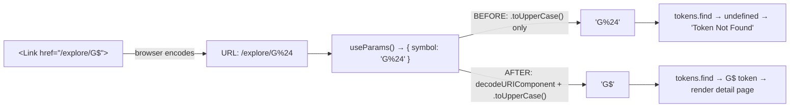

# CRITICAL — Explore token detail breaks for G$ (the project's flagship token)

## Problem

Clicking the "G$" token row on `/explore`, or navigating to its share URL
`http://localhost:3100/explore/G%24`, lands on a "Token Not Found" page even
though G$ is a registered token in `useOnChainMarketData` (it's literally the
GoodDollar protocol's native token).

This is the same break path used when a user hits the "Previous: G$"
pagination button on the ETH detail page (which links to `/explore/G%24`).

### Reproduction

1. `agent-browser open http://localhost:3100/explore`
2. Click row 1 (G$ GoodDollar) — URL becomes `http://localhost:3100/explore/G%24`
3. Page renders:
   - Heading: **"Token Not Found"**
   - Body: `The token "G%24" is not available on GoodDollar L2.`

OR simpler:

```
$ curl -s http://localhost:3100/explore/G%24 | grep -oE 'Token Not Found|G%24' | head -5
Token Not Found
G%24
```

The `$` was URL-encoded into the path (`%24`) — correctly so by both
`<Link>` and the address bar — but the page never decodes it back.

### Root cause

`frontend/src/app/(app)/explore/[symbol]/page.tsx`:

```tsx
import { useParams, useRouter } from 'next/navigation'
// ...
export default function TokenDetailPage() {
  const params = useParams()
  const symbol = (params.symbol as string)?.toUpperCase()   // ← bug
  const { tokens } = useOnChainMarketData()
  const token = tokens.find(t => t.symbol.toUpperCase() === symbol)
  // ...
}
```

Next.js 14's `useParams()` returns the raw URL segment, which for `G$` is
`"G%24"`. We uppercase it but never `decodeURIComponent()`. The lookup
in `useOnChainMarketData` then misses because the registered symbol is
`G$`, not `G%24`.

### Why it matters (CRITICAL)

- G$ is the **flagship native token** of the entire project. The Explore
  page is the primary way users research tokens. If G$'s detail page is
  broken, the "what is GoodDollar" journey is broken.
- The error page is silent about the cause and provides no recovery path
  beyond a generic "Back" button — users see "Token Not Found" for the
  one token they came to learn about.
- Same bug affects any future token whose symbol contains a URL-reserved
  character (e.g., a `$` prefixed memecoin, or names containing `+`, `&`,
  `#`, `?`, `/`).
- The same broken navigation is reachable from at least 3 user paths:
  the Explore table click, the search dropdown click, and the
  prev/next pagination on adjacent token detail pages.

## Acceptance Criteria

- Visiting `http://localhost:3100/explore/G%24` (or `/explore/G$` typed
  directly) renders the G$ token detail page with the correct name,
  symbol, price, description, etc. — NOT "Token Not Found".
- Clicking row 1 (G$) on `/explore` from the table goes to the working
  detail page.
- Clicking the "Previous: G$" pagination on `/explore/ETH` goes to the
  working detail page.
- All existing tokens (ETH, USDC, WBTC, …) continue to work — no
  regression.
- A unit test asserts that `useParams().symbol` is decoded with
  `decodeURIComponent` before lookup, so `'G%24' → 'G$'`.
- All existing Vitest tests still pass.

## Out of Scope

- Refactoring the route to use the token address instead of the symbol
  (would be a larger change; this is just decoding the symbol path
  segment correctly).
- Visual redesign of the "Token Not Found" page.
- Backend / market-data changes — the on-chain `G$` symbol is correct
  in `useOnChainMarketData`; only the route param decoding is broken.

## References

- `frontend/src/app/(app)/explore/[symbol]/page.tsx` — the bug site.
- `frontend/src/lib/useOnChainMarketData.ts` — confirms `'G$'` is a
  valid registered symbol with description and price wiring.
- Next.js docs: [useParams](https://nextjs.org/docs/app/api-reference/functions/use-params)
  — note that segment values are NOT URL-decoded for you.
- Iteration #14 review screenshots: `/tmp/review-iter14/02-token-detail.png`
  (shows the broken state).

---

## Planning (added in iteration #14)

### Overview

`useParams()` in Next.js 14 App Router returns raw URL segments. For `/explore/G%24`,
`params.symbol === "G%24"`, not `"G$"`. The token detail page uppercases the value
and looks it up in `useOnChainMarketData().tokens`, which registers G$ with the
literal symbol `"G$"`. The lookup fails, and the page falls through to the
"Token Not Found" branch. The fix is to `decodeURIComponent()` the segment before
the uppercase + lookup; the same applies to the `tokenIndex` lookup that powers
prev/next pagination.

### Research notes

- **Next.js docs** confirm `useParams()` returns raw segments; the framework
  does NOT auto-decode percent-encoded characters in dynamic params (see
  https://nextjs.org/docs/app/api-reference/functions/use-params).
- `next/link` and `router.push()` DO auto-encode the path on the way out, so
  `<Link href="/explore/G$">` correctly produces `/explore/G%24`. The problem
  is purely on the receiving side.
- `decodeURIComponent("G%24") === "G$"`. It is a no-op for symbols without
  reserved chars, so applying it unconditionally is safe for ETH/USDC/etc.
- `decodeURIComponent` throws on malformed sequences (e.g. lone `%`). We must
  wrap it in a try/catch and fall through to "Token Not Found" on failure,
  rather than crashing the page.
- The same file (`page.tsx`) reads `params.symbol` exactly once at line 59.
  All downstream lookups (`tokens.find`, `tokens.findIndex`) derive from
  the single `symbol` const — so a single decode at the source is enough.
- An existing test at `frontend/src/app/(app)/explore/__tests__/page.test.tsx`
  already mocks `useOnChainMarketData` with a `G$` token and
  `next/navigation`'s `useRouter`. We can extend that pattern by mocking
  `useParams` in a NEW test file for the `[symbol]/page.tsx` route.

### Architecture



### One-week decision: YES

This is a small, surgical fix:
- 1 file changed in production code (`[symbol]/page.tsx`), ~3 lines
  (a try/catch helper + use it once)
- 1 new test file (Vitest + Testing Library) covering both encoded and
  decoded params, and the malformed-input safety case
- No data model, no API, no contract changes; no security surface touched
- Total estimate: ~30 minutes for an experienced TS/Next.js engineer

Verdict: easily fits in one day, let alone one week.

### Implementation plan

1. **RED — write the failing test** (`frontend/src/app/(app)/explore/[symbol]/__tests__/page.test.tsx`):
   - Mock `next/navigation` so `useParams()` returns `{ symbol: 'G%24' }`.
   - Mock `useOnChainMarketData` to register a `G$` token (mirroring the
     existing mock in the sibling `__tests__/page.test.tsx`).
   - Render `TokenDetailPage` and assert the G$ name/description renders
     and that the page does **NOT** contain the string "Token Not Found".
   - Add a second case where `params.symbol === 'G$'` (already-decoded)
     also resolves correctly — defends against double-decoding.
   - Add a third case where `params.symbol === 'BAD%'` (malformed) renders
     the "Token Not Found" page without throwing.
   - Run the test → expect failure on the first assertion.

2. **GREEN — fix the page** (`frontend/src/app/(app)/explore/[symbol]/page.tsx`):
   - Add a small helper near the top of the file:

     ```ts
     function decodeSymbolParam(raw: string | undefined): string {
       if (!raw) return ''
       try {
         return decodeURIComponent(raw).toUpperCase()
       } catch {
         // Malformed percent-encoding — fall through to "not found"
         return raw.toUpperCase()
       }
     }
     ```

   - Replace line 59:

     ```ts
     const symbol = (params.symbol as string)?.toUpperCase()
     ```

     with:

     ```ts
     const symbol = decodeSymbolParam(params.symbol as string | undefined)
     ```

   - Re-run the new test → expect pass.

3. **REGRESSION — re-run the full suite**:
   - `cd frontend && npm test -- --run` → all existing tests still pass.
   - Smoke test in the running app:
     - `agent-browser open http://localhost:3100/explore/G%24` → renders G$.
     - `agent-browser open http://localhost:3100/explore/ETH` → still works.
     - Click "Previous: G$" pagination from `/explore/ETH` → lands on G$.

4. **POLISH — react-doctor + commit**:
   - `npx -y react-doctor@latest . --verbose --diff` → score ≥ 75.
   - `git add -A && git commit -m "fix(explore): decode URL-encoded symbol param so /explore/G$ resolves"`.

### Out of scope (do NOT do in this task)

- Switching the route to use `[address]` instead of `[symbol]` — that's a
  larger refactor with its own SEO/sharing considerations.
- Redesigning the "Token Not Found" page — a separate polish task if needed.
- Touching backend / oracle / on-chain data — none of those are involved.
- Any other URL-encoding bugs elsewhere in the app — separate audit task
  if observed.
