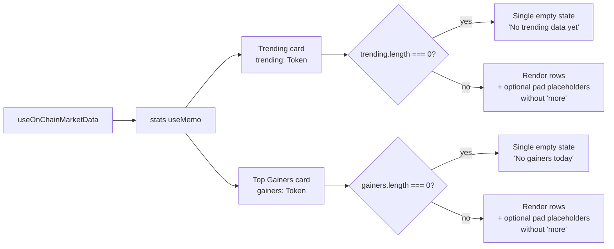

# Explore — Fix duplicate "No more X today" rows when Trending/Top Gainers are fully empty

## Problem

On `/explore`, the **Trending** and **Top Gainers** summary cards render
placeholder rows when there are fewer than 3 entries. In the fully-empty
case (zero entries), this produces three identical italicized rows:

```
1   No more gainers today
2   No more gainers today
3   No more gainers today
```

The word **"more"** is incorrect when zero entries have been shown — it
implies "more, in addition to the ones already listed", but nothing was
listed at all. Showing the same message three times also looks like a
rendering bug to users.

Screenshot evidence: `/tmp/review-iter15/edge-explore.png` (Top Gainers card)
captured during iteration #15 edge-case review on the live frontend
(`http://localhost:3100/explore`).

### Reproduction

1. `agent-browser open http://localhost:3100/explore`
2. Look at the "Top Gainers" summary card in the top-right of the page.
3. When the on-chain market data has no tokens with positive 24h change,
   the card shows three rows: `1 No more gainers today`,
   `2 No more gainers today`, `3 No more gainers today`.

The same bug exists structurally in the "Trending" card (with the message
`No more data`), but is not triggered today because three trending tokens
are always available.

### Root cause

File: `frontend/src/app/(app)/explore/page.tsx`

```tsx
{stats.gainers.length < 3 && Array.from({ length: 3 - stats.gainers.length }).map((_, i) => (
  <div key={`g-e-${i}`} className="flex items-center text-xs text-gray-700 italic py-0.5">
    <span className="w-3 mr-1.5">{stats.gainers.length + i + 1}</span>
    No more gainers today
  </div>
))}
```

The pad-with-placeholders logic doesn't distinguish between "list has
1-2 items, fill the rest" and "list is completely empty, show a single
empty state".

The same pattern is used by the Trending card.

## Acceptance criteria

1. When `stats.gainers.length === 0`, the Top Gainers card renders a
   single empty-state message (e.g. "No gainers today" — without "more"),
   not three duplicated rows.
2. When `stats.gainers.length` is 1 or 2, the existing fill-with-placeholder
   behaviour is preserved with sensible wording (e.g. "No more gainers" for
   the remaining slots) — but the message is **not** rendered three times.
3. The same rules apply to the Trending card (`No more data` → single
   "No data available" message when `stats.trending.length === 0`).
4. No new console errors, no regressions in the existing tests under
   `frontend/src/app/(app)/explore/`.
5. `npx -y react-doctor@latest . --verbose --diff` reports score 75+ for
   the changed file.

## Out of scope

- The underlying reason G$ shows `$0.000000` in the table (the price feed
  is returning zero on-chain — that's a backend / oracle concern outside
  the frontend's reach).
- Sparkline rendering, sorting, search behaviour (untouched here).
- Mobile carousel behaviour (already works).

## Overview

A single React component (`SummaryCards` inside
`frontend/src/app/(app)/explore/page.tsx`) renders three summary cards:
Market Stats, Trending, and Top Gainers. Two of those cards use a
"pad to 3 items" pattern that, when the source list is empty, renders the
same italic empty-state message three times with row numbers 1/2/3.

We need a small, surgical change so that:

- `length === 0` → render exactly one centered empty-state message.
- `length === 1|2` → keep current behaviour (fill remaining slots) but
  drop the row number prefix in the placeholder rows so it doesn't read
  like "missing item 2" and "missing item 3".

## Research notes

- The two affected blocks live inside `cards` (around lines 176–181 for
  Trending and 210–215 for Top Gainers).
- `stats.gainers` and `stats.trending` come from a `useMemo` over
  on-chain market data in the same file — both are normal `Token[]`
  arrays. There's no async/loading flag; an empty array currently means
  "no tokens met the filter."
- No tests reference the literal string `No more gainers today` (verified
  via repo-wide search of `frontend/`), so we can safely change wording.
- React keys: existing rows use `key={t.symbol}` for real entries and
  `key={\`g-e-${i}\`}` / `key={\`t-e-${i}\`}` for placeholders. We'll
  keep that convention.
- Tailwind classes used: `text-xs text-gray-700 italic py-0.5`. Reuse for
  the single empty state so the visual style stays consistent.

## Assumptions

- The frontend dev server (`http://localhost:3100`) is the same one used
  for review screenshots.
- No other component imports or depends on the exact placeholder markup.
- The current empty-state copy ("No more gainers today" / "No more data")
  is not referenced from analytics or i18n keys.

## Architecture diagram



## One-week decision

**YES** — well under one week. This is a single-file edit (~20 lines)
in a leaf React component with no shared state, no API changes, no new
dependencies, and no test infrastructure to add.

## Implementation plan

Phase 1 — Trending card empty state (around lines 160–183):

1. Replace the `{stats.trending.length < 3 && ...}` block with a
   branch:
   - If `stats.trending.length === 0`: render one centered row with
     `No trending data yet` (no leading row number).
   - Else if `< 3`: render `3 - length` placeholder rows using the
     current italic style **but** without the numeric prefix (drop the
     `<span className="w-3 mr-1.5">…</span>` and remove the word "more"
     so the copy reads naturally, e.g. `—`).

Phase 2 — Top Gainers card empty state (around lines 194–217):

1. Mirror the same branch:
   - `gainers.length === 0`: single row `No gainers today`.
   - `gainers.length === 1 | 2`: pad with placeholders that show `—`
     instead of `No more gainers today`.

Phase 3 — Verification:

1. Run `npx -y react-doctor@latest . --verbose --diff` from
   `/home/goodclaw/gooddollar-l2/frontend` (or repo root — match what the
   build-loop does) and ensure score ≥ 75 and no new errors.
2. Manually verify in browser that:
   - Top Gainers with 0 entries shows the single new message.
   - Trending with all 3 entries still renders identically.
3. Commit with message `fix(explore): single empty-state row for Trending and Top Gainers`.

No new tests are required (the existing testing in this area is render
smoke tests; the changed strings aren't asserted anywhere).
