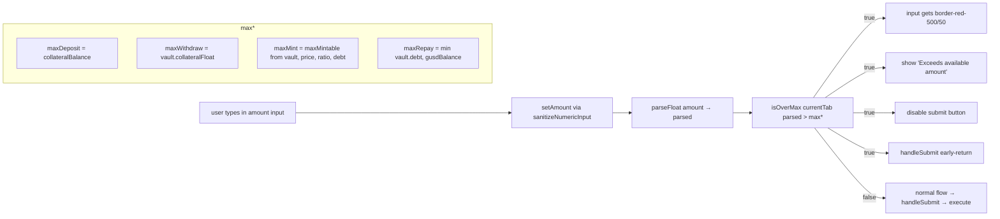

# Stable — Block over-max amounts in VaultPanel before sending tx (deposit/withdraw/mint/repay)

## Problem

On `/stable`, every vault action tab (Deposit, Withdraw, Mint, Repay) lets
users type and submit an amount that exceeds the protocol's safe limit
without **any** client-side guardrail. The submit button stays bright
green and clickable. Pressing it triggers a wallet popup that then
reverts — either at approval time (insufficient balance) or at
contract-call time (insufficient collateral, ratio breach, etc.) — and
the user sees a cryptic wallet error like
`reverted: ERC20: transfer amount exceeds balance` or a vague
`Internal JSON-RPC error`.

This is poor UX: the page already knows the safe upper bound for each
action (it's displayed right under the input as helper text), but it
doesn't enforce it.

The other two action pages we shipped in this initiative already block
this on the client:

- `frontend/src/app/(app)/lend/page.tsx` uses `isOverMax(currentTab)` to
  add a red border on the input, render a `Exceeds available amount`
  message, and disable the submit button.
- `frontend/src/app/(app)/perps/page.tsx` uses `exceedsMargin` to do the
  same for trade size.

`stable/page.tsx` is the only major DeFi panel missing this guard.

### Reproduction

1. `agent-browser open http://localhost:3100/stable` (wallet connected, no
   vault position yet, wallet WETH balance say `0.5`).
2. In the **WETH Vault** card, on the **Deposit** tab, type `999`.
3. The helper text correctly shows `Wallet: 0.5000 WETH`, but the green
   **Deposit** button stays enabled.
4. Click it → wallet popup → user confirms → reverts with
   `ERC20: transfer amount exceeds balance`.
5. Same pattern on **Withdraw** (typing > vault collateral), **Mint**
   (typing > `maxMintable`), and **Repay** (typing > vault debt or > gUSD
   balance).

### Root cause

File: `frontend/src/app/(app)/stable/page.tsx`

The four max values are already computed:

```tsx
const maxDeposit  = collateralBalance
const maxWithdraw = vault ? vault.collateralFloat : 0
const maxMint     = vault ? maxMintable(vault.collateralFloat, price, liquidationRatio, vault.actualDebtFloat) : 0
const maxRepay    = vault ? Math.min(vault.actualDebtFloat, gusdBalance) : 0
```

But nothing in `handleSubmit` or in the button's `disabled` prop checks
them:

```tsx
function handleSubmit(currentTab: StableActionKind) {
  if (currentTab === 'close') { /* … */ return }
  if (!amount || !address) return
  execute(currentTab, ilkKey, amount, ilkMeta.tokenAddress, ilkMeta.decimals)
}

// button
disabled={busy || (currentTab !== 'close' && !amount && phase === 'idle')}
```

`Close Vault` is intentionally exempt (it uses `'0'`).

## Acceptance criteria

1. For `deposit | withdraw | mint | repay` tabs, when the typed amount
   (parsed as a `number`) is strictly greater than the corresponding
   `maxDeposit | maxWithdraw | maxMint | maxRepay`:
   - The amount input gets a red-tinted border (mirror `lend` styling
     `border-red-500/50`).
   - A red helper line appears below the input (replacing or
     supplementing the existing "Wallet/Max/Outstanding" hint) reading
     `Exceeds available amount` (or a clearer per-action wording — see
     plan).
   - The submit button is **disabled** and `handleSubmit` early-returns.
2. `close` tab is **unchanged** (no amount input, uses `'0'`).
3. Typing exactly the max value (e.g. clicking `MAX`) does NOT trigger
   the error state — it stays valid. (Use strict `>` comparison.)
4. Negative or non-finite parses are treated as `0` (no over-max error
   for empty input — the empty-amount case is already covered by the
   existing `!amount` disable).
5. No new console errors, no regression in existing tests (none reference
   `stable/page.tsx` directly — verified via grep across `frontend/`).
6. `npx -y react-doctor@latest . --verbose --diff` reports score ≥ 75 for
   the changed file (target 75+, hard floor 50).
7. The visual feedback matches the existing GoodLend pattern so the two
   pages feel consistent.

## Out of scope

- The `Close Vault` flow (no input — already correct).
- Server-side / contract-level checks (the contract still validates;
  this task is purely UX defense-in-depth).
- Adding a price-impact warning when minting near the liquidation
  ratio (would be a separate task, lower priority).
- Disabling individual tabs when their max is zero (e.g. hiding
  Withdraw when collateral=0) — current UX shows the helper text and
  just relies on this validation to keep the button safe.
- Showing the user's gUSD balance directly inside the panel header
  (the `maxRepay` line already implicitly surfaces it via
  `min(debt, gusdBalance)`).

## Overview

A single React component (`VaultPanel` inside
`frontend/src/app/(app)/stable/page.tsx`) renders the three vault cards
(WETH, G$, USDC), each with five action tabs. Four of those tabs (all
except `close`) currently lack over-max validation.

We add a small `isOverMax(currentTab)` helper that:

1. Computes `parsed = parseFloat(amount) || 0`.
2. Returns the relevant `max*` per tab.
3. Returns `parsed > max` (strict, so MAX click stays valid).

Then we wire the result into:

- The input's border class.
- A red helper line under the input.
- The submit button's `disabled` prop.
- An early-return inside the click handler.

## Research notes

- Two reference implementations already exist in the repo:
  - `frontend/src/app/(app)/lend/page.tsx` lines 252–263 (compute),
    363–373 (input + message), 432 (disabled).
  - `frontend/src/app/(app)/perps/page.tsx` uses `exceedsMargin` with
    the same intent (input error prop + disabled).
- `parseFloat('')` returns `NaN`; coercing with `|| 0` keeps the empty
  case as 0 — that matches what we want (no error message when input
  is blank — that case is already handled by the disabled prop's
  `!amount` clause).
- `sanitizeNumericInput` already prevents most weird inputs (only
  digits / one dot allowed). So we don't need to re-sanitize before
  the `parseFloat`.
- `maxMintable` lives in `@/lib/useGoodStable`. Returns a `number`
  (float). Already imported.
- For `Repay`, the relevant cap is the smaller of the user's gUSD
  balance and the actual debt — `maxRepay` already encodes this.
- Tailwind classes used by Lend page error border: `border-red-500/50`.
  Stable currently uses `border-dark-50` on the input wrapper (line
  252). We add a conditional class.
- Stable's input wrapper currently does NOT have a `border` class on
  the relative wrapper — the border is on the `<input>` itself. So we
  toggle the border class on the input element.
- No tests reference `stable/page.tsx` (verified by repo-wide grep for
  `StablePage` and `VaultPanel`).
- React state: we don't need new state — `isOverMax` derives from
  existing `amount`, `vault`, `price`, `gusdBalance`, `collateralBalance`.

## Assumptions

- The frontend dev server (`http://localhost:3100`) is the same one used
  for review screenshots.
- No analytics events reference the helper-text strings.
- `maxMintable` is purely a UI helper (does not change contract
  behaviour) — true based on `@/lib/useGoodStable` import surface.

## Architecture diagram



## One-week decision

**YES** — well under one week. Single-file edit (~25 lines) in a leaf
React component. No shared state changes, no new dependencies, no
schema/API changes, no test infrastructure. The pattern is already
proven in `lend/page.tsx` and `perps/page.tsx`; we are literally
copy-pasting the structure with the right max accessors.

## Implementation plan

Phase 1 — Add `isOverMax` helper inside `VaultPanel`:

1. After the existing `maxDeposit / maxWithdraw / maxMint / maxRepay`
   block, add:

   ```ts
   const parsedAmount = parseFloat(amount) || 0
   const maxForTab = (currentTab: StableActionKind): number => {
     if (currentTab === 'deposit')  return maxDeposit
     if (currentTab === 'withdraw') return maxWithdraw
     if (currentTab === 'mint')     return maxMint
     if (currentTab === 'repay')    return maxRepay
     return Infinity  // 'close' — no input
   }
   const isOverMax = (currentTab: StableActionKind) =>
     currentTab !== 'close' && parsedAmount > maxForTab(currentTab)
   ```

Phase 2 — Wire it into the input render (around line 246):

1. Make the input className conditional on `isOverMax(currentTab)`:
   - Default: `border border-dark-50`.
   - Over-max: replace `border-dark-50` with `border-red-500/50`.
2. Just after the helper text `div` (line 268), add:

   ```tsx
   {isOverMax(currentTab) && (
     <p className="text-xs text-red-400 mb-3 -mt-1">
       Exceeds available {currentTab === 'mint' || currentTab === 'repay' ? 'gUSD' : cfg.label}
     </p>
   )}
   ```

Phase 3 — Wire it into the submit button:

1. Update the `disabled` prop on the submit button (line 287):

   ```tsx
   disabled={
     busy ||
     (currentTab !== 'close' && !amount && phase === 'idle') ||
     isOverMax(currentTab)
   }
   ```

2. Update `handleSubmit` to early-return on over-max:

   ```ts
   function handleSubmit(currentTab: StableActionKind) {
     if (currentTab === 'close') {
       execute('close', ilkKey, '0', ilkMeta.tokenAddress, ilkMeta.decimals)
       return
     }
     if (!amount || !address) return
     if (isOverMax(currentTab)) return
     execute(currentTab, ilkKey, amount, ilkMeta.tokenAddress, ilkMeta.decimals)
       .then(() => { if (phase === 'done') setAmount('') })
   }
   ```

Phase 4 — Verification:

1. Visual: `agent-browser open http://localhost:3100/stable` with a
   connected wallet. Type an over-max value in each of
   Deposit / Withdraw / Mint / Repay → confirm red border, error
   message, disabled button.
2. Type a valid value → confirm normal styling restored, button
   enabled.
3. Click `MAX` → confirm the input shows the max but is NOT flagged
   (strict `>`).
4. Run `cd frontend && npx -y react-doctor@latest . --verbose --diff`
   → confirm score ≥ 75 for `stable/page.tsx`. Fix any new errors.
5. Run `cd frontend && npx tsc --noEmit` to ensure no type regressions.
6. Commit with message:
   `fix(stable): block over-max amounts in VaultPanel before sending tx`.

No new tests required (existing area has no targeted tests; behaviour
is interactive UX validation already covered by manual verification
across the other DeFi pages with the same pattern).
