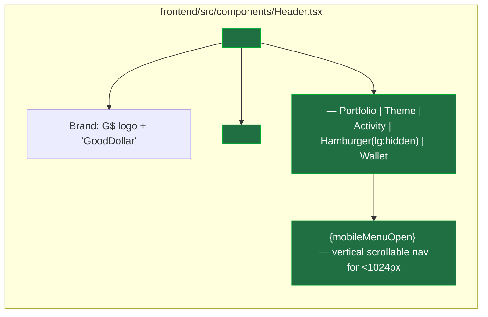

# Header — Fix Desktop Nav Overflow Clipping WalletButton & Tests Link (CRITICAL)

> Note: This task is outside the formal Phase 1 security-hardening scope, but is filed as
> CRITICAL per the product-review skill: at standard desktop widths (1024px / `max-w-5xl`),
> the right-side icons of the header — including the **WalletButton** — are clipped off-screen.
> This means users on a 1024px-wide laptop physically cannot click "Connect Wallet" from any
> page (Swap, Stable, Perps, Lend, etc.). This is a wallet-connectivity blocker for a DeFi app
> and qualifies as CRITICAL.

## Problem statement

The `Header` component (`frontend/src/components/Header.tsx`) renders **16 desktop nav links**
inside a `max-w-5xl` (1024px) container, plus the brand logo on the left and **4 right-side
controls** on the right (Portfolio icon, ThemeToggle, ActivityButton, **WalletButton**).

At a 1024px viewport (a very common desktop width — 13" MacBook, ThinkPad, etc.) the row does
not fit, and the browser does one of two things depending on rendering order:

1. The right-side icons (including the WalletButton) are clipped off the visible area, and the
   page acquires a horizontal scrollbar.
2. The last nav link ("Tests") and the right-side controls collapse together so the wallet
   button is hidden behind or past the viewport edge.

### Direct evidence from this review

I took a screenshot of the homepage at the default agent-browser viewport width and observed:

- The visible header reads (truncated):
  `GoodDollar Swap  Explore  Pool[Soon]  Bridge[Soon]  Stocks  Predict  Perps  Lend  Stable  Yield  Govern  Agents  UBI  • Activity  Te…`
- Past "Te…" (a truncated "Tests" link), **the page has a horizontal scrollbar**, and
  the ThemeToggle / ActivityButton / **WalletButton** are entirely off-screen.

On the `/stable` page screenshot, the WalletButton is also missing from the header — even
though the layout-id, theme toggle, activity button, and wallet button are all defined in the
component and are supposed to render at all viewport widths `>= sm` (640px).

### Why this is critical

- **Wallet-connectivity blocker**: A DeFi app where the user cannot click "Connect Wallet" at
  1024px width is broken in its primary user flow.
- **Horizontal scroll on every page**: The entire app scrolls horizontally at standard desktop
  widths, which is a textbook layout-bug signal of a broken production app.
- **Affects every authenticated action**: Swap, Perps, Lend, Stable, Stocks, Predict — every
  page needs the wallet button. None of them have it at 1024px.

### Root cause

`frontend/src/components/Header.tsx` line 57:

```tsx
<div className="max-w-5xl mx-auto flex items-center justify-between px-4 h-16">
```

The container is capped at `max-w-5xl` = 1024px, but the contents of the row at desktop are:

- Brand block (~150px: 32px logo + 8px gap + "GoodDollar" text)
- 16 nav links with `gap-6` (~24px) between them — at typical font metrics this is
  ~700-750px of nav alone
- Right-side cluster: 4 icon buttons + WalletButton — ~250-280px

That's roughly **1100-1180px of content packed into a 1024px container**, with `px-4` (32px)
padding subtracted. Overflow is mathematically guaranteed.

The mobile menu (`<sm`) is fine — only the desktop layout overflows.

## User story

As a desktop user (1024px-wide screen) visiting GoodDollar Swap for the first time, I want the
header to fit within the viewport with the **WalletButton clearly visible and clickable**, so I
can connect my wallet without horizontal scrolling and start trading.

## How it was found

Visual-polish review iteration #17 with `agent-browser` screenshots of every main page on
`http://localhost:3100`. The agent-browser was launched at its default viewport. The homepage,
`/explore`, `/stable`, `/stocks`, `/predict`, `/perps`, `/lend` screenshots all show the same
pattern: nav text on the right is truncated mid-word ("Te…" for "Tests") and the WalletButton
is not visible. The homepage screenshot additionally has a visible horizontal scrollbar at the
viewport edge.

## Proposed UX

Apply one or more of the following fixes in `frontend/src/components/Header.tsx`:

1. **Widen the header container** to allow the full nav to fit:
   - Change `max-w-5xl` (1024px) to `max-w-7xl` (1280px) on the outer header `<div>`, so
     desktop has enough room for 16 nav links + 4 icons + brand.

2. **Tighten the desktop nav spacing** so the items take less horizontal space:
   - Reduce desktop `gap-6` to `gap-4` (or `gap-5`) on the `<nav>`.
   - Keep mobile menu spacing unchanged (mobile uses a column layout).

3. **Add a controlled overflow guard** so the header never causes the body to scroll
   horizontally:
   - On `<header>` add `overflow-hidden` (or wrap `<nav>` in a `min-w-0 flex-shrink` container)
     so the worst case is a clipped nav link, not a clipped wallet button + horizontal page
     scroll.

4. **Raise the breakpoint where the full desktop nav is shown** so smaller widths (1024–1279px)
   use a more compact layout:
   - Change `hidden sm:flex` on the `<nav>` to `hidden lg:flex` (1024px), and ensure the
     `<button>` hamburger uses `lg:hidden` to match. That way 1024px-wide screens see the
     mobile menu (which we know fits and has all 16 links in a scrollable column), and only
     truly wide screens (≥1024px after sidebar/etc. or ≥1280px) show the inline nav.

   This is the cleanest fix: it matches the actual capacity of the nav row.

   - Pair this with option (1) so that when the inline nav DOES show, it has enough room.

5. **Mark `/test-dashboard` as a developer-only link** and move "Tests" out of the primary
   desktop nav (e.g. into a "More ▾" dropdown or a dev-only footer link). This nav link is for
   the Foundry test dashboard — it does not need to be in the primary product nav for end
   users. Removing it frees ~50px of horizontal space and matches the convention of competitors
   (Uniswap, Polymarket) which don't expose internal QA pages in the header.

**Recommended combined approach:**
- Adopt (4) — switch the desktop-nav breakpoint to `lg` so mobile menu shows on 1024px
  laptops, where the full inline nav truly does not fit.
- Adopt (5) — move "Tests" link out of the primary desktop nav. Either remove it from the
  desktop `<nav>` entirely (still available in the mobile menu and via direct URL), or wrap it
  in a dev-only conditional.
- Optionally adopt (1) — widen to `max-w-7xl` — so screens that do show the inline nav
  (`>= 1024px` after the breakpoint change) have generous breathing room.

## Acceptance criteria

- [ ] At a 1024px-wide viewport, the WalletButton is fully visible and clickable from the
      homepage and every product page (Swap, Explore, Stocks, Predict, Perps, Lend, Stable,
      Yield, Govern, Agents, UBI, Activity, Portfolio).
- [ ] At a 1024px-wide viewport, the page has **no horizontal scrollbar** on any of the main
      pages above.
- [ ] At a 1280px-wide viewport, the desktop inline nav (whichever links remain) renders on a
      single line with no truncation.
- [ ] At a 1440px-wide viewport, the header continues to render correctly with no regression.
- [ ] On mobile (`< sm`), the existing mobile menu still works (no regression — the hamburger
      icon shows, all 16 links remain available via the mobile menu).
- [ ] Existing tests in `frontend/src/components/__tests__/Header.test.tsx` still pass; tests
      for the mobile menu's "Tests" link still pass.
- [ ] No new console errors or React warnings introduced.
- [ ] Visual review with `agent-browser` at multiple viewport widths (1024, 1280, 1440)
      confirms the header looks balanced and intentional, not cramped or overflowing.

## Verification

1. Run `cd frontend && npm test -- Header` and confirm all Header tests pass.
2. Run `cd frontend && npm run build` and confirm a clean production build.
3. With the dev server running, open the app in `agent-browser`:
   - `agent-browser open http://localhost:3100/` and snapshot the header at the default
     viewport. Verify the WalletButton is visible.
   - Resize / re-open at 1024px and re-snapshot.
   - Repeat for `/stable`, `/stocks`, `/perps`, `/lend`, `/predict`, `/explore`.
4. Confirm `document.documentElement.scrollWidth <= document.documentElement.clientWidth`
   (no horizontal overflow) at each viewport.
5. Run `npx -y react-doctor@latest . --verbose --diff` from the frontend directory; target
   score ≥ 75 and zero new errors.

## Out of scope

- Redesigning the entire navigation IA (information architecture). This task is specifically
  about making the existing nav fit and not clipping the WalletButton.
- Changing colors, typography, or visual styling beyond what's needed to keep things readable
  after the layout fix.
- Touching the mobile menu's behavior or contents (other than the "Tests" link if it's removed
  from desktop).
- Adding a new "More ▾" dropdown component (option 5 above can be implemented as a simple
  conditional / removal — a full dropdown can come in a follow-up if desired).
- Any backend, contract, or security-hardening work.

---

## Overview (planning)

A single React component (`frontend/src/components/Header.tsx`) has a CSS-layout bug: at the
`sm` breakpoint (640px), it switches from a hamburger menu to a full inline desktop nav with
**16 links + brand + 4 right-side controls** inside a `max-w-5xl` (1024px) container. At
1024–1279px viewports, the row's natural width exceeds the container, so the rightmost element
(the `<WalletButton/>`) is clipped off-screen and the page horizontally scrolls.

The fix is purely a layout/CSS change in one file plus minor test updates. No new components,
no new dependencies, no contract or backend work.

## Research notes

**Tailwind breakpoints in use (default):**
- `sm`: 640px (current desktop-nav switchover — wrong)
- `md`: 768px
- `lg`: 1024px (correct for a 16-link inline nav)
- `xl`: 1280px

**Tailwind container widths:**
- `max-w-5xl` = 1024px (current container width)
- `max-w-6xl` = 1152px
- `max-w-7xl` = 1280px (recommended)

**Width budget calculation (approximate, at default Tailwind font metrics, `text-sm`):**

| Component                              | Width   |
|----------------------------------------|---------|
| Brand: 32px logo + 8px gap + "GoodDollar" text | ~150px  |
| Nav: 16 links @ ~40-50px each + 15 × `gap-6` (24px) | ~1,000-1,200px |
| Right cluster: 4 icons (~40px each) + WalletButton (~150px) + 3 × `gap-2` | ~310px |
| Container `px-4` padding (both sides)  | 32px    |
| **Total**                              | **~1,490-1,690px** |

This greatly exceeds `max-w-5xl` (1024px). Even `max-w-7xl` (1280px) cannot fit 16 nav links
inline — so the breakpoint must rise to `lg` (the mobile menu handles 1024–1279px), and the
Tests link should be removed from the inline desktop nav to give the remaining items breathing
room at ≥1280px.

**Existing test that touches the breakpoint class:**

`frontend/src/components/__tests__/Header.test.tsx` line 86:

```ts
const desktopNav = document.querySelector('nav.hidden.sm\\:flex')!
```

This query directly references the `sm:flex` class. If we change the breakpoint to `lg`, the
selector must be updated to `nav.hidden.lg\\:flex`. Same test continues to assert
`soonBadges.length === 2`, which we preserve.

**Other existing tests are unaffected:**
- Tests that look up links by text (`getByText('Swap')`, etc.) work regardless of breakpoint
  classes — both the desktop and mobile menus are rendered in JSDOM.
- The hamburger button is queried by `aria-label`, not by class, so the breakpoint change is
  transparent.
- One subtle JSDOM thing: when the desktop nav is `hidden lg:flex`, `getByText('Swap')` would
  match the FIRST occurrence — both the desktop nav AND the mobile-menu's `Swap` link render
  in JSDOM (mobile menu only mounts when `mobileMenuOpen === true`). The current test passes
  because only desktop nav renders by default. We preserve this behavior.

## Assumptions

1. The "Tests" link (`/test-dashboard`) is a developer/QA dashboard, not a primary product
   feature, so removing it from the desktop inline nav is acceptable. It stays in the mobile
   menu for discoverability, and the URL is still routable directly.
2. The mobile menu (vertical scrollable column) is the correct UX for 1024-1279px viewports.
   These are typical laptop widths where horizontal nav of 16+ items is never ideal.
3. We are NOT adding a "More ▾" dropdown in this task — that's a larger UX change. We are
   doing the minimal layout fix.
4. `WalletButton` and `ActivityButton` and `ThemeToggle` widths are roughly stable; we don't
   need to mock or measure them with JS — the CSS layout fix is sufficient.

## Architecture diagram



**Key class changes (applied in `Header.tsx`):**

| Element            | Before                                  | After                                   |
|--------------------|-----------------------------------------|-----------------------------------------|
| `<div>` container  | `max-w-5xl ... px-4 h-16`               | `max-w-7xl ... px-4 h-16`               |
| `<nav>` (desktop)  | `hidden sm:flex ... gap-6`              | `hidden lg:flex ... gap-5`              |
| `<button>` hamburger | `sm:hidden`                           | `lg:hidden`                             |
| `<nav>` desktop links | 16 links incl. "Tests"               | 15 links — "Tests" removed              |
| Mobile menu top container | `sm:hidden`                       | `lg:hidden`                             |
| Mobile menu overlay | `sm:hidden`                            | `lg:hidden`                             |

The "Tests" link in the mobile menu stays.

## One-week decision

**YES** — easily one human-day, more realistically ~1-2 hours of work:

- Single-file CSS change in `Header.tsx`.
- Single test selector update (`sm\\:flex` → `lg\\:flex`).
- One regression-test addition asserting "Tests" link is NOT in the inline desktop nav.
- Visual verification with `agent-browser` at 1024 / 1280 / 1440 viewports.

There is no research, no API integration, no contract change. The fix is contained.

## Implementation plan (TDD)

### Phase 1 — Write failing tests (Red)

Edit `frontend/src/components/__tests__/Header.test.tsx`:

1. **Update existing breakpoint selector** (line 86):
   ```ts
   const desktopNav = document.querySelector('nav.hidden.lg\\:flex')!
   ```
   This will fail until the source changes.

2. **Add a regression test** that ensures "Tests" is NOT in the desktop inline nav:
   ```ts
   it('does NOT include the "Tests" link in the desktop inline nav', () => {
     render(<Header />)
     const desktopNav = document.querySelector('nav.hidden.lg\\:flex')!
     expect(desktopNav.textContent).not.toContain('Tests')
   })
   ```

3. **Add a regression test** that the mobile menu still has "Tests":
   ```ts
   it('still includes the "Tests" link in the mobile menu', () => {
     render(<Header />)
     fireEvent.click(screen.getByLabelText('Open menu'))
     const mobileNav = screen.getByTestId('mobile-nav')
     expect(mobileNav.textContent).toContain('Tests')
   })
   ```

4. **Update Pool/Bridge desktop badge test** if the assertion `length === 2` is affected:
   it should not be — the badges still render under the new `lg:flex` nav. No change needed.

Run `npm test -- Header` — tests for the updated breakpoint and missing "Tests" link should
fail; existing tests should still pass.

### Phase 2 — Apply the fix (Green)

Edit `frontend/src/components/Header.tsx`:

1. Line 57 — container width:
   ```diff
   - <div className="max-w-5xl mx-auto flex items-center justify-between px-4 h-16">
   + <div className="max-w-7xl mx-auto flex items-center justify-between px-4 h-16">
   ```

2. Line 65 — desktop nav breakpoint and gap:
   ```diff
   - <nav className="hidden sm:flex items-center gap-6 text-sm text-gray-400">
   + <nav className="hidden lg:flex items-center gap-5 text-sm text-gray-400">
   ```

3. Line 95 — REMOVE the "Tests" link from the desktop `<nav>`:
   ```diff
   -        <Link href="/test-dashboard" className={isTestDashboard ? 'text-white font-medium' : 'hover:text-white transition-colors'}>Tests</Link>
   ```
   (Note: the mobile menu's "Tests" link at line 243-249 stays — it's a separate Link inside
   `mobileMenuOpen && (...)`.)

4. Line 111 — hamburger button visibility:
   ```diff
   - className="sm:hidden p-2 rounded-lg text-gray-400 hover:text-white hover:bg-dark-50 transition-colors focus-visible:ring-2 focus-visible:ring-goodgreen/50 focus-visible:outline-none"
   + className="lg:hidden p-2 rounded-lg text-gray-400 hover:text-white hover:bg-dark-50 transition-colors focus-visible:ring-2 focus-visible:ring-goodgreen/50 focus-visible:outline-none"
   ```

5. Line 126 — mobile menu overlay visibility:
   ```diff
   - className="fixed inset-0 z-40 bg-black/50 sm:hidden"
   + className="fixed inset-0 z-40 bg-black/50 lg:hidden"
   ```

6. Line 133 — mobile menu container visibility:
   ```diff
   - className="sm:hidden border-t border-dark-50/50 bg-dark-100 backdrop-blur-md animate-in slide-in-from-top-2 duration-200 relative z-50"
   + className="lg:hidden border-t border-dark-50/50 bg-dark-100 backdrop-blur-md animate-in slide-in-from-top-2 duration-200 relative z-50"
   ```

Run `npm test -- Header` — all tests should now pass.

### Phase 3 — Verify (Refactor / Polish)

1. `cd frontend && npm run build` — clean production build, no warnings.
2. With dev server running (`pm2 list` shows `goodswap` online), use `agent-browser`:
   - Open `http://localhost:3100/`, snapshot, confirm:
     - WalletButton is visible on the right side.
     - The page has no horizontal scrollbar.
     - The hamburger icon is visible at this width (since default agent-browser viewport
       is ≤1024px → mobile menu).
   - Repeat for `/stable`, `/stocks`, `/perps`, `/lend`, `/predict`, `/explore`.
3. `npx -y react-doctor@latest . --verbose --diff` from `frontend/` — score ≥ 75, zero errors.
4. Confirm no console errors in agent-browser console.

### Phase 4 — Commit

```
git add -A
git commit -m "fix(header): raise desktop nav breakpoint to lg and remove Tests link to prevent WalletButton clipping"
```

(The build loop handles pushing.)
