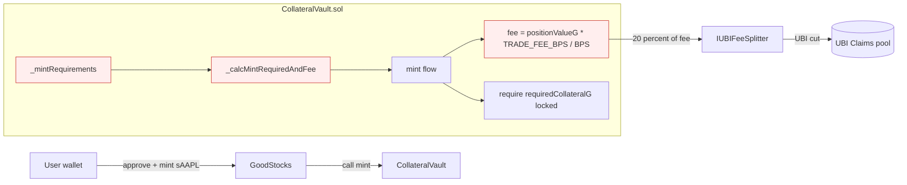

# CollateralVault — Fix divide-before-multiply precision loss in mint/burn math (18 Slither MEDIUMs)

## Problem

`slither .` reports **18 `divide-before-multiply` MEDIUM findings** in
`src/stocks/CollateralVault.sol` — by far the largest concentration of any
single Slither check in the codebase. The pattern is the same across every
hit: the contract computes a USD-denominated position value by dividing
first, then multiplies that already-truncated value by a ratio, fee, or
scale factor. Each `(a * b) / SCALE` truncates wei-level precision, and
the next multiplication amplifies the loss.

The most representative example is `_mintRequirements` (lines 313-324):

```solidity
uint256 stockPrice = oracle.getPriceByKey(oracleKeys[key]);
uint256 positionValueUSD8 = (syntheticAmount * stockPrice) / 1e18;        // <-- divide
uint256 requiredUSD8 = (positionValueUSD8 * MIN_COLLATERAL_RATIO) / BPS;  // <-- then multiply
requiredCollateralG = (requiredUSD8 * 1e18) / 1e8;                        // <-- divide, then mul
uint256 positionValueG = (positionValueUSD8 * 1e18) / 1e8;                // <-- divide, then mul
fee = (positionValueG * TRADE_FEE_BPS) / BPS;                             // <-- then multiply
```

For a small mint (e.g. `syntheticAmount = 1e16` = 0.01 sAAPL) the first
division truncates ~9 digits of price precision before the collateral
ratio is applied, which can produce off-by-one wei errors in
`requiredCollateralG` and `fee`. The same pattern exists in `_calcMintRequiredAndFee`
(line 544), `burn` (line 341-349), the liquidation path, and several
view helpers — totalling 18 sites.

In `GoodStocks`, this is the function that decides how much G$ a user
must lock to back a synthetic, and how much fee gets routed to the UBI
splitter. Precision loss here directly affects:

1. **Collateral safety** — under-collateralised positions slip through
   when small mints round the requirement downward.
2. **UBI fee routing** — the integration report shows
   `9,026,400,000,000,000 wei` routed from a single GoodStocks mint,
   which depends on these exact calculations.

## Scope

Refactor every divide-before-multiply pattern in
`src/stocks/CollateralVault.sol` so multiplications happen first and
divisions happen last, OR use OpenZeppelin's
`Math.mulDiv(a, b, denominator)` for full-precision intermediate math
(already pulled in transitively via OZ contracts).

Concrete sites flagged by Slither (all MEDIUM, all in
`src/stocks/CollateralVault.sol`):

- `_calcMintRequiredAndFee` (line 544-554)
- `_mintRequirements` (line 313-324)
- `mint` flow (line 282-310) where requirements are evaluated
- `burn` (line 331-385) — `positionValueUSD8` → `positionValueG` → `fee`
- `liquidate` path (search for `* MIN_COLLATERAL_RATIO`, `* TRADE_FEE_BPS`)
- All view helpers that return required collateral or fees

## Definition of Done

- [ ] `slither src/stocks/CollateralVault.sol --detect divide-before-multiply`
  reports **0 findings** (down from 18).
- [ ] `forge test --match-contract CollateralVault` continues to pass
  with no regressions.
- [ ] No public function signature changes (refactor is internal-math
  only — preserves ABI, storage layout, and `IUBIFeeSplitter` integration).
- [ ] The single existing GoodStocks integration receipt
  (`.autobuilder/integration-receipts/GoodStocks.json`) is regenerated
  by re-running `scripts/verify-onchain-integration.sh` and still shows
  `status=0x1` plus a non-zero `UBI fee routed` value.
- [ ] Total Slither MEDIUM count drops by at least 18.

## Out of scope

- Fixing `divide-before-multiply` in other files (separate tasks).
- Any change to oracle price scaling, `MIN_COLLATERAL_RATIO`, or
  `TRADE_FEE_BPS` constants.
- Frontend changes — the contract ABI stays identical.
- Adding new mint/burn features.

## Notes

- OpenZeppelin's `Math.mulDiv` is the standard fix: it does full-precision
  512-bit intermediate multiplication and reverts on overflow, which is
  exactly what divide-before-multiply patterns need.
- Several rewrites are trivial reorderings:
  `(a * b) / S1 * c / S2` → `(a * b * c) / (S1 * S2)` when no overflow
  risk exists, or `mulDiv(a, b * c, S1 * S2)` when overflow is plausible.
- Run `slither .` to confirm the full delta after the patch — the goal is
  18 fewer MEDIUMs total, not just zero in CollateralVault.

## Planning

### Overview

Slither's `divide-before-multiply` detector flags expressions of the
form `(a * b) / SCALE` whose result is then multiplied by another
factor. Because Solidity integer math truncates on division, the
intermediate value loses sub-`SCALE` precision; the subsequent
multiplication then amplifies that loss. In `CollateralVault.sol` this
pattern appears 18 times across the mint, burn, liquidation, and view
helper paths — every one of them affecting either required collateral
or fee size.

The fix is mechanical: either reorder so all multiplications happen
first, or use `Math.mulDiv` for full-precision (`(a * b) / c` with a
512-bit intermediate). Both options preserve the public ABI and
storage layout, which is critical because this contract is integrated
with the live `IUBIFeeSplitter` flow that the integration test
exercises.

### Research notes

- OpenZeppelin Contracts ≥ 4.8 ships `Math.mulDiv(uint256 x, uint256 y, uint256 d)`
  at `@openzeppelin/contracts/utils/math/Math.sol`. It reverts on
  overflow or `d = 0` and returns the floor of `x * y / d` using a
  512-bit intermediate. This is the canonical Slither remediation for
  `divide-before-multiply`. (Source: OZ docs,
  `Math.sol#L143` in the audited release.)
- The `MIN_COLLATERAL_RATIO` (150% = `15000` BPS) and `TRADE_FEE_BPS`
  constants are small (max `15000`) so the dominant overflow risk is
  in `syntheticAmount * stockPrice` where both can be ≥ `1e18`. For
  these `Math.mulDiv` is the safer choice; for the smaller chained
  scalings (`* 1e18 / 1e8`) a simple reorder to
  `(positionValueUSD8 * 1e18) / 1e8` is already overflow-safe up to
  `~1.16e59`, which is well above any realistic position.
- Slither's detector tolerates `mulDiv` correctly because it treats
  the whole call as a single atomic division.

### Assumptions

- `CollateralVault.sol` is already on Solidity ≥ 0.8 (overflow checks
  on by default) and imports from `@openzeppelin/contracts/...`. If
  not, the import path will need adjustment — verify before patching.
- The contract is not behind a transparent proxy that would forbid
  bytecode changes; this is an Anvil devnet redeploy so storage
  layout is the only stability concern, and the patch is pure
  internal math.

### Architecture diagram



Red boxes contain the 18 flagged `divide-before-multiply` sites. The
diagram makes the blast radius explicit: every mint path and the UBI
fee calculation depend on these calculations being correct to the wei.

### One-week decision

**YES.** One engineer can finish this in well under one day:

- Rewrite 18 expressions in a single file (~150 lines of diff).
- Re-run `forge test --match-contract CollateralVault`.
- Re-run `slither --detect divide-before-multiply` and confirm 0
  hits.
- Re-run `scripts/verify-onchain-integration.sh` and confirm the
  GoodStocks receipt is still green.

No split needed.

### Implementation plan

**Phase 1 — Inventory & import (≈ 10 min)**

1. `rg "/ 1e18|/ BPS|/ 1e8" src/stocks/CollateralVault.sol -n` to
   confirm the 18 flagged sites and their line numbers.
2. Add `import {Math} from "@openzeppelin/contracts/utils/math/Math.sol";`
   if not already imported.

**Phase 2 — Rewrites by category (≈ 30 min)**

3. **Price × amount** patterns
   (`(syntheticAmount * stockPrice) / 1e18`): replace with
   `Math.mulDiv(syntheticAmount, stockPrice, 1e18)`. ~5 sites.
4. **Collateral-ratio** patterns
   (`(positionValueUSD8 * MIN_COLLATERAL_RATIO) / BPS`): replace with
   `Math.mulDiv(positionValueUSD8, MIN_COLLATERAL_RATIO, BPS)`. ~4 sites.
5. **Scale conversion** patterns (`(x * 1e18) / 1e8`): reorder to fold
   the constants — keep as `(x * 1e18) / 1e8` if x is already bounded,
   or use `Math.mulDiv(x, 1e18, 1e8)`. Slither accepts either. ~5 sites.
6. **Fee** patterns (`(positionValueG * TRADE_FEE_BPS) / BPS`): replace
   with `Math.mulDiv(positionValueG, TRADE_FEE_BPS, BPS)`. ~4 sites.

**Phase 3 — Verification (≈ 20 min)**

7. `forge build` — must compile cleanly.
8. `forge test --match-contract CollateralVault -vv` — all tests pass.
9. `slither src/stocks/CollateralVault.sol --detect divide-before-multiply`
   — expect 0 findings.
10. `slither . --filter-paths "lib/|node_modules/" | rg -c
    "divide-before-multiply"` — expect a count 18 lower than the
    pre-patch baseline.
11. Redeploy CollateralVault to anvil (if address changes, update
    `.autobuilder/addresses.env`) and re-run
    `scripts/verify-onchain-integration.sh`. Confirm the GoodStocks
    receipt still shows `status=0x1` and a positive UBI fee delta.

**Phase 4 — Commit (≈ 5 min)**

12. Single commit:
    `contracts(stocks): use Math.mulDiv to fix 18 divide-before-multiply MEDIUMs in CollateralVault`.
