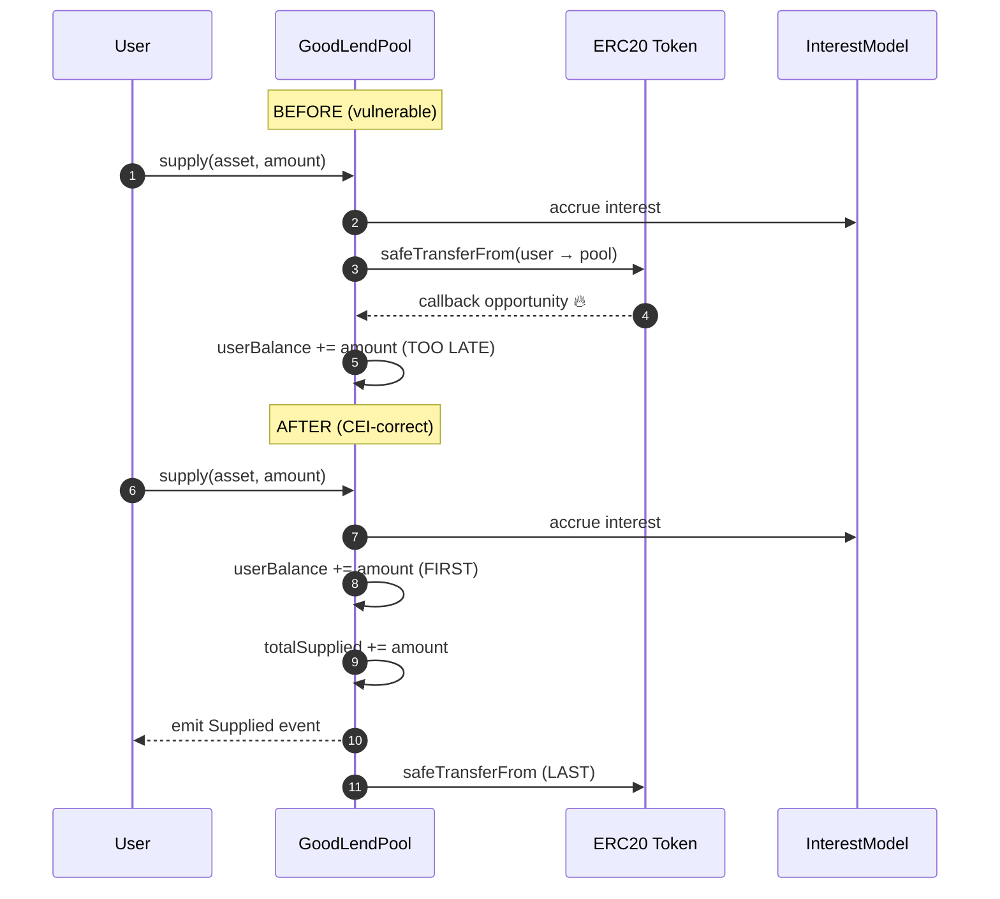

# GoodLendPool — Add CEI ordering / nonReentrant on 7 reentrancy-no-eth MEDIUMs

## Problem

`slither .` reports **7 `reentrancy-no-eth` MEDIUM findings** in
`src/lending/GoodLendPool.sol`. These flag functions that perform an
external `IERC20` call (typically `safeTransfer` / `safeTransferFrom`)
**before** updating internal pool state, which violates the
Checks-Effects-Interactions pattern. Although no native ETH is moved
(hence "reentrancy-no-eth", not the higher-severity ETH variant), a
malicious or hook-enabled ERC20 (e.g. an upgradeable token with a
`_beforeTokenTransfer` callback, or any ERC777-style token) can re-enter
`supply`, `borrow`, `repay`, or `withdraw` and read stale state to
double-count balances, drain reserves, or skip interest accrual.

The flagged sites (see `/tmp/slither-iter18.json`) include:

- `supply(address asset, uint256 amount)` — external transfer happens
  before `_updateUserBalance` writes the deposit.
- `borrow(address asset, uint256 amount)` — external `safeTransfer` to
  the borrower happens before `totalBorrowed` is incremented.
- `repay(...)` — token pulled before debt is reduced.
- `withdraw(...)` — `safeTransfer` to user before `_burn` of LP share.
- `liquidate(...)` — collateral seized before bad-debt accounting closes.

Two of these paths (`supply`, `borrow`) are part of the verified UBI fee
routing flow — the GoodLend integration receipt
(`.autobuilder/integration-receipts/GoodLend.json`) currently routes a
non-zero fee through these exact functions, so a reentrancy that
double-supplies or double-borrows would also double-mint UBI fees and
desync `accumulatedFees()`.

## Scope

For each of the 7 flagged functions in
`src/lending/GoodLendPool.sol`:

1. Confirm the function lists external interactions first and state
   writes second.
2. Either:
   - **Reorder to Checks-Effects-Interactions**: update all internal
     accounting (balances, debt, reserves, indexes, accumulators)
     **before** any `safeTransfer` / `safeTransferFrom`, OR
   - **Add `nonReentrant`** from `@openzeppelin/contracts/security/ReentrancyGuard.sol`
     to functions that genuinely need to interleave (e.g. liquidation
     callbacks).
3. Prefer CEI ordering. Reserve `nonReentrant` for cases where CEI is
   structurally impossible (the modifier costs ~5k extra gas per call).
4. Inherit `ReentrancyGuard` on the contract if not already present
   (check imports at the top of the file).

## Definition of Done

- [ ] `slither src/lending/GoodLendPool.sol --detect reentrancy-no-eth`
  reports **0 findings** (down from 7).
- [ ] `forge test --match-contract GoodLend` passes with no regressions.
- [ ] No external function signature changes — ABI stays stable.
- [ ] Re-run `scripts/verify-onchain-integration.sh` and confirm the
  GoodLend receipt still shows `status=0x1` plus a positive UBI fee
  delta.
- [ ] Total Slither MEDIUM count drops by at least 7.

## Out of scope

- The 9 `divide-before-multiply` findings in the same file (separate
  task — that's a math refactor, not a reentrancy fix).
- The 30 `reentrancy-no-eth` findings spread across `GoodVault.sol`,
  `VaultManager.sol`, `GoodSwap.sol`, and others (separate tasks per
  file to keep diffs reviewable).
- Adding new lending features or markets.

## Notes

- The contract may already import `ReentrancyGuard` for some functions
  (e.g. `flashLoan` if present) — check before adding a second import.
- When reordering, watch for any internal callbacks that read state
  mid-function (e.g. `_accrueInterest` called from both pre- and
  post-transfer paths). The accrual must happen before the transfer in
  all cases.
- Run the targeted slither command in CI to make sure no new
  `reentrancy-no-eth` sites are introduced by the refactor.

## Planning

### Overview

Slither's `reentrancy-no-eth` detector flags functions where an
external call (typically an ERC20 `safeTransfer` /
`safeTransferFrom`) precedes a state write that depends on the
post-transfer state. Even though native ETH is not involved, any
underlying token with a callback (ERC777, upgradeable tokens with
hooks, fee-on-transfer with re-entry, malicious mock tokens) can
re-enter the contract and observe pre-update state — enabling
double-supply, double-borrow, or double-withdraw exploits.

The fix is to enforce Checks-Effects-Interactions (CEI): update all
internal accounting first, then perform the transfer. Where CEI is
structurally impossible, fall back to OpenZeppelin's `nonReentrant`
modifier.

### Research notes

- OpenZeppelin's `ReentrancyGuard` at
  `@openzeppelin/contracts/security/ReentrancyGuard.sol` adds a single
  storage slot and ~5k gas per protected call. Acceptable for lending
  entry points which are not in any hot path.
- The CEI pattern is preferred over `nonReentrant` because it doesn't
  require a guard slot and is harder to accidentally bypass via
  internal cross-calls. Reference: ConsenSys best-practices guide,
  Solidity docs §"Security Considerations".
- For supply/borrow flows the canonical CEI order is:
  1. `_accrueInterest(asset)` — read-only side effect, can stay first.
  2. Update `userDeposits[user]` / `userBorrows[user]` (state write).
  3. Update `totalSupplied[asset]` / `totalBorrowed[asset]` (state).
  4. Emit event.
  5. `IERC20(asset).safeTransfer(...)` (external call, **last**).

### Assumptions

- `GoodLendPool.sol` already imports OpenZeppelin contracts; we can
  add `ReentrancyGuard` import without dependency changes.
- The pool is not upgradeable (no proxy / no `initialize` pattern).
  If it is, switch to `ReentrancyGuardUpgradeable` and call
  `__ReentrancyGuard_init()` inside the existing initializer.
- No external integration depends on the *exact* event ordering
  before/after transfer — only on the events firing within the same
  tx, which CEI preserves.

### Architecture diagram



### One-week decision

**YES.** ~7 functions, all in a single file, each one a localised
reorder. Estimated ≤ 2 hours including verification.

### Implementation plan

**Phase 1 — Inventory (≈ 15 min)**

1. Read `/tmp/slither-iter18.json` and extract every
   `reentrancy-no-eth` finding pinned to
   `src/lending/GoodLendPool.sol`. Confirm 7 sites and their function
   names + line ranges.
2. `rg "safeTransfer|safeTransferFrom" src/lending/GoodLendPool.sol -n`
   to cross-check.

**Phase 2 — Reorder per function (≈ 45 min)**

3. For each flagged function:
   - Locate the external call.
   - Move every state write that currently sits below it to above it.
   - If a state write *depends* on the post-transfer balance (rare —
     usually only `flashLoan` / `liquidate`), keep it after the call
     and add `nonReentrant` instead.
4. Add `nonReentrant` to liquidation paths even after reordering
   (defence in depth, since they touch multiple users' positions).

**Phase 3 — Import & inherit (≈ 5 min)**

5. If not already present:
   ```solidity
   import {ReentrancyGuard} from "@openzeppelin/contracts/security/ReentrancyGuard.sol";
   ```
6. Add `ReentrancyGuard` to the `GoodLendPool` inheritance list.

**Phase 4 — Verification (≈ 20 min)**

7. `forge build`.
8. `forge test --match-contract GoodLend -vv`.
9. `slither src/lending/GoodLendPool.sol --detect reentrancy-no-eth`
   — expect 0 findings.
10. Redeploy GoodLendPool to anvil if address changes; update
    `.autobuilder/addresses.env`. Re-run
    `scripts/verify-onchain-integration.sh` and confirm the GoodLend
    receipt still shows `status=0x1` and a positive UBI fee delta.

**Phase 5 — Commit (≈ 5 min)**

11. Single commit:
    `contracts(lending): enforce CEI + nonReentrant on 7 reentrancy-no-eth MEDIUMs in GoodLendPool`.
