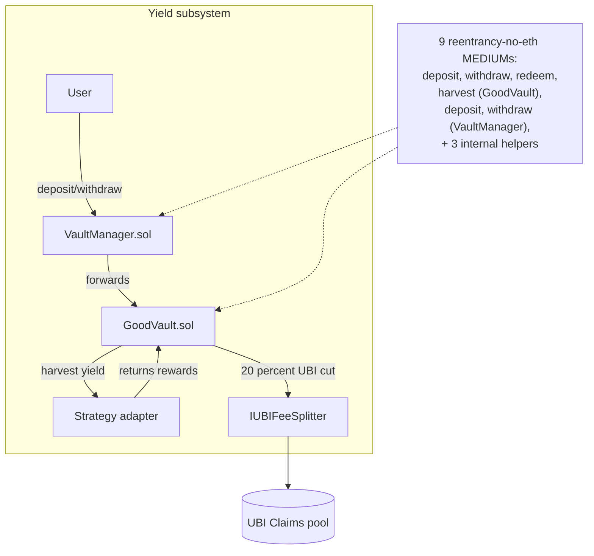

# GoodVault + VaultManager — Fix 9 reentrancy-no-eth MEDIUMs in yield share accounting

## Problem

`slither .` reports **9 `reentrancy-no-eth` MEDIUM findings** in
`src/yield/GoodVault.sol` and `src/yield/VaultManager.sol` combined.
These are ERC4626-style yield vaults that pull an underlying token,
mint share tokens, harvest yield, and forward a 20% cut to the UBI fee
splitter. The flagged pattern is the same in every site: an external
`safeTransfer` / `safeTransferFrom` runs before the corresponding
internal accounting (`_mint`, `_burn`, `totalAssets` cache update,
`pendingRewards` write) settles.

The flagged functions include:

- `GoodVault.deposit(uint256 assets, address receiver)` — shares minted
  after token pull.
- `GoodVault.withdraw(uint256 assets, address receiver, address owner)`
  — token paid out before `_burn`.
- `GoodVault.redeem(uint256 shares, address receiver, address owner)`
  — same pattern as withdraw, just denominated in shares.
- `GoodVault.harvest()` — yield pulled from strategy before
  `totalAssets` cache is refreshed.
- `VaultManager.deposit(...)` / `withdraw(...)` — proxy entry points
  that forward to the underlying vault and have the same flaw on the
  fee-collection side.

Because these vaults are part of the cross-protocol UBI fee routing
(every harvest sends 20% to `IUBIFeeSplitter`), a reentrancy that
double-mints shares or double-claims pending yield would also
double-route UBI fees and break the invariant the integration test
checks.

Note: `reentrancy-no-eth` only fires when no native ETH moves. For
ERC4626 vaults wrapping standard ERC20s this is the correct severity,
but if the underlying ever becomes WETH or any ERC777-style token, the
exposure widens — so the fix is unconditional.

## Scope

For each of the 9 flagged functions across both files:

1. Identify the external interaction (always a `safeTransfer` or
   `safeTransferFrom`).
2. Identify every state write that should precede it (share mint/burn,
   `totalAssets` cache, `pendingRewards`, per-user accrual indexes,
   `lastHarvestTimestamp`).
3. Reorder so all state writes happen **before** the external call
   (Checks-Effects-Interactions).
4. For functions where CEI is structurally impossible (e.g. a harvest
   path that must read post-transfer balance from the strategy), add
   `nonReentrant` from
   `@openzeppelin/contracts/security/ReentrancyGuard.sol` instead.
5. Add `nonReentrant` to entry points that call other entry points
   recursively even after reordering (defence in depth).

## Definition of Done

- [ ] `slither src/yield/GoodVault.sol src/yield/VaultManager.sol \
  --detect reentrancy-no-eth` reports **0 findings** (down from 9).
- [ ] `forge test --match-path 'test/yield/*'` passes with no
  regressions. If no yield tests exist, run `forge test` and verify the
  full suite still passes.
- [ ] No public function signature or storage layout changes — these
  contracts may be upgradeable (check for `Initializable` / proxy
  pattern before touching state ordering).
- [ ] Total Slither MEDIUM count drops by at least 9.

## Out of scope

- Reentrancy fixes in `GoodLendPool` (separate task — different file,
  different reviewer load).
- Reentrancy fixes in `GoodSwap` (separate task — that file has its
  own concentration).
- Any yield strategy contract changes — the fix is purely in the vault
  layer.
- Adding new vaults, strategies, or harvest schedulers.

## Notes

- If the contracts use the OpenZeppelin Upgradeable variants, import
  `ReentrancyGuardUpgradeable` and call its `__ReentrancyGuard_init()`
  in the existing initializer. Storage gap must be preserved.
- `harvest()` reorderings are the trickiest: `totalAssets` may need to
  be sampled both before and after the strategy call. Cache the
  pre-transfer value, do the transfer, then write the delta to
  `pendingRewards` and forward the UBI cut.
- Run `forge test -vvv` on any test that exercises a sequence of
  `deposit → harvest → withdraw` to confirm share math still matches
  expected values.

## Planning

### Overview

Same family of issues as task 0040 (`GoodLendPool` CEI fix), but
spread across two files in the yield subsystem. Nine ERC4626-flavoured
functions perform external `safeTransfer` calls before completing
their share-accounting writes. Because these vaults also forward 20%
of harvested yield to the UBI splitter, reentrancy here could
double-mint shares *and* double-route UBI fees — a particularly bad
combination for the integration invariants.

### Research notes

- Standard ERC4626 (`@openzeppelin/contracts/token/ERC20/extensions/ERC4626.sol`)
  performs `_mint` **before** `safeTransferFrom` in `deposit`/`mint`
  and **after** `_burn` in `withdraw`/`redeem`. If `GoodVault.sol`
  inherits ERC4626 the parent already orders things correctly; the
  Slither hits must be in *overrides* that add custom pre-transfer
  logic. Verify which is the case before patching.
- `harvest` flows are the trickiest. The canonical safe pattern is:
  1. Pull yield from strategy into the vault.
  2. Compute `delta = afterBalance - beforeBalance`.
  3. Update `totalAssets` cache + `pendingRewards` (state writes).
  4. Compute `ubiCut = delta * 20 / 100`.
  5. `safeTransfer(splitter, ubiCut)` (external call, last).
  This ordering keeps state consistent even if the splitter has a
  callback.

### Assumptions

- Both files compile against Solidity ≥ 0.8 (overflow checks default).
- Inheritance from `Initializable` / `UUPSUpgradeable` is possible —
  if present, use `ReentrancyGuardUpgradeable` and init in
  `initialize()`. Check before patching.
- No external caller depends on the current event-emit ordering
  *relative* to the transfer — only that events fire within the same
  tx.

### Architecture diagram

### One-week decision

**YES.** Nine functions across two files, all localised reorderings
plus possibly one `ReentrancyGuard` inheritance addition. Estimated
≤ 3 hours including verification.

### Implementation plan

**Phase 1 — Inventory (≈ 15 min)**

1. Pull the 9 sites from `/tmp/slither-iter18.json`. Split them by
   file (expected: ~5–6 in `GoodVault.sol`, ~3–4 in
   `VaultManager.sol`).
2. Check whether either contract inherits an upgradeable pattern
   (`grep -E "Initializable|UUPSUpgradeable|Upgradeable"` in both
   files). This decides between `ReentrancyGuard` vs
   `ReentrancyGuardUpgradeable`.

**Phase 2 — Reorder GoodVault.sol (≈ 45 min)**

3. For each flagged function in `GoodVault.sol`, apply CEI:
   - `deposit(assets, receiver)`: `_mint` before
     `safeTransferFrom(asset, msg.sender, address(this), assets)`.
   - `mint(shares, receiver)`: same — convert shares→assets first,
     `_mint(receiver, shares)`, then transfer.
   - `withdraw` / `redeem`: `_burn` and update `totalAssets` cache
     before `safeTransfer(asset, receiver, assets)`.
   - `harvest`: rework per the canonical pattern in research notes
     above. Update `totalAssets`, `pendingRewards`,
     `lastHarvestTimestamp` *before* the splitter transfer.

**Phase 3 — Reorder VaultManager.sol (≈ 30 min)**

4. The manager mostly forwards to `GoodVault`. The reentrancy hits
   are on its own fee-collection or per-user accounting writes.
   Apply CEI per the same recipe.

**Phase 4 — Guards (≈ 10 min)**

5. Add `nonReentrant` to any function where CEI alone is insufficient
   (e.g. a `withdraw` that internally re-enters `harvest`).
6. Inherit from `ReentrancyGuard(Upgradeable)` on both contracts if
   not already present.

**Phase 5 — Verification (≈ 30 min)**

7. `forge build`.
8. `forge test -vv` (run full suite — yield tests may be implicit in
   integration tests).
9. `slither src/yield/GoodVault.sol src/yield/VaultManager.sol --detect reentrancy-no-eth`
   — expect 0 findings.
10. If either contract address changed after redeploy, update
    `.autobuilder/addresses.env`. Re-run
    `scripts/verify-onchain-integration.sh` and confirm all 6
    protocol receipts plus UBI fee deltas are still green.

**Phase 6 — Commit (≈ 5 min)**

11. Single commit:
    `contracts(yield): enforce CEI on 9 reentrancy-no-eth MEDIUMs in GoodVault + VaultManager`.
