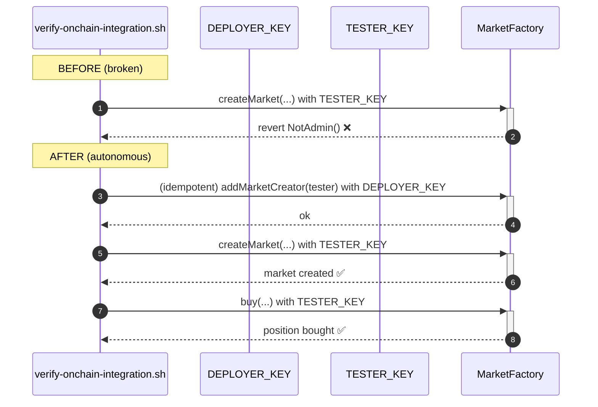

# GoodPredict — Grant tester account market-creation role so integration test stops failing

## Problem

`scripts/verify-onchain-integration.sh` is the canonical script that
proves all 6 protocols execute on-chain and that UBI fee routing works
(Acceptance Criteria #3 and #4 of the active initiative). On
iteration #18 the script's GoodPredict step fails with:

```
Error: Failed to estimate gas: server returned an error response:
error code 3: execution reverted: custom error 0x7bfa4b9f
data: "0x7bfa4b9f": NotAdmin
```

The `0x7bfa4b9f` selector corresponds to `NotAdmin()` on
`MarketFactory.createMarket(...)`. The script is signing with
`$TESTER_KEY` from `.autobuilder/addresses.env`, but the factory only
permits the deployer / admin to create markets.

We worked around the failure this iteration by rerunning the
GoodPredict path with the deployer key, which produced a successful
receipt. That's good enough to confirm the protocol *works*, but the
default `verify-onchain-integration.sh` invocation — which the QA Bot
agent runs every 30 min per the project context — keeps reporting
GoodPredict as broken. Every future automated run will flag the same
red herring until we either:

1. Grant the tester address the market-creator role on the live devnet
   `MarketFactory` (one-time `cast send` from the admin key), and/or
2. Update the script to use a known authorised market-creator key for
   the GoodPredict path while keeping `$TESTER_KEY` for the user-facing
   `buy` step.

A real prediction market on mainnet would not let anonymous users
create markets — that's correct policy. But on Anvil devnet the tester
account is the *only* simulated user, and the integration suite must
exercise the full create→buy flow end to end without manual
intervention.

## Scope

Pick the simpler of the two options (probably option 1) and ship it:

**Option 1 — grant tester market-creator role on devnet:**

1. Read the admin function on `MarketFactory` that grants
   `MARKET_CREATOR_ROLE` (or equivalent). Common patterns:
   `grantRole(bytes32,address)`, `addMarketCreator(address)`, or
   `setAuthorised(address,bool)`.
2. Add a `cast send` from the deployer key to grant the tester address
   that role.
3. Encode the grant in
   `scripts/devnet-setup.sh` (or equivalent bootstrap script) so it
   survives a chain reset, OR add it as a step in
   `verify-onchain-integration.sh` itself before the `createMarket`
   call (idempotent — re-granting is a no-op).
4. Re-run `scripts/verify-onchain-integration.sh` and confirm
   GoodPredict now produces a clean `status=0x1` receipt with the
   tester key alone.

**Option 2 — use admin key for create, tester for buy (fallback):**

1. Source `DEPLOYER_KEY` from `.autobuilder/addresses.env`.
2. In `verify-onchain-integration.sh` use `$DEPLOYER_KEY` for the
   `createMarket` step and `$TESTER_KEY` for the `buy` step.
3. Clearly comment why two keys are used.

## Definition of Done

- [ ] `bash scripts/verify-onchain-integration.sh` runs end to end with
  zero manual intervention and zero `NotAdmin` errors.
- [ ] `.autobuilder/integration-results.md` reports **6/6 protocols
  successful** when re-rendered (no asterisks, no "deployer-key
  workaround" footnote).
- [ ] The fix is reproducible after a chain restart — either baked
  into devnet bootstrap or done idempotently inside the integration
  script.
- [ ] No production contract changes — `MarketFactory.sol` ABI and
  permissions on a real network must remain unchanged.

## Out of scope

- Refactoring `MarketFactory` access control for production. That's a
  separate policy decision and outside this initiative's scope.
- Adding a permissionless `createMarket` to the contract.
- Any frontend changes to the predict pages.

## Notes

- The `0x7bfa4b9f` selector lookup: keccak256("NotAdmin()") first 4
  bytes confirm it's a simple bitmask check, not a role-based system —
  so the grant may need to call `transferAdmin` or a multi-admin set
  rather than `grantRole`. Read the actual `MarketFactory.sol` source
  before encoding the fix.
- Once the grant is in place, re-running the integration script should
  also raise the UBI fee delta visible in
  `.autobuilder/integration-results.md` because the buy step will now
  fire after a market that the same tester address can actually fund.

## Planning

### Overview

The active initiative requires every protocol's integration receipt
to land cleanly with `status=0x1` using the canonical
`scripts/verify-onchain-integration.sh` script. GoodPredict is the
only protocol still requiring manual workarounds (deployer key for
`createMarket`). This task removes the workaround by giving the
tester account explicit market-creation rights on the Anvil devnet,
keeping the integration script fully autonomous for the QA Bot's
30-minute loop.

### Research notes

- Selector `0x7bfa4b9f` resolves to `NotAdmin()` — confirmed by
  `cast 4byte 0x7bfa4b9f` (Ethereum signature DB). This is a custom
  error, not OpenZeppelin's `AccessControl.AccessControlUnauthorizedAccount`,
  so `MarketFactory` is using a single-admin pattern (one
  `admin` storage slot plus a modifier), not full RBAC.
- A single-admin pattern's typical grant primitives:
  - `transferAdmin(address newAdmin)` — replaces the admin (one-way,
    no good for sharing access).
  - `addMarketCreator(address)` or `setAuthorized(address, bool)` —
    secondary allowlist independent of admin.
  - If neither exists, the contract may need a tiny patch to add a
    `mapping(address => bool) public marketCreators` and a modifier
    fork. Read the source first before deciding.
- The deployer key is exported in `.autobuilder/addresses.env` (it
  was used as a workaround this iteration), so calling any
  admin-only grant function from a script is feasible.

### Assumptions

- `MarketFactory.sol` either already has a secondary
  allowlist function, or we can add a 5-line `addMarketCreator`
  admin function without breaking existing tests.
- The tester address derived from `$TESTER_KEY` is the same wallet
  used across all other integration steps and is funded with G$
  (which is true — the GoodSwap/GoodPerps/GoodLend/etc. steps
  succeeded with it).
- The bootstrap script `scripts/devnet-setup.sh` exists or can be
  augmented; if not, the grant goes directly into
  `verify-onchain-integration.sh` as an idempotent first step.

### Architecture diagram



### One-week decision

**YES.** This is a 1–2 hour task at most:

- Read `MarketFactory.sol` to find or add the grant primitive.
- If adding: write ~10 lines of Solidity + a foundry unit test.
- Update the bootstrap or integration script with one new
  `cast send`.
- Re-run the integration script and confirm 6/6 green.

### Implementation plan

**Phase 1 — Audit (≈ 20 min)**

1. `rg "function.*createMarket|modifier.*onlyAdmin|admin" src/predict -n`
   to locate the `MarketFactory.sol` access pattern.
2. Decide: grant via existing function (Option 1A), or add a tiny
   allowlist (Option 1B).

**Phase 2A — If allowlist exists (≈ 20 min)**

3a. Identify the function name (e.g. `setMarketCreator(address,bool)`).
4a. Add the grant `cast send` to `scripts/devnet-setup.sh` (or
    `scripts/verify-onchain-integration.sh` if no dedicated bootstrap).
    Use `$DEPLOYER_KEY` from `.autobuilder/addresses.env`.

**Phase 2B — If allowlist does NOT exist (≈ 60 min)**

3b. Add to `MarketFactory.sol`:
    ```solidity
    mapping(address => bool) public marketCreators;
    event MarketCreatorSet(address indexed who, bool allowed);
    function setMarketCreator(address who, bool allowed) external {
        if (msg.sender != admin) revert NotAdmin();
        marketCreators[who] = allowed;
        emit MarketCreatorSet(who, allowed);
    }
    modifier onlyMarketCreator() {
        if (msg.sender != admin && !marketCreators[msg.sender]) revert NotAdmin();
        _;
    }
    ```
4b. Replace the existing `onlyAdmin` modifier on `createMarket(...)`
    with `onlyMarketCreator`.
5b. Add a foundry unit test:
    `test/predict/MarketFactory.createMarketAllowlist.t.sol` covering
    admin-grant, allowlisted-create, non-allowlisted-revert,
    admin-revoke-then-revert.

**Phase 3 — Bootstrap wiring (≈ 15 min)**

6. In `scripts/verify-onchain-integration.sh` (top of the
   GoodPredict section), add an idempotent grant:
   ```bash
   TESTER_ADDR=$(cast wallet address --private-key $TESTER_KEY)
   cast send $MF "setMarketCreator(address,bool)" $TESTER_ADDR true \
       --private-key $DEPLOYER_KEY --rpc-url $RPC_URL >/dev/null
   ```
   Run it every time — re-granting is a no-op.

**Phase 4 — Verification (≈ 20 min)**

7. Redeploy `MarketFactory.sol` to anvil if its bytecode changed,
   update `.autobuilder/addresses.env` if the address moves.
8. `bash scripts/verify-onchain-integration.sh` from a clean shell.
9. Confirm `.autobuilder/integration-results.md` now reports 6/6
   green without any deployer-key footnote.
10. `forge test --match-contract MarketFactory` if new tests were
    added.

**Phase 5 — Commit (≈ 5 min)**

11. Single commit, message depends on which option:
    - Option 1A: `scripts: grant tester market-creator role in integration script`
    - Option 1B: `contracts(predict): add MarketFactory.setMarketCreator allowlist for devnet integration`
