# Layout — Fix RainbowKit `[data-rk]` Wrapper Collapsing Page Width Site-Wide (CRITICAL)

> Note: This task is outside the formal Phase 1 security-hardening scope, but is filed as
> CRITICAL per the product-review skill: a single CSS-layout bug in a third-party provider
> wrapper (`<div data-rk="">` injected by `RainbowKitProvider`) is shrinking the visible
> content width of **every** page in the app, in some cases by 70%. Pages look like a narrow
> mobile column even on a 1440px desktop. This is a visually broken state that warrants a
> CRITICAL fix before any other polish work.

## Problem statement

`RainbowKitProvider` (from `@rainbow-me/rainbowkit`) wraps its children with an
auto-injected `<div data-rk="">` that has **no width styling**. This wrapper sits between
our outer flex container (`PageTransition`'s `flex flex-col items-center w-full`) and the
page content. Because the page content uses `w-full` inside a `max-w-5xl` container, and
because the parent flex container uses `align-items: center` (from `items-center`), the
unstyled `[data-rk]` wrapper shrinks to its **intrinsic content width** instead of expanding
to its parent's available width.

This means the inner `<div className="w-full max-w-5xl mx-auto">` of every page does NOT
get the 1024px (`max-w-5xl`) width it asks for — it gets whatever narrower width the
collapsing `[data-rk]` parent allows.

### Direct evidence — measured on the live deployment

I measured `[data-rk]` width vs. its parent's available width on `goodswap.goodclaw.org`
in iteration #19 with `agent-browser eval`. Default agent-browser viewport gave a `<main>`
width of ~1425px in every case. `[data-rk]` widths were:

| Page              | `[data-rk]` width | `<main>` width | Wasted horizontal space |
|-------------------|-------------------|----------------|--------------------------|
| `/` (landing)     | **460px**         | 1425px         | ~68% of viewport unused  |
| `/portfolio`      | **419px**         | 1393px         | ~70% of viewport unused  |
| `/swap`           | **460px**         | (n/a)          | ~68% of viewport unused  |
| `/perps`          | **930px**         | 1393px         | ~33% of viewport unused  |
| `/lend`           | **1103px**        | 1393px         | ~21% of viewport unused  |
| `/stable`         | **1024px**        | 1393px         | ~26% of viewport unused  |
| `/stocks`         | **959px**         | 1393px         | ~31% of viewport unused  |
| `/predict`        | **988px**         | 1393px         | ~29% of viewport unused  |
| `/explore`        | **895px**         | 1393px         | ~36% of viewport unused  |

The `<main>` element correctly spans the full viewport. The `PageTransition` wrapper
underneath also takes the full viewport width. But **as soon as the DOM enters
`<div data-rk="">` from `RainbowKitProvider`, the width collapses to whatever the inner
content needs**. A page like `/portfolio` that uses three small summary cards inside a
`max-w-5xl` container ends up only 419px wide — visually appearing as a narrow phone column
floating in a sea of empty desktop space.

### Where the bug lives in the React tree

```
<body class="font-sans min-h-screen flex flex-col">
  <Providers>                                   ← QueryClient + ThemeProvider only (no RainbowKit)
    <Header />
    <UBIBanner />
    <main id="main-content" class="flex-1 flex flex-col items-center px-4 pt-8 pb-12">
      <PageTransition>                          ← <motion.div class="flex-1 flex flex-col items-center w-full">
        {children}                              ← children for the (app)/ route group
      </PageTransition>
    </main>
  </Providers>
</body>
```

For `(app)/*` routes, `children` is `<WalletProviders>{pageContent}</WalletProviders>`,
where `WalletProviders` renders:

```tsx
<WagmiProvider config={config}>
  <RainbowKitProvider theme={...}>
    <WalletReadyContext.Provider value={true}>
      {children}                                 ← page content (e.g., portfolio, swap)
    </WalletReadyContext.Provider>
  </RainbowKitProvider>
</WagmiProvider>
```

Internally, `RainbowKitProvider` wraps its children in a `<div data-rk="">` that injects the
RainbowKit CSS-variable theme (`--rk-colors-*`, `--rk-fonts-*`, etc.) and renders a `<style>`
block. **This auto-injected `<div>` has no `width`, no `display: flex`, no `align-self`** —
it's just a plain block-level element. But its parent (`PageTransition`'s `motion.div`) is
a flex container with `align-items: center`, which makes child elements without explicit
width/align-self collapse to their intrinsic content width.

For the landing page (`/`), `LandingSwapCard` also wraps with its own `WalletProviders`, so
the same bug applies — the swap card section is squeezed to 460px even though there's room
for 1425px.

### Why this is critical

- **Every product page is visually broken**: Portfolio at 419px wide looks like a mobile
  phone column adrift on a 1440px desktop. Perps, Stocks, Predict, Explore all leave 30–36%
  of the viewport blank for no reason.
- **Confuses users about supported viewport widths**: A user on a 1440px laptop sees content
  that looks like it belongs on a 480px phone — the page appears either malformed or
  designed for some completely wrong viewport.
- **Defeats the existing `max-w-5xl` design intent**: Pages explicitly request 1024px
  containers but only get whatever the RainbowKit wrapper grudgingly grants.
- **Affects every page, not a single component**: This is sitewide, not isolated to one
  feature. A single fix unblocks visual polish across the whole app.

### Root cause

`RainbowKitProvider` from `@rainbow-me/rainbowkit` always renders an extra
`<div data-rk="">` wrapper to scope its CSS variables. The element has no width or display
defaults. Inside our `flex flex-col items-center` parent, the cross-axis (`align-items`)
defaults to `stretch` only when child has no explicit dimensions and no margin auto — but
`items-center` overrides this to `center`, which shrinks children to intrinsic width.

This is a known pattern with theme-scoping wrappers from third-party libs: they assume the
host app uses block layout, not centered flex.

## User story

As a desktop user (1440px-wide screen) visiting `/portfolio` (or any product page), I want
the page content to actually fill the intended `max-w-5xl` (1024px) container width so the
layout looks like a professional production app rather than a narrow column floating in
empty space.

## How it was found

Visual-polish review iteration #19 with `agent-browser` screenshots of every main page on
`https://goodswap.goodclaw.org`. The `/portfolio` screenshot at 1265px viewport showed
three "Connect wallet" placeholder cards squeezed into roughly the left third of the page
with the rest of the viewport blank. A DOM trace via
`agent-browser eval` traced the parent of the page's outermost styled `<div>` and found
`<div data-rk="">` collapsing to 419px wide in a 1393px parent. Repeating the measurement
across all `(app)` pages plus the landing page (which mounts `WalletProviders` for the
`LandingSwapCard`) confirmed the bug is sitewide.

## Proposed UX

Fix in **one of two surgical ways** — both are minimal one-file changes:

### Option A (preferred) — Add a global CSS rule for `[data-rk]`

In `frontend/src/app/globals.css`, add:

```css
/*
 * RainbowKit injects an unstyled <div data-rk=""> wrapper around children. When that
 * wrapper sits inside a flex container with `align-items: center` (our PageTransition),
 * it collapses to its intrinsic content width, shrinking pages site-wide. Force it to
 * take the full available width so our `max-w-5xl` (and similar) page containers work.
 */
[data-rk] {
  width: 100%;
  display: flex;
  flex-direction: column;
  flex: 1 1 auto;
}
```

This is preferred because:
- It's a one-place global fix — no React component restructure.
- It targets the third-party wrapper directly without touching `WalletProviders.tsx`
  semantics.
- If RainbowKit ever changes the wrapper element name or removes it, the rule simply
  becomes a no-op.

### Option B — Wrap children in `WalletProviders.tsx` with our own full-width container

In `frontend/src/components/WalletProviders.tsx`, change:

```tsx
<WalletReadyContext.Provider value={true}>{children}</WalletReadyContext.Provider>
```

to:

```tsx
<WalletReadyContext.Provider value={true}>
  <div className="w-full flex flex-col flex-1">{children}</div>
</WalletReadyContext.Provider>
```

This adds an explicit width-asserting wrapper of our own. The `[data-rk]` parent still
collapses, but our inner div forces its own width to the full available space. This is
slightly less elegant because it adds an extra DOM node we control, but it has the same
effect.

**Recommendation: Option A.** It's strictly less code, requires no JS/JSX changes, and works
even if `WalletProviders.tsx` is restructured.

## Acceptance criteria

- [ ] On `/portfolio` at a 1440px-wide viewport, the page's `<div className="w-full
      max-w-5xl mx-auto">` container renders at exactly 1024px wide (or the viewport width
      minus padding, whichever is smaller).
- [ ] On `/portfolio` at a 1024px-wide viewport, the same container renders at the viewport
      width minus padding (no horizontal collapse).
- [ ] On `/perps`, `/lend`, `/stable`, `/stocks`, `/predict`, `/explore`, `/swap`, the
      `[data-rk]` wrapper takes 100% of its parent's width, not its intrinsic content
      width.
- [ ] On `/` (landing) the `LandingSwapCard` section's `[data-rk]` wrapper also takes 100%
      of its parent's width.
- [ ] No new horizontal scrollbar introduced on any page.
- [ ] Existing layout-sensitive components (Header, UBIBanner, LandingFooter) render
      identically — they live OUTSIDE the `[data-rk]` wrapper and are not affected.
- [ ] `frontend/src/components/__tests__/*` test suite still passes with no regressions.
- [ ] No new console errors, no React warnings, no Axe a11y errors introduced.

## Verification

1. `cd frontend && npm test` — full Jest suite passes.
2. `cd frontend && npm run build` — clean production build with no new warnings.
3. With dev server running (`pm2 list` shows `goodswap` online), use `agent-browser`:
   - Open each of `/`, `/portfolio`, `/swap`, `/perps`, `/lend`, `/stable`, `/stocks`,
     `/predict`, `/explore`.
   - For each page, run:
     ```js
     agent-browser eval "(()=>{const rk=document.querySelector('[data-rk]'); return JSON.stringify({rk: Math.round(rk.getBoundingClientRect().width), parent: Math.round(rk.parentElement.getBoundingClientRect().width)})})()"
     ```
     Expected: `rk` width equals `parent` width on every page.
   - Take a screenshot of `/portfolio` and confirm the three summary cards span the full
     `max-w-5xl` (1024px) region rather than huddling in a 419px column.
4. `npx -y react-doctor@latest . --verbose --diff` from the frontend directory — score ≥ 75
   and zero new errors.
5. Confirm `document.documentElement.scrollWidth <= document.documentElement.clientWidth`
   (no horizontal overflow) at every viewport.

## Out of scope

- Redesigning page layouts to use a different max-width than `max-w-5xl`. This task is
  specifically about restoring the intended `max-w-5xl` width that pages already declare.
- Replacing `RainbowKitProvider` with a different wallet UI library. The `[data-rk]`
  wrapper is RainbowKit's intentional theme-scope mechanism; we just need it to behave
  correctly inside flex parents.
- Changing the `PageTransition` flex layout. `items-center` is the correct horizontal
  centering for the page; the bug is the unstyled child, not the container.
- Any backend, contract, or security-hardening work.
- Other observed visual issues (Predict featured-market duplication, Perps chart-height
  mismatch, Lend metric-card alignment, Stable wallet-button alignment, Explore data
  inconsistency) — those are tracked as separate tasks in subsequent iterations.

---

## Planning

### Research notes

- **RainbowKit's `<div data-rk="">` wrapper**: Confirmed present in current
  `@rainbow-me/rainbowkit` builds — the provider auto-injects this `<div>` to scope its
  CSS variables (e.g., `--rk-colors-*`, `--rk-fonts-*`). The wrapper has `display: block`
  by default and **no width style** (verified via DOM trace on
  `goodswap.goodclaw.org` in iteration #19 — see "Direct evidence" table in problem
  statement above).
- **Why the collapse happens**: The wrapper is a child of `PageTransition`'s
  `motion.div` which is `flex flex-col items-center w-full`. Flex children **do not**
  default to `align-self: stretch` in the cross-axis when the parent uses
  `align-items: center` — they shrink to their intrinsic content width. Result: the
  `[data-rk]` div hugs whatever its largest descendant requests, ignoring our
  `max-w-5xl` page containers.
- **Where it leaks**: Two places mount `WalletProviders` (the file that renders
  `RainbowKitProvider`):
  1. `frontend/src/app/(app)/layout.tsx` — wraps every `(app)` route group page.
  2. `frontend/src/components/LandingSwapCard.tsx` — wraps the swap card on the
     landing page (`/`).
- **Fix locality**: A single CSS rule in `frontend/src/app/globals.css` targeting
  `[data-rk]` reaches both mount points without code changes. It's also resilient — if
  RainbowKit removes the wrapper in a future version, the rule becomes a no-op.
- **No conflicting global rules**: Searched `globals.css` and `tailwind.config.ts` for
  any existing `[data-rk]` selector — none found. Safe to add.
- **Tailwind utility alternative considered**: We could pass `className` to
  `RainbowKitProvider` via its `__className` extension, but this is undocumented and
  fragile across versions. CSS attribute selector is preferred.
- **No risk of horizontal overflow**: `width: 100%` on a flex child fills the parent's
  cross-axis without exceeding it (the parent already has `px-4` outer padding via
  `<main>`). Verified mentally; will verify in browser during execution.

### Architecture diagram

```mermaid
flowchart TD
  A["&lt;body class='font-sans min-h-screen flex flex-col'&gt;"] --> B[Providers&nbsp;&#40;Query+Theme&nbsp;only&#41;]
  B --> C[Header]
  B --> D[UBIBanner]
  B --> E["&lt;main class='flex-1 flex flex-col items-center px-4'&gt;"]
  E --> F["PageTransition&nbsp;&#40;motion.div, flex flex-col items-center w-full&#41;"]
  F --> G{Route&nbsp;type}
  G -->|"&#40;app&#41;/* routes"| H[WalletProviders]
  G -->|"/ landing"| I[Landing&nbsp;page&nbsp;content]
  I --> J[LandingSwapCard]
  J --> K[WalletProviders]
  H --> L["RainbowKitProvider&nbsp;&#40;injects &lt;div data-rk=''&gt;&#41;"]
  K --> L
  L --> M["&lt;div data-rk=''&gt;&nbsp;\u2190&nbsp;BUG: collapses to intrinsic width"]
  M --> N["Page content with max-w-5xl mx-auto"]
  style M fill:#fee,stroke:#c33,color:#c33
  style L fill:#fff7e6,stroke:#e69500
```



**Fix injects ONE CSS rule** that styles `[data-rk]` to `width:100%; display:flex;
flex-direction:column; flex:1 1 auto;`. No JSX or component restructure.

### One-week decision

**YES** — a single human can complete this in well under one week. Realistic estimate:
**30–60 minutes** total, including:
- 5 min: Add the CSS rule to `globals.css`.
- 10 min: Verify with `agent-browser` on each of the 9 affected pages.
- 5 min: Run `react-doctor` and confirm no regressions.
- 10 min: Run `npm test` and confirm tests pass.
- 10 min: Run `npm run build` and confirm clean build.
- 5–10 min: Commit, update README.

Rationale: this is a one-line CSS addition with no code paths, no migrations, no schema
changes, no tests to update. The verification surface is large (9 pages) but each check is
fast.

### Implementation plan

**Phase 1 — Add the CSS rule (5 min):**

1. Open `frontend/src/app/globals.css`.
2. Append the rule from "Option A" (preferred) in the proposed UX section above:
   ```css
   /*
    * RainbowKit injects an unstyled <div data-rk=""> wrapper around children. Inside our
    * <PageTransition> flex container (`align-items: center`) it collapses to its intrinsic
    * content width, shrinking pages site-wide. Force it to fill the available width so
    * page-level `max-w-5xl` containers work as intended.
    */
   [data-rk] {
     width: 100%;
     display: flex;
     flex-direction: column;
     flex: 1 1 auto;
   }
   ```

**Phase 2 — Verification (15 min):**

3. Restart the dev server if needed (or rely on Tailwind/Next hot reload).
4. With `pm2 list` showing `goodswap` online, run `agent-browser eval` on each of `/`,
   `/portfolio`, `/swap`, `/perps`, `/lend`, `/stable`, `/stocks`, `/predict`, `/explore`:
   ```js
   (function(){const rk=document.querySelector('[data-rk]'); return JSON.stringify({rk: Math.round(rk.getBoundingClientRect().width), parent: Math.round(rk.parentElement.getBoundingClientRect().width)})})()
   ```
   Expected: `rk` width equals `parent` width on every page (within 1px tolerance).
5. Take a screenshot of `/portfolio` and confirm three summary cards span ~1024px (or the
   viewport width minus padding, whichever is smaller).
6. Confirm no horizontal scrollbar appeared:
   ```js
   document.documentElement.scrollWidth <= document.documentElement.clientWidth
   ```

**Phase 3 — Test + build (15 min):**

7. `cd frontend && npm test` — full Jest suite passes.
8. `cd frontend && npm run build` — clean production build, no new warnings.
9. `npx -y react-doctor@latest . --verbose --diff` — score ≥ 75 and zero new errors.

**Phase 4 — Commit + README (10 min):**

10. Update README.md "Updated:" date and (if applicable) any visual-polish stats.
11. `git add -A && git commit -m "frontend(layout): force [data-rk] wrapper to full width to fix sitewide collapse"`.

### Risks / mitigations

- **Risk**: A descendant inside `[data-rk]` was implicitly relying on the wrapper being
  intrinsic-width (e.g., a centering trick). **Mitigation**: Visual check on all 9 pages
  catches this. If found, narrow the selector to e.g. `body > [data-rk], [data-rk]:has(main)`
  or scope only to `.app-shell [data-rk]`.
- **Risk**: New horizontal scrollbar on a page that previously was OK. **Mitigation**:
  scrollWidth check in Phase 2 step 6 catches this.
- **Risk**: RainbowKit changes wrapper element/attribute in future upgrade.
  **Mitigation**: Comment in CSS explains the intent; if rule becomes a no-op it does no
  harm.
