# Predict — Don't Render the Featured Hero Market Twice (Hide Duplicate from Grid)

> Note: This task is outside the formal Phase 1 security-hardening scope, but is filed
> per the product-review skill: it is a clear visual-polish bug observed in iteration #19's
> visual review of the Predict page.

## Problem statement

On `/predict`, the highest-volume active market is rendered **twice** on the same page:

1. Once at the top as the `<FeaturedMarket />` hero card (large card with sparkline,
   "Trending" badge, and big Yes/No buttons).
2. Again, immediately below, in the active-markets grid as a regular `<MarketCard />`.

This happens because `FeaturedMarket` picks the top-volume active market from `allMarkets`,
but the grid below renders **every** active market in `filtered` (which includes the same
market). There is no exclusion of the featured market from the grid.

In `frontend/src/app/(app)/predict/page.tsx` (around line 395 and 446–453):

```tsx
<FeaturedMarket markets={allMarkets} />

{/* ... filters ... */}

{activeMarkets.length > 0 && (
  <div className="mb-2">
    <p className="text-xs text-gray-500 mb-3 font-medium">
      {activeMarkets.length} Active {activeMarkets.length === 1 ? 'Market' : 'Markets'}
    </p>
    <div className="grid grid-cols-1 sm:grid-cols-2 lg:grid-cols-3 gap-4">
      {activeMarkets.map(market => (
        <MarketCard key={market.id} market={market} />   {/* includes the featured one */}
      ))}
    </div>
  </div>
)}
```

`FeaturedMarket` (line 209–213) computes `featured` internally:

```tsx
const featured = useMemo(() => {
  const active = markets.filter(m => getMarketStatus(m.endDate) !== 'expired')
  if (active.length === 0) return null
  return active.reduce((top, m) => m.volume > top.volume ? m : top, active[0])
}, [markets])
```

The `featured` market id is never exposed to the parent, so the parent has no way to
exclude it from the grid.

### Why this looks bad

- A professional production app never shows the same market twice in the same view.
- Users see the same question, the same Yes/No price, the same volume number, the same
  sparkline trend back-to-back.
- The "Active Markets" count (e.g. "5 Active Markets") is also mathematically misleading
  because it includes the duplicate.
- It makes the page feel buggy/unpolished, especially when there are only 2–3 markets
  total — then the same market dominates 50% of the visible viewport.

### Visual evidence

iteration #19 visual-polish screenshot of `/predict` shows the featured market
"Will GoodDollar reach $0.01 by end of 2025?" rendered as both:
- The full-width hero card at the top (large green Yes/No buttons, sparkline on the right).
- The first card in the grid below (smaller version of the same card).

Same id, same question, same percentages, just different visual sizes.

## User story

As a user browsing prediction markets, when I see a "Trending" hero market at the top of
the page, I expect the markets grid below to show **other** markets I haven't already seen
in the hero — not a duplicate of it.

## How it was found

Visual-polish review iteration #19. Confirmed by reading
`frontend/src/app/(app)/predict/page.tsx` lines 209–213 (FeaturedMarket selects the
top-volume active market) and lines 446–453 (grid renders every active market with no
exclusion of the featured id).

## Proposed UX

Make `FeaturedMarket` callable in a way that lets the parent know which market id was
chosen, then filter that id out of the grid below. Two clean approaches — both are
small, surgical changes:

### Option A (preferred) — Lift "featured selection" into the parent

In `predict/page.tsx`:

1. Compute `featured` in the parent next to `activeMarkets`/`expiredMarkets`:
   ```tsx
   const featured = useMemo(() => {
     const active = allMarkets.filter(m => getMarketStatus(m.endDate) !== 'expired')
     if (active.length === 0) return null
     return active.reduce((top, m) => m.volume > top.volume ? m : top, active[0])
   }, [allMarkets])

   const featuredId = featured?.id

   const activeMarketsWithoutFeatured = useMemo(
     () => activeMarkets.filter(m => m.id !== featuredId),
     [activeMarkets, featuredId],
   )
   ```
2. Pass the chosen featured market down: `<FeaturedMarket market={featured} />`.
3. Render the grid with `activeMarketsWithoutFeatured` instead of `activeMarkets`.
4. Update the count line: `"{activeMarketsWithoutFeatured.length} More Active Market(s)"`
   (or keep "Active Markets" but use the deduplicated count).

Update `FeaturedMarket` to accept a single `market: PredictionMarket | null` instead of
the full `markets` array. This keeps the component simpler and makes the "featured
selection" decision live in one place (the parent) instead of being implicit.

### Option B — Pass `excludeId` to the grid

Keep `FeaturedMarket` as-is, but expose its chosen id via a callback or by re-running the
same selection logic in the parent (less DRY than Option A, and easy to drift). Then
filter the grid:

```tsx
const activeMarketsWithoutFeatured = useMemo(
  () => activeMarkets.filter(m => m.id !== featuredId),
  [activeMarkets, featuredId],
)
```

**Recommendation: Option A.** Only one component knows the featured-market selection rule.
Easier to test. Easier to read.

## Acceptance criteria

- [ ] On `/predict`, the market shown in the `<FeaturedMarket />` hero card is **not**
      also rendered in the active-markets grid below.
- [ ] The "Active Markets" count above the grid reflects the deduplicated number
      (i.e. `total active markets - 1` when a featured exists, or `total active markets`
      when no featured exists).
- [ ] When there is only 1 active market, the grid does **not** render an empty section
      heading; either skip the grid section entirely or show it with a clear empty state
      ("No more active markets — see the featured one above").
- [ ] When there are 0 active markets, no `<FeaturedMarket />` is rendered (existing
      behavior — `FeaturedMarket` already returns `null` in that case).
- [ ] Expired markets section is unaffected — still renders all expired markets.
- [ ] Search/filter/category logic continues to work: if the user filters or searches such
      that the featured market is no longer in `filtered`, the grid still does the right
      thing (i.e. the featured stays at top regardless of filter, but the dedup logic
      uses the same `featured.id` to exclude from the grid).
- [ ] No new console errors, no React warnings, no Axe a11y errors introduced.
- [ ] Existing `frontend/src/app/(app)/predict/__tests__/*.test.tsx` tests still pass.

## Verification

1. `cd frontend && npm test` — full Jest suite passes.
2. `cd frontend && npm run build` — clean production build with no new warnings.
3. With dev server running (`pm2 list` shows `goodswap` online), use `agent-browser`:
   - Open `/predict`.
   - Confirm the featured market's question is rendered exactly once on the page (run
     `document.body.innerText.split(featuredQuestion).length - 1` and expect `1`).
   - Confirm the count text matches `activeMarketsWithoutFeatured.length` rather than
     `activeMarkets.length`.
4. `npx -y react-doctor@latest . --verbose --diff` from the frontend directory — score ≥ 75
   and zero new errors.

## Out of scope

- Redesigning `FeaturedMarket` visual style.
- Changing the rule for which market is "featured" (still: highest-volume active market).
- Introducing per-user personalization of the featured choice.
- Any backend, contract, or security-hardening work.
- Other visual issues observed in iteration #19 — those have separate tasks.

---

## Planning

### Research notes

- **Confirmed source location**: `frontend/src/app/(app)/predict/page.tsx`. The
  `FeaturedMarket` component is defined around lines 205–311 and computes its featured
  market via `useMemo` from the passed `markets` array using a reducer that picks the
  highest `volume` active market. The `PredictPage` component renders
  `<FeaturedMarket markets={allMarkets} />` and then separately maps `activeMarkets`
  through `<MarketCard />` in a 3-column responsive grid (lines 446–453).
- **No callback or shared state currently exists** to inform the parent which market
  was selected as featured, so the parent has no way to filter it out today.
- **Filter / search / category logic** lives in the parent (`activeMarkets` is derived
  from a filtered list). Featured selection is also based on `allMarkets` (the
  unfiltered set), which means the featured market may not be in the filtered grid
  even today — so the dedup logic must be tolerant of "featured not in grid" already.
- **Tests**: `frontend/src/app/(app)/predict/__tests__/` contains existing tests for
  the page. They will need spot-checks (not necessarily updates) after the refactor.
- **Component API change is local**: `FeaturedMarket` currently accepts
  `markets: PredictionMarket[]` and computes the featured internally. Lifting selection
  to the parent and changing the prop to `market: PredictionMarket | null` is a clean
  boundary change with one call site.
- **No other consumers** of `FeaturedMarket` outside this page (verified via grep).

### Architecture diagram

```mermaid
flowchart LR
  subgraph Before["Before — duplicate"]
    A1[allMarkets] --> B1[FeaturedMarket]
    B1 -->|"computes featured internally"| C1[Hero Card]
    A1 --> D1[activeMarkets]
    D1 --> E1[Grid of MarketCard]
    C1 -.same market.-> E1
  end

  subgraph After["After — dedup"]
    A2[allMarkets] --> F2["useMemo: featured&nbsp;&#40;highest-volume active&#41;"]
    F2 --> B2[FeaturedMarket]
    B2 --> C2[Hero Card]
    A2 --> D2[activeMarkets]
    D2 --> G2["activeMarketsWithoutFeatured&nbsp;&#40;filter id !== featured.id&#41;"]
    G2 --> E2[Grid of MarketCard]
    F2 -.id used to filter.-> G2
  end

  style C1 fill:#fee,stroke:#c33,color:#c33
  style E1 fill:#fee,stroke:#c33,color:#c33
  style C2 fill:#efe,stroke:#393,color:#393
  style E2 fill:#efe,stroke:#393,color:#393
```



Single-file edit (`predict/page.tsx`). `FeaturedMarket` API simplified from
`{ markets: PredictionMarket[] }` to `{ market: PredictionMarket | null }`.

### One-week decision

**YES** — well under one week. Realistic estimate: **45–90 minutes** total:
- 10 min: Lift featured selection out of `FeaturedMarket` into a `useMemo` in
  `PredictPage`. Refactor `FeaturedMarket` props to accept a single `market`.
- 5 min: Add `activeMarketsWithoutFeatured` `useMemo`.
- 5 min: Update grid to render `activeMarketsWithoutFeatured`.
- 5 min: Update count text.
- 10 min: Run + update local tests if needed.
- 10 min: `agent-browser` visual verification.
- 10 min: `react-doctor` + `npm run build`.
- 5–10 min: Commit + README.

Rationale: single file, well-bounded refactor, no schema changes, no API contract
changes. Small enough to land in one short focused session.

### Implementation plan

**Phase 1 — Refactor (20 min):**

1. Open `frontend/src/app/(app)/predict/page.tsx`.
2. Update the `FeaturedMarket` component signature:
   ```tsx
   function FeaturedMarket({ market }: { market: PredictionMarket | null }) {
     if (!market) return null
     // ... existing JSX, replacing internal `featured` references with `market` ...
   }
   ```
   Remove the internal `useMemo` selection logic.
3. In `PredictPage`, add:
   ```tsx
   const featured = useMemo(() => {
     const active = allMarkets.filter(m => getMarketStatus(m.endDate) !== 'expired')
     if (active.length === 0) return null
     return active.reduce((top, m) => (m.volume > top.volume ? m : top), active[0])
   }, [allMarkets])
   const featuredId = featured?.id
   const activeMarketsWithoutFeatured = useMemo(
     () => activeMarkets.filter(m => m.id !== featuredId),
     [activeMarkets, featuredId],
   )
   ```
4. Replace the call site `<FeaturedMarket markets={allMarkets} />` with
   `<FeaturedMarket market={featured} />`.
5. In the active-markets grid section, replace `activeMarkets` with
   `activeMarketsWithoutFeatured` for both the count and the `.map()`.
6. Update the heading copy: when `featured` exists and the dedup grid is non-empty,
   say `"{N} More Active Market(s)"`. When there are zero items left after dedup,
   skip rendering the grid section heading entirely (no empty section).

**Phase 2 — Tests (15 min):**

7. `cd frontend && npm test -- predict` — run predict page tests.
8. If any test asserts the prior count text or the featured market also appearing in
   the grid, update those assertions to reflect the new dedup behavior. (Most likely
   no changes needed, since the existing tests focus on the featured hero card itself.)

**Phase 3 — Visual verification (10 min):**

9. With `pm2 list` showing `goodswap` online, open `/predict` in `agent-browser`.
10. Run:
    ```js
    (function(){const q='Will GoodDollar reach $0.01 by end of 2025?'; return document.body.innerText.split(q).length - 1})()
    ```
    Expected: `1` (was `2` before fix).
11. Confirm count text matches `activeMarketsWithoutFeatured.length`.

**Phase 4 — Quality + commit (15 min):**

12. `cd frontend && npm run build` — clean production build.
13. `npx -y react-doctor@latest . --verbose --diff` — score ≥ 75.
14. Update README "Updated:" date.
15. `git add -A && git commit -m "frontend(predict): exclude featured hero market from active-markets grid"`.

### Risks / mitigations

- **Risk**: A test asserts the old prop shape (`markets={...}`) of `FeaturedMarket`.
  **Mitigation**: Update the test to pass `market={...}` directly. This is a local,
  expected change.
- **Risk**: Filtering/searching the grid removes the featured market from `activeMarkets`,
  which could make `activeMarketsWithoutFeatured` re-include nothing odd. **Mitigation**:
  filter operates on `activeMarkets` (post-filter) but `featured` is computed from
  `allMarkets` (pre-filter), so the hero stays consistent regardless of search input.
  Behavior is correct: hero shows top market overall; grid shows whatever the user filtered
  to, minus the hero (if present in the filter).
- **Risk**: When `featured` is `null` (zero active markets), `activeMarketsWithoutFeatured`
  equals `activeMarkets`. **Mitigation**: This is the desired no-op behavior; covered by
  the existing acceptance criterion.
