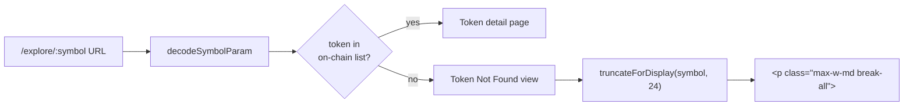

# Explore — Bound User-Controlled Symbol on "Token Not Found" Page to Prevent Horizontal Overflow

## Overview (planner)

A single ~5-line edit in `frontend/src/app/(app)/explore/[symbol]/page.tsx`:
truncate `symbol` for display and add `break-all`/`max-w-md` to the error
paragraph so an arbitrary URL segment can never blow out the layout.

## Research notes

- React already HTML-escapes the value, so XSS is not at risk (verified
  with `/explore/<script>alert(1)</script>` during the iteration #25
  review — see `/tmp/review-25/04-token-xss.png`).
- Tailwind `break-all` maps to `word-break: break-all`, which forces
  wrapping inside a single token of contiguous characters — the right
  primitive here because `AAAA…` has no whitespace boundaries.
- `decodeSymbolParam()` already handles `URIError` from malformed
  encodings, so the only remaining defensive gap is length / wrapping.
- No state, no async, no API call — pure render-time bound.

## Assumptions

- A 24-char ellipsised display is acceptable to product. Real ERC-20
  symbols are 3–8 chars; even synthetics like `sNVDA-2026Q4` stay well
  under 24.
- No existing snapshot test pins the exact text of the Token Not Found
  paragraph. If one exists it can be updated to assert the truncation
  helper instead.

## Architecture diagram



## One-week decision

**YES** — single-file, single-component change. ~15 min including a
small RTL test. Easily fits one week.

## Implementation plan

1. In `frontend/src/app/(app)/explore/[symbol]/page.tsx`, add a small
   pure helper near `decodeSymbolParam`:
   ```ts
   function truncateSymbolForDisplay(value: string, max = 24): string {
     return value.length > max ? `${value.slice(0, max)}…` : value
   }
   ```
2. In the `if (!token)` branch (around line 128), derive
   `const displaySymbol = truncateSymbolForDisplay(symbol)` and use it
   in the `<p>` text instead of the raw `{symbol}`.
3. On that `<p>`, replace the className with
   `text-sm text-gray-400 mb-6 max-w-md break-all`.
4. Audit the rest of the file for any other place the raw `symbol`
   param appears in user-visible text (currently only in this one
   paragraph and in the URL itself — nothing else to change).
5. Add a Vitest test (next to existing explore tests if one exists,
   otherwise skip): render the route with a 500-char symbol mocked
   via `useParams`, assert the rendered paragraph contains the
   ellipsis and that text length is bounded.
6. Run `npx -y react-doctor@latest . --verbose --diff` and fix
   anything that drops the score below 75.


> Filed under Phase 1 Security Hardening & Production Readiness as a defensive
> input-handling fix: the page currently renders an arbitrary user-controlled
> URL segment verbatim without length bounds, breaking the page layout.
> Discovered during the iteration #25 edge-cases product review.

## Problem statement

Navigating to `/explore/<anything>` for a non-existent token renders a friendly
"Token Not Found" page in `frontend/src/app/(app)/explore/[symbol]/page.tsx`:

```tsx
// frontend/src/app/(app)/explore/[symbol]/page.tsx (lines 128–138)
if (!token) {
  return (
    <div className="flex flex-col items-center justify-center min-h-[60vh] text-center px-4">
      <h1 className="text-2xl font-bold text-white mb-3">Token Not Found</h1>
      <p className="text-sm text-gray-400 mb-6">The token &quot;{symbol}&quot; is not available on GoodDollar L2.</p>
      <Link href="/explore" ...>Back to Explore</Link>
    </div>
  )
}
```

The `symbol` value is whatever the URL contains, decoded via
`decodeSymbolParam()`. There is no length cap, no truncation, and no CSS
word-break. A long, space-free symbol such as
`/explore/AAAAAAAAAA…` (500 chars) renders as a single unbroken token in the
`<p>` and pushes the page wider than the viewport, producing a horizontal
scrollbar across the whole site (the header, footer, and nav also extend).

Evidence (screenshots from iteration #25 review):
- `/tmp/review-25/05-token-long.png` — ~70-char symbol, body extends past viewport
- `/tmp/review-25/13-token-long2.png` — same case, second confirmation
- `/tmp/review-25/14-token-extreme.png` — 500-char symbol, severe horizontal overflow

XSS is already mitigated (React escapes the value — confirmed in
`/tmp/review-25/04-token-xss.png`), so this is purely a layout / DoS-against-the-layout
issue, not a script-injection issue. But unbounded rendering of an arbitrary URL
segment is exactly the kind of defensive-coding gap the security-hardening
initiative is meant to close.

## Acceptance criteria

1. Navigating to `/explore/<very-long-string>` does **not** create a horizontal
   scrollbar on the document at any viewport ≥ 320px wide.
2. The displayed symbol in the error message is either:
   - hard-truncated to at most ~32 visible characters with an ellipsis, **or**
   - wrapped using CSS `break-all` / `overflow-wrap: anywhere` so the text
     stays inside its container.
3. The page still clearly tells the user which token they tried to load (do
   not blank out the symbol — show the truncated/wrapped form).
4. No regression for normal-length symbols (`BTC`, `ETH`, `G$`, `sAAPL`,
   `WBTC`, etc.) — they render exactly as before.
5. Same defensive treatment applied to any other place in
   `app/(app)/explore/[symbol]/page.tsx` where the raw `symbol` URL param is
   embedded in user-visible text (e.g., page `<title>` /
   `document.title` if set, breadcrumb if present).

## Suggested implementation

Two complementary fixes:

1. **Truncate for display** in `decodeSymbolParam()` or at the render site —
   cap at e.g. 24 characters and append `…` when longer:

   ```ts
   const displaySymbol = symbol.length > 24 ? `${symbol.slice(0, 24)}…` : symbol
   ```

2. **Defensive CSS** on the error-message `<p>`:

   ```tsx
   <p className="text-sm text-gray-400 mb-6 max-w-md break-all">
     The token &quot;{displaySymbol}&quot; is not available on GoodDollar L2.
   </p>
   ```

   Using `break-all` (rather than `break-words`) ensures even a single
   unbroken string wraps; `max-w-md` keeps the column narrow.

## Out of scope

- Adding a "did you mean?" suggestion list (separate UX task).
- Adding rate-limiting or 404 hardening at the routing layer.
- Refactoring `decodeSymbolParam()` beyond adding the length cap.

## Test plan

- Manual: visit each of the following and confirm no horizontal scroll appears
  on the document, and the symbol is shown truncated or wrapped:
  - `/explore/AAAAAAAAAAAAAAAAAAAAAAAAAAAAAAAAAAAAAAAAAAAAAAAA`
  - `/explore/` + 500 × `A`
  - `/explore/NONEXISTENT_TOKEN_XYZ_12345`
- Manual: visit `/explore/BTC` (which redirects to the real BTC page if
  available, or shows the not-found state if not) and confirm the symbol
  renders normally.
- Add a Vitest/RTL test (if a test exists for this route) covering the
  truncation behavior with a 500-character symbol.
