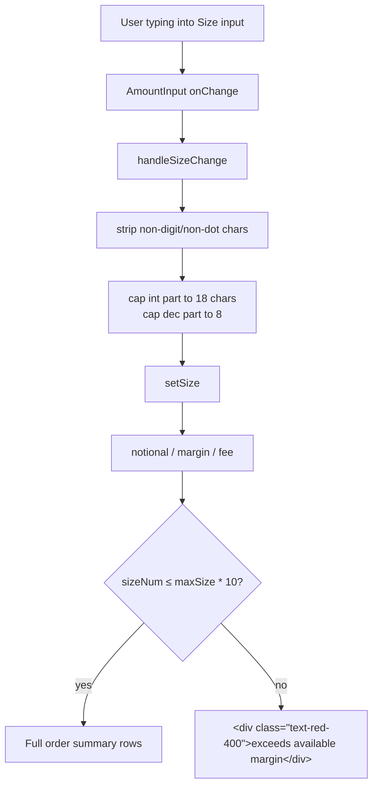

# Perps — Cap Size Input Length and Prevent Notional/Margin/Fee Display Overflow on Astronomical Inputs

## Overview (planner)

Two surgical edits in `frontend/src/app/(app)/perps/page.tsx`:
(a) sanitize+bound the Size string in the existing `setSize` setter so
the integer part can never exceed 18 chars, and (b) gate the order
summary block so values above ~10× the margin cap render a clean
"exceeds available margin" message instead of falling into compact
`Q`/`T` notation.

## Research notes

- The Size input flows through `AmountInput` whose `onChange` already
  passes the raw string up to `setSize`. The cleanest interception
  point is to wrap the setter (e.g. `handleSizeChange`) rather than
  reach into `AmountInput`'s internals.
- The existing `formatPerpsPrice` / `formatLargeValue` helpers fall
  back to compact (`K/M/B/T/Q`) suffixes above ~$1e15. That is correct
  behavior for legitimate large positions on small-cap pairs, so we
  should NOT change the formatter — we should refuse to render the
  summary at all once the value is clearly out-of-range.
- The `exceedsMargin` guard already prevents an out-of-range submit, so
  this change is purely cosmetic / readability. No on-chain behavior
  changes.
- The "BTC" unit label inside `AmountInput` overlaps because the input
  itself does not `truncate` / `min-w-0`. We avoid touching the shared
  component by capping the string length upstream, which is enough to
  prevent the visual collision in practice.

## Assumptions

- 18 integer digits is a sane hard cap. Even on the smallest-cap
  pair, an honest position size never needs more than ~12 digits
  before the decimal.
- 8 decimal digits is enough precision (BTC native precision is 8;
  the displayed asset precision in the order summary is lower).
- Showing a single red "exceeds available margin" line in place of the
  full summary is acceptable UX for the over-bound case — it matches
  the existing `exceedsMargin` submit-time error.

## Architecture diagram



## One-week decision

**YES** — one file, ~25 lines of changed code, no new dependencies.
Including manual regression and a couple of unit tests around
`handleSizeChange`, this is a half-day of work.

## Implementation plan

1. In `frontend/src/app/(app)/perps/page.tsx`:
   - Locate the existing `setSize` usage. Introduce a memoized
     `handleSizeChange(next: string)` that:
     - Strips chars outside `[0-9.]`.
     - Drops all but the first `.`.
     - Caps the integer part to 18 characters.
     - Caps the decimal part to 8 characters.
     - Calls `setSize(normalized)`.
   - Replace the inline `onChange={setSize}` (or equivalent) on the
     Size `AmountInput` with `onChange={handleSizeChange}`.
2. In the order-summary block (around line 426), wrap the existing
   rows with the additional guard `sizeNum <= maxSize * 10` (use the
   already-computed `maxSize` from line 257; if `maxSize === 0` use a
   sane fallback like `Number.MAX_SAFE_INTEGER / effectivePrice` so a
   missing margin doesn't accidentally hide the summary for normal
   trades).
3. Add an "exceeds margin" sibling block, only rendered when
   `sizeNum > 0 && sizeNum > maxSize * 10`, showing a short red line
   with the approximate `maxSize`.
4. Verify the existing submit-time `exceedsMargin` check still fires
   and that disabled-button styling still applies in the
   over-bound case.
5. Add Vitest unit tests for `handleSizeChange`:
   - `'1,000abc'` → `'1000'`
   - `'1.2.3'` → `'1.23'`
   - `'9'.repeat(50)` → 18 nines
   - `'0.123456789012'` → `'0.12345678'`
6. Manually re-test with `999999999999999999999` and confirm:
   - Input never grows past 18 digits.
   - No visual overlap with the `BTC` label.
   - Summary block shows the red "exceeds available margin" line, not
     `$104.97Q` etc.
7. Manually re-test normal flows: `0.5`, `1.25`, `100` — summary
   renders normally with sensible numbers.
8. Run `npx -y react-doctor@latest . --verbose --diff` and fix issues
   to keep the score ≥ 75.


> Filed under Phase 1 Security Hardening & Production Readiness as a defensive
> input/display fix. Discovered during the iteration #25 edge-cases product
> review on `/perps`.

## Problem statement

On the `/perps` order form (`frontend/src/app/(app)/perps/page.tsx`), the
Size input has no upper bound on either the typed string length or the
numeric magnitude. Typing a 21-digit value such as `999999999999999999999`
into "Size (BTC)" causes two visible problems:

1. **Input text overflows** out of the AmountInput field and crashes into
   the "BTC" symbol label on the right side of the input row. The number
   sequence visually overlaps the unit label, making the form unreadable.
2. **The order summary block (lines 426–439)** renders the computed
   `notional`, `marginRequired`, `liqPrice`, `fee`, and `ubiFee` using
   `formatPerpsPrice()` and `formatLargeValue()`. For inputs in the 10^21+
   range these helpers fall back to scientific-style compact notation
   (`$104.97Q`, `1.05Q`, etc.). "Q" (quintillion) is not a unit users can
   parse at a glance; the field reads as a malformed number rather than
   "this trade is impossibly large".

Evidence: `/tmp/review-25/11-perps-huge.png` from iteration #25 review.

The transaction itself is correctly blocked by the existing `exceedsMargin`
check (`marginRequired > account.availableMargin`), so this is **not**
a security-exploitable issue. But the UI breaking on adversarial / fat-fingered
input is exactly the kind of edge-case the production-readiness pass is meant
to harden — a user sharing a screenshot of `$104.97Q` margin would reasonably
conclude the app is broken.

## Acceptance criteria

1. The Size `AmountInput` rejects (or visibly clamps) any string longer than
   18 characters before the decimal point. 18 digits is more than the largest
   plausible token amount in 18-decimal wei terms.
2. If the user types or pastes a value larger than `maxSize` (the
   margin-derived cap already computed on line 257), one of:
   - The value is clamped to `maxSize` on blur, **or**
   - The existing `error` prop shows the "Exceeds available margin" message
     immediately (today it only triggers via `exceedsMargin` once submit is
     attempted) and the order-summary block does not render the broken
     compact-notation values.
3. The "Size (BTC)" / asset-symbol label never visually overlaps with the
   typed value at any input length up to the 18-character cap.
4. The order summary (Notional, Margin, Liq. Price, Fee, → UBI) is hidden,
   replaced with a single "Size exceeds available margin" line, or
   bounded so values >$1e15 render as "—" (or "> max") rather than
   `$104.97Q` / similar compact unit.
5. Normal trading flows (e.g., typing `0.5`, `1.25`, `100`) are unchanged.

## Suggested implementation

In `frontend/src/app/(app)/perps/page.tsx`:

1. Add a `maxLength` (or onChange-guard) to the Size `AmountInput` so the
   raw string can never exceed 18 characters before the decimal:

   ```tsx
   const handleSizeChange = (next: string) => {
     // Strip everything except digits and a single decimal point, then cap
     // the integer part at 18 digits so notional/margin can't exceed 1e21.
     const cleaned = next.replace(/[^0-9.]/g, '')
     const [intPart = '', decPart = ''] = cleaned.split('.')
     const boundedInt = intPart.slice(0, 18)
     const normalized = decPart ? `${boundedInt}.${decPart.slice(0, 8)}` : boundedInt
     setSize(normalized)
   }
   ```

2. Inside the order-summary `{sizeNum > 0 && hasValidPrice && effectivePrice > 0 && (` block (line 426), short-circuit
   when `sizeNum > maxSize * 10` (i.e., an order more than 10× the
   margin-derived cap):

   ```tsx
   {sizeNum > 0 && hasValidPrice && effectivePrice > 0 && sizeNum <= maxSize * 10 && (
     <div className="space-y-1 text-xs"> … existing rows … </div>
   )}
   {sizeNum > maxSize * 10 && (
     <div className="text-xs text-red-400">
       Size exceeds available margin. Max ≈ {formatPerpsPrice(maxSize)} {pair.baseAsset}.
     </div>
   )}
   ```

3. Verify `AmountInput`'s internal layout: the unit label on the right
   should sit inside a flex/grid cell, not absolutely positioned over the
   input, so long values push the cursor rather than colliding with the
   label. If absolute positioning is in use, switch to `flex` so the input
   `min-w-0 truncate`s instead of overflowing.

## Out of scope

- Real BigInt-based math for notional/margin (the displayed numbers come
  from `Number` arithmetic; replacing that is a separate Phase-2 task).
- Adding `maxValue` clamping to other AmountInputs on the page (TP/SL).
- Reformatting `formatLargeValue` to drop "Q"/"T" units globally.

## Test plan

- Manual: type `999999999999999999999` into the Size input on `/perps`.
  Confirm:
  - The visible value is bounded to 18 digits.
  - The unit label `BTC` does not overlap the digits.
  - The Notional / Margin / Fee / → UBI rows either hide or show a clean
    "exceeds margin" message instead of `$104.97Q`.
- Manual: type a normal value like `0.5` — flow unchanged, all summary rows
  render with sensible numbers.
- Manual: paste a string with commas / letters (`"1,000abc"`) — only digits
  and a single decimal remain.
- Add a Vitest/RTL test for `handleSizeChange` that asserts:
  - Letters/symbols stripped
  - Multiple decimals collapsed to one
  - Integer part capped at 18 chars
