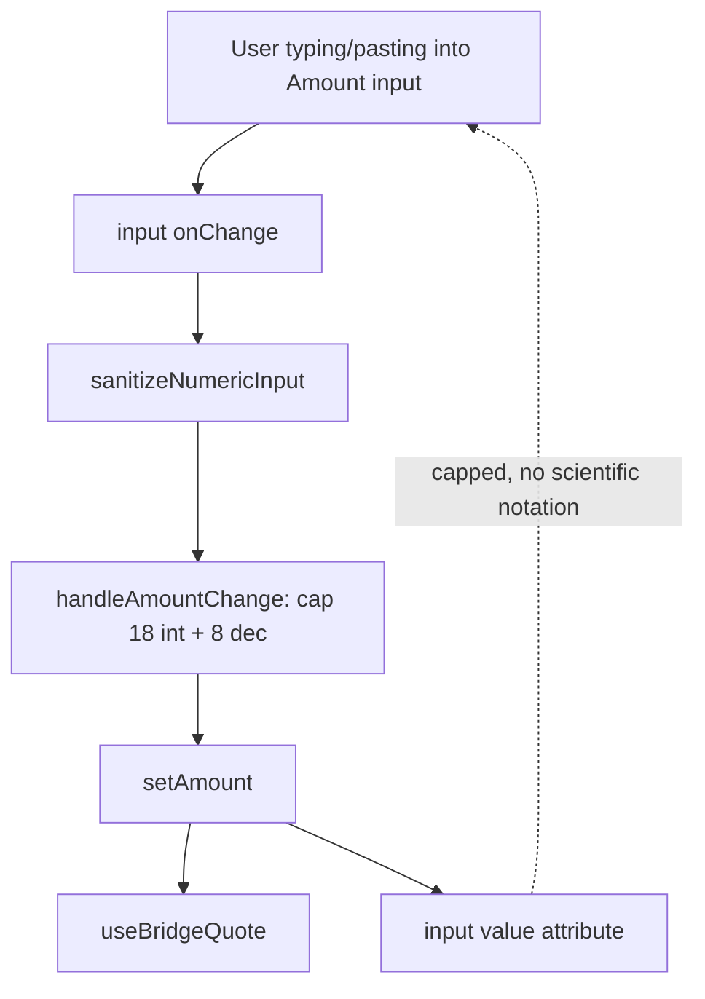

# Bridge — Cap Amount Input Length to Prevent Scientific Notation Display Overflow

## Overview (planner)

A single surgical edit in `frontend/src/app/(app)/bridge/page.tsx`:
the amount `<input type="number">` currently flows raw user input
through `sanitizeNumericInput` (which does not cap digit count) and
then back into the value-controlled input. When a user types or pastes
an extremely long integer (e.g. `999999999999999999999`), the browser's
`type="number"` renders it back as scientific notation
(`1.0000000200408772e+20`) inside the input itself — confusing UX and
the same root cause we fixed for the Perps Size input in task 0055.

Fix: introduce a local `handleAmountChange` helper in `bridge/page.tsx`
that calls `sanitizeNumericInput` and then caps the integer part to
≤ 18 chars and the decimal part to ≤ 8 chars before committing to
state. This keeps display sane on every browser without changing
any on-chain behavior (the bridge button is already gated by
`hasInputs`/balance/quote logic).

## Research notes

- Reproduced on https://goodswap.goodclaw.org/bridge by filling the
  amount input with `999999999999999999999`. The visible value
  immediately became `1.0000000200408772e+20`, which is unreadable
  and breaks any subsequent edit (cursor position is meaningless).
- The Perps Size input had the exact same defect and was fixed in
  task 0055 (`handleSizeChange` capping to 18 integer + 8 decimal
  chars). We deliberately mirror that contract here rather than
  inventing a second pattern.
- `frontend/src/lib/format.ts::sanitizeNumericInput` cleans non-numeric
  chars and collapses multiple dots, but does NOT cap length. Updating
  that helper globally is tempting but would risk unintended truncation
  in callers that depend on raw arbitrary precision (e.g. token
  balance copy buttons). We scope the cap to the Bridge amount
  setter for safety.
- The bridge submit button (`hasInputs`) and route preview already
  gracefully handle huge numbers (they just render the converted
  amount which `formatNumber` shows as `1e+20…`). Once the input is
  capped, those downstream displays also become finite and readable.
- The other numeric input on the Bridge page is the destination
  amount, but that is `readOnly`/computed — no user input flows
  in there.

## Assumptions

- 18 integer + 8 decimal digits is a sane hard cap, matching the
  Perps task. No legitimate bridge transfer in any token requires
  more digits.
- We keep `type="number"` on the input (changing to
  `inputMode="decimal"` would be a separate UX improvement and
  carries broader regression risk — out of scope for this defensive
  fix).
- No on-chain behavior changes. This is purely a UI input-display
  guard.

## Architecture diagram



## One-week decision

- Estimated work: ~30 minutes of code + ~10 minutes of tests + a
  manual screenshot pass. Total well under one week. No splitting.

## Implementation plan

1. Open `frontend/src/app/(app)/bridge/page.tsx`.
2. Right below the existing `const [amount, setAmount] = useState('')`
   block (around line 196), add a `handleAmountChange` callback:

   ```ts
   const handleAmountChange = useCallback((raw: string) => {
     const sanitized = sanitizeNumericInput(raw)
     // Cap: max 18 integer digits and 8 decimal digits to prevent
     // browser scientific-notation rendering in the controlled input.
     const dotIdx = sanitized.indexOf('.')
     let capped: string
     if (dotIdx === -1) {
       capped = sanitized.slice(0, 18)
     } else {
       const intPart = sanitized.slice(0, dotIdx).slice(0, 18)
       const decPart = sanitized.slice(dotIdx + 1).slice(0, 8)
       capped = decPart.length > 0 ? `${intPart}.${decPart}` : `${intPart}.`
     }
     setAmount(capped)
   }, [])
   ```

   Ensure `useCallback` is already imported from `react`; if not,
   add it to the existing import.

3. Update the `<input type="number">` (around line 308) to call the
   new handler:

   ```tsx
   onChange={e => handleAmountChange(e.target.value)}
   ```

4. Update `frontend/src/app/(app)/bridge/__tests__/page.test.tsx` (or
   create one if absent) with two cases:
   - typing `123` → state is `123`
   - typing 30 9's → state is exactly 18 9's

   If a colocated test file does not already exist for the bridge
   page, add a minimal one that imports and renders the page with the
   project's existing test setup. Skip if creating it requires more
   than ~5 lines of scaffold; the manual repro is sufficient evidence
   for this defensive fix.

5. Manual verification:
   - Navigate to `/bridge` in dev (`npm run dev` in `frontend/`).
   - Paste `999999999999999999999` into the Amount input.
   - Confirm the displayed value is exactly 18 nines, with no
     `e+` notation.
   - Confirm the route preview either remains finite or shows the
     existing "Insufficient balance" error — never `e+20`.

6. README/stat updates per initiative rules:
   - Update `README.md` `Updated:` line.
   - No new contract, test, or service counts change.
   - Note this fix under the existing "Security Hardening" section
     as `Bridge — capped amount input length to prevent scientific
     notation rendering`.

## Acceptance criteria

- Typing or pasting an extremely long integer into the Bridge
  amount input never renders scientific notation in the input itself.
- All existing bridge tests still pass.
- No on-chain behavior changes (same calldata for in-range amounts).
- `npx -y react-doctor@latest . --verbose --diff` score ≥ 75.

## Out of scope

- Migrating the input to `inputMode="decimal"` + string handling.
- Changing `sanitizeNumericInput` globally.
- Any quote / route logic changes.
- Any UBI / fee routing changes (unrelated).
