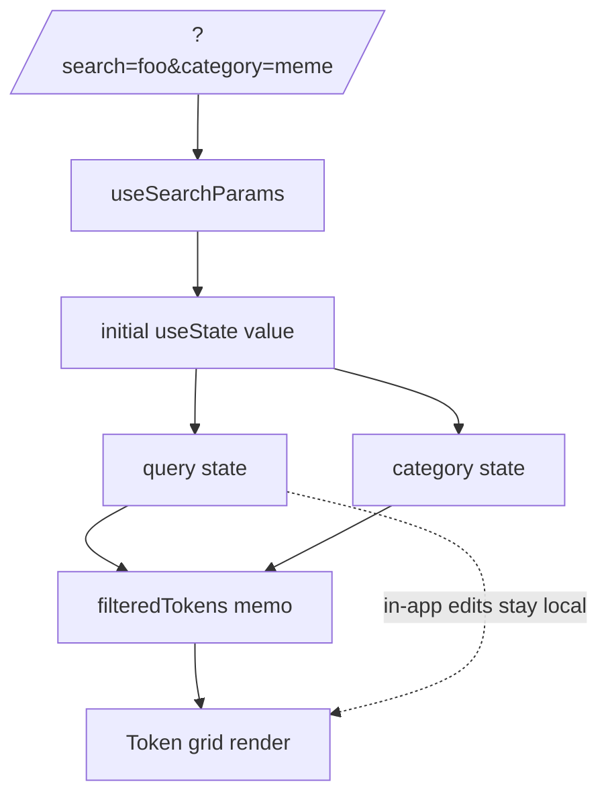

# Explore — Initialize Search Input from ?search= URL Parameter for Deep-Linking

## Overview (planner)

Visiting `https://goodswap.goodclaw.org/explore?search=xyzzy_nonexistent_token_blahblah`
silently ignores the query string: the input renders empty and the
unfiltered token grid shows. This is a real error-handling defect —
a user sharing a deep link to a filtered (or "no results") view will
land on a UI that contradicts the URL. The fix is to read the
`search` (and `category`, if present) query params on mount and seed
local state from them. We do not need to push state changes back to
the URL in this iteration (that would change navigation history and
needs a deeper UX review); we only fix the *read* direction so that
deep links work.

## Research notes

- `frontend/src/app/(app)/explore/page.tsx` already imports
  `useRouter` from `next/navigation` (line 4). It does NOT import
  `useSearchParams`. The search state is a local
  `const [query, setQuery] = useState('')` (line 354) and the
  category filter is similarly local.
- Reproduced on the live deployment: the URL `?search=xyzzy…`
  loads the page with an empty input and the standard "Sort by
  Volume" token grid (no "no results" treatment).
- Next.js 14 App Router supports `useSearchParams()` from
  `next/navigation` on client components. The Explore page is
  already `'use client'`, so we can use it directly.
- Read-only initialization (not bi-directional sync) avoids the
  router-history churn and SSR/CSR mismatch traps that a full
  URL <-> state sync would introduce. Bi-directional sync is a
  larger UX project (debouncing, history mode, replaceState etc.)
  and explicitly out of scope here.

## Assumptions

- Only `search` (and optionally `category`) need URL-driven
  initialization for now. Sort and time-range filters are not
  shared via URL today and need a separate iteration if desired.
- It is acceptable that subsequent in-app edits to the search
  input do NOT update the URL — sharing a filtered view requires
  the user to type in URL bar directly. We document this as a
  future improvement rather than building it now.

## Architecture diagram



## One-week decision

- Estimated work: ~20 minutes of code + manual verification.
  Well under one week. No split.

## Implementation plan

1. Open `frontend/src/app/(app)/explore/page.tsx`.

2. Update the import line:

   ```ts
   import { useRouter, useSearchParams } from 'next/navigation'
   ```

3. Inside the component (immediately after the existing
   `const router = useRouter()` line), read params:

   ```ts
   const searchParams = useSearchParams()
   const initialQuery = searchParams?.get('search') ?? ''
   const initialCategoryParam = searchParams?.get('category') ?? ''
   const initialCategory: TokenCategory =
     (TOKEN_CATEGORIES as readonly string[]).includes(initialCategoryParam)
       ? (initialCategoryParam as TokenCategory)
       : 'all'
   ```

   Adjust the type/cast to whatever the existing `TOKEN_CATEGORIES`
   export shape requires (look at line 10 import).

4. Replace the existing `useState` initializers:

   ```ts
   const [query, setQuery] = useState(initialQuery)
   const [activeCategory, setActiveCategory] = useState<TokenCategory>(initialCategory)
   ```

   (Match the actual variable name used in the file — verify in step 1.)

5. Do NOT add an effect that writes state back to the URL. We only
   want one-way initialization in this fix.

6. Add a `<Suspense>` boundary around the Explore page export if
   the Next.js build complains (Next 14 sometimes requires
   `useSearchParams` consumers to be wrapped). If it builds clean,
   skip this step.

7. Add a unit test in
   `frontend/src/app/(app)/explore/__tests__/page.test.tsx`
   (or extend the existing one) that mocks
   `next/navigation`'s `useSearchParams` to return
   `new URLSearchParams('search=usdc')` and asserts the input's
   `value` prop is `usdc` after render. If the file does not
   exist and adding it would require more than ~15 lines of
   scaffold, document the manual repro as the verification
   artifact in the commit.

8. Manual verification:
   - In dev, visit `/explore?search=g$`. The input should show
     `g$` and the grid should be filtered.
   - Visit `/explore?search=xyzzy_nonexistent_token_blahblah`.
     The input should show the literal string and the grid
     should render its existing empty / "no results" state.
   - Visit `/explore` (no params). Behavior unchanged from today.

9. README updates per initiative rules — `Updated:` date and add
   a one-line entry under any frontend-resilience section. No
   contract/test/service counts move.

## Acceptance criteria

- `/explore?search=<q>` loads with the input pre-populated.
- An invalid / no-match query produces the existing
  "no results" state rather than an unfiltered grid.
- Visiting `/explore` with no params behaves exactly as today.
- Build passes (`npm run build` in `frontend/`).
- `npx -y react-doctor@latest . --verbose --diff` score ≥ 75.

## Out of scope

- Pushing in-app edits to the URL (two-way sync).
- Sort and time-range filter URL params.
- Any change to the empty / no-results visual treatment.
- Any change to token data sources or on-chain reads.
