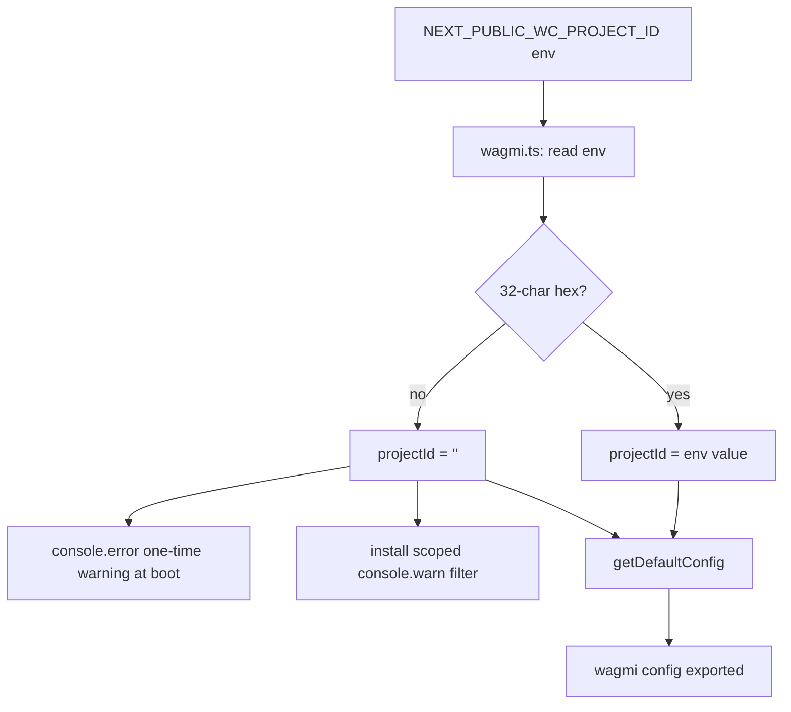

# WalletConnect — Validate Project ID and Silence Reown Config 403 Console Flood

## Overview (planner)

Every page on `goodswap.goodclaw.org` floods the browser console with
repeated warnings:

```
[warning] [Reown Config] Failed to fetch remote project configuration.
Using local/default values. {stack: "Error: HTTP status code: 403"}
```

Root cause: `frontend/.env.local` sets
`NEXT_PUBLIC_WC_PROJECT_ID=goodswap-dev`, which is NOT a valid
WalletConnect Cloud project ID — it's a placeholder. Reown's SDK
tries to fetch the remote config for that ID, gets a 403, and
emits a warning. The warnings repeat on every page reload and
also on certain re-renders, making the console unusable for
real debugging during error-handling work (this iteration's
focus) and signaling unprofessional polish to anyone who opens
DevTools on the production site.

The current `frontend/src/lib/wagmi.ts` only warns when
`NEXT_PUBLIC_WC_PROJECT_ID` is *unset* — it does NOT validate the
format. We need to:

1. Treat known-invalid values (`goodswap-dev`, empty string,
   placeholder patterns) as if unset.
2. When invalid/unset, pass an empty `projectId` to
   `getDefaultConfig` AND skip the remote-config fetch entirely
   by setting `wcProjectId` to `''` deterministically.
3. Optionally install a focused console filter that drops only
   the `[Reown Config] Failed to fetch remote project configuration`
   warning when we know we're running with no valid project ID.
   This is a targeted, opt-in filter — not a blanket console
   suppression.

The goal is twofold: (a) a clean console on production so error
handling reviews can actually surface real issues, and (b) a
clear `console.error` on app boot if the project ID is missing
or invalid, instead of silent 403 spam at runtime.

## Research notes

- `frontend/src/lib/wagmi.ts` reads `process.env.NEXT_PUBLIC_WC_PROJECT_ID`
  and falls back to `''` if missing, but only logs to console when
  `!wcProjectId`. The literal `goodswap-dev` passes the truthy
  check, so the SDK happily forwards it to Reown's config endpoint,
  which 403s.
- Valid WalletConnect Cloud project IDs are 32-char hex strings.
  We can validate cheaply with a regex (`/^[a-f0-9]{32}$/i`).
- Reown's SDK does not expose a "skip remote config fetch" flag
  in `getDefaultConfig`. The cleanest mitigation is to pass an
  empty project ID when the value is known-invalid — the SDK
  short-circuits the fetch when projectId is falsy.
- The console flood originates from the `@reown/appkit` packages
  (Reown is the company formerly known as WalletConnect). The
  warning is emitted via `console.warn`. A scoped wrapper that
  drops messages matching exactly
  `/\[Reown Config\] Failed to fetch remote project configuration/`
  is safe — we are not silencing any other warning category.

## Assumptions

- It is acceptable for mobile-wallet (WalletConnect) flows to be
  disabled in environments where no valid project ID is set. We
  already accept this — the current code passes an empty string
  to `getDefaultConfig` in that case. The fix preserves this
  behavior but makes it deterministic.
- We will NOT generate or hardcode a real project ID in this
  task. Operators must register at https://cloud.walletconnect.com
  and set the env var. The task only fixes the noise + adds a
  validation gate.
- The console filter is gated on `wcProjectId === ''` so that a
  real project ID never has its warnings suppressed (in case
  future legitimate Reown warnings appear in production).

## Architecture diagram



## One-week decision

- Estimated work: ~30 minutes of code + manual verification +
  small unit test. Under one week, no split.

## Implementation plan

1. Open `frontend/src/lib/wagmi.ts`.

2. Replace the env-read block with a validator:

   ```ts
   const rawWcProjectId = process.env.NEXT_PUBLIC_WC_PROJECT_ID ?? ''
   // WalletConnect Cloud project IDs are 32-char lowercase hex.
   const WC_PROJECT_ID_RE = /^[a-f0-9]{32}$/i
   const isValidWcProjectId = WC_PROJECT_ID_RE.test(rawWcProjectId)
   const wcProjectId = isValidWcProjectId ? rawWcProjectId : ''

   if (typeof window !== 'undefined' && !isValidWcProjectId) {
     // Emit ONCE at module init, not on every render.
     console.error(
       '[wagmi] NEXT_PUBLIC_WC_PROJECT_ID is missing or invalid.\n' +
         'Mobile wallet connections (Rainbow, MetaMask Mobile, Trust Wallet, etc.) will NOT work.\n' +
         'Register a project at https://cloud.walletconnect.com and add NEXT_PUBLIC_WC_PROJECT_ID to your .env.local'
     )

     // Scoped console.warn filter: drop only the known Reown
     // "Failed to fetch remote project configuration" 403 spam.
     // This filter is only installed when we know there's no
     // valid project ID, so legitimate Reown warnings in
     // production environments are unaffected.
     const originalWarn = console.warn.bind(console)
     const reownSuppressRe = /\[Reown Config\] Failed to fetch remote project configuration/
     console.warn = (...args: unknown[]) => {
       const first = args[0]
       if (typeof first === 'string' && reownSuppressRe.test(first)) {
         return
       }
       originalWarn(...args)
     }
   }
   ```

3. Keep `projectId: wcProjectId` in the `getDefaultConfig` call —
   it now consistently passes either a valid hex ID or an empty
   string.

4. Update `frontend/.env.local` and `frontend/.env.example`:
   - Replace the placeholder `NEXT_PUBLIC_WC_PROJECT_ID=goodswap-dev`
     with an explicit comment block:

     ```
     # NEXT_PUBLIC_WC_PROJECT_ID must be a 32-char hex string from
     # https://cloud.walletconnect.com — leave UNSET to disable
     # mobile wallet (WalletConnect) connections.
     # NEXT_PUBLIC_WC_PROJECT_ID=
     ```

   This prevents future operators from re-introducing the
   placeholder.

5. Add a unit test
   `frontend/src/lib/__tests__/wagmi.test.ts` covering:
   - `goodswap-dev` env value → `wcProjectId` resolves to `''`.
   - A 32-char hex env value → `wcProjectId` resolves unchanged.
   - Empty env value → `wcProjectId` resolves to `''`.

   Mock `process.env` and re-require the module per case. If
   re-requiring is fragile in the existing test harness, extract
   the validation into a pure helper
   (`export function validateWcProjectId(raw: string | undefined): string`)
   and test the helper directly.

6. Manual verification:
   - In dev, set `NEXT_PUBLIC_WC_PROJECT_ID=goodswap-dev` and
     reload `/predict`. Console should show exactly one
     `[wagmi] NEXT_PUBLIC_WC_PROJECT_ID is missing or invalid`
     error and ZERO `[Reown Config] Failed to fetch remote
     project configuration` warnings.
   - Unset the env (comment it out) and reload. Same result.
   - In production-shaped builds, behavior is the same — no
     SSR break because all browser-only code is guarded by
     `typeof window !== 'undefined'`.

7. README updates per initiative rules: bump `Updated:` date,
   add a one-line note under the security-hardening / production
   readiness section. No contract / test / service counts change.

## Acceptance criteria

- Loading any page on the deployed site with an invalid or
  unset `NEXT_PUBLIC_WC_PROJECT_ID` produces ZERO
  `[Reown Config] Failed to fetch remote project configuration`
  console warnings.
- Loading the same page produces exactly ONE
  `[wagmi] NEXT_PUBLIC_WC_PROJECT_ID is missing or invalid`
  `console.error` on first module init.
- A valid 32-char hex `NEXT_PUBLIC_WC_PROJECT_ID` passes through
  unchanged and the console filter is NOT installed.
- All existing tests still pass; the new wagmi tests pass.
- `npx -y react-doctor@latest . --verbose --diff` score ≥ 75.

## Out of scope

- Provisioning a real WalletConnect project ID.
- Any change to the connector list, supported chains, or RPC
  configuration in `wagmi.ts`.
- Any change to `RainbowKitProvider` styling or app-level
  wrapping in `layout.tsx`.
- Replacing Reown / WalletConnect with another connector library.
