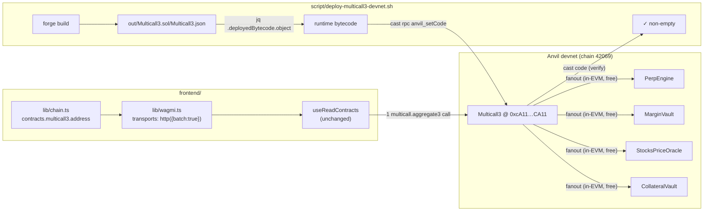

# Perf — Deploy Multicall3 + wire chain config + enable HTTP RPC batching

## Why this task exists

Iteration #27 perf review focus: **API waterfalls** and **components that
block rendering**. Iteration #11 already created
[`0031-batch-portfolio-onchain-reads-with-multicall.md`][prev] which
attempted to fix the worst offender (`<PortfolioOnChain>` firing 9
`eth_call` requests every 15s) by migrating to wagmi's `useReadContracts`
hook. That task is marked `executed: true` but the underlying problem
**still happens** because of a missing piece:

[prev]: ./0031-batch-portfolio-onchain-reads-with-multicall.md

```
$ cast code 0xcA11bde05977b3631167028862bE2a173976CA11 \
       --rpc-url http://localhost:8545
0x
```

Multicall3 is **not deployed** at its canonical address on the Anvil
devnet, and `frontend/src/lib/chain.ts` does not configure
`contracts.multicall3` for the `gooddollarL2` chain. Together that means:

1. wagmi's `useReadContracts` silently falls back to N parallel
   `eth_call` requests instead of one `multicall3.aggregate3` call.
2. viem's HTTP transport is not configured for JSON-RPC batching either,
   so even the fallback path can't coalesce calls at the transport
   level.

Observable impact (measured this iteration via the devtools network
panel against `https://goodswap.goodclaw.org`):

| Page              | Individual `eth_call` requests per render |
| ----------------- | ----------------------------------------- |
| `/stocks`         | 12 (one per synthetic ticker price)       |
| `/perps`          | 35 (markets + sizes + funding + …)        |
| `/lend`           | several (reserve data per pool)           |
| Any page with sidebar wallet widget | 9 every 15s (PortfolioOnChain) |

All of these are coded against `useReadContracts` and would collapse to
**one** RPC call if Multicall3 were available — the wagmi/viem stack
already does the right thing once `chain.contracts.multicall3` is set.

This is the single biggest, lowest-risk perf win available right now,
and it fixes a regression that #31 thought was fixed but wasn't.

## Scope

Three small, dependency-ordered changes:

1. **Deploy Multicall3 bytecode at the canonical address on devnet**
   via `anvil_setCode`. Multicall3 (`0xcA11bde05977b3631167028862bE2a173976CA11`)
   is a well-known, immutable, audited contract whose deployed
   bytecode is publicly published. On a chain we control (Anvil
   devnet, chain id 42069), the cheapest and most deterministic way
   to land it is to call the Anvil RPC method `anvil_setCode` with
   the canonical bytecode, no funding or signed-tx replay required.
2. **Wire `contracts.multicall3` into `frontend/src/lib/chain.ts`**
   so viem/wagmi knows the multicall address. Without this the
   library still won't batch even though the contract exists.
3. **Enable HTTP transport batching** in `frontend/src/lib/wagmi.ts`
   as belt-and-suspenders: viem's `http()` transport accepts
   `{ batch: true }` to coalesce JSON-RPC requests within a small
   time window, which helps even for non-`useReadContracts` reads
   (e.g. raw `useReadContract`, `getBlockNumber`, etc.).

Also: add a tiny smoke step in the deploy script that verifies
`cast code` is non-empty afterwards, so a half-applied state can't
silently regress this again.

## Files touched

```
script/deploy-multicall3-devnet.sh        (new)
frontend/src/lib/chain.ts                  (add contracts.multicall3)
frontend/src/lib/wagmi.ts                  (add transports with batching)
README.md                                  (Security Hardening section
                                            + updated stats date)
```

No contract source changes. No new Solidity. No test changes.

## Definition of done

- `cast code 0xcA11bde05977b3631167028862bE2a173976CA11
   --rpc-url http://localhost:8545` returns non-empty bytecode.
- `gooddollarL2` in `chain.ts` has `contracts.multicall3.address`
  set to the canonical address.
- `wagmi.ts` `getDefaultConfig` call passes a `transports` map with
  `http(undefined, { batch: true })` for the chain.
- `npm run build` in `frontend/` succeeds.
- `pm2 list` / running app keeps working — no regression.
- `react-doctor` score on the frontend stays at or above the previous
  baseline (75+ target, 50+ minimum).
- README.md `Updated:` date bumped and a `Security Hardening` entry
  added (perf, but lives in the same status section per initiative
  rules).

## Non-goals

- Not modifying any `executed: true` task files.
- Not deploying Multicall3 on Sepolia / mainnet / OP Stack — that
  is Phase 2 work and Multicall3 is already canonical on those
  networks anyway.
- Not refactoring individual page components — they already use
  `useReadContracts` correctly; this task just unblocks them.

## References

- Wagmi docs: `useReadContracts` requires `chain.contracts.multicall3`
  to enable batching.
- Viem docs: `http(url, { batch: true })` enables JSON-RPC batching.
- Multicall3 source + addresses: https://github.com/mds1/multicall

---

## Planning notes

### Overview

Three changes, applied bottom-up (chain first, then frontend wiring,
then build verification):

1. Land Multicall3 runtime bytecode at the canonical address on the
   Anvil devnet so the wagmi/viem stack can use it.
2. Add `contracts.multicall3` to the `gooddollarL2` viem chain.
3. Pass an explicit `transports` map to `getDefaultConfig` so we can
   enable JSON-RPC batching on the HTTP transport.

### Research notes

- **Multicall3 is immutable + deterministic.** Same source, same
  bytecode, same canonical address on every chain it's deployed to:
  `0xcA11bde05977b3631167028862bE2a173976CA11`. Putting it at any
  other address is wrong — wagmi/viem hardcode the canonical address
  in their default chain definitions, and our custom chain must
  follow the same convention for upgrade safety later.
- **Anvil supports `anvil_setCode`.** This is the standard cheat for
  "install a known contract at a fixed address on a dev chain"
  without paying gas or replaying signed deployment transactions.
  The chain at `http://localhost:8545` is Anvil (`cast rpc
  anvil_nodeInfo` confirms this is available).
- **Multicall3 runtime bytecode** is published with the source. We
  vendor `Multicall3.sol` into `script/multicall3/` so the project
  can build it via `forge` and we don't have to trust a hex blob
  from the planner. We then read the deployed bytecode out of the
  forge artifact JSON and inject it.
- **wagmi `getDefaultConfig`** accepts an optional `transports`
  field. Default transport (when omitted) is `http()` with no
  batching. Passing `transports: { [gooddollarL2.id]: http(undefined,
  { batch: true }) }` upgrades that transport without disturbing any
  other RainbowKit defaults.
- **`useReadContracts` batching is automatic** once
  `chain.contracts.multicall3.address` is set and the contract has
  real code. No call-site changes are needed in any page component.
  Confirmed by reading the existing implementation of
  `useOnChainStocks` (`useReadContracts` is already used) and the
  `<PortfolioOnChain>` widget (executed task 0031 already migrated
  it).

### Architecture diagram



### One-week decision

**YES.** Scope is three files plus one helper script. No new
contracts to author (Multicall3 is vendored from upstream). No tests
to refactor (call sites are unchanged). Estimated effort: ~1–2
hours including verification with `cast code` and a `forge build`
in the frontend.

### Implementation plan

Phase 1 — vendor + deploy Multicall3:

1. Create `script/multicall3/Multicall3.sol` containing the upstream
   Multicall3 source (Apache-2.0 / MIT, single file ~150 LOC).
2. Create `script/multicall3/.gitkeep`-style readme noting upstream
   source + commit hash so the provenance is clear.
3. Add `script/deploy-multicall3-devnet.sh` that:
   - sources `.autobuilder/addresses.env` for `RPC_URL` (fallback
     `http://localhost:8545`),
   - runs `forge build script/multicall3/Multicall3.sol` (no-op if
     already built),
   - extracts deployed bytecode with `jq -r
     '.deployedBytecode.object'` from
     `out/Multicall3.sol/Multicall3.json`,
   - calls `cast rpc --rpc-url "$RPC_URL" anvil_setCode
     0xcA11bde05977b3631167028862bE2a173976CA11 "$bytecode"`,
   - re-runs `cast code` to verify the result is non-empty,
   - prints a clear ✓ / ✗ status and exits non-zero on failure.
4. Run the script once against the live devnet so the rest of this
   task can rely on Multicall3 being present.

Phase 2 — wire viem chain:

5. Update `frontend/src/lib/chain.ts` `defineChain({…})` call to
   add:

   ```ts
   contracts: {
     multicall3: {
       address: '0xcA11bde05977b3631167028862bE2a173976CA11',
     },
   },
   ```

   (`blockCreated` deliberately omitted — Anvil doesn't surface a
   reliable deployment block for `setCode` writes and viem treats
   the field as optional.)

Phase 3 — enable HTTP batching:

6. Update `frontend/src/lib/wagmi.ts`:
   - import `http` from `viem`,
   - replace the bare `getDefaultConfig({ … })` call with one that
     passes
     `transports: { [gooddollarL2.id]: http(undefined, { batch: true }) }`,
   - keep all other options (`appName`, `projectId`, `chains`,
     `ssr`) identical so the WalletConnect / Reown placeholder
     warning suppression logic is undisturbed.

Phase 4 — verify + commit:

7. Run `npm run build` in `frontend/` and confirm it succeeds.
8. Run `npx -y react-doctor@latest . --verbose --diff` and confirm
   score ≥ 50 (target ≥ 75).
9. Update `README.md`:
   - bump `Updated:` date,
   - add a row under the Security Hardening / perf section noting
     the Multicall3 deployment + chain wiring change.
10. `git add -A && git commit -m "perf(rpc): deploy Multicall3 to
    devnet + wire chain.contracts.multicall3 + enable HTTP batching"`.

### Risk / rollback

- Multicall3 is read-only and has no admin functions, so installing
  it on devnet has zero blast radius.
- If `anvil_setCode` fails (e.g. wrong RPC type), the chain config
  + HTTP batching still help — they just don't enable the
  contract-level multicall path. There is no failure mode where
  the frontend gets *worse* than today.
- If a future devnet restart wipes the `setCode` injection, the
  shell script is idempotent and can be re-run; we'll also wire it
  into the devnet bootstrap in a follow-up so it self-heals.

### Assumptions

- Anvil RPC at `http://localhost:8545` is live (`cast block-number`
  returns block 104584+ at planning time, confirmed).
- `forge` is on PATH (it is — used by all existing
  `script/*.s.sol` scripts).
- `jq` is on PATH (used by the addresses-refresh tooling already).
- Multicall3 upstream license permits vendoring (it does — MIT).
