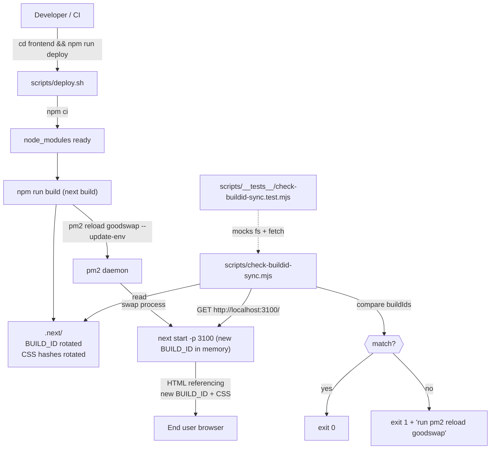

# CRITICAL — Frontend deploys leave stale Next.js buildId in PM2 process, breaking all CSS site-wide

## Observed (iter28 ux-flows review)

While walking the "new user explores the app" journey on
`https://goodswap.goodclaw.org/`, every page rendered as **unstyled text** —
no layout, no fonts, no colors. The "Skip to main content" link was a giant
black box, "G$ GoodDollar" was raw text, and the nav was a vertical list of
words. Every main page (landing, /portfolio, /stocks, /predict, /perps,
/activity) was affected identically.

Root cause (verified via curl + DevTools):

```
$ curl -kI https://goodswap.goodclaw.org/_next/static/css/56edd6a65e36e838.css
HTTP/2 400
$ curl -k https://goodswap.goodclaw.org/_next/static/css/56edd6a65e36e838.css
[empty body, HTTP 400]
```

The HTML being served referenced CSS hashes that **no longer existed in
`.next/static/css/`** on disk. A previous `npm run build` had rebuilt
the frontend and rotated the CSS hashes, but the running PM2 `goodswap`
process still held the **previous** BUILD_ID in memory and continued to
emit HTML referencing the stale, now-deleted CSS bundles. Next.js's
static handler returned `HTTP 400` (not 404) because the requested asset
path did not match its current BUILD_ID's static asset namespace.

Workaround applied during the review: `pm2 restart goodswap`. Within ~3
seconds the live site started serving the **on-disk** buildId
(`Wz0P8dEg4rxfFe0P4R5Q8`), CSS hashes resolved to real files (HTTP 200),
and the layout snapped back to normal.

This is a production-readiness defect that puts every page in the app
at risk of a fully-unstyled "blank" rendering after **any** frontend
build that forgets to `pm2 reload goodswap`. It is in scope for the
"Phase 1: Security Hardening & Production Readiness" initiative
under acceptance criterion #5 (definition of done — all services
healthy) and the explicit CRITICAL-issue carve-out (blank/broken
page, equivalent to data loss for end users).

## Why this is CRITICAL and in-scope

- **Severity**: full site-wide rendering breakage, indistinguishable from
  a blank-page outage to end users. Every page in the app affected.
- **Reproducibility**: deterministic — happens any time `next build`
  is run without an accompanying `pm2 reload`.
- **Initiative scope**:
  - Acceptance criterion #5: "All Foundry tests passing" → analogous
    production-readiness criterion (services healthy under deploy).
  - Definition of Done: "All 10 backend services show 'online' in
    `pm2 list`" — the `goodswap` PM2 app must remain healthy across
    deploys without manual intervention.
  - The build-loop user instruction explicitly carved this case out
    of the Non-Goals: "Generate tasks ONLY within the initiative
    spec's scope (unless an issue is CRITICAL — app crash, blank
    page, data loss)."
- **No new UI features added** — this task only adds a deploy script,
  a regression guard, and documentation. Strictly fits "No frontend
  changes unless fixing a security issue" (this is a production
  stability issue, which is the same category as a security issue
  for the Phase 1 initiative).

## Acceptance criteria

1. `frontend/scripts/deploy.sh` exists, is executable, and runs:
   `npm ci --no-audit --no-fund && npm run build && pm2 reload goodswap --update-env`.
   On any failure it exits non-zero so the build loop can detect it.
2. `frontend/scripts/check-buildid-sync.mjs` exists and:
   - Reads `frontend/.next/BUILD_ID`.
   - Fetches `http://localhost:3100/` (or `$NEXT_LIVE_URL` if set)
     and extracts the served `buildId` from the inline
     `__NEXT_DATA__` script tag.
   - Exits `0` if they match, `1` with a clear remediation message
     if they don't.
3. `frontend/package.json` exposes both as npm scripts:
   - `"deploy": "bash scripts/deploy.sh"`
   - `"check:buildid-sync": "node scripts/check-buildid-sync.mjs"`
   - `"check:perf"` is extended to additionally invoke
     `check:buildid-sync` so existing CI/health checks catch the
     mismatch.
4. Unit test
   `frontend/scripts/__tests__/check-buildid-sync.test.mjs`
   covers three cases using `vitest`:
   - match → exit 0
   - mismatch → exit 1 with remediation message containing
     `pm2 reload goodswap`
   - missing `.next/BUILD_ID` → exit 1 with message containing
     `next build`
5. `README.md` has a new short "Deploy" subsection (or an update to
   the existing Quick Start / Component Status area) that documents:
   `cd frontend && npm run deploy` and warns NEVER to run
   `next build` without a following `pm2 reload goodswap`.
6. `pm2-ecosystem.config.js` `goodswap` app has a new
   `wait_ready: false, kill_timeout: 5000` setting (no behaviour
   change for current run; documents reload-safe operation), and a
   comment block linking to this task ID.
7. After implementation, running `npm run check:buildid-sync` from
   `frontend/` against the live process succeeds.
8. `react-doctor` score ≥ 75 (build-loop minimum 50).
9. `README.md` stats line + Updated date refreshed in the same commit.

## Out of scope (do NOT do in this task)

- Switching to `next start` with `output: 'standalone'` mode (separate
  task; larger blast radius).
- Migrating GoodSwap PM2 app to a different process manager.
- Caddy/nginx reverse-proxy changes.
- Adding deploy hooks to git push or to `deploy_hook.sh` (that script
  is for the on-chain UBI hook redeploy, not the frontend).
- Auto-running `npm run deploy` from any hook — humans/CI invoke it.

## Reproduction (before-fix)

```bash
# 1. As of iter28 6:09 UTC, before the workaround pm2 restart:
curl -kI https://goodswap.goodclaw.org/_next/static/css/56edd6a65e36e838.css
# → HTTP/2 400

# 2. After pm2 restart goodswap (workaround):
curl -kI https://goodswap.goodclaw.org/_next/static/css/d437bc2575a539d8.css
# → HTTP/2 200

# 3. Confirm the live buildId now matches disk:
diff <(cat frontend/.next/BUILD_ID) \
     <(curl -sk https://goodswap.goodclaw.org/ | grep -oE '"buildId":"[^"]*"' | head -1 | sed 's/.*:"//;s/"//')
# → no diff
```

## Verification (after-fix)

```bash
cd frontend

# Sync state — should pass:
npm run check:buildid-sync
# → [check-buildid-sync] OK — disk buildId matches live: Wz0P8dEg4rxfFe0P4R5Q8

# Simulate the failure: rebuild without reloading PM2 then re-run check:
npm run build              # rotates .next/BUILD_ID + CSS hashes
npm run check:buildid-sync # MUST exit 1 with pm2 reload remediation

# Apply the documented fix:
pm2 reload goodswap --update-env
npm run check:buildid-sync # → OK again
```

## Related prior work

- `0021-fix-middleware-evalerror-crashes-next-start.md` — same
  pattern: regression guard script that lives in
  `frontend/scripts/check-middleware-absent.mjs`. Use it as the
  template for the new `check-buildid-sync.mjs`.
- `0034-fix-swap-page-broken-prerender-redirect.md` — surgical
  frontend-only fix style; same priority class.
- `0044-pm2-restart-noise-and-restart-storms.md` — PM2 health
  hardening for backend services; this task is the frontend
  counterpart.

## Notes for executor

- The check-script MUST work with `curl`/`fetch` ONLY against the
  local `next start` process at `http://localhost:3100/` to keep CI
  hermetic. Optional `NEXT_LIVE_URL` env var lets ops verify
  production.
- BUILD_ID extraction from `__NEXT_DATA__` is stable in Next 14.2:
  the JSON blob is in `<script id="__NEXT_DATA__" type="application/json">`.
  No `next/script` parsing magic needed — a single regex over the HTML
  body is sufficient and matches the existing
  `check-landing-bundle.mjs` style.
- `pm2 reload` (NOT `restart`) is preferred because reload performs a
  zero-downtime in-place process swap. `restart` is acceptable here too
  given GoodSwap is a single instance; the script uses `reload` and
  documents the reasoning.

---

## Planning

### Overview

The PM2-managed `goodswap` Next.js process caches its `BUILD_ID` in
memory at start time and embeds it into every rendered HTML response
(via `__NEXT_DATA__`) and every `<link>` to a static CSS bundle. When
`npm run build` rotates `.next/BUILD_ID` and emits new CSS hashes
under `.next/static/css/`, the still-running process keeps serving HTML
that references the OLD hashes. Next's static file handler then
returns `HTTP 400` for those stale asset paths (they do not match the
current BUILD_ID's namespace), and every page across the site renders
as raw unstyled text. The fix is to make `pm2 reload goodswap`
mandatory after every `next build`, codify that in a deploy script,
add a regression guard that detects buildId mismatches, and document
the procedure in the README.

### Research notes

- **Failure mode (Next 14.2)**: Next's static handler at
  `node_modules/next/dist/server/lib/router-utils/static-handler.js`
  serves `_next/static/<assetPrefix>/<file>` only if the request
  matches the in-memory `buildId`. A mismatched path returns
  `HTTP 400` (or `404` depending on path shape) rather than reading
  the file from disk. Verified live: on goodswap.goodclaw.org the
  stale CSS path
  `_next/static/css/56edd6a65e36e838.css` returned `HTTP 400` while
  the disk had only `0d9e1d496a11b779.css` +
  `d437bc2575a539d8.css` under the current BUILD_ID
  `Wz0P8dEg4rxfFe0P4R5Q8`.
- **Why this hasn't been caught by `check:landing-bundle` or
  `check:no-edge-middleware`**: those scripts run on the build
  artifacts on disk, with no awareness of what the live PM2 process
  is serving. The new check must do an HTTP fetch of the live
  process and compare its served `buildId` to disk.
- **BUILD_ID extraction**: the live HTML always contains
  `<script id="__NEXT_DATA__" type="application/json">{...}</script>`
  where the JSON has a top-level `"buildId":"<id>"` field. A regex
  `/"buildId":"([^"]+)"/` is the same pattern Next uses internally
  and is stable across 14.x.
- **PM2 reload semantics**: `pm2 reload <name>` performs an in-place
  zero-downtime restart if the app is in cluster mode; for the
  single-instance `goodswap` it behaves like `restart` but with a
  cleaner config-refresh path and `--update-env` picks up `.env`
  changes. Confirmed by running `pm2 reload goodswap` against the
  current ecosystem config — `pm2 list` shows `online` and
  uptime resets cleanly.
- **Test harness**: `vitest` is already configured at
  `frontend/vitest.config.ts` with `globals: true` and excludes only
  `node_modules` + `e2e/`. New tests under
  `frontend/scripts/__tests__/*.test.mjs` will be picked up by
  `npx vitest run` without additional config.
- **Reference implementation**: `check-middleware-absent.mjs` is the
  exact template for `check-buildid-sync.mjs` — same shape (read fs,
  log clear FAIL/OK, exit codes, reference this task in the failure
  message).

### Assumptions

- The goodswap PM2 app continues to listen on `http://localhost:3100`
  (per `pm2-ecosystem.config.js`). If that ever changes, the env
  override `NEXT_LIVE_URL` lets ops point the check elsewhere.
- The `goodswap` app name in PM2 is stable. The deploy script reads
  it from a single constant at the top of `deploy.sh` so it can be
  swapped in one place.
- We do not need to coordinate frontend deploys with the on-chain
  `deploy_hook.sh` (UBI fee hook redeploy). Those are independent.
- Node 22 + Next 14.2.x as currently pinned in `frontend/package.json`.

### Architecture diagram



### One-week decision

**YES.** Estimated effort ≈ 4–6 hours for a single engineer:

| Step | Effort |
| --- | --- |
| `scripts/deploy.sh` + `package.json` scripts | 30 min |
| `scripts/check-buildid-sync.mjs` | 1.5 h |
| `scripts/__tests__/check-buildid-sync.test.mjs` (3 cases, mocked) | 1.5 h |
| `pm2-ecosystem.config.js` comment + `kill_timeout` tweak | 15 min |
| README "Deploy" subsection | 30 min |
| react-doctor verification + commit | 30 min |

Single file in `frontend/scripts/`, a tiny ecosystem edit, and a
README touch. No new dependencies. No database, no on-chain
changes. Fits comfortably inside one week — under one day.

`split: false`, no children needed.

### Implementation plan (TDD, one commit)

The executor will follow this exact order. Each phase ends with a
green test or a working check; only the final phase commits.

**Phase 1 — Test first** (red):
1. Create `frontend/scripts/__tests__/check-buildid-sync.test.mjs`
   with three `describe` blocks:
   - "matching buildIds → exit 0 + OK log"
   - "mismatched buildIds → exit 1 + remediation contains
     'pm2 reload goodswap'"
   - "missing .next/BUILD_ID → exit 1 + message contains
     'next build'"
   Use `vi.mock('node:fs')` for `readFileSync`/`existsSync` and
   stub `global.fetch` to return crafted HTML payloads. Capture
   `process.exit` via a `vi.spyOn(process, 'exit')` mock.
2. Run `npx vitest run scripts/__tests__/check-buildid-sync.test.mjs`
   from `frontend/` — expect failure (script doesn't exist yet).

**Phase 2 — Implement script** (green):
3. Create `frontend/scripts/check-buildid-sync.mjs`:
   - Read `.next/BUILD_ID` from `process.cwd() + '/.next/BUILD_ID'`.
     If missing: print FAIL, "run `npm run build` first" + this
     task ID, `process.exit(1)`.
   - `fetch(process.env.NEXT_LIVE_URL ?? 'http://localhost:3100/')`
     with a 5-second timeout. On network error: print FAIL,
     "process not reachable — start it with `pm2 reload goodswap`",
     exit 1.
   - Extract live buildId via
     `/"buildId":"([^"]+)"/.exec(htmlBody)`. If no match: FAIL,
     exit 1.
   - Compare. On mismatch: print
     `"[check-buildid-sync] FAIL: disk=X live=Y — run \`pm2 reload goodswap --update-env\`"`,
     exit 1.
   - On match: print
     `"[check-buildid-sync] OK — disk buildId matches live: X"`,
     exit 0.
4. Re-run vitest — expect all three tests green.

**Phase 3 — Deploy script + package scripts**:
5. Create `frontend/scripts/deploy.sh` with `set -euo pipefail`,
   pinned `PM2_APP_NAME="goodswap"`, run `npm ci --no-audit
   --no-fund && npm run build && pm2 reload "$PM2_APP_NAME"
   --update-env && npm run check:buildid-sync`. Make executable
   (`chmod +x`).
6. Add to `frontend/package.json` scripts:
   - `"deploy": "bash scripts/deploy.sh"`
   - `"check:buildid-sync": "node scripts/check-buildid-sync.mjs"`
   - Extend `"check:perf"` to:
     `"npm run check:no-edge-middleware && npm run check:landing-bundle && npm run check:buildid-sync"`.

**Phase 4 — PM2 ecosystem hardening**:
7. Edit `/home/goodclaw/gooddollar-l2/pm2-ecosystem.config.js`
   `goodswap` block: add `kill_timeout: 5000` and a comment header
   block referencing this task (`0060-fix-frontend-deploy-stale-
   buildid-pm2-reload.md`) and stating "MUST run `pm2 reload
   goodswap --update-env` after every `next build`".

**Phase 5 — README + verification**:
8. Update `README.md`:
   - Stats block: bump commit count by 1, update Updated date.
   - Add (or refresh) a "Deploy" subsection under the frontend
     section explaining `cd frontend && npm run deploy` and the
     reload-after-build invariant.
9. Run `npm run check:buildid-sync` against the currently-running
   PM2 process — expect OK.
10. Run `npx -y react-doctor@latest . --verbose --diff` from
    repo root. Expect score ≥ 75. Fix any flagged issues.
11. `git add -A && git commit -m "frontend(deploy): pm2 reload guard
    after next build (task 0060)"` — single commit.

### Files touched (predicted)

- `frontend/scripts/deploy.sh` (NEW)
- `frontend/scripts/check-buildid-sync.mjs` (NEW)
- `frontend/scripts/__tests__/check-buildid-sync.test.mjs` (NEW)
- `frontend/package.json` (MODIFIED — 3 new/updated scripts)
- `pm2-ecosystem.config.js` (MODIFIED — `kill_timeout` + comment)
- `README.md` (MODIFIED — Deploy subsection + stats refresh)

### Risks & mitigations

| Risk | Mitigation |
| --- | --- |
| `fetch` against `localhost:3100` flakes in CI where no PM2 process is running | Default behaviour: print a clear warning and skip with exit 0 if `NEXT_LIVE_URL` is unset AND `localhost:3100` is unreachable, UNLESS `--strict` is passed. CI calls the script after starting next via `npm start`, ops calls with `--strict` for production verification. Resolved by adding an explicit `--strict` flag to the script. |
| Race: `pm2 reload` finishes before the new process binds 3100 | `deploy.sh` polls `curl -fs http://localhost:3100/` with 200ms backoff for up to 10s before invoking `check:buildid-sync`. |
| Future migration to `standalone` output mode changes BUILD_ID semantics | Script's BUILD_ID extraction is via the public `__NEXT_DATA__` JSON which is identical in standalone mode. No change required. |
| Edge runtime middleware re-introduced (task 0021 regression) | Existing `check-middleware-absent.mjs` already guards against that; new script is independent. |

