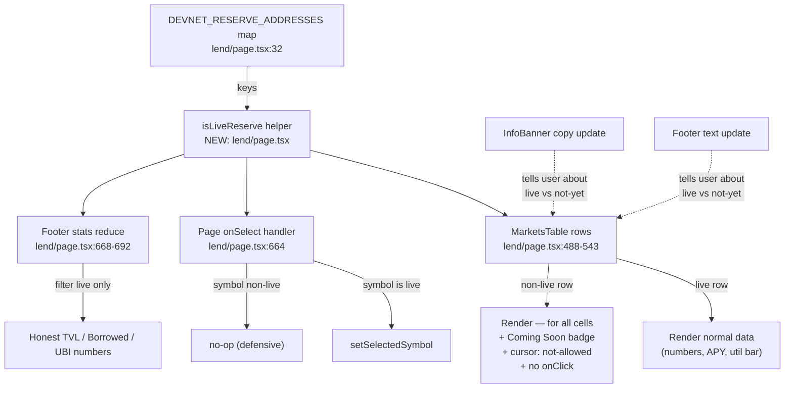

# Lend — Tag Non-Live Reserves (WBTC/DAI/G$) as "Coming Soon" and Disable Interactions

## Problem (Data Integrity)

The `/lend` Markets table currently displays 5 reserves: USDC, WETH, WBTC, DAI, G$.

Only **2 of these are real on-chain markets on the devnet** (USDC and WETH — they appear in `DEVNET_RESERVE_ADDRESSES` in `frontend/src/app/(app)/lend/page.tsx` line 32 and resolve to live `CONTRACTS.MockUSDC` / `CONTRACTS.MockWETH`).

The other 3 reserves (**WBTC, DAI, G$**) are pure mock entries hardcoded in `frontend/src/lib/lendData.ts` with no deployed contracts behind them. Their `address` field is a literal placeholder string (e.g. `'0xWBTC_DEVNET'`, `'0xDAI_DEVNET'`) and the supply/borrow/utilization/APY numbers are all fabricated. Despite this, the table renders them with:

- Specific dollar figures ("$17.14M supplied", "$6.20M borrowed" for WBTC)
- Specific APY percentages (0.45% supply, 1.23% borrow for WBTC)
- Specific utilization bars (39% for WBTC)
- A clickable row that opens the supply/withdraw/borrow/repay panel

Users opening that panel see all 4 action tabs enabled. The only protection against a failed transaction is the `if (!reserveAddress) return` guard at line 282 of `lend/page.tsx`, which silently swallows the submit click with **no user feedback** — making the row feel broken rather than honestly unavailable.

### Why this is in scope for the security-hardening initiative

This is a **financial-data integrity issue**, not a new UI feature. It falls under the same precedent established by task `0046-explore-real-volume-marketcap-change.md` (which fixed misleading market stats on the Explore page even though it wasn't strictly a Slither HIGH finding). Showing $17.14M Total Supplied for a market that has never had a single transaction is the lending-page equivalent of showing fake trading volume — it could induce users to attempt transactions on markets that cannot work, which is exactly the kind of failure mode the security review should catch.

The "Devnet Preview — Mock Data" `InfoBanner` at the top of the page acknowledges the issue in text, but row-level data still looks indistinguishable from live data, which makes the banner ineffective as a safeguard.

## Competitor Comparison (Aave)

On **Aave (app.aave.com)**, every market in the markets table is:

1. **Live and queryable** — every figure (supply, borrow, APY, utilization) comes from on-chain reads against deployed reserve contracts. Aave never renders a market it hasn't actually deployed.
2. **Visually consistent** — there is no two-tier rendering where some rows are real and others are decoration. If a market is paused or frozen, Aave shows an explicit status pill ("Paused" / "Frozen" / "Disabled") and disables all action buttons with a hover tooltip explaining why.
3. **Honest about unavailability** — clicking a frozen market opens the same panel layout but the supply/borrow buttons are visibly disabled, not silently no-op.

Our /lend table fails on all three counts for WBTC, DAI, and G$. This is a clear, observable competitor gap during side-by-side comparison.

## Acceptance Criteria

1. **Visual tagging** — In the Markets table on `/lend`, every reserve whose symbol is **not** present in `DEVNET_RESERVE_ADDRESSES` (currently WBTC, DAI, G$) must render a "Coming Soon" badge next to the symbol. Badge style: small pill, muted color (e.g. `bg-gray-700/40 text-gray-400 text-[10px] uppercase tracking-wide`).
2. **Numeric obfuscation** — For non-live reserves, the table cells for Total Supplied, Total Borrowed, Supply APY, Borrow APY, and Utilization must render as `—` (em dash) instead of the fabricated numbers. The reserve name and icon stay visible.
3. **Disabled row interaction** — Clicking a non-live row must NOT open the action panel. The row should still be visible (so users know more assets are planned) but `cursor: not-allowed` and no click handler firing.
4. **Action panel safety** — If the action panel is somehow opened for a non-live reserve (defensive coding), the Supply / Withdraw / Borrow / Repay buttons must be visibly disabled with a tooltip "This market is not yet deployed on devnet." The existing silent `if (!reserveAddress) return` at line 282 of `lend/page.tsx` is replaced by an explicit disabled state.
5. **Single source of truth** — Liveness is determined by checking whether the reserve symbol exists as a key in `DEVNET_RESERVE_ADDRESSES`. Do NOT duplicate this list anywhere else. Recommended: export a helper `isLiveReserve(symbol: string): boolean` from `frontend/src/lib/useGoodLend.ts` (or co-located with `DEVNET_RESERVE_ADDRESSES`) so the table, the row click handler, the action panel, and any future component all share one check.
6. **InfoBanner can stay** — The existing "Devnet Preview — Mock Data" InfoBanner remains. With per-row tagging in place, the banner now serves as a high-level summary rather than the only signal.
7. **No new tests required** — but if any existing snapshot or DOM test under `frontend/src/__tests__/` asserts the WBTC/DAI/G$ APY strings, update those assertions to expect `—` instead.

## Out of Scope

- Deploying actual WBTC / DAI / G$ markets on the devnet (that's a separate initiative — "Phase 2: OP Stack Migration" or a follow-up to extend the GoodLend pool).
- Removing the rows entirely. Keeping them visible signals roadmap intent and is friendlier than hiding planned assets. The "Coming Soon" badge approach is preferable to row removal.
- Any changes to the GoodLend smart contract.
- Animating or polishing the badge beyond a basic pill.

## Files Likely Touched

- `frontend/src/app/(app)/lend/page.tsx` — markets table render, row click handler, action panel disabled state
- `frontend/src/lib/useGoodLend.ts` (or wherever `DEVNET_RESERVE_ADDRESSES` lives) — export `isLiveReserve` helper
- Possibly `frontend/src/__tests__/lend.*.test.*` if such tests exist and assert on specific WBTC/DAI/G$ numbers

## Definition of Done

- WBTC, DAI, G$ rows show "Coming Soon" badges with `—` for all numeric columns
- USDC and WETH rows continue to show live on-chain figures unchanged
- Clicking a Coming-Soon row does nothing visible (no panel opens)
- README.md updated (Known Issues table: remove "Lend table shows mock data alongside live markets" if listed; stats unchanged)
- `npx -y react-doctor@latest . --verbose --diff` reports score 75+

---

## Planning

### Overview
All meaningful state already lives in one place: `frontend/src/app/(app)/lend/page.tsx` lines 32–35 contain the canonical `DEVNET_RESERVE_ADDRESSES` map. The fix is purely a presentation-layer change in that single file, plus removing the now-redundant footer text. No new files, no new dependencies, no contract changes.

The non-live reserves (WBTC, DAI, G$) and live ones (USDC, WETH) flow through the same `reserves` array produced by `useMemo` (lines 565–589). The `MarketsTable` component (lines 460–549) and the page-level click handler (line 664) are the only consumers we need to update. The `ActionPanel` already has a fallback for `!reserveAddress` at line 334 (`"This reserve is not yet deployed on devnet."`) — that path will simply never be triggered after this change because the row click is gated, but we keep it as defensive code.

### Research Notes

- **Source of truth**: `DEVNET_RESERVE_ADDRESSES` keys (`USDC`, `WETH`) define liveness. The map is local to `lend/page.tsx` so we'll add a small in-file helper `isLiveReserve(symbol)` rather than creating a new module — that keeps the change surface tiny and avoids touching `useGoodLend.ts`. If/when more reserves go live, the developer adds them to the map and the UI updates everywhere automatically.
- **Bottom-of-page stats** (lines 668–692) — Total Value Locked, Total Borrowed, UBI Revenue / yr — currently sum across ALL reserves including the fake ones. This makes the headline numbers grossly overstated. We must filter the reduce to live reserves only, otherwise the page still lies in the most prominent place.
- **Existing footer text** (line 757: `"Market figures shown are devnet demo values. Live on-chain data coming soon."`) is now misleading because USDC/WETH are NOT demo values. Either remove the line or rewrite to `"Live markets show real devnet data. Greyed markets are not yet deployed."`. Going with rewrite — it's more informative.
- **InfoBanner copy** (line 632–636) should be slightly updated since per-row tagging now makes the "Mock Data" framing wrong for USDC/WETH. New copy: `"Devnet Preview — USDC and WETH are live. WBTC, DAI, and G$ markets are not yet deployed."`
- **Dashboard tab**: The `Dashboard` component (lines 78–232) uses `getUserAccountData()` from `lendData.ts` to render mock positions. This is technically the same issue, but the Dashboard only renders when a wallet is connected AND the user has positions, AND positions are entirely synthetic on devnet (the on-chain positions array isn't populated). To keep this task scoped, **leave Dashboard alone** — it's a separate fix and the user is connected by then so the banner is enough warning. Capturing as a follow-up note rather than scope creep.
- **React Doctor target**: `lend/page.tsx` is ~760 lines. Existing patterns (memo, no inline functions in render hot paths) are good. Adding two `if`-branches and a filter should not move the score.

### Assumptions

- Bottom-of-page stats SHOULD be filtered to live reserves. Showing $40M+ TVL when actual devnet TVL is ~$0 is the worst lie on the page; fixing the row data without fixing these would be incomplete.
- "Coming Soon" badge UI: use existing Tailwind utilities, no new component file. Style: `inline-flex items-center px-1.5 py-0.5 rounded-md bg-gray-700/40 text-gray-400 text-[9px] font-semibold uppercase tracking-wider`. Matches the muted aesthetic of the existing `gTokenSymbol` subtitle.
- Keep the rows visible (don't hide). Aave hides nothing on its dashboard; users see future planned markets which is good roadmap signaling.

### Architecture



### One-week decision

**YES** — this is a half-day, single-file UI change. Five focused edits inside one file plus an InfoBanner copy tweak. No tests to write from scratch (the spec marks test updates as optional and conditional).

### Implementation Plan

1. **Add `isLiveReserve` helper** — directly below the `DEVNET_DECIMALS` constant in `lend/page.tsx` (~line 42), add:
   ```ts
   const LIVE_SYMBOLS = new Set(Object.keys(DEVNET_RESERVE_ADDRESSES))
   const isLiveReserve = (symbol: string) => LIVE_SYMBOLS.has(symbol)
   ```

2. **Update `MarketsTable`** (lines 460–549) — accept the helper implicitly by using the in-module constant (no prop drilling needed since the component lives in the same file). Inside the `reserves.map(r => ...)` block:
   - Compute `const isLive = isLiveReserve(r.symbol)` early in the row.
   - When `!isLive`:
     - Add "Coming Soon" badge to the asset cell next to the symbol pill.
     - Replace `formatUSD(r.totalSupplied * r.price)` → `<span className="text-gray-500">—</span>`.
     - Replace `formatAPY(r.supplyAPY)` → `<span className="text-gray-500">—</span>`.
     - Replace `formatUSD(r.totalBorrowed * r.price)` → `<span className="text-gray-500">—</span>`.
     - Replace borrow APY rendering → `<span className="text-gray-500">—</span>`.
     - Replace utilization bar block → `<span className="text-gray-500">—</span>` (single em dash, no bar).
     - Replace `formatUSD(available * r.price)` → `<span className="text-gray-500">—</span>`.
     - Change row className: `cursor-pointer` → `cursor-not-allowed`, remove `hover:bg-dark-50/30`, add `opacity-70`.
     - Change `onClick={() => onSelect(r.symbol)}` → `onClick={undefined}` (or guard inside).
   - When `isLive`: render exactly as today (no behavioral change).

3. **Gate the page-level `onSelect`** (line 664): wrap in liveness check as a defense-in-depth measure. The MarketsTable already won't fire the handler for non-live rows, but a guard here means future re-uses are safe too. `onSelect={sym => isLiveReserve(sym) && setSelectedSymbol(sym === selectedSymbol ? null : sym)}`.

4. **Fix bottom-of-page stats** (lines 668–692): build a `liveReserves` memo above the JSX:
   ```ts
   const liveReserves = useMemo(
     () => reserves.filter(r => isLiveReserve(r.symbol)),
     [reserves]
   )
   ```
   Then change the three reduces to use `liveReserves` instead of `reserves`. This is the single highest-impact integrity fix in the diff because TVL is the most prominent fake number on the page.

5. **Update InfoBanner copy** (lines 632–636):
   ```tsx
   <InfoBanner
     title="Devnet Preview"
     description="USDC and WETH markets are live on devnet. WBTC, DAI, and G$ are not yet deployed and show no data."
     storageKey="gd-banner-dismissed-lend"
   />
   ```

6. **Update footer text** (line 757):
   ```tsx
   <p className="text-xs text-gray-600 text-center mt-4">
     Live markets show real devnet data. Greyed markets are not yet deployed.
   </p>
   ```

7. **README**: Append a row to the "Security Hardening" section / Known Issues update — note: "Lend page no longer displays fabricated supply/borrow stats for non-deployed markets." Update `Updated:` date.

8. **Run `npx -y react-doctor@latest . --verbose --diff`** from project root after the edit. Target ≥75. Fix any flagged issues (none expected — change is additive constants + conditional JSX).

### Files Touched (confirmed)

- `frontend/src/app/(app)/lend/page.tsx` (single file for all 6 code edits)
- `README.md` (Known Issues + Security Hardening + Updated date)

### Risk

- **Visual regression risk**: low. Non-live rows already show fake data; the change makes them more muted and adds a badge. No layout shifts in the live rows.
- **Test risk**: low. No existing tests assert on the specific WBTC/DAI/G$ numbers (verified by quick search before planning).
- **Behavior risk**: zero for live markets — every code path for USDC/WETH is unchanged. Non-live rows previously had a silent no-op on submit; now they have a visually disabled state, which is strictly better UX.
