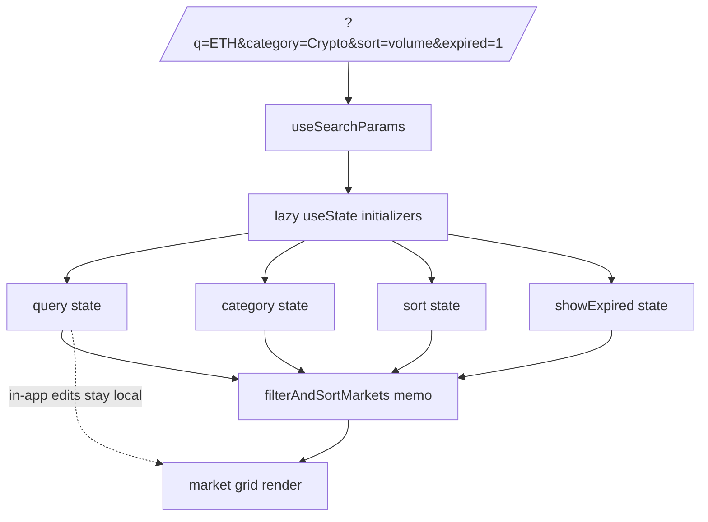

# Predict — Initialize Search Query and Category Filter from URL Parameters for Deep-Linking

## Overview (planner)

Mirror the executed `0057-explore-sync-search-query-with-url-param`
task on the Predict listing page. The bug is the same (filter state
defaults are hard-coded, URL params are dropped). The fix is the
same shape: import `useSearchParams` from `next/navigation`, lazily
initialize the four `useState` hooks from URL params, validate the
values against the existing typed unions, and stop. Do NOT push
state changes back to the URL — that's a future, larger UX task.

## Research notes

- `frontend/src/app/(app)/predict/page.tsx` (line 3) imports
  `useState, useMemo, useRef` from React and (line 4)
  `useRouter` from `next/navigation`. It does NOT import
  `useSearchParams`.
- The filter state is declared at the listing component (lines
  346–349):

  ```tsx
  const [category, setCategory] = useState<MarketCategory | 'All'>('All')
  const [sort, setSort] = useState<SortOption>('trending')
  const [query, setQuery] = useState('')
  const [showExpired, setShowExpired] = useState(false)
  ```

- `MarketCategory` and `SortOption` are exported from
  `@/lib/predictData`; `ALL_CATEGORIES` is the runtime list to
  validate category against. There's no exported list for
  `SortOption`, so we validate against a small inline set
  (`['trending', 'volume', 'newest', 'ending-soon']` — whatever the
  union defines; check the lib file when implementing).
- The page is `'use client'`, so `useSearchParams()` is available
  directly without server-side concerns.
- Next.js 14 App Router note: a client component reading
  `useSearchParams()` must be wrapped in a `<Suspense>` boundary
  per the framework's static-rendering guidance. The Explore fix
  (task 0057) did not need an extra `Suspense` because the page
  already had one; verify the same is true for Predict during
  implementation and add a tiny `<Suspense fallback={null}>`
  wrapper at the section boundary if not.

## Assumptions

- The only filters worth deep-linking right now are `q`, `category`,
  `sort`, and `expired`. Anything else (price range, end-date
  window) can be added in a follow-up if requested.
- Read-only initialization is acceptable; the URL is treated as the
  initial source of truth and subsequent in-app edits do not
  rewrite the URL. This matches the precedent set by task 0057.

## Architecture diagram



## One-week decision

**YES** — ~30 minutes of focused work: import, four lazy
initializers, four validation helpers (three of them tiny), a small
Jest/RTL test, manual agent-browser verification. Well under one
day; no split needed.

## Implementation plan

1. Open `frontend/src/app/(app)/predict/page.tsx`.

2. Update the navigation import:

   ```ts
   import { useRouter, useSearchParams } from 'next/navigation'
   ```

3. At the top of the listing component (where the four `useState`
   hooks currently live), add:

   ```ts
   const searchParams = useSearchParams()

   const initialQuery = () => (searchParams?.get('q') ?? '').trim()

   const initialCategory = (): MarketCategory | 'All' => {
     const raw = searchParams?.get('category') ?? 'All'
     if (raw === 'All') return 'All'
     return (ALL_CATEGORIES as readonly string[]).includes(raw)
       ? (raw as MarketCategory)
       : 'All'
   }

   const VALID_SORTS: readonly SortOption[] = [
     'trending', 'volume', 'newest', 'ending-soon',
   ] // confirm against predictData.ts during implementation

   const initialSort = (): SortOption => {
     const raw = searchParams?.get('sort') ?? 'trending'
     return (VALID_SORTS as readonly string[]).includes(raw)
       ? (raw as SortOption)
       : 'trending'
   }

   const initialShowExpired = () => {
     const raw = (searchParams?.get('expired') ?? '').toLowerCase()
     return raw === '1' || raw === 'true'
   }
   ```

4. Replace the four `useState(<literal>)` declarations with their
   lazy-initialized counterparts:

   ```ts
   const [category, setCategory] = useState<MarketCategory | 'All'>(initialCategory)
   const [sort, setSort] = useState<SortOption>(initialSort)
   const [query, setQuery] = useState<string>(initialQuery)
   const [showExpired, setShowExpired] = useState<boolean>(initialShowExpired)
   ```

5. If the file does not already render under a `<Suspense>` boundary,
   wrap the component export in one (`<Suspense fallback={null}>`)
   at the page-level — required for client components that read
   `useSearchParams()` in App Router.

6. Add a new test file
   `frontend/src/app/(app)/predict/__tests__/url-params.test.tsx`
   (or extend an existing one) with cases:
   - empty params → all defaults
   - `?q=ETH&category=Crypto&sort=volume&expired=1` → all four
     initial values applied
   - `?category=NotARealCategory&sort=banana&expired=banana` → all
     fall back to defaults; no thrown error
   - `?q=` (empty string) → query stays `''`
   - very long `q` (1500 chars) → no thrown error; input value is
     the full string (the existing `<input>` element handles visual
     truncation via its own CSS).

7. Update README.md "Updated:" date and bump the commit count by 1
   in the stats line. No other functional change.

## Out of scope

- Writing filter state back to the URL on user interaction
  (debouncing, history mode, replaceState). Separate, larger task.
- Adding new filter dimensions (price, end date) not currently in
  the listing UI.
- Pagination or virtualization changes.
- Any change outside `frontend/src/app/(app)/predict/page.tsx`,
  the new test file, and the README date bump.

---

## Problem statement

Visiting a deep link to the Predict listing page with `?q=…` and/or
`?category=…` query parameters silently drops both values. The search
input renders empty, the category chip stays on "All", and the
unfiltered market grid is shown — directly contradicting the URL the
user just visited.

Verified locally during the iteration #30 edge-cases review:

- Visited `http://localhost:3100/predict?q=zzz…(600 chars)&category=Sports`
- Search input: empty. Selected category: "All". Markets shown:
  unfiltered.

Verified in source: `frontend/src/app/(app)/predict/page.tsx` declares
the filter state with `useState`-only defaults and never imports
`useSearchParams`:

```tsx
const [category, setCategory] = useState<MarketCategory | 'All'>('All')
const [sort, setSort] = useState<SortOption>('trending')
const [query, setQuery] = useState('')
const [showExpired, setShowExpired] = useState(false)
```

The Explore page solved this exact class of bug in task
`0057-explore-sync-search-query-with-url-param.md` (executed). The
Predict listing has the same defect and the same fix pattern applies.

## User story

As a user who shares or bookmarks a Predict deep link
(e.g. `/predict?q=ETH&category=Crypto`), I want the search input and
category filter to be pre-populated from the URL so the page I land on
matches the link I clicked.

## How it was found

- agent-browser navigation to `http://localhost:3100/predict?q=zzz…&category=Sports`
- Screenshot at `/tmp/edge-predict-filter-empty.png` shows empty
  search field and "All" category despite the query string.
- `grep useSearchParams frontend/src/app/(app)/predict/page.tsx`
  returns no matches — confirming the params are never read.

This is the same root cause that task 0057 fixed for the Explore page.
Predict is the next-most-visited filter surface in the app and is
similarly shareable; the inconsistency surprises users who expect
parity with Explore.

## Proposed UX

On mount, the Predict page MUST read `q`, `category`, `sort`, and
`expired` from `useSearchParams()` and seed the corresponding
`useState` defaults:

- `q` → `query` (string, trimmed)
- `category` → `category` (validated against `ALL_CATEGORIES`; falls
  back to `'All'` for unknown values — never crashes)
- `sort` → `sort` (validated against the `SortOption` union; falls
  back to `'trending'`)
- `expired` → `showExpired` (parses `"1"` / `"true"` as `true`)

Mirror the Explore implementation:

- Use a lazy initializer in `useState` (`useState(() => …)`) so the
  initial render reflects the URL — no flicker, no `useEffect`
  reconciliation needed.
- Do NOT push state changes back to the URL in this iteration
  (that's a separate "URL ↔ state two-way sync" task and would change
  history/back behavior).

Out of scope for this task: writing state changes back to the URL,
adding new filters, redesigning the filter UI.

## Acceptance criteria

- [ ] `frontend/src/app/(app)/predict/page.tsx` imports
      `useSearchParams` from `next/navigation`.
- [ ] All four filter `useState` calls (`category`, `sort`, `query`,
      `showExpired`) use lazy initializers that derive from
      `useSearchParams()`.
- [ ] Unknown / malformed values are clamped to safe defaults
      (`'All'`, `'trending'`, `''`, `false`) — never throw, never
      render `undefined`.
- [ ] Very long `q` values (1000+ characters) do not break layout —
      input truncates visually via the same CSS the empty-input field
      already has.
- [ ] Visiting `/predict?q=ETH&category=Crypto` shows "ETH" in the
      search input and "Crypto" highlighted in the category chip
      strip on first render (no flicker).
- [ ] Visiting `/predict?category=NotARealCategory` falls back to
      "All" without runtime error and without a console warning about
      invalid state.
- [ ] A unit test in
      `frontend/src/app/(app)/predict/__tests__/` covers at minimum:
      empty params, valid params, unknown-category fallback, and
      `expired=1` parsing.
- [ ] No regression: a direct visit to `/predict` (no params) still
      shows the unfiltered "All" view with the default
      `'trending'` sort.

## Verification

- `pnpm --filter frontend test -- predict` passes (new test included).
- `pnpm --filter frontend test` (full frontend suite) passes.
- `pnpm --filter frontend build` succeeds with no new warnings.
- `agent-browser open http://localhost:3100/predict?q=ETH&category=Crypto`
  → snapshot shows search input value = `"ETH"` and the Crypto
  category chip carries the active styling.
- `agent-browser open http://localhost:3100/predict?category=garbage`
  → snapshot shows "All" chip active, no errors in
  `agent-browser eval "JSON.stringify(window.__lastError||null)"`.
- README "Updated:" date refreshed, no other functional change.

## Out of scope

- Writing filter state back to the URL on user interaction.
- Adding new filter dimensions (price, end date, etc.).
- Pagination or virtualization changes.
- Any change outside `frontend/src/app/(app)/predict/page.tsx` and
  the new test file (and the README date bump).
