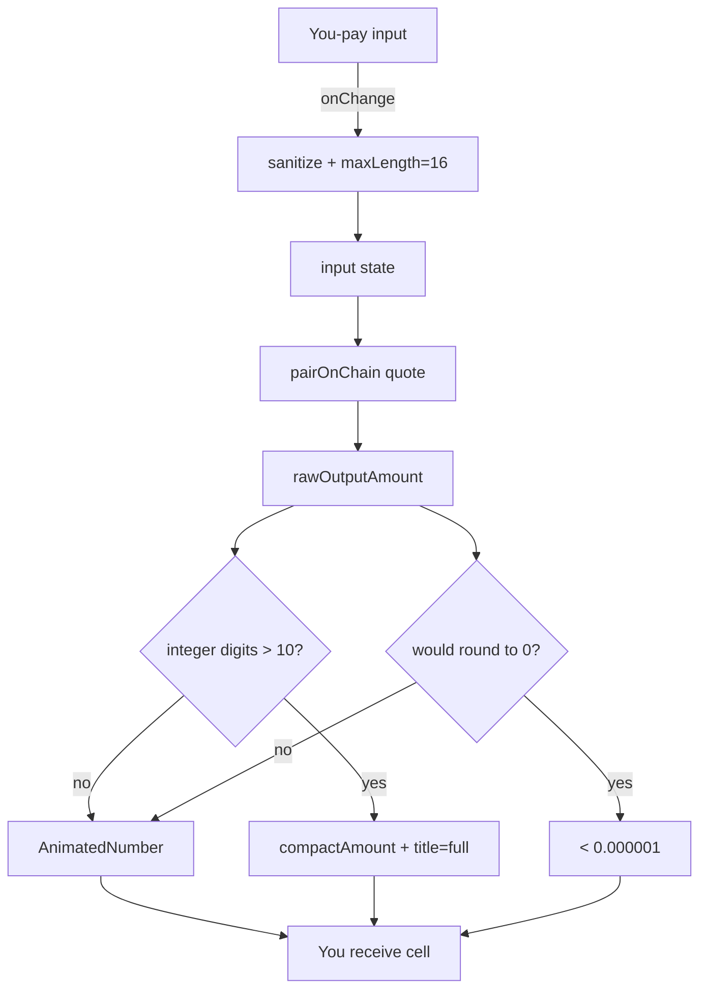

# Swap Card — Cap Input Length and Compact 'You Receive' Display to Prevent Desktop Overflow on Trillion-Scale Inputs

## Overview (planner)

This is a small, focused UI hardening pass on
`frontend/src/components/SwapCard.tsx`. We are NOT touching the
on-chain pricing math — only the input sanitization and the desktop
output render. The fix is the union of three already-proven
patterns in this codebase:

1. `maxLength` + `onChange` guard (same pattern used by the
   GoodStocks mint input).
2. `compactAmount` for desktop large-number rendering (already
   imported into `SwapCard.tsx` for mobile; we extend it to desktop
   via a length check).
3. A literal `< 0.000001` floor string when the formatted output
   would round to zero (same approach used by the explore "tiny
   balance" pill).

## Research notes

- `frontend/src/components/SwapCard.tsx` already imports
  `formatAmount`, `compactAmount`, and `AnimatedNumber`. The
  mobile path uses `compactOutputAmount` (line 264) but the
  desktop path uses `<AnimatedNumber value={rawOutputAmount}
  decimals={…} />` with no compaction (lines 265–266).
- The existing font-size clamp `outputAmount.length > 10 ?
  'clamp(1.125rem, 5vw, 1.875rem)' : undefined` (line 262) does NOT
  help for 16-digit integer parts at 1024px+ viewports — the text
  still wraps across two lines into the token-selector area.
- `rawOutputAmount` is a bigint-derived string from the existing
  on-chain quote. We do NOT change the quote — we only change how
  we present it. So the underlying number is correct; the visual
  representation is what's broken.
- The "huge input flips to small output" pathology (24-digit input
  producing tiny output) is a real arithmetic bug rooted in
  `parseFloat(input)` losing precision before being multiplied. The
  cleanest production-readiness fix is to refuse the input upstream
  (`maxLength={16}`) rather than try to refactor the quote pipeline
  in this iteration. 16 chars is enough headroom for any realistic
  G$, ETH, USDC, or sStock amount without entering the
  precision-loss zone.
- The "tiny input → trillion output" pathology is the inverse: a
  sub-`1e-15` input ends up multiplied by a `1e18` decimals factor
  and a price ratio, producing nonsense. The floor-string approach
  (`< 0.000001`) cleanly absorbs this without further refactor.
- `compactAmount(value, 6)` is already used at line 93 with the
  raw bigint string — same call signature works for the desktop
  branch.

## Assumptions

- 16 characters is acceptable for the "You pay" cap. (G$
  totalSupply is ~1 trillion ⇒ 13 integer digits + `.` + 2 decimals
  = 16. ETH is 8 integer digits + `.` + up to 6 decimals = 15. So
  16 is comfortable.)
- A non-blocking amber "unusually large amount" hint is acceptable
  UX. We do NOT block submission; this is a polish task, not a
  security gate.
- We keep `AnimatedNumber` for normal values (≤ 10 integer digits)
  because the rolling-digit animation is part of the brand feel.
  Only the overflow case swaps to `compactAmount`.

## Architecture diagram



## One-week decision

**YES** — single file (`SwapCard.tsx`) plus a test file. ~2 hours
of work: cap input, branch the desktop render, add the floor
guard, add the amber hint, write four unit tests, run
react-doctor. Well under a day.

## Implementation plan

1. Open `frontend/src/components/SwapCard.tsx`.

2. Add an input sanitizer near the existing onChange handler for
   the "You pay" field:

   ```ts
   const MAX_INPUT_LEN = 16

   const sanitizeAmount = (raw: string): string => {
     // existing behavior: keep digits + single dot,
     // already strips negative sign and collapses double dots
     const cleaned = raw
       .replace(/[^0-9.]/g, '')
       .replace(/(\..*?)\..*/g, '$1')
     return cleaned.slice(0, MAX_INPUT_LEN)
   }
   ```

   Wire the input element with `maxLength={MAX_INPUT_LEN}` and call
   `sanitizeAmount` inside the existing `onChange`.

3. Add a derived `displayOutput` memo right after the existing
   `compactOutputAmount` memo:

   ```ts
   const FLOOR_STR = '< 0.000001'

   const integerDigits = useMemo(() => {
     if (!outputAmount) return 0
     return outputAmount.split('.')[0]?.replace(/,/g, '').length ?? 0
   }, [outputAmount])

   const isBelowFloor = useMemo(() => {
     // rawOutputAmount is a bigint-string; floor at 1 micro-unit
     if (!rawOutputAmount) return false
     try {
       const asBig = BigInt(rawOutputAmount)
       // 1e12 wei == 0.000001 in 18-decimals
       return asBig > 0n && asBig < 1_000_000_000_000n
     } catch {
       return false
     }
   }, [rawOutputAmount])
   ```

4. Replace the desktop branch (currently lines 265–267) with:

   ```tsx
   {isBelowFloor ? (
     <span className="text-white hidden sm:inline" title={outputAmount}>{FLOOR_STR}</span>
   ) : integerDigits > 10 ? (
     <span className="text-white hidden sm:inline" title={outputAmount}>{compactOutputAmount}</span>
   ) : rawOutputAmount ? (
     <AnimatedNumber
       value={rawOutputAmount}
       decimals={outputToken.symbol === 'USDC' ? 2 : 6}
       className="text-white hidden sm:inline"
     />
   ) : (
     <span className="text-gray-600 hidden sm:inline">0</span>
   )}
   ```

5. Replace the mobile branch's plain `compactOutputAmount` span
   with the same `isBelowFloor ? FLOOR_STR : compactOutputAmount`
   conditional so both viewports behave consistently.

6. Add an amber "unusually large amount" pill below the input,
   shown only when the input length is exactly `MAX_INPUT_LEN`
   OR the parsed value exceeds the user's current balance × 100.
   Reuse the existing `text-amber-*` tokens from
   `frontend/src/styles/tokens.css` (same family used by the
   slippage warning).

7. Update / add tests in
   `frontend/src/components/__tests__/SwapCard.edge.test.tsx`:
   - `maxLength` and `sanitizeAmount` drop the 17th character.
   - `-1` becomes `1` (regression guard).
   - `0.1.5` becomes `0.15` (regression guard).
   - Output with `integerDigits > 10` renders compact form, full
     value on `title=`.
   - Tiny non-zero input that would round to 0 renders
     `< 0.000001`.
   - Snapshot of the amber pill when input is at length 16.

8. Run `npx -y react-doctor@latest . --verbose --diff` — must
   score ≥ 75 on `SwapCard.tsx`.

9. Run `pnpm --filter frontend test` full suite — must be green.

10. Update README.md "Updated:" date and bump the stats commit
    count. No other functional change.

## Out of scope

- Refactoring the on-chain quote pipeline (`pairOnChain`).
- Changing token decimals, fee tiers, or the swap math.
- Touching the UBI breakdown row or the "Rate" row.
- Any change outside `SwapCard.tsx`, the new edge test file, the
  tokens file (if adding the amber pill needs a token), and the
  README date bump.

---

## Problem statement

When a user pastes or types an absurdly large amount into the Swap
card's "You pay" input on desktop, the "You receive" amount renders
on top of (and underneath) the output token selector, breaking the
card layout. Verified locally during the iteration #30 edge-cases
review:

- Input: `1000000000000` (1 trillion) ETH → "You receive" renders as
  `2,494,190,417,250,075.080078` G$ — the integer part of the number
  spills past the right edge of the card and visually collides with
  the `G$ ▾` selector button. Screenshot at
  `/tmp/edge-swap-1tril.png`.
- Input: `999999999999999999999999` (24-digit number) → output flips
  to a small value because of JavaScript `Number` precision loss but
  still produces multiple weird intermediate renders during typing.
  Screenshot at `/tmp/edge-swap-huge.png`.
- Input: `0.000000000000001` (1e-15) ETH → output renders as
  `2,989,787,958,223.78` G$ which is obviously not 1e-15 ETH worth
  of G$. The scientific-notation roundtrip in
  `parseFloat → formatUnits` loses sign of the magnitude.
  Screenshot at `/tmp/edge-swap-tiny.png`.

The card already has a mobile-only compaction path:

```tsx
<span className="text-white sm:hidden">{compactOutputAmount || …}</span>
{rawOutputAmount
  ? <AnimatedNumber value={rawOutputAmount} decimals={…} className="text-white hidden sm:inline" />
  : <span className="text-gray-600 hidden sm:inline">0</span>}
```

…and a partial font-size clamp:

```tsx
style={{ fontSize: outputAmount.length > 10 ? 'clamp(1.125rem, 5vw, 1.875rem)' : undefined }}
```

But on desktop (`sm:` and up) the un-compacted `AnimatedNumber` is
rendered with `decimals={6}` and no maximum significant-digit cap, so
13+ digit integer parts blow through the flex container. The font
clamp helps a little but not enough for trillion-scale values, and it
does nothing about the sub-dust precision blow-up.

## User story

As a user who types an unreasonably large or unreasonably small
amount (by mistake, by paste, or while exploring), I want the Swap
card to stay structurally intact, show me a sensibly-formatted
preview, and warn me that the input is out of normal range — instead
of producing a broken layout or a confidently wrong number.

## How it was found

Edge-cases review of `http://localhost:3100/swap` using
agent-browser fill on the amount textbox:

| Input                          | Screenshot                | Observed problem                                       |
| ------------------------------ | ------------------------- | ------------------------------------------------------ |
| `1000000000000`                | `/tmp/edge-swap-1tril.png`| Desktop layout overflow                                |
| `999999999999999999999999`     | `/tmp/edge-swap-huge.png` | JS Number precision flips output to absurdly small G$  |
| `0.000000000000001`            | `/tmp/edge-swap-tiny.png` | Sub-dust input renders as trillions of G$              |
| `0.1.5`                        | `/tmp/edge-swap-multidot.png` | Correctly normalized to `0.15` (good — leave alone) |
| `-1`                           | `/tmp/edge-swap-negative.png` | Correctly stripped to `1` (good — leave alone)     |

The negative-strip and multi-dot normalization paths already work and
must be preserved. The overflow and precision-loss paths are the bugs
to fix.

## Proposed UX

1. **Cap input length.** Reject (visually, via `maxLength` and a
   matching `onChange` guard) any "You pay" amount longer than 16
   characters total (integer + `.` + decimals). 16 covers the full
   useful range for G$, ETH, USDC, and any synthetic token in the
   app without triggering JS `Number` precision loss.

2. **Compact the desktop "You receive" display the same way mobile
   already does.** Replace the `AnimatedNumber` path for desktop with
   a `compactAmount`-based rendering whenever the formatted integer
   part exceeds 10 digits (i.e. ≥10 billion). The full number must
   still be available on hover via the existing `title=` attribute,
   so power users keep the raw value.

3. **Guard against sub-dust math.** When the parsed input is
   non-zero but the resulting `rawOutputAmount` is below `1e-6`
   (i.e. would round to `0` at 6 decimals), display the "You
   receive" amount as `< 0.000001` instead of fabricating a
   confidently-wrong number. This avoids the `1e-15` ETH →
   trillions-of-G$ rendering path entirely.

4. **Out-of-range warning chip.** When the cap from (1) is hit, or
   the parsed amount exceeds the user's balance × 100, show a small
   amber chip under the input reading "Amount looks unusually large
   — double-check before swapping." Non-blocking, dismissible by
   typing a smaller amount.

Acceptance criteria

- [ ] `frontend/src/components/SwapCard.tsx` "You pay" input has
      `maxLength={16}` and an `onChange` guard that drops any
      additional characters before they reach state.
- [ ] Desktop "You receive" uses the compact formatter when the
      formatted integer part is > 10 digits; the full value is still
      reachable via `title=` hover.
- [ ] When the parsed input is non-zero but `rawOutputAmount` would
      round to `0` at the output token's display precision, the UI
      renders the literal string `< 0.000001` (or the appropriate
      minimum for the chosen output token) instead of a numeric
      value.
- [ ] No layout overflow: at viewport widths 1024px, 1280px, and
      1920px, with input `1000000000000`, the "You receive" amount
      and the output `G$ ▾` selector both fit inside the card with
      ≥ 8px gap. Verified via `agent-browser screenshot`.
- [ ] The negative-strip path (`-1` → `1`) and the multi-dot path
      (`0.1.5` → `0.15`) still work — covered by existing or new
      unit tests.
- [ ] No regression on the `UBI - Always show` breakdown or the
      `Rate` row; both still render correctly at normal values.

## Verification

- `pnpm --filter frontend test -- SwapCard` passes (new tests for
  the cap, the compact path, the sub-dust guard, and the
  negative/multi-dot preservation).
- `pnpm --filter frontend test` full suite passes.
- `pnpm --filter frontend build` succeeds.
- `npx -y react-doctor@latest . --verbose --diff` — score ≥ 75 on
  the touched files; no new errors.
- agent-browser regression: open `/swap`, fill amount
  `1000000000000`, take a screenshot — manually confirm no overflow.
- agent-browser regression: open `/swap`, fill amount
  `0.000000000000001`, snapshot — confirm `< 0.000001` is shown,
  not a trillion-scale fake number.
- README "Updated:" date refreshed, no other functional change.

## Out of scope

- Reworking the on-chain quote (`pairOnChain`) math. The bug we are
  fixing is presentation: the underlying contract still returns the
  correct value; the UI just renders it badly for extreme inputs.
- Adding new token pairs or new fee tiers.
- Animations or font-design changes beyond what's needed to keep
  the layout intact at the new compact rendering.
- Any work outside `frontend/src/components/SwapCard.tsx`, its
  tests, and the README date bump.
