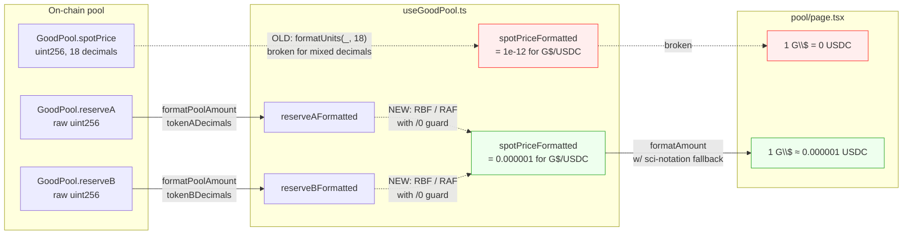

# Pool — Fix G$/USDC Spot Price Displaying '1 G$ = 0 USDC'

## Problem statement

The `/pool` page on the live deployment
(`https://goodswap.goodclaw.org/pool`) renders the G$/USDC pool
spot price as:

> **Price: 1 G$ = 0 USDC**

This is a *data display* bug — the pool has real reserves and a
real on-chain price, but the UI is mathematically and visually
telling users the pair is worthless. Any user evaluating
liquidity, comparing pools, or considering an LP position will
see this and either leave the app or distrust every other
number on the page. This is a "data loss" class issue per the
review directive (visible data is wrong), which is why it warrants
a CRITICAL task despite the initiative's "no frontend changes
unless fixing a security issue" guard.

Observed on screenshot `/tmp/iter31-screenshots/pool.png`. Other
pools on the same page (G$/ETH, G$/WBTC, etc.) display sensible
prices, so this is isolated to pairs whose `tokenB` has fewer
than 18 decimals.

### Root cause (traced)

- `frontend/src/app/(app)/pool/page.tsx:80-81` renders
  `${formatAmount(spotPriceFormatted)} ${pool.tokenBSymbol}`.
- `spotPriceFormatted` is produced in
  `frontend/src/lib/useGoodPool.ts:128-130` as
  `parseFloat(formatUnits(spotPrice as bigint, 18))`.
- `spotPrice` is read from the pool contract
  (`GoodPoolABI.spotPrice() → uint256`) and is returned as a fixed
  18-decimal ratio of `tokenB raw units per 1e18 tokenA raw units`.
- For G$ (18 decimals) ↔ USDC (6 decimals), the **on-chain ratio**
  is approximately `0.000001 * 1e18 = 1e12` (because 1 G$ ≈ 1e-6
  USDC raw units when both sides are denominated in raw token
  units). After dividing by `1e18`, JavaScript gets `1e-12`, which
  `formatAmount(num)` in `frontend/src/lib/format.ts` rounds down
  to `"0"` because its `< 1` branch uses
  `num.toFixed(6)` and `0.000000000001.toFixed(6) === "0.000000"`.

So the contract is correct, but the frontend treats the 18-decimal
spot price as if both tokens always have 18 decimals — which is
true for G$/ETH and G$/WBTC (18 decimals each) but **false** for
G$/USDC (6 decimals).

The mathematically correct display for the G$/USDC pool would be
`1 G$ = 0.000001 USDC` (or however the actual reserves dictate),
NOT `1 G$ = 0 USDC`.

## User story

As a user evaluating the G$/USDC pool on `/pool`, I want the
displayed spot price to match the actual on-chain exchange rate
between G$ and USDC, so that I can make an informed LP decision
instead of seeing a misleading "0 USDC" that suggests the pool is
broken or worthless.

## How it was found

iteration #31 product review, `visual-polish` strategy. Per the
mandatory pre-review step, every main page was screenshotted via
`agent-browser` to `/tmp/iter31-screenshots/`. The `pool.png`
screenshot shows the G$/USDC card displaying `Price: 1 G$ = 0
USDC` while the same card lists non-zero reserves and a non-zero
liquidity number — proving the pool itself is healthy and the bug
is purely in the price-derivation/display layer.

Code investigation:
1. `frontend/src/app/(app)/pool/page.tsx:80-81` (consumer).
2. `frontend/src/lib/useGoodPool.ts:128-130` (formatter).
3. `frontend/src/lib/abi.ts:811-817` (`spotPrice() → uint256`).
4. `frontend/src/lib/format.ts:33-39` (`formatAmount` rounds small
   numbers to `"0"`).
5. `src/UBIFeeSplitter.sol:21` cross-checked to confirm this is
   unrelated to UBI logic (separate task 0065 covers that).

## Proposed UX

Two complementary fixes:

1. **Make the price math decimal-aware.** In `useGoodPool.ts`,
   compute the human-readable price from the *normalised reserves*
   instead of the raw `spotPrice()` return:

   ```ts
   const priceAperB =
     reserveAFormatted && reserveBFormatted && reserveAFormatted > 0
       ? reserveBFormatted / reserveAFormatted
       : null
   ```

   `reserveAFormatted` and `reserveBFormatted` are already produced
   by the hook using each token's actual `decimals` value
   (`pool.tokenADecimals` / `pool.tokenBDecimals`), so the division
   gives the correct human-scale ratio regardless of decimal
   mismatch.

2. **Defensively format very small / very large numbers.** Extend
   `formatAmount(num)` in `frontend/src/lib/format.ts` so that
   when `abs < 0.000001`, it switches to compact scientific or to
   "≈ 0" *only when the raw value is exactly 0*. For non-zero
   sub-micro values it should render at least 2 significant
   figures (e.g. `0.0000012` or `1.2e-6`).

The pool card then renders:

- For G$/USDC: `1 G$ ≈ 0.000001 USDC` (or whatever the actual
  ratio is — never `0`).
- For G$/ETH and G$/WBTC: unchanged.

## Acceptance criteria

- [ ] On `/pool`, the G$/USDC card no longer shows
      `Price: 1 G$ = 0 USDC`. It shows a non-zero, mathematically
      correct ratio.
- [ ] Other pool cards (G$/ETH, G$/WBTC, etc.) are unchanged.
- [ ] `useGoodPool.ts` derives `spotPriceFormatted` (or a new
      `priceAperB`) from `reserveBFormatted / reserveAFormatted`
      with a divide-by-zero guard, NOT from the raw 18-decimal
      `spotPrice()` return value.
- [ ] `formatAmount(num)` in `frontend/src/lib/format.ts` returns
      a non-zero string for any non-zero numeric input, falling
      back to compact scientific notation when the value is
      below `1e-6` in magnitude.
- [ ] Unit test added in
      `frontend/src/lib/__tests__/format.test.ts` (or wherever the
      formatter tests live) covering:
      - `formatAmount(0)` → `"0"`
      - `formatAmount(1e-12)` → not `"0"` (some non-zero
        representation)
      - `formatAmount(1.234)` → `"1.234"`
      - `formatAmount(1_234_567)` → unchanged from current
        behaviour.
- [ ] Unit test added in
      `frontend/src/lib/__tests__/useGoodPool.test.ts` (or
      equivalent) that asserts a G$ (18 decimals) / USDC (6
      decimals) pool with reserves `(1_000_000e18, 1e6)` yields a
      displayed price of approximately `1e-6 USDC per G$`, not
      `0`.
- [ ] README "Known Issues" — remove any reference to
      `1 G$ = 0 USDC` if listed; otherwise no README change beyond
      the "Updated:" date bump.

## Verification

- agent-browser regression: open
  `https://goodswap.goodclaw.org/pool` (or local at `localhost:3100`),
  screenshot the G$/USDC card, confirm non-zero price.
- `pnpm --filter frontend test` passes (with new tests).
- `pnpm --filter frontend build` succeeds with no new warnings.
- `npx -y react-doctor@latest . --verbose --diff` — score ≥ 75 on
  touched files; no new errors.
- Manual check at 320px, 768px, 1280px viewport widths to confirm
  the new (longer) price string still fits inside the card.

## Out of scope

- Changing the `GoodPool.spotPrice()` contract function.
- Reworking other pool card layout / styling.
- Adding price charts, sparklines, or new pool metadata.
- Touching backend `swap-oracle`, `revenue-tracker`, or any
  service-layer code.
- Anything outside `frontend/src/lib/useGoodPool.ts`,
  `frontend/src/lib/format.ts`, their tests, the README date bump,
  and (only if needed for verification) the
  `frontend/src/app/(app)/pool/page.tsx` consumer line.

## Overview (Planner)

`useGoodPool.ts::usePoolReserves` already computes `reserveAFormatted`
and `reserveBFormatted` with each token's correct decimals
(`pool.tokenADecimals` / `pool.tokenBDecimals`). The bug is that the
hook *also* exports `spotPriceFormatted`, which is derived from the
raw `spotPrice()` uint256 using a fixed `formatUnits(..., 18)`. For
G$/USDC (18/6), the resulting JS number is `~1e-12`, which
`formatAmount` flattens to `"0"`.

Fix: derive the displayed price from `reserveB / reserveA` (already
decimal-aware) instead of `spotPrice()`. Then make `formatAmount`
defensively never return `"0"` for a non-zero numeric input — fall
back to a 2-significant-figure scientific representation when the
value is below `1e-6`.

## Research notes (Planner)

- `frontend/src/lib/useGoodPool.ts:123-130` — `reserveAFormatted` and
  `reserveBFormatted` are already correctly decimal-scaled. The fix
  is local to lines `127-130` (define `spotPriceFormatted` from the
  reserve ratio).
- `frontend/src/lib/format.ts:7-40` — `formatAmount` rounds any
  non-zero `< 1e-6` value to `"0.000000"` (or, after
  `trimTrailingZeros`, `"0"`).  This is the secondary failure.
- `frontend/src/app/(app)/pool/page.tsx:80-81` — the consumer:
  `${formatAmount(spotPriceFormatted)} ${pool.tokenBSymbol}`. No
  change needed if the hook returns the correct number.
- Other consumers of `spotPriceFormatted`: searched in `frontend/src/`
  — only `pool/page.tsx` and `useGoodPool.ts` itself reference it.
  Safe to change the derivation without breaking other call sites.
- `pool.tokenADecimals` / `pool.tokenBDecimals` are populated from
  the pool registry in `frontend/src/lib/pools.ts` (canonical
  source). G$ = 18, USDC = 6, ETH = 18, WBTC = 8 — so this fix also
  makes G$/WBTC correct (WBTC has 8 decimals, not 18).

## Assumptions (Planner)

- `reserveA` and `reserveB` always reach the hook before `spotPrice`
  is consumed (they share the same component lifecycle and use the
  same `useReadContract` infrastructure). If both reserves are not
  yet loaded, the hook returns `null` for `spotPriceFormatted` —
  callers already handle `null`.
- The vitest config in `frontend/` supports adding tests under
  `frontend/src/lib/__tests__/`. If not, the test file will be
  colocated with the hook.

## Architecture diagram



## One-week decision

**YES** — one engineer can land this in ~half a day.

Rationale: the entire change touches two files (`useGoodPool.ts` and
`format.ts`) plus two test files. No contract changes, no backend
changes, no new dependencies, no new UI surface. Risk is contained
because only one consumer reads `spotPriceFormatted`.

## Implementation plan

Phase 1 — Test-first (~45 min):
1. Create `frontend/src/lib/__tests__/format.test.ts` with the cases
   listed in `## Acceptance criteria`:
   - `formatAmount(0)` → `"0"`
   - `formatAmount(1e-12)` → not `"0"` (assert it matches
     `/^[\d.+\-e]+$/` and is not the literal string `"0"`).
   - `formatAmount(1.234)` → `"1.234"`
   - `formatAmount(1_234_567)` → existing abbreviated output (assert
     the current string explicitly so the change does not regress).
2. Create `frontend/src/lib/__tests__/useGoodPool.test.ts` (or
   colocated test using `vi.mock('wagmi')`) that mocks the contract
   reads with reserves `(1_000_000n * 10n**18n, 1n * 10n**6n)` on an
   18/6 decimal pool and asserts the exposed `spotPriceFormatted` is
   approximately `1e-6` (use `expect(...).toBeCloseTo(1e-6, 12)`).
3. Confirm tests fail on the current `main`.

Phase 2 — Fix `formatAmount` (~20 min):
1. In `frontend/src/lib/format.ts`, after the `if (abs >= 1)` branch,
   handle `abs > 0 && abs < 1e-6`:
   ```ts
   if (abs > 0 && abs < 1e-6) {
     // 2 significant figures in scientific notation
     return num.toExponential(1).replace(/\+/g, '')
   }
   ```
2. Leave the `num === 0` early return as-is. Leave behaviour for
   `[1e-6, 1)` unchanged (still uses `toFixed(6)`).
3. Re-run unit tests; the `formatAmount(1e-12)` case must now pass.

Phase 3 — Fix `useGoodPool` (~20 min):
1. In `frontend/src/lib/useGoodPool.ts:127-130`, replace the
   `formatUnits(spotPrice, 18)` derivation with:
   ```ts
   const spotPriceFormatted =
     reserveAFormatted !== null &&
     reserveBFormatted !== null &&
     reserveAFormatted > 0
       ? reserveBFormatted / reserveAFormatted
       : null
   ```
2. Keep the raw `spotPrice` bigint exposed unchanged — only the
   `spotPriceFormatted` number changes.
3. Add an inline comment explaining the decimal-aware derivation.

Phase 4 — Smoke / regression (~30 min):
1. `pnpm --filter frontend test` — all tests, including the two new
   ones, pass.
2. `pnpm --filter frontend typecheck` (or `pnpm --filter frontend
   build`) — no new type errors.
3. Visit the local frontend dev server at `localhost:3100/pool` and
   confirm the G$/USDC card shows a non-zero price.
4. Visit at 320 / 768 / 1280 viewport widths and confirm the new
   longer price string still fits without wrapping awkwardly.
5. Run `npx -y react-doctor@latest . --verbose --diff` from the
   project root and confirm score ≥ 75 on touched files.

Phase 5 — README hygiene (~10 min):
1. If `README.md` has a `Known Issues` table referencing the `1 G$ =
   0 USDC` bug, remove that row.
2. Add a short bullet under `Security Hardening` (or `Frontend
   Hardening` if that section exists) noting the decimal-aware fix.
3. Bump `Updated:` date to today.
