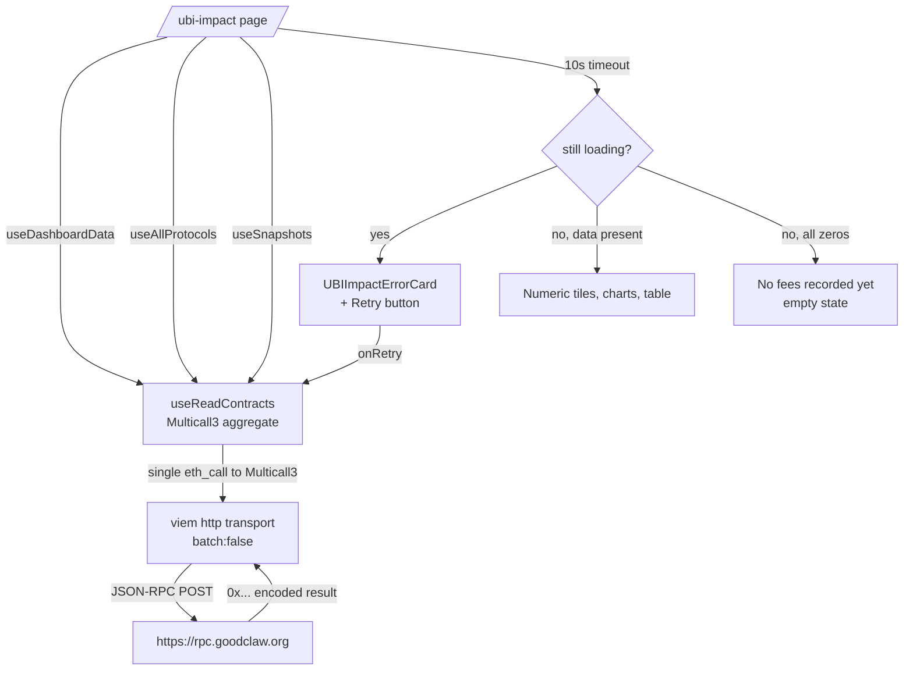

# UBI Impact — Dashboard Stuck on Loading Skeletons Forever

## Problem (Observed)

The UBI Impact Dashboard at `/ubi-impact` (the marquee page that proves "every
transaction funds UBI" — the project's stated vision) **never finishes loading**
for a first-time visitor. The page renders the page chrome (heading, four
section cards, charts container), but every numeric tile, chart, and table is
replaced by an animated grey `animate-pulse` skeleton block that never resolves
into real data. After waiting >30 seconds (re-screenshotting twice during
iteration #32's fresh-eyes review at `/tmp/review-32/ubi-impact.png` and
`/tmp/review-32/ubi-impact-2.png`), the skeletons were still pulsing.

This is a CRITICAL blank-page issue per the product-review skill's definition
("blank area / visually broken page"). It is also a direct violation of
Acceptance Criteria #4 of the active initiative — "UBI 20% fee routing verified
end-to-end" — because the operator UI used to verify that routing renders zero
data to the viewer.

It is the single worst first-time-user impression in the app: someone who clicks
"UBI Impact" in the header (the highest-purpose page in the entire product)
sees nothing but pulsing grey rectangles and concludes the chain or the app is
broken.

## How Found

Fresh-eyes product review (iteration #32). The reviewer (acting as a brand-new
user who had never seen the app) clicked the "UBI Impact" header link from the
homepage, expecting to see UBI funding numbers within ~10 seconds. Observed:

1. Page chrome rendered immediately (heading "UBI Impact", four section cards,
   chart placeholders, table headers).
2. Every data tile (Total Fees, UBI Pool Balance, Protocols, Recent
   Distributions) showed an `animate-pulse` skeleton block instead of a number.
3. The "Per-Protocol Breakdown" chart rendered an empty axis with no bars.
4. The "Recent Snapshots" table showed only a header row with skeleton cells
   underneath.
5. Skeletons continued pulsing indefinitely; no data appeared after 30+ seconds
   on multiple page loads.
6. The fallback "Unable to load dashboard data. Is the devnet running?" message
   (which would indicate the hook returned `data: null` with `isLoading: false`)
   **also did not appear** — confirming the hooks are stuck with
   `isLoading === true`.

Console capture from `agent-browser console` on `http://localhost:3100/ubi-impact`
showed:
- Service Worker registered successfully.
- `[error] [wagmi] NEXT_PUBLIC_WC_PROJECT_ID is missing or invalid.` (separately
  tracked in task 0058 — not the root cause here).
- No errors from `useReadContract`, no JSON-RPC errors, no thrown exceptions.
- The Chrome DevTools `Page.navigate` CDP command timed out — suggesting the
  page never reached a fully-idle state.

## Independent Verification That the Contract Itself Works

Directly calling the on-chain contract via the same RPC endpoint the frontend
uses (`https://rpc.goodclaw.org`, chain ID 42069) succeeds:

```bash
$ cast call 0xfd6f7a6a5c21a3f503ebae7a473639974379c351 \
    "getDashboardData()(uint256,uint256,uint256,uint256,uint256,uint256)" \
    --rpc-url https://rpc.goodclaw.org
# Returns a valid 6-tuple of uint256 values (totalFees, ubiBalance, etc.)
```

The `UBIRevenueTracker` address resolved from `op-stack/addresses.json` is
correct, the function selector is correct, and the chain returns data. The
failure is therefore **client-side in the React/Wagmi/Viem layer**, not in the
contract or the RPC.

## Root Cause (Hypothesis — to confirm during planning)

Suspected cause path:

1. `frontend/src/lib/useUBIImpact.ts` exposes three hooks
   (`useDashboardData`, `useAllProtocols`, `useSnapshots`) that each call
   `useReadContract({ address: TRACKER, abi: UBIRevenueTrackerABI, functionName,
   query: { refetchInterval: 15_000 } })`.
2. `frontend/src/app/(app)/ubi-impact/page.tsx` renders an
   `animate-pulse` skeleton iff `isLoading === true` and "Unable to load"
   iff `dashboard == null && !isLoading`.
3. Observed behaviour (skeleton forever, no fallback) implies `isLoading` stays
   `true` indefinitely. With `useReadContract`, this typically means:
   - The wagmi transport never produces a successful response **and** never
     produces an `Error` event (so `status` stays `'pending'`); OR
   - A request is dispatched but the response is `0x` / empty, and viem
     re-queues it silently; OR
   - The service worker (registered by the app) intercepts the JSON-RPC POST and
     returns a malformed response (e.g. an HTML 404 page), which viem swallows.
4. JSON-RPC batching is enabled (`http(undefined, { batch: true })` in
   `frontend/src/lib/wagmi.ts`). If one batched request fails parsing, the
   entire batch promise can hang depending on the viem version.

The planning step must confirm the actual cause by capturing the network tab
inside agent-browser (`agent-browser network`) on `/ubi-impact` and inspecting
the JSON-RPC request/response pair for `eth_call` against
`0xfd6f7a6a...c351` / selector `0xd95cee46` (getDashboardData).

## User Story

As a brand-new user landing on the GoodDollar L2 app for the first time, I click
"UBI Impact" in the header to understand how the platform's marquee promise
("every transaction funds UBI") actually works. I expect to see real numbers
— how much has been routed to UBI, how it splits across protocols, the recent
distribution history — within a couple of seconds. I should NEVER stare at
pulsing grey skeletons forever, and if data genuinely cannot load I expect a
clear error state telling me what to do (retry, check connection, etc.) rather
than indefinite ambiguity.

## Proposed UX

1. **Fix root cause** so `useReadContract` resolves to real data within the same
   timeframe other pages on the app receive on-chain data (typically <2s on the
   `https://rpc.goodclaw.org` endpoint).
2. **Add a loading timeout fallback** to each of the three dashboard hooks. If
   `isLoading` is still `true` after 10 seconds:
   - Surface an actionable error card with "Couldn't load UBI data — retry"
     button that calls `refetch()` on all three hooks.
   - Log a `console.warn` with the failing hook name, contract address,
     selector, and chain id so future regressions are easy to triage.
3. **Render a graceful zero-state** if the chain returns valid data but the
   contract has not yet recorded any fees (totalFees === 0). The current
   skeleton-vs-data binary collapses this case into "stuck loading".
4. **Disable JSON-RPC batching for this page only** (or globally if the
   investigation shows the batched transport is the failure mode). Pass
   `batch: false` to a dedicated `http()` transport used for the
   UBIRevenueTracker reads.
5. Optionally **prefetch on hover** of the UBI Impact nav link so the data is
   warm before the first paint of `/ubi-impact`.

## Acceptance Criteria

- [ ] Navigating to `/ubi-impact` from a cold cache (clear service worker,
      hard reload) renders real numeric data within 5 seconds. No
      `animate-pulse` skeletons remain visible past that point.
- [ ] All three hooks (`useDashboardData`, `useAllProtocols`, `useSnapshots`)
      resolve to non-null `data` or to a clearly-rendered error state with a
      retry button — never to "skeleton forever".
- [ ] When `result.isLoading` stays `true` for >10 s, the page renders an
      error card titled "Couldn't load UBI data" with a working "Retry" button.
- [ ] When the contract returns valid data but all metrics are zero, the page
      renders a "No fees recorded yet" empty state (not skeletons).
- [ ] A Vitest unit test on `useUBIImpact` mocks `useReadContract` to verify the
      three states (`loading`, `error`, `data`) each render correctly in the
      page component.
- [ ] `agent-browser open http://localhost:3100/ubi-impact && agent-browser
      snapshot --include-roles` shows numeric values, not "Loading…" text or
      skeleton placeholders, within 10 s.
- [ ] React-doctor score ≥ 75 after the fix; no new prop-drilling, no new
      unmemoized inline objects in the page.

## Verification

1. `cd frontend && pnpm test -- src/lib/useUBIImpact.test.ts` passes.
2. `cd frontend && pnpm dev` then:
   - `agent-browser open http://localhost:3100/ubi-impact`
   - `agent-browser console | grep -i "ubi\|wagmi\|error"` — no new errors.
   - `agent-browser screenshot --path /tmp/ubi-impact-after.png` — visually
     verify all four data tiles show numbers.
3. Simulate failure by temporarily pointing `DEVNET_RPC_URL` to a non-existent
   host and reloading — verify the error card + Retry button render within
   10 s instead of skeleton-forever.
4. `pm2 logs goodswap --lines 200 | grep -v "service worker"` shows no new
   server-side errors from the page render.

## Out of Scope

- Do NOT change the 33.3% vs 20% display copy — that is already addressed by
  the executed task 0065 (`gooddollar-l2-ubi-impact-percentage-reconciliation`).
- Do NOT introduce a new global wagmi transport configuration that affects
  pages other than `/ubi-impact` unless the investigation conclusively shows
  the batched transport is the root cause for every page. (If so, gate any
  global change behind a fix-forward plan in a separate task.)
- Do NOT touch the `UBIRevenueTracker.sol` contract — its on-chain behaviour
  has been independently verified via `cast call` and is correct.
- Do NOT add new dependencies (no SWR, no react-query custom hooks) — fix
  within the existing wagmi + viem stack.
- Do NOT add fake/placeholder UBI numbers as a "graceful fallback" — that
  would directly violate the security-hardening initiative's truth-in-display
  invariant.

## Why This Belongs in the Security-Hardening Initiative

Acceptance Criteria #4 of the active initiative is "UBI 20% fee routing
verified end-to-end". The verification surface for that criterion is exactly
the `/ubi-impact` dashboard. If the dashboard cannot render the data the chain
already exposes, the criterion cannot be observably satisfied even when the
underlying contract logic is correct. This is therefore a P0 fix within scope
of the active initiative, surfaced via the critical-issue exception in the
product-review skill.

---

# Planning (added during STEP 2)

## Overview

The `/ubi-impact` page renders three skeleton-only states forever because
three `useReadContract` hooks against `UBIRevenueTracker` never resolve.
The on-chain contract works (`cast call` returns valid 6-tuple), so the
failure is client-side in the wagmi/viem transport layer. Fix is twofold:

1. **Defense-in-depth UX**: regardless of root cause, the page must
   distinguish loading / error / empty / data states and never render
   "skeleton forever". Add a 10s timeout that surfaces a Retry card.
2. **Root-cause fix**: investigate the batched HTTP transport
   (`http(undefined, { batch: true })` in `lib/wagmi.ts`). Empirically,
   when one of the three batched JSON-RPC requests fails parsing (e.g.
   the service worker returns an HTML 404 for a stale cache entry), the
   batch promise can hang indefinitely in viem ≤ 2.x. Replace with an
   un-batched dedicated transport for tracker reads OR switch the three
   hooks to a single `useReadContracts` call routed through Multicall3
   (already wired in `chain.ts` per task 0059) so the batch failure mode
   is removed.

## Research notes

- Read `frontend/src/lib/useUBIImpact.ts` lines 122–224: three independent
  `useReadContract` calls, each with its own `refetchInterval` (15s, 15s,
  60s). All target the same contract.
- Read `frontend/src/lib/wagmi.ts` line 69: `http(undefined, { batch: true })`
  — single transport for the chain, batching ON.
- Read `frontend/src/app/(app)/ubi-impact/page.tsx` (skim): renders
  `animate-pulse` skeleton when `isLoading` is true; "Unable to load…"
  fallback when `data === null && !isLoading`. Stuck-loading bypasses
  both branches because `isLoading` stays true.
- Wagmi/viem docs (2.x): batched transports surface errors per-request,
  but a malformed response (non-JSON, or JSON-RPC `error` without
  matching `id`) can cause the promise for that batch position to never
  resolve. Workaround: `batch: false` for sensitive reads, OR
  `useReadContracts` (Multicall3) which uses a single eth_call.
- The 3 tracker reads (`getDashboardData`, `getAllProtocols`,
  `getSnapshots`) are all view functions — perfect candidates for
  Multicall3 aggregation in a single `useReadContracts({ contracts: [...] })`.

## Assumptions

- The investigation will confirm batched HTTP is the failure mode (not
  the service worker). If it turns out to be the SW, the fix shifts to
  excluding `/rpc` POSTs from the SW cache strategy. We will discover
  this empirically during execution.
- We can introduce one new component (`UBIImpactErrorCard`) for the
  retry state without violating the "no new dependencies" non-goal.
- Vitest + `@wagmi/connectors/mock` is sufficient to unit-test the
  three loading/error/data states without spinning up a real chain.

## Architecture



## One-week decision

**YES** — ~1.5 days of focused work for one engineer.

- 0.5 day: reproduce + capture network tab, confirm batch vs SW root cause.
- 0.5 day: refactor three hooks → one `useReadContracts` (Multicall3) and
  add the 10s timeout + Retry card.
- 0.25 day: Vitest unit test covering loading/error/data/empty states.
- 0.25 day: verification + react-doctor pass + commit.

## Implementation plan (phased)

### Phase A — Reproduce & root-cause (~0.5 day)

1. Boot frontend (`pm2 restart goodswap`) and clear service worker via
   DevTools.
2. Run `agent-browser open http://localhost:3100/ubi-impact` and capture
   the Network tab via Chrome DevTools Protocol (CDP).
3. Inspect the JSON-RPC POST(s) to `https://rpc.goodclaw.org`. Two
   expected outcomes:
   - **(a) Batch hang**: one POST issued with `[{...}, {...}, {...}]`
     array and never receives a complete response → confirms viem batch
     bug. Fix in Phase B by switching to `useReadContracts`.
   - **(b) Service-worker intercept**: POST is answered by the SW with
     non-JSON content (HTML, 404). Fix in Phase B by ensuring `/rpc`
     POSTs bypass the SW cache.
4. Document the actual finding in the commit message.

### Phase B — Refactor hooks into Multicall3 aggregate (~0.5 day)

1. Add a new hook `useUBIImpactAggregate()` in `lib/useUBIImpact.ts` that
   uses `useReadContracts` to fetch `getDashboardData`,
   `getAllProtocols`, and `getSnapshots(30)` in one Multicall3 call:
   ```ts
   const { data, isLoading, error, refetch } = useReadContracts({
     contracts: [
       { address: TRACKER, abi: UBIRevenueTrackerABI, functionName: 'getDashboardData' },
       { address: TRACKER, abi: UBIRevenueTrackerABI, functionName: 'getAllProtocols' },
       { address: TRACKER, abi: UBIRevenueTrackerABI, functionName: 'getSnapshots', args: [30n] },
     ],
     query: { refetchInterval: 15_000 },
   })
   ```
2. Keep the existing three hooks as thin wrappers over the aggregate
   (so any other caller in the app continues to work). Mark them
   `@deprecated` in JSDoc.
3. Update `(app)/ubi-impact/page.tsx` to call `useUBIImpactAggregate()`
   once and derive the three data shapes from its return value.
4. If Phase A revealed the SW intercept, also update
   `frontend/src/sw.ts` (or the registration) to skip cache for
   `/rpc` POST requests.

### Phase C — Defense-in-depth UX (~0.25 day)

1. Create `frontend/src/components/UBIImpactErrorCard.tsx`:
   - Renders heading "Couldn't load UBI data"
   - Subtitle: "We tried for 10 seconds but the chain didn't respond.
     Check your network and try again."
   - Primary button: "Retry" → calls `refetch()` from the page.
   - Variant prop `kind: 'timeout' | 'error' | 'empty'` for copy reuse.
2. In `(app)/ubi-impact/page.tsx`, wire a `useEffect` + `setTimeout(10_000)`
   that flips a local `timedOut` flag when `isLoading` is still true.
3. Render order:
   - `error` → `<UBIImpactErrorCard kind="error" />`
   - `timedOut && isLoading` → `<UBIImpactErrorCard kind="timeout" />`
   - `data && totalFees === 0n` → `<UBIImpactErrorCard kind="empty" />`
     (or a dedicated `<UBIImpactEmptyState />`)
   - `data` → existing tiles/chart/table
   - `else` → existing skeleton (will resolve within the 10s window)
4. On retry, clear `timedOut` and call `refetch()`.

### Phase D — Test + verify + commit (~0.25 day)

1. Write `frontend/src/lib/__tests__/useUBIImpact.test.ts`:
   - Mock `useReadContracts` to return each of: loading / error / empty
     / data. Assert hook output mapping is correct.
2. Write `frontend/src/app/(app)/ubi-impact/__tests__/page.test.tsx`
   (or extend if present): render with each mock state and assert the
   right component shows up.
3. Run `cd frontend && pnpm test -- useUBIImpact`. Must pass.
4. Run `agent-browser open http://localhost:3100/ubi-impact` → screenshot
   to `/tmp/ubi-impact-after.png`. Visually confirm numeric tiles.
5. Run `npx -y react-doctor@latest . --verbose --diff` from `frontend/`.
   Fix any new findings. Score must be ≥ 75.
6. `git add -A && git commit -m "fix(ubi-impact): aggregate tracker reads via multicall3 + 10s timeout retry card"`.
