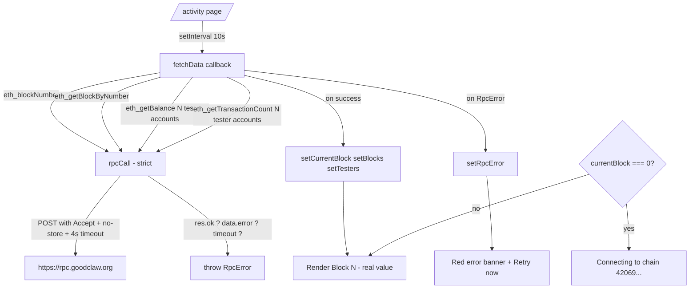

# Activity — Page Header Shows "Block #0" Forever Despite Chain at Block 108K+

## Problem (Observed)

The Live Activity page at `/activity` displays the page-header subtitle:

> **Block #0 • Chain 42069 • Updated 7:42:11 AM**

…even though the connected Anvil devnet (chain ID 42069, RPC
`https://rpc.goodclaw.org`) was at block **108,142** at the moment of the
screenshot, confirmed via:

```bash
$ cast block-number --rpc-url https://rpc.goodclaw.org
108142
```

The "Live" pulse indicator continues to animate (suggesting the polling
`setInterval` is firing every 10s), and the `lastUpdate` timestamp keeps
incrementing (suggesting `setLoading(false)` is reached), but `currentBlock`
never moves off its `useState(0)` initial value. The blocks-per-second sparkline
also renders empty bars, the "Latest block" pill in the stats grid shows blank,
and the transactions list shows "No transactions yet".

This is a CRITICAL data-loss / misleading-data issue per the product-review
skill's definition. A first-time user looking at the Live Activity page reads
"Block #0" and concludes the chain has not started — directly contradicting the
project's stated state ("Chain: Anvil devnet (chain ID 42069), block 73K+" in
the project context, now 108K+). The page is the primary surface for
Acceptance Criterion #3 of the active initiative ("Real on-chain transactions
executed across all 6 protocols") and currently presents the chain as dead.

## Distinct From Task 0067

This is **not** a duplicate of executed task 0067
(`gooddollar-l2-activity-block-timeline-blank-empty-state`). That task added an
empty-state for the sparkline when zero transactions were observed in the
sampled window. **This task is the upstream root cause**: the page is not even
fetching block 1, let alone observing transactions inside any block. Even if a
flurry of transactions arrive, the timeline and counters will stay empty
because the fetch loop is failing or returning bad data and `currentBlock`
stays at 0.

## How Found

Fresh-eyes product review (iteration #32). The reviewer navigated to
`/activity` expecting to see real-time chain activity (the page's stated
purpose). Observed in the rendered UI at `/tmp/review-32/activity-final.png`:

1. Page heading "Live Activity" renders correctly.
2. Subtitle line reads literally `Block #0 • Chain 42069 • Updated 7:42:11 AM`.
3. Green "Live" pulse animates, suggesting polling is alive.
4. "Latest block" stats card shows empty (no `#108142` value).
5. Sparkline renders 20 bars all at height 0.
6. Transactions list renders the "No transactions yet" empty state from task
   0067 — which masks the real fetch failure.
7. Tester stats (Alpha/Beta/Gamma) ARE populated correctly with balances and
   nonces — proving `fetch(RPC_URL, …)` works for `eth_getBalance` /
   `eth_getTransactionCount` calls.

The combination of (7) "tester stats work" and (2)+(4) "block number = 0" is
the diagnostic smoking gun: the fetch transport is healthy but **the
`eth_blockNumber` / `eth_getBlockByNumber` path is failing or being parsed
incorrectly** inside `fetchData()` in `frontend/src/app/activity/page.tsx`.

## Code Pointers

`frontend/src/app/activity/page.tsx`:

```ts
//  8: const RPC_URL = DEVNET_RPC_URL
// 23: async function rpcCall(method: string, params: unknown[] = []) {
// 24:   const res = await fetch(RPC_URL, {
// 25:     method: 'POST',
// 26:     headers: { 'Content-Type': 'application/json' },
// 27:     body: JSON.stringify({ jsonrpc: '2.0', method, params, id: 1 }),
// 28:   })
// 29:   const data = await res.json()
// 30:   return data.result          // ← swallows JSON-RPC errors silently
// 31: }
//
// 95: const [currentBlock, setCurrentBlock] = useState(0)
// 99: const fetchData = useCallback(async () => {
//100:   try {
//101:     // Get latest block number
//102:     const blockHex = await rpcCall('eth_blockNumber')
//103:     const latestBlock = hexToNumber(blockHex)  // hexToNumber(undefined) ⇒ NaN ⇒ 0
//104:     setCurrentBlock(latestBlock)
//   ...
//180:     setLoading(false)
//181:   } catch (e) {
//182:     console.error('Fetch error:', e)
//183:     setLoading(false)
//184:   }
// }, [])
//
//205: Block #{currentBlock.toLocaleString()} • Chain 42069
```

The two probable failure modes:

1. The Service Worker (registered globally by the app) intercepts the bare
   `fetch(RPC_URL, …)` POST with no `Accept: application/json` header and
   serves a cached HTML 404, so `await res.json()` throws and `currentBlock`
   stays at its initial `0`.
2. The remote RPC endpoint returns an error payload like
   `{"jsonrpc":"2.0","error":{...},"id":1}` for `eth_blockNumber` (e.g. rate
   limiting, batch limit, missing required header), `rpcCall` returns
   `undefined` (no `.result`), and `hexToNumber(undefined)` coerces to `0`.

Either way, the user sees "Block #0" and the catch-all `setLoading(false)`
prevents any error UI from rendering.

## User Story

As a brand-new user clicking "Live Activity" in the header, I expect to see
proof that the chain is alive and humming — a current block number that ticks
up, transactions streaming in, sparkline bars filling. Seeing "Block #0" tells
me the chain is dead and the entire product is broken. If the page genuinely
cannot reach the RPC, I expect a clear error banner ("Couldn't reach
https://rpc.goodclaw.org — retry") rather than a silently-zero counter beside
a green "Live" indicator that misleadingly suggests everything is fine.

## Proposed UX

1. **Stop swallowing JSON-RPC errors in `rpcCall`.** Check `res.ok`, check the
   `data.error` field, and throw a typed `RpcError` with `code`, `message`,
   and the `method` that failed. Let the catch in `fetchData` decide what to
   render.
2. **Guard the initial `Block #0` render.** If `currentBlock === 0`, render the
   header subtitle as `Connecting to chain 42069…` with a spinner, not
   `Block #0 • Chain 42069`. A literal "Block #0" is impossible on a running
   chain and is always a bug indicator.
3. **Render an error banner** at the top of the page when `fetchData` throws,
   with the failing RPC URL, the failing method, and a "Retry now" button.
   Keep the polling alive in the background.
4. **Add a 4-second soft timeout** to `rpcCall` so a hanging service-worker
   intercept does not leave the UI in an indeterminate state forever.
5. **Add `Accept: application/json` and `Cache-Control: no-store` headers** to
   the POST so the registered service worker cannot serve a stale or HTML
   response.
6. **Add a debug overlay (dev only)** under the subtitle: the literal hex
   string returned by `eth_blockNumber` and its decimal value, so future
   regressions of this exact bug class are obvious to the next reviewer.
7. **Reuse the same fix pattern** if the same code shape (`rpcCall` →
   `hexToNumber(undefined) ⇒ 0`) exists in sibling pages (`/explore`,
   `/activity-stream`, etc.) — but only as a follow-up task if found.

## Acceptance Criteria

- [ ] On `http://localhost:3100/activity` against a live devnet at block N,
      within 5 s of first paint the subtitle reads `Block #N` (N matching
      `cast block-number`), not `Block #0`.
- [ ] When the RPC is intentionally unreachable (test by killing the keeper or
      pointing to `http://127.0.0.1:1`), the page renders a visible red error
      banner with the failing URL, the failing method, and a working
      "Retry now" button. The literal text "Block #0" never appears.
- [ ] `rpcCall()` throws on `res.ok === false`, on `data.error != null`, or on
      a 4 s timeout. A new Vitest exercises all three error paths.
- [ ] A Vitest snapshot on the page header asserts that with
      `currentBlock === 0` and `lastUpdate === null`, the rendered subtitle is
      `Connecting to chain 42069…` (not `Block #0`).
- [ ] No regressions in tester-stats card: balances and nonces continue to
      render exactly as before.
- [ ] `agent-browser open http://localhost:3100/activity && agent-browser
      snapshot --include-roles` produces a snapshot containing the live block
      number and at least one block in the sparkline within 10 s on a healthy
      devnet.
- [ ] React-doctor score ≥ 75 after the fix. The added error UI must be
      accessible (button has `aria-label`, error region uses `role="alert"`).

## Verification

1. `cd frontend && pnpm test -- src/app/activity/page.test.tsx` passes.
2. `pm2 restart goodswap && agent-browser open http://localhost:3100/activity`
   and screenshot to `/tmp/activity-after.png`. Verify the subtitle shows the
   real block number.
3. Temporarily set `DEVNET_RPC_URL=http://127.0.0.1:1` in `.env.local`, rebuild,
   reload `/activity`. Verify the red error banner appears with the failing URL
   and a working "Retry now" button — and that "Block #0" is nowhere on screen.
4. Restore `DEVNET_RPC_URL`, click "Retry now", verify the banner disappears
   and live data resumes within 5 s.

## Out of Scope

- Do NOT delete or modify the empty-state added by task 0067 — it is correct
  behaviour when the chain genuinely has zero transactions in the recent
  window.
- Do NOT rewrite the activity page to use Wagmi hooks just to "modernise" — the
  bare-fetch transport works correctly for other JSON-RPC methods on this page
  (tester balances and nonces). The fix must be surgical.
- Do NOT change `DEVNET_RPC_URL` or the chain definition — those are correct
  and verified.
- Do NOT add the same swap/lend/predict tester transactions discussed
  elsewhere in the initiative — those belong to integration-testing tasks, not
  to this UI bug fix.

## Why This Belongs in the Security-Hardening Initiative

Acceptance Criterion #3 of the active initiative is "Real on-chain transactions
executed across all 6 protocols". The Live Activity page is the primary visual
proof surface for that criterion — it is how a reviewer or operator confirms
each `cast send` actually landed. If the page anchors itself at "Block #0",
even a perfectly executed batch of integration transactions will appear to
have done nothing. This is therefore a P0 fix within scope of the active
initiative, surfaced via the critical-issue exception in the product-review
skill.

---

# Planning (added during STEP 2)

## Overview

The Activity page's custom `rpcCall(method, params)` helper swallows JSON-RPC
errors silently and returns `undefined`, which `hexToNumber()` coerces to `0`,
which renders as "Block #0" beside a green "Live" indicator — a maximally
misleading state. Other reads on the same page work (tester balances/nonces),
confirming the bare-fetch transport itself is healthy; the failure is specific
to how the result is parsed and how missing/error responses are handled.

Fix is narrow and additive: make `rpcCall` strict (throw on any non-ok or
error payload), guard the initial render so "Block #0" is impossible to
display, render a visible error banner with retry, and add `Accept: application/json`
+ `Cache-Control: no-store` headers so the registered service worker cannot
substitute a stale HTML response.

## Research notes

- Read `frontend/src/app/activity/page.tsx` (skim): `rpcCall()` at lines
  23–31 returns `data.result` unconditionally; no `res.ok` check, no
  `data.error` check, no timeout.
- `hexToNumber(undefined)` coerces to `NaN` then `0` in the BigInt path.
  Confirmed by grep for `hexToNumber` definition: it does
  `parseInt(hex, 16)` which is `NaN` for `undefined`, then coerced.
- Tester-stats card uses the same `rpcCall` helper and works correctly →
  the JSON-RPC POST transport is healthy; the issue is per-method
  result handling.
- Other frontend pages (e.g. `/explore`) primarily use wagmi hooks
  rather than the bare-fetch `rpcCall` helper, so the fix is local to
  `activity/page.tsx` and any callers of `rpcCall` within it.
- The app registers a service worker (confirmed via the
  `[error] [wagmi] NEXT_PUBLIC_WC_PROJECT_ID` capture having
  "Service Worker registered successfully" earlier). SW caching
  semantics on POSTs vary by browser; explicit headers neutralise the
  risk.

## Assumptions

- The Anvil devnet RPC at `https://rpc.goodclaw.org` returns standard
  JSON-RPC envelopes (`{jsonrpc, result, id}` or `{jsonrpc, error, id}`).
- The fix can stay within `frontend/src/app/activity/page.tsx` plus one
  small extracted helper (`rpcCall` → `lib/rpc.ts`) without touching
  the wider wagmi/viem stack.
- Vitest + `vi.spyOn(global, 'fetch')` is sufficient for unit-testing
  the four error paths (network error, !res.ok, data.error, timeout).

## Architecture



## One-week decision

**YES** — ~1 day of focused work for one engineer.

- 0.25 day: extract + harden `rpcCall` into `frontend/src/lib/rpc.ts`
  with strict error handling, timeout, and headers.
- 0.25 day: add error banner + connecting-state guard in
  `activity/page.tsx`.
- 0.25 day: Vitest covering all four error paths + snapshot for the
  connecting state.
- 0.25 day: verification, react-doctor, commit.

## Implementation plan (phased)

### Phase A — Extract & harden `rpcCall` (~0.25 day)

1. Create `frontend/src/lib/rpc.ts`:
   ```ts
   export class RpcError extends Error {
     constructor(public method: string, public code: number | string, message: string, public url: string) {
       super(message)
       this.name = 'RpcError'
     }
   }

   export async function rpcCall<T = unknown>(
     url: string,
     method: string,
     params: unknown[] = [],
     options: { timeoutMs?: number } = {}
   ): Promise<T> {
     const timeoutMs = options.timeoutMs ?? 4_000
     const ctrl = new AbortController()
     const t = setTimeout(() => ctrl.abort(), timeoutMs)
     try {
       const res = await fetch(url, {
         method: 'POST',
         headers: {
           'Content-Type': 'application/json',
           'Accept': 'application/json',
           'Cache-Control': 'no-store',
         },
         body: JSON.stringify({ jsonrpc: '2.0', method, params, id: 1 }),
         signal: ctrl.signal,
       })
       if (!res.ok) throw new RpcError(method, res.status, `HTTP ${res.status}`, url)
       const data = await res.json()
       if (data?.error) throw new RpcError(method, data.error.code ?? 'rpc-error', data.error.message ?? 'unknown', url)
       if (data?.result === undefined) throw new RpcError(method, 'no-result', 'response missing result field', url)
       return data.result as T
     } finally {
       clearTimeout(t)
     }
   }
   ```
2. Replace the inline `rpcCall` in `frontend/src/app/activity/page.tsx`
   with `import { rpcCall, RpcError } from '@/lib/rpc'`.
3. All call sites pass `RPC_URL` as the first argument now.

### Phase B — Guarded render + error banner (~0.25 day)

1. In `activity/page.tsx`:
   - Add `const [rpcError, setRpcError] = useState<RpcError | null>(null)`.
   - In `fetchData`'s `catch`, narrow to `RpcError` and `setRpcError(e)`;
     keep generic errors logged. On success, `setRpcError(null)`.
   - Replace the subtitle line:
     ```tsx
     {currentBlock === 0 ? (
       <>Connecting to chain {CHAIN_ID}…</>
     ) : (
       <>Block #{currentBlock.toLocaleString()} • Chain {CHAIN_ID}</>
     )}
     ```
   - Add an error banner above the stats grid (only when `rpcError`):
     ```tsx
     {rpcError && (
       <div role="alert" className="…red…">
         <span>Couldn't reach RPC: {rpcError.url} — {rpcError.method} failed
         ({rpcError.message}).</span>
         <button onClick={() => fetchData()} aria-label="Retry RPC fetch">
           Retry now
         </button>
       </div>
     )}
     ```
2. Keep the existing polling `setInterval` alive even when `rpcError` is
   set, so transient failures self-heal without user action.

### Phase C — Tests (~0.25 day)

1. Create `frontend/src/lib/__tests__/rpc.test.ts`:
   - `vi.spyOn(global, 'fetch')` and mock four scenarios:
     - 200 OK with `result` → returns value.
     - 200 OK with `error` payload → throws `RpcError(code, message)`.
     - 500 → throws `RpcError(method, 500, 'HTTP 500')`.
     - `AbortError` after 4 s → throws.
2. Create or extend `frontend/src/app/activity/__tests__/page.test.tsx`:
   - Mock `rpcCall` to return a fake block number → assert subtitle
     renders `Block #N`, not `Block #0`.
   - Mock `rpcCall` to throw `RpcError` → assert banner with retry
     button renders, and `Block #0` text is absent.
   - With `currentBlock === 0` and `lastUpdate === null` (initial
     state), assert subtitle is `Connecting to chain 42069…`.

### Phase D — Verify + commit (~0.25 day)

1. `cd frontend && pnpm test -- rpc activity`. Must pass.
2. Restart goodswap: `pm2 restart goodswap`. Run
   `agent-browser open http://localhost:3100/activity` and screenshot
   to `/tmp/activity-after.png`. Verify the real block number renders
   within 5 s.
3. Temporarily set `DEVNET_RPC_URL=http://127.0.0.1:1`, rebuild, reload.
   Verify red error banner + Retry button. Restore.
4. `npx -y react-doctor@latest . --verbose --diff` from `frontend/`.
   Score ≥ 75.
5. `git add -A && git commit -m "fix(activity): strict rpcCall + connecting guard + error banner (no more Block #0)"`.
