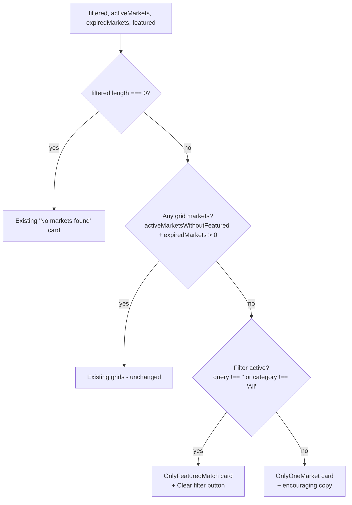

# Predict — Blank Space Below Filters When the Only Active Market Is the Featured Hero (Looks Like a Broken Page)

> Note: This task is outside the formal Phase 1 security-hardening scope but is
> filed per the product-review skill's "blank page" exception: walking through
> the realistic user journey "user opens prediction markets and picks one"
> reveals a state where the page renders empty below the filter row with no
> message, no skeleton, and no help text. From a user's perspective the page
> looks broken, which is exactly the class of issue the skill says to capture
> regardless of scope.

## Problem statement

Walking through the realistic user journey "user wants to browse and bet on
prediction markets":

1. Open `/predict`.
2. The featured hero ("Will BTC hit $100K by 2026?") renders at the top.
3. The search box, sort options (Trending / Newest / Highest Volume / Ending
   Soon), and category chips (All / Crypto / Politics / Sports / AI & Tech /
   World Events / Culture) all render correctly below the hero.
4. **Below the filters there is nothing.** No grid, no "No markets found"
   empty-state card, no skeleton, no loading spinner, no helper text.
5. The user is left with the filter UI promising they can filter through
   markets — but there's nothing to filter through. They have no way to know
   whether (a) the page is still loading, (b) all markets are hidden behind
   the filter, (c) the featured market is the only one, or (d) the page is
   actually broken.

The "Markets are illustrative. Resolution via oracle coming soon." footer
sits directly under the filter row, with a huge gap of nothing between the
filters and that footer. To a first-time user this reads as "the page failed
to load the market grid."

### Root cause

In `frontend/src/app/(app)/predict/page.tsx` (the render block starting at
line 476), the conditional rendering has a logic gap:

```tsx
{filtered.length === 0 ? (
  <div className="bg-dark-100 rounded-2xl border border-gray-700/20 py-16 text-center">
    <p className="text-gray-400 text-sm mb-1">No markets found</p>
    <p className="text-gray-600 text-xs">Try adjusting your search or filters</p>
  </div>
) : (
  <>
    {activeMarketsWithoutFeatured.length > 0 && (
      <div className="mb-2">
        {/* … grid of active markets … */}
      </div>
    )}

    {expiredMarkets.length > 0 && (
      <div className="mt-8">
        {/* … expired markets section … */}
      </div>
    )}
  </>
)}
```

The "No markets found" empty state is only shown when `filtered.length === 0`.
But the featured hero is selected from `allMarkets` (the unfiltered set) via
`selectFeaturedMarket(allMarkets)`, and then de-duplicated out of the grid
via `activeMarketsWithoutFeatured = activeMarkets.filter(m => m.id !== featuredId)`
(introduced in task 0044 to prevent rendering the featured market twice).

This creates an undocumented dead zone:

- `filtered.length > 0` → skip the "No markets found" branch.
- `activeMarketsWithoutFeatured.length === 0` → skip the "Active Markets" grid.
- `expiredMarkets.length === 0` → skip the "Expired" section.
- Result: render literally nothing.

Concrete cases where this fires today on the live devnet:

1. **Only the featured market is active.** With 1 active market on chain,
   `selectFeaturedMarket` picks it, the grid filters it out, leaving zero
   cards.
2. **All remaining active markets are filtered out by category/search**, but
   the featured market still matches and remains in `filtered`. E.g. filter
   by "Sports" when only the featured Crypto market matches the unfiltered
   `selectFeaturedMarket` heuristic.
3. **The on-chain market list is loading slowly** and only the featured
   market has resolved so far.

### Impact

- **First-time users**: see a page that looks broken — the filter UI promises
  markets that never appear. High-confidence churn moment in the prediction
  markets onboarding flow.
- **Trust**: prediction markets are the single most visible UBI funding
  surface on the homepage; a blank page here directly damages the credibility
  of the "every trade funds UBI" pitch from the marketing copy two divs above.
- **Discoverability**: even users who notice the featured hero have no signal
  that there are no other markets to explore — they might assume the filter
  UI hides them or that the page failed to load.

## Acceptance criteria

1. When `filtered.length > 0` but `activeMarketsWithoutFeatured.length === 0`
   and `expiredMarkets.length === 0`, the page MUST render a helpful message
   below the filters — not blank space. Suggested copy depends on whether the
   featured market exists:
   - If `featured` exists: "You're looking at the only active market right
     now. Check back soon — new markets open frequently." with a subtle CTA
     to scroll back up to the hero.
   - If `featured` is null (unlikely but possible if `selectFeaturedMarket`
     returns null): fall back to the existing "No markets found" copy.
2. When the user is filtering by category or search and there are zero
   matches in `activeMarketsWithoutFeatured`, distinguish that case from "no
   markets at all". Suggested copy: "No active markets match your filters.
   The featured market above is your only option, or [Clear filters]."
3. The fix must not regress the working case where `activeMarketsWithoutFeatured.length > 0`:
   the grid renders unchanged.
4. The fix must not regress the working case where the user has typed a
   search term that matches nothing at all — the existing "No markets found"
   card should still render in that case.
5. No new dependencies; this is a render-logic fix only.
6. A regression test in `frontend/src/__tests__/predict-page.test.tsx`
   (create if needed) verifies the three relevant states: (a) only featured
   exists, (b) featured + several grid markets exist, (c) filter rules out
   every grid market but featured still matches.

## Out of scope

- Changing how `selectFeaturedMarket` chooses the featured market (separate
  task — currently picks the wrong market, see task 0074 for the
  contradictory-data hero issue).
- Adding a "Create new market" CTA from this empty state — that's a feature,
  not a fix.
- Backend / on-chain changes — this is purely a frontend render fix.

## Reproduction steps

1. Start the dev server with the current Anvil devnet state.
2. Open `https://goodswap.goodclaw.org/predict` (or `http://localhost:3000/predict`).
3. Observe the featured hero at the top, the filter row below it, and a
   large gap of blank space before the "Markets are illustrative…" footer.
4. Open devtools and confirm in the React tree: `filtered` is non-empty,
   `activeMarketsWithoutFeatured` is empty, `expiredMarkets` is empty.

## Related work

- Task 0044 — `predict-deduplicate-featured-from-grid` introduced the
  `activeMarketsWithoutFeatured` filter that creates this dead zone.
- Task 0067 — fixed a similar "blank block timeline" issue on the Activity
  page, where the empty state had no helpful copy. Same class of bug.
- Task 0074 (this batch) — `predict-featured-hero-contradictory-data` covers
  why the featured market itself shows nonsense numbers.

---

## Planning

### Research

`frontend/src/app/(app)/predict/page.tsx` lines 393–410 derive three lists from
the user-filtered `filtered` set: `activeMarkets`, `expiredMarkets`, and
`activeMarketsWithoutFeatured` (active minus the deduped featured market).
Lines 476–522 render only two branches:

1. `filtered.length === 0` → "No markets found" empty-state card.
2. Otherwise → render `activeMarketsWithoutFeatured` grid + `expiredMarkets`
   collapse. Both grids are gated by `> 0`, so when the featured hero is the
   only thing in `filtered` (after the dedup), no grid renders and the page
   ends abruptly under the filter row.

The dedup behavior is correct (task 0044 intentionally avoids rendering the
same market twice). The bug is a missing third render branch: "featured is
the only match".

Two sub-cases need to be distinguished by copy:

- **Filter narrowed it down** — there are other active markets in `allMarkets`
  but the current search/category filtered them out. Copy: "This is the only
  market matching your filter." with a "Clear filter" button that resets
  `query` to '' and `category` to 'All'.
- **Genuinely only one active market on chain** — `allMarkets` itself only
  has one active market. Copy: "Only one active market right now. Check back
  soon — new markets are added regularly."

The check for "filter narrowed" is `activeMarkets.length === 1 && featured &&
allMarkets.filter(getMarketStatus !== 'expired').length > 1`.

### Architecture



The fix is a local `<OnlyFeaturedNotice>` helper inside `predict/page.tsx`
(co-located with the page since this is purely a render concern). It takes
`isFiltered: boolean` and `onClear: () => void` props. Render it inside the
existing `<>…</>` branch when both grids are empty but `featured` exists.

### One-week decision

YES. This is a single-file render change (~50 lines added in
`predict/page.tsx`, no new files except a regression test). Estimated effort
1–3 hours including tests. Well under one week.

### Implementation steps

1. Add `<OnlyFeaturedNotice>` component above `PredictPageInner` in
   `predict/page.tsx`.
2. In the existing `<>…</>` branch (after line 481), add a sibling render
   block: when `activeMarketsWithoutFeatured.length === 0 &&
   expiredMarkets.length === 0 && featured` → render `<OnlyFeaturedNotice
   isFiltered={query !== '' || category !== 'All'} onClear={() => { setQuery(''); setCategory('All') }} />`.
3. Style to match the existing "No markets found" card (same `bg-dark-100
   rounded-2xl border border-gray-700/20` shell) but slightly less prominent
   since the featured hero already filled the top of the page.
4. Add regression test
   `frontend/src/app/(app)/predict/__tests__/empty-grid.test.tsx` that mounts
   the page with mocks for `useOnChainPredictionMarkets` returning exactly
   one active market, verifies no dead zone appears, and asserts the helpful
   copy is present.
5. Add a second test variant with three active markets but a search query
   that only matches the featured one, asserting "Clear filter" works.

### Acceptance verification

- Manual: visit `/predict`, observe the new helpful card instead of the
  blank space below the filter row.
- `pnpm --filter frontend test` passes the two new tests.
- `npx -y react-doctor@latest frontend --verbose --diff` returns ≥ 75.
