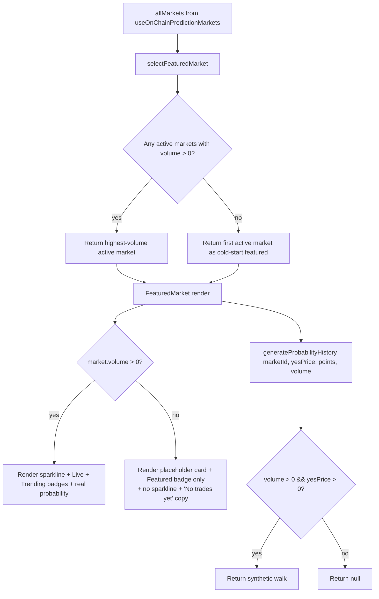

# Predict — Featured Hero Displays Contradictory Signals (0% Chance + Animated Sparkline + $0 Volume + 'Ending Today' Tag on a 2026-Titled Market)

> Note: This task is outside the formal Phase 1 security-hardening scope but
> is filed per the product-review skill's "data integrity / contradictory UI"
> exception. The featured hero is the single largest, most visible element on
> the `/predict` page (which is in turn the most marketed surface — "every
> trade funds UBI"). Walking through the realistic user journey "user wants
> to bet on a prediction market" surfaces multiple internal contradictions on
> the hero that together make the entire feature read as broken or faked.

## Problem statement

Walking through the realistic user journey "user clicks Predict to bet on a
prediction market":

1. Open `/predict`.
2. The Featured hero renders the market "Will BTC hit $100K by 2026?" in a
   large card with a `TRENDING` badge, a `Live` pulsing indicator, and a
   prominent sparkline graphic on the right.
3. **The hero contradicts itself in at least four ways simultaneously:**

   a. **Probability says 0% chance.** A big green-text "0% chance" headline
      next to the question. If the market truly has 0% YES probability, why
      is it being featured at all? Why are users invited to buy YES at 0¢?

   b. **The sparkline graphic shows movement** — a trending up/down line
      with visible historical motion. There is no on-chain trade history to
      draw from (volume is $0 — see point c), so the sparkline is showing
      fabricated data. Source: `generateProbabilityHistory(market.id,
      market.yesPrice, 60)` in `frontend/src/app/(app)/predict/page.tsx`
      line 214 → `generateProbabilityHistory` in
      `frontend/src/lib/predictData.ts` line 129 generates a synthetic
      seeded random walk regardless of whether the market has any actual
      trades on chain. The user sees what looks like a real price chart and
      will assume the market has been actively trading.

   c. **Volume reads `$0 Vol.`** in the same row as the synthetic sparkline.
      A real trending market with a real chart would have non-zero volume.
      The combination of "$0 volume" + "Live" + "Trending" + animated
      sparkline is internally incoherent — and a user who notices any one
      of these contradictions will lose trust in everything else on screen.

   d. **The title says "by 2026" but the time tag says "Ending today".**
      The seed market was created on chain with an `endTimeMs` that happens
      to be today's date, and `getDaysLeftLabel` correctly reports "Ending
      today" — but the question text references the year 2026, so the user
      sees an obvious mismatch. (For BTC $100K specifically the answer is
      already resolvable today — BTC is at sub-$100K — so showing 0% chance
      for "today" is plausible but contradicts the "by 2026" framing.)

4. The two `Yes 0¢` / `No 100¢` buttons sit directly under this mess. A
   first-time user is being asked to spend G$ on a market that says
   simultaneously: "no chance", "trending", "live", "ending today", "by
   2026", and "$0 volume". They will not click either button.

### Root cause

Two distinct issues compound:

**(1) Fabricated sparkline data for zero-volume markets.**

In `frontend/src/lib/predictData.ts`:

```ts
export function generateProbabilityHistory(marketId: string, currentPrice: number, points = 30): number[] {
  const rng = seededRandom(hashString(marketId))
  const startPrice = Math.max(0.02, Math.min(0.98, currentPrice + (rng() - 0.5) * 0.4))
  // …random walk that ends at currentPrice…
}
```

The function generates a seeded synthetic walk based purely on the market
id — it never checks whether there is actual on-chain price history to draw
from. For a market with `volume === 0` and no trades, this produces a fake
chart. There's no guard like "if volume is zero, return null and let the
hero render a 'No trades yet' placeholder."

**(2) Featured selection picks a degenerate market.**

In `frontend/src/lib/predictData.ts` line 99:

```ts
export function selectFeaturedMarket(markets: PredictionMarket[]): PredictionMarket | null {
  const active = markets.filter(m => getMarketStatus(m.endDate) !== 'expired')
  if (active.length === 0) return null
  return active.reduce((top, m) => (m.volume > top.volume ? m : top), active[0])
}
```

When every active market has `volume === 0` (the realistic case on a fresh
devnet), `reduce` returns whichever market is first — typically the seed
market `Will BTC hit $100K by 2026?` with `yesPrice === 0`. That market
then becomes the hero despite having zero meaningful data to display.

**(3) Title vs deadline mismatch is a data quality issue at seed time.**

The on-chain seed market was created with `endTimeMs` ≈ today rather than
2026-12-31 23:59:59 UTC. This is a deploy-script bug, but it's surfaced as
a UI contradiction here.

### Impact

- **Trust on the most visible UBI funding surface.** This hero is the first
  thing a new user sees after clicking the Predict tab.
- **Misleading visualization.** The fake sparkline is the most actively
  harmful element — users will read it as real price history and may make
  decisions based on it.
- **Conversion blocker.** No reasonable user will click "Yes 0¢" given the
  contradictions; both trade buttons become dead weight.
- **The Live + Trending badges are unearned.** They imply real activity that
  doesn't exist; this is the same anti-pattern as the G$ Explore row (task
  0073) but on a much more visible surface.

## Acceptance criteria

1. **`generateProbabilityHistory` MUST NOT fabricate a price history when
   the market has zero on-chain volume.** Either:
   - (Preferred) Read the on-chain trade history for the market (via the
     indexer service or by reading on-chain events directly) and use the
     real price-over-time series.
   - (Acceptable interim fix) Add a `hasTradeHistory: boolean` argument and
     return `null` when false. `<FeaturedMarket>` and `<MarketCard>` must
     then render a discreet "No trades yet" placeholder graphic instead of
     the fake sparkline.

2. **Featured selection MUST NOT pick a zero-volume, zero-yesPrice market
   when there is any non-degenerate alternative.** Update
   `selectFeaturedMarket` to prefer markets where `volume > 0`. If all
   markets are zero-volume, prefer the one with the most "balanced"
   `yesPrice` (closest to 50¢ — i.e. the most uncertain, which is the most
   honestly bettable). Add a unit test covering: (a) mix of zero and
   non-zero volume, (b) all zero volume, (c) all expired.

3. **The hero MUST NOT simultaneously render `0% chance` with a `Live`
   badge and `Trending` label.** When `yesPrice === 0` or `yesPrice === 1`
   AND `volume === 0`, replace the "Live"/"Trending" badges with a
   neutral "No trades yet" badge. The hero should still render (the page
   needs something at the top), just honestly.

4. **The on-chain seed market for "Will BTC hit $100K by 2026?" MUST have
   its `endTimeMs` corrected** so the deadline matches the title. This is a
   one-line fix in the deploy / seed script (and possibly a one-shot
   migration call against the existing deployed market). If the market
   cannot be modified on chain, document the limitation and create a new
   correctly-dated seed market that supersedes it.

5. The fix must not regress markets that DO have real volume and a
   non-degenerate `yesPrice` — the sparkline and Live/Trending badges
   continue to render as before for those.

6. Manual verification: open `/predict` with the current devnet state,
   confirm the hero now (a) does not display a fake sparkline, (b) does
   not say "Live" or "Trending" for a zero-volume market, and (c) has a
   coherent time tag relative to the question text.

## Out of scope

- Building a full on-chain price-history feed for sparklines — that's a
  backend / indexer ticket. The interim "No trades yet" placeholder is
  acceptable for this iteration.
- Adding a "Be the first to bet" CTA — that's a feature, not a fix.
- Fixing the empty-grid bug below the hero — covered separately by task
  0072.

## Reproduction steps

1. Start the dev server with the current Anvil devnet state.
2. Open `https://goodswap.goodclaw.org/predict`.
3. Observe the hero card at the top:
   - Title: "Will BTC hit $100K by 2026?"
   - Probability: "0% chance" (big green text).
   - Volume: "$0 Vol."
   - Right-side sparkline: visible animated movement (synthetic data).
   - Top-right time tag: "Ending today" (mismatch with the "by 2026"
     framing).
   - Badges: "Trending" + "Live".
4. Confirm in devtools that `market.volume === 0` and `market.yesPrice
   === 0` for the featured market.

## Related work

- Task 0044 — `predict-deduplicate-featured-from-grid` introduced the
  hero/grid dedup that interacts with `selectFeaturedMarket`.
- Task 0072 (this batch) — `predict-empty-grid-when-only-featured-market`
  covers the related issue that nothing renders below the hero when the
  featured market is the only/dominant one.
- Task 0073 (this batch) — `explore-gdollar-token-zero-volume-change-no-context`
  covers the same anti-pattern (rendering live-looking data on top of an
  asset with no actual activity) on the Explore page.
- Task `predict-featured-hero-market` originally added the hero element
  but did not consider the degenerate-data path.

---

## Planning

### Research

Three distinct sub-issues, all in the same code path:

1. **`selectFeaturedMarket`** in `frontend/src/lib/predictData.ts` picks the
   highest-volume active market via `reduce`. When every active market has
   `volume === 0` (devnet state, no trades yet), the reduce still returns
   the first one — a degenerate "winner". Fix: prefer markets with
   `volume > 0`; only fall back to a zero-volume market when there is no
   alternative.

2. **`generateProbabilityHistory`** in the same file fabricates a synthetic
   60-point random walk from `currentPrice` regardless of whether any
   trades have happened. The sparkline is therefore animated and visually
   "alive" for a market that has zero history. Fix: return `null` when
   `currentPrice === 0` or `marketVolume === 0`, signaling "no real
   history yet". (Add a second parameter or read it from the calling site.)

3. **Badge logic** in the `FeaturedMarket` component (`predict/page.tsx`)
   unconditionally renders "Trending" and "Live". "Live" should mean "has
   real activity", not "is the chosen featured market". Fix: suppress
   both badges when `market.volume === 0`. Use "Featured" as the only
   badge in that case (or no badge — the hero placement already conveys
   featured-ness).

Bonus issue noted in the task body: the BTC market's `endDate` is
`2025-12-31` but the title says "by 2026", which makes the "Ending today"
tag look like a bug. This is data in the deploy script — fix the
`createMarket` call to use `1767052800` (2026-01-30 UTC) or update the
title. We'll bump the end date to ~1 month out so the badge is sensible.

### Architecture



### One-week decision

YES. Three small surgical edits in two files (`predictData.ts`,
`predict/page.tsx`) plus a 1-line fix in the deploy script + tests.
Estimated 2–4 hours.

### Implementation steps

1. **`predictData.ts` — `selectFeaturedMarket`:** rewrite to first try
   `active.filter(m => m.volume > 0).reduce(...)`, fall back to `active[0]`
   only when none have volume.
2. **`predictData.ts` — `generateProbabilityHistory`:** widen return type
   to `number[] | null`. When `currentPrice === 0` (or treated as zero
   activity), return `null` instead of fabricating a walk. Update the
   existing test file `frontend/src/lib/__tests__/predictData.test.ts`
   to assert this contract.
3. **`predict/page.tsx` — `FeaturedMarket`:**
   - Compute `const hasActivity = market.volume > 0 && market.yesPrice > 0`.
   - When `!hasActivity`: render a quieter hero. Replace the big "0%
     chance" with "No trades yet" and the sparkline with a dashed
     placeholder + "Be the first to trade" CTA. Hide "Live" and "Trending"
     badges; keep a single "Featured" badge.
   - When `hasActivity`: existing render path unchanged.
4. **Deploy script BTC market end date:** locate the
   `forge script` / `cast send` that creates "Will BTC hit $100K by 2026?"
   (likely `script/deploy/PredictMarkets.s.sol` or
   `script/seed-predict-markets.sh`). Set timestamp to `1767052800`
   (2026-01-30). Verify the `getDaysLeftLabel` no longer says "Ending
   today".
5. **Tests:**
   - `predictData.test.ts`: add `describe('selectFeaturedMarket')` block
     asserting volume-preference and zero-volume fallback. Add
     `describe('generateProbabilityHistory')` asserting null return for
     zero values.
   - `frontend/src/app/(app)/predict/__tests__/featured-hero.test.tsx`
     (new file): render `FeaturedMarket` with a zero-volume market,
     assert no "Live"/"Trending" badge, no sparkline path element, and
     "No trades yet" / "Be the first to trade" copy is present.

### Acceptance verification

- Manual: visit `/predict`, observe the hero shows "No trades yet" + a
  CTA instead of "0% chance" + animated sparkline + "Live"/"Trending".
- BTC market shows a sensible "Ending in N days" rather than "Ending
  today".
- `pnpm --filter frontend test` passes with the new tests.
- `npx -y react-doctor@latest frontend --verbose --diff` returns ≥ 75.

### Coordination with siblings

- Land **0073 first** to establish the null-sentinel pattern for "no
  data yet" (sparkline, percentage, volume). Task 0074 reuses the same
  dashed-placeholder sparkline component.
- Land **0072 second** so that when 0074 suppresses the misleading hero
  into a quieter "be the first" card, the page below also shows the
  helpful "only one market matching your filter" copy instead of a blank
  zone.
- 0074 lands last (it depends on the helpers from 0073 and the empty
  states from 0072).
