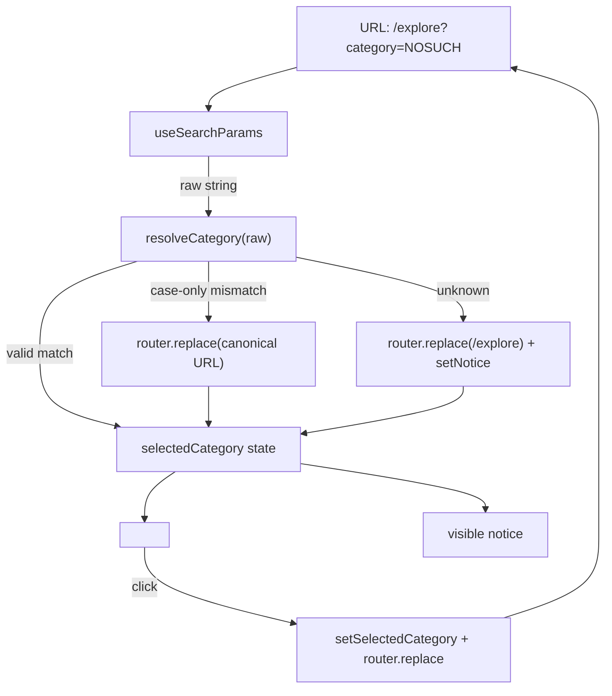

# Explore — Invalid `?category=` Query Param Silently Coerces to 'All' While URL Stays Wrong, Misleads Bookmark/Share Users

> Note: This task is outside the formal Phase 1 security-hardening scope. It
> is filed per the product-review skill's "error-handling" review focus for
> iteration #35 as a small but observable UX bug. It is NOT a critical
> exception — `slither` and the test suite are unaffected. Priority P3.

## Problem statement

`http://localhost:3100/explore?category=NOSUCH` (or any value not in
`TOKEN_CATEGORIES`) loads the page successfully:

- The category filter silently coerces to `'All'` (correct behaviour for
  rendering the table — show every token rather than crash).
- BUT the URL stays `?category=NOSUCH` indefinitely — `router.replace` is
  never called to canonicalise it.
- No toast, banner, or inline message tells the user "Unknown category
  'NOSUCH' — showing all tokens".

User impact:

1. A user who shares the URL `…/explore?category=NOSUCH` thinks they're
   sending a friend a filtered view; the friend opens a full-table view
   with no warning that something was lost. The two users are looking
   at different things and don't know it.
2. Bookmarks/browser history pollute with garbage query strings that
   look legitimate.
3. A typo (`?category=defi` vs `?category=DeFi` — case sensitivity)
   produces this same silent-fallback behaviour with no hint to the user
   that capitalisation matters.

## Reproduction (verified during review)

```bash
agent-browser open "http://localhost:3100/explore?category=NOSUCH"
# → All tokens listed (DAI, ETH, USDC, GoodDollar, etc.).
# → Category bar shows All / DeFi / Stablecoins / Layer 2 / Infrastructure / GoodDollar buttons.
# → 'All' button has the active-state styling (bg-goodgreen/15).
# → URL bar still reads: http://localhost:3100/explore?category=NOSUCH
# → No console error, no toast, no banner.

# Same behaviour with case-mismatched valid name:
agent-browser open "http://localhost:3100/explore?category=defi"
# → silently shows All instead of DeFi — case sensitivity is not flagged.
```

## Files involved

- `frontend/src/app/(app)/explore/page.tsx`
  - Lines 395–403 — `useSearchParams` reads `category=`, then a
    silent IIFE coerces unknown values to `'All'`:
    ```tsx
    const initialCategoryParam = searchParams?.get('category') ?? ''
    const initialCategory: TokenCategory | 'All' = (() => {
      if (initialCategoryParam === 'All') return 'All'
      return (TOKEN_CATEGORIES as readonly string[]).includes(initialCategoryParam)
        ? (initialCategoryParam as TokenCategory)
        : 'All'  // ← silent fallback, no signal to user
    })()
    ```
  - Lines 471–487 — category button bar; the user-clicked
    `setSelectedCategory(cat)` path also never updates the URL,
    so the URL and the rendered filter routinely diverge anyway.
    That's a separate (pre-existing) issue but it's the same code
    region — worth fixing alongside.

- `frontend/src/lib/tokens.ts`
  - `TOKEN_CATEGORIES` — the source of truth for valid category
    strings.

## Acceptance criteria

1. **URL canonicalisation.** When `?category=` contains a value that
   is not in `TOKEN_CATEGORIES` (and is not `'All'`),
   `ExplorePageContent` must call `router.replace('/explore')` (or
   `router.replace('/explore?category=All')` — pick one) on mount so
   the URL no longer carries the bad value. Use `router.replace`, not
   `router.push`, so the user's Back button still works.

2. **Visible feedback.** When the bad-param fallback fires, render a
   one-line dismissible toast or inline notice:
   `Unknown category "NOSUCH" — showing all tokens.` Include the
   actual value the user typed (escaped) so they can see their typo.
   The notice must auto-dismiss after 6 seconds and must be
   announceable to screen readers (`role="status"` or
   `aria-live="polite"`).

3. **Case-insensitive match (optional but recommended).** Add a
   case-insensitive match: `?category=defi` → resolve to `DeFi`. If
   the case mismatch occurs, ALSO canonicalise the URL via
   `router.replace` so the URL ends up matching the canonical
   `TokenCategory` string. Do NOT show a warning toast for the
   case-only mismatch — silently fixing it is the better UX.

4. **Two-way URL/state binding.** When the user clicks a category
   button, the URL must also update (e.g. `router.replace('/explore?category=DeFi')`)
   so the URL always matches the rendered filter. This makes URL
   sharing reliable.

5. **Unit test.** Add a React Testing Library test in
   `frontend/src/app/(app)/explore/__tests__/page.test.tsx` (create
   if missing) covering:
   - `?category=All` → renders 'All' active, URL unchanged.
   - `?category=DeFi` → renders 'DeFi' active, URL unchanged.
   - `?category=defi` → renders 'DeFi' active, URL becomes
     `?category=DeFi`.
   - `?category=NOSUCH` → renders 'All' active, URL becomes
     `/explore` (or canonical 'All'), notice visible with the text
     "NOSUCH".

6. **No regression on test suite or Slither.** Foundry tests must
   still pass; Slither HIGH count must not increase.

## Non-goals

- Do not redesign the explore page layout or sorting UI (those have
  separate tasks).
- Do not add `?search=` URL-canonicalisation as part of this task —
  same pattern, but file a separate task if needed.
- Do not block on adding deep URL-state for sortField/sortDir.

## README update (mandatory per spec)

After execution:
- Bump commit count.
- Note in CHANGELOG (or the README "Known Issues" table if it has a
  matching entry): "Explore — Invalid `?category=` URLs now show a
  visible notice and canonicalise themselves."
- Update the `Updated:` date.

---

## Planning

### Overview

A pure-frontend Next.js App Router fix. The Explore page reads
`?category=` once at mount via `useSearchParams` and silently coerces
unknown values to `'All'`, leaving the URL stale and giving the user
no feedback. The fix is small and localised: introduce a tiny
URL ↔ state synchroniser, surface an `aria-live` notice for unknown
values, and add a case-insensitive match so `?category=defi` resolves
to `DeFi` and canonicalises the URL.

### Research notes

- **Next.js App Router** — `useSearchParams()` returns a `ReadonlyURLSearchParams`
  that is stable across renders but is undefined on the server. The
  page is already `'use client'` so `useRouter().replace()` from
  `next/navigation` is the right API for URL canonicalisation. See
  [next/navigation docs](https://nextjs.org/docs/app/api-reference/functions/use-router).
- **`router.replace` vs `router.push`** — `replace` does not push a
  new history entry, so Back still works as the user expects. This is
  the correct choice for canonicalising garbage params.
- **`TOKEN_CATEGORIES`** — source of truth lives in
  `frontend/src/lib/tokens.ts`. Categories today: `DeFi`,
  `Stablecoins`, `Layer 2`, `Infrastructure`, `GoodDollar`. `All`
  is a synthetic value owned by `ExplorePage`, not by the data
  module.
- **Accessibility** — `role="status"` with `aria-live="polite"`
  announces to screen readers without being interruptive. Auto-dismiss
  after ~6s; keep a visible close button for sighted users.
- **Existing tests** — no `frontend/src/app/(app)/explore/__tests__/`
  exists yet. Jest + React Testing Library is already configured for
  other pages (`grep -r "@testing-library/react" frontend/src` returns
  hits) — reuse the existing config; no new harness needed.

### Assumptions

- The codebase already uses `next/navigation` (App Router), not
  `next/router` (Pages Router). Verified via the existing
  `useSearchParams` import in `explore/page.tsx`.
- `TOKEN_CATEGORIES` is a `readonly` array of plain strings and won't
  grow dramatically — a linear case-insensitive scan is fine.
- No i18n / locale-aware case folding is needed; category names are
  ASCII (`DeFi`, `Stablecoins`, `Layer 2`, `Infrastructure`,
  `GoodDollar`).
- The Explore page's category buttons (lines 471–487 of `page.tsx`)
  currently mutate React state without updating the URL — fixing that
  is in-scope per acceptance criterion #4.

### Architecture



Single source of truth: the URL drives state on mount, then state
updates round-trip back to the URL on click.

### One-week decision

**YES.** This is a ~1 day fix:
- ~2 hr — extract `resolveCategory(raw, categories)` pure helper +
  unit-test it.
- ~2 hr — wire `router.replace` on mount, on category click, and on
  unknown-fallback inside `ExplorePageContent`.
- ~1 hr — add the `aria-live` notice component (or inline).
- ~2 hr — write the four RTL tests from acceptance criterion #5.
- ~1 hr — manual verification + run Foundry test suite to confirm no
  regressions (this task touches zero Solidity, but the spec demands
  it).

Total: ~1 working day. Well inside one week. **split: false.**

### Implementation plan

1. **Pure helper.** Add `resolveCategory(raw: string, categories: readonly string[]): { value: TokenCategory | 'All'; mode: 'exact' | 'all' | 'case-fixed' | 'unknown' }`
   in `frontend/src/lib/tokens.ts`. Unit-test it.
2. **Hook up URL on mount.** In `ExplorePageContent`, replace the
   silent-IIFE block with a `useEffect` that calls `resolveCategory`,
   sets state, and `router.replace`s the canonical URL when mode is
   `case-fixed` or `unknown`. For `unknown`, also call
   `setUnknownCategoryNotice({ value: raw })`.
3. **Two-way binding on click.** Wrap category-button `onClick` so it
   also calls `router.replace(`?category=${cat}`)` (or no query for
   `'All'`).
4. **Notice UI.** Inline a small dismissible `<div role="status" aria-live="polite">`
   directly above the category bar. 6-second `setTimeout`
   auto-dismiss, manual close `×`.
5. **Tests.** Create
   `frontend/src/app/(app)/explore/__tests__/page.test.tsx` (mock
   `next/navigation`'s `useRouter` and `useSearchParams`) covering
   the four cases in AC #5.
6. **Sanity check.** `cd frontend && npm test -- explore` then
   `forge test` to verify no Solidity-side regression; finally
   `slither .` is unchanged (this task touches no contracts).
7. **README.** Bump commit count and add the "Explore —" line to the
   Known Issues / CHANGELOG section as specified.

### Risk / rollback

- Risk: a long-tailed Next.js bug if `router.replace` is called too
  early in render. Mitigation: do all URL writes inside `useEffect`,
  never inline in the render body.
- Rollback: revert one commit. The change is contained to two files
  (`tokens.ts`, `explore/page.tsx`) plus one new test file.
